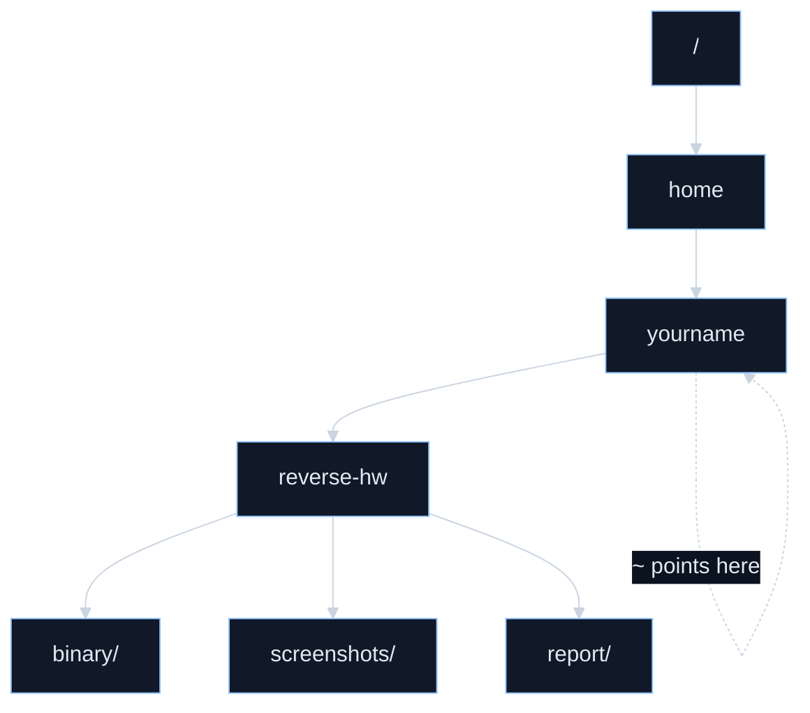
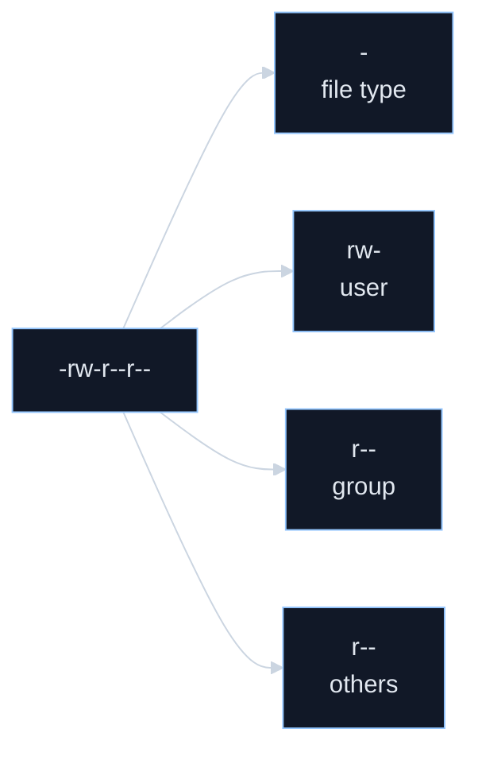
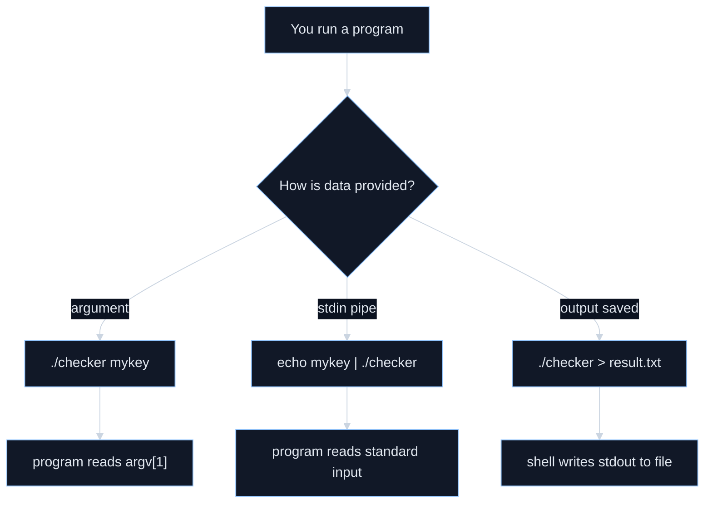

# Homework 1 Week 2: Linux Command-Line Basics

This handout is for a beginner student learning from zero for a binary-analysis or reverse-engineering assignment. It focuses on the subset of Linux needed for coursework: not getting lost in folders, reading text output, fixing execute permissions, and running programs correctly.

## Week 2 purpose

Week 1 gave you the map. Week 2 gives you the **hands-on movement skills**.

Ubuntu’s official beginner materials are a good fit for your stage: they explicitly assume **no prior knowledge**, describe the command line as a text interface to your computer, and focus on basic file manipulation, useful commands, and chaining commands together. The newer Ubuntu Desktop docs also explain the Linux filesystem as a **single tree rooted at `/`**, with `~` as shorthand for your home directory. ([Ubuntu][1])

## Week 2 overview

| Day | Theme | By the end of the day, you should be able to... | Main commands |
| --- | --- | --- | --- |
| 8 | Linux basics | explain root `/`, home `~`, and why the terminal matters | terminal, shell, `/`, `~` |
| 9 | Navigation | know where you are and move around confidently | `pwd`, `ls`, `cd` |
| 10 | File operations | create, copy, move, rename, and delete safely | `mkdir`, `touch`, `cp`, `mv`, `rm` |
| 11 | Reading output | inspect text files and command output without panic | `cat`, `less`, `head`, `tail` |
| 12 | Permissions | understand why a file will not run and how to fix it | `chmod`, `ls -l` |
| 13 | Running programs | tell arguments apart from standard input/output | `./program`, `>`, `<`, pipe, `$?` |
| 14 | Integration | do a mini lab without notes | all of the above |

---

## Day 8 — Linux basics and the terminal mindset

**Goal.** Build the right mental picture of Linux before touching too many commands.

**Core ideas.** In Linux, the command line is not some weird hidden “expert-only mode”; it is a normal text interface to the same computer. Ubuntu’s beginner tutorial says it is often essential because many technical instructions online are written as commands. The Ubuntu Desktop docs also explain that Unix-like systems use a **single unified filesystem** whose top is `/`, rather than a Windows-style world of separate drive letters. Your home directory sits somewhere under that tree, and `~` is a shortcut for “my home.” ([Ubuntu][1])

**What this means for you.** Since your later homework involves a Linux executable, the terminal matters because that is where you will most naturally:

* navigate to the binary,
* run it,
* see error messages,
* and capture output for your report.

**Extended example for you.** Imagine your future class folder is:

```text
/home/yourname/reverse-hw/
```

Inside it, you might later have:

```text
/home/yourname/reverse-hw/binary/
/home/yourname/reverse-hw/screenshots/
/home/yourname/reverse-hw/report/
```

The important point today is not memorizing commands. It is realizing that all of these live in **one tree**, and every path is just “a route through that tree.”

**Visual map.**



**If you are coming from Windows.** The biggest mental shift is this: stop thinking in terms of `C:\something\something`. In Linux, think in terms of a single tree beginning at `/`. Ubuntu’s docs explicitly call `/` the root of that unified filesystem. ([Ubuntu Documentation][2])

**Mini practice.**

1. Open a terminal.
2. Type:

   ```bash
   pwd
   ```
3. Then type:

   ```bash
   cd /
   pwd
   cd
   pwd
   ```
4. Write down what changed after each command.

**Check yourself.**

* What does `/` mean?
* What does `~` mean?
* What is the difference between “the terminal” and “the filesystem”?

**Read next.** Start with Ubuntu’s beginner command-line guide overview and the section on paths. It is the best “main textbook” for this week. ([Ubuntu][1])

---

## Day 9 — `pwd`, `ls`, and `cd`

**Goal.** Stop getting lost.

**Core ideas.** `pwd` prints the current directory. `cd` changes the current working directory, and if you give it no directory, Bash uses your `HOME` directory. `ls` lists information about files; by default it works on the current directory, and in directories it ignores names beginning with `.` unless you ask for them with `-a`. In long format (`ls -l`), it also shows file type, mode bits, owner, group, size, and timestamp. ([GNU][3])

**Three ideas to nail today.**

**1. `pwd` = “Where am I?”**
If you ever feel lost, `pwd` is the reset button.

**2. `cd` = “Move me.”**
Examples:

```bash
cd /
cd
cd ..
cd /tmp
```

Ubuntu’s docs also emphasize that relative paths depend on where you start, while paths beginning with `/` are absolute. ([Ubuntu Documentation][2])

**3. `ls` = “What’s here?”**
Useful starter forms:

```bash
ls
ls -a
ls -l
ls -la
```

You do not need to memorize every `ls` option yet. For now:

* `ls` shows what is here,
* `ls -a` shows hidden dot-files too,
* `ls -l` shows more details.

**Extended example for you.** Suppose your future homework binary is in:

```text
/home/yourname/reverse-hw/binary/crackme
```

To reach it, you need to understand at least these three patterns:

```bash
cd
cd reverse-hw
cd binary
pwd
ls
```

or, in one jump:

```bash
cd /home/yourname/reverse-hw/binary
```

If you cannot navigate to the file, you cannot run it. This is why navigation is not a side topic; it is part of the real assignment workflow.

**Quick SOP.**
If you feel lost in the terminal:

1. Run `pwd` to see exactly where you are.
2. Run `ls` or `ls -a` to see what is in that location.
3. Use `cd ..` to go up one level, `cd` to go home, or `cd /absolute/path` to jump directly.
4. Run `pwd` again after moving, so you confirm the change instead of guessing.

**Mini practice.**
Try these in order:

```bash
pwd
cd /
pwd
ls
cd /tmp
pwd
ls -a
cd
pwd
```

Then answer:

* What changed after `cd /`?
* What changed after plain `cd`?
* What did `ls -a` show that `ls` did not?

**Common trap.**
If you are in `/home/yourname` and type:

```bash
cd notes
```

that means “go into a folder called `notes` **inside my current location**.”
If you type:

```bash
cd /notes
```

that means “go into a folder called `notes` directly under the root `/`.”

Those are completely different.

**Checkpoint.**
Explain the difference between:

* `cd notes`
* `cd /notes`
* `cd ..`
* `cd`

**Read next.** Re-read the Ubuntu section on relative and absolute paths after practicing. It lands much better after your fingers have tried it once. ([Ubuntu Documentation][2])

---

## Day 10 — `mkdir`, `touch`, `cp`, `mv`, `rm`

**Goal.** Learn the core verbs for file and folder handling.

**Core ideas.** `mkdir` creates directories, and `-p` creates missing parent directories when needed. `touch` changes timestamps and creates an empty file if the target does not exist. `cp` makes an independent copy, `mv` moves or renames, and `rm` removes files but not directories by default. ([GNU][3])

**Think of these as six action words.**

* `mkdir` = make a folder
* `touch` = make an empty file quickly
* `cp` = duplicate
* `mv` = move or rename
* `rm` = delete a file
* `pwd` / `ls` still matter because you should check where you are before doing anything destructive

**Extended example for you.** Let’s make a fake class workspace.

```bash
cd
mkdir week2-lab
cd week2-lab
mkdir notes
mkdir screenshots
touch notes/todo.txt
ls
ls notes
```

Now make a backup copy:

```bash
cp notes/todo.txt notes/todo_backup.txt
ls notes
```

Rename the backup:

```bash
mv notes/todo_backup.txt notes/old_todo.txt
ls notes
```

Delete it:

```bash
rm notes/old_todo.txt
ls notes
```

This is almost exactly the kind of muscle memory you’ll use later when organizing screenshots, moving binaries into test folders, or renaming report drafts.

**One very important distinction.**

* `cp file1 file2` keeps both.
* `mv file1 file2` usually leaves only the new name/location.

That difference bites beginners constantly.

**About `mkdir -p`.**
This is useful when you want nested folders and some parents do not exist yet. Official docs say it creates missing parents and ignores already existing parent directories. ([GNU][3])

Example:

```bash
mkdir -p project/week2/screens
```

**Common trap.**
`rm` is not “move to recycle bin.” Treat it like a sharp tool.

You do not need recursive deletion yet. For now, get comfortable with simple file removal only.

**Quick SOP.**
Before any file operation, especially `mv` or `rm`:

1. Run `pwd` so you know which folder you are affecting.
2. Run `ls` to confirm the target file name really exists.
3. Use `cp` if you want a backup before renaming or deleting.
4. Use `mv` when the goal is rename or relocation, not duplication.
5. Use `rm` only when you are sure you no longer need the file.

**Checkpoint.**
Without looking back, explain the difference between:

* `cp`
* `mv`
* `rm`

Then explain why `touch` is useful even though it does not put text into a file.

**Read next.** The GNU Coreutils manual is the official reference for these commands. For your level, use it as a “what exactly does this command do?” book, not a “read every page” book. ([GNU][4])

---

## Day 11 — `cat`, `less`, `head`, `tail`

**Goal.** Learn to inspect text output without drowning in it.

**Core ideas.** `cat` copies file content, or standard input, to standard output. `head` shows the first 10 lines by default, and `tail` shows the last 10 lines by default; both can also read from standard input. Ubuntu’s tutorial explains that `man` pages are usually shown through a pager, typically `less`, and that man pages are best treated as quick references rather than full tutorials for first-time learners. ([GNU][3])

**What each tool is good for.**

**`cat`**
Best for short files.

```bash
cat sample.txt
cat -n sample.txt
```

`cat -n` is nice because it numbers lines. ([GNU][3])

**`less`**
Best for long files you want to scroll through.

* open with:

  ```bash
  less sample.txt
  ```
* quit with:

  ```text
  q
  ```

Ubuntu’s tutorial specifically notes that `man` output is typically piped through `less`. ([Ubuntu][1])

**`head`**
Best for the beginning of a file.

```bash
head sample.txt
```

**`tail`**
Best for the end of a file.

```bash
tail sample.txt
```

**Extended example for you.** Later, when you run a binary or a helper script, you may get a screen full of text. If all you care about is:

* the first few lines of usage info, use `head`;
* the last few lines where the success/error message appears, use `tail`;
* the whole thing but in a scrollable view, use `less`.

That is a very practical student workflow: you do not always need *all* the output at once.

**Mini practice.**
Create a file called `sample.txt` using any text editor and put at least 20 lines in it. Then run:

```bash
cat sample.txt
head sample.txt
tail sample.txt
less sample.txt
```

Then try:

```bash
cat -n sample.txt
```

**A useful rule of thumb.**

* tiny file → `cat`
* long file → `less`
* only beginning matters → `head`
* only ending matters → `tail`

**Checkpoint.**
When would `less` be better than `cat`?

**Read next.** Read Ubuntu’s section about man pages and pagers once. The single most valuable lesson there is: do not try to read man pages like novels. Use them like dictionaries. ([Ubuntu][1])

---

## Day 12 — `chmod`, execute permission, and `ls -l`

**Goal.** Understand why “the file exists” does not automatically mean “I can run it.”

**Core ideas.** `chmod` changes file mode bits. The official man page says symbolic modes use user/group/other/all (`u g o a`) and permissions such as read/write/execute (`r w x`), while numeric modes are built from octal values 4, 2, and 1. It also notes that execute on a directory means “search,” which is why directory permissions behave a bit differently from file permissions. In `ls -l`, those mode bits are displayed in long format output. ([Man7][5])

**The one picture to understand today.**

A long listing might show:

```text
-rw-r--r-- 1 user user 0 Jan 1 12:00 demo.sh
```

Break it like this:

* first character: file type
  `-` = regular file, `d` = directory, `l` = symbolic link, and so on. `ls -l` documents these type markers. ([GNU][3])
* next 9 characters: permission bits in groups of three

  * user
  * group
  * others

So:

```text
rw- r-- r--
```

means:

* owner can read/write
* group can read
* others can read

No one can execute it yet.

**Visual map.**



**Symbolic mode examples.**

```bash
chmod u+x demo.sh
chmod g-w demo.sh
chmod o-r demo.sh
chmod a+x demo.sh
```

**Numeric mode examples.**

* `7 = 4+2+1 = rwx`
* `6 = 4+2 = rw-`
* `5 = 4+1 = r-x`
* `4 = 4 = r--`

So:

* `755` = `rwx r-x r-x`
* `644` = `rw- r-- r--`

Those numeric meanings come straight from the `chmod` documentation. ([Man7][5])

**Why this matters to your assignment.**
One very real beginner problem in binary-analysis homework is:

* you found the file,
* you are in the correct directory,
* but it still will not run.

Often, one of the first things to check is whether the file has execute permission.

**Extended example for you.**
Imagine your homework binary is called `crackme`.

You might later do:

```bash
ls -l crackme
chmod +x crackme
ls -l crackme
```

Even before you fully understand binaries, you should be able to **see** the permission bits change.

**Mini practice.**
In your lab folder:

```bash
cd ~/week2-lab
touch demo.sh
ls -l demo.sh
chmod u+x demo.sh
ls -l demo.sh
chmod 644 demo.sh
ls -l demo.sh
chmod 755 demo.sh
ls -l demo.sh
```

Observe how the permission string changes.

**Common trap.**
Do not try to memorize every possible permission combination today.
What matters now is:

* `r = read`
* `w = write`
* `x = execute`
* permissions are grouped for user, group, others

**Checkpoint.**
Explain:

1. what `755` means,
2. what `chmod u+x file` does,
3. why a file can exist but still not be runnable.

**Read next.** For this topic, the `chmod(1)` man page is worth reading directly because it is short and precise. Use it together with `ls -l`, not separately. ([Man7][5])

---

## Day 13 — Running programs, arguments, standard input/output, and exit status

**Goal.** Understand what a command line is *actually doing* when you run a program.

**Core ideas.** Bash defines a simple command as a command word followed by arguments. If the command name has no slash, Bash searches functions, builtins, and then directories in `$PATH`; if it contains a slash, Bash executes that exact named program. In C programs, command-line parameters are available as `argc` and `argv`, with the invoked program name stored as `argv[0]`. Bash redirections use file descriptor 0 for standard input and 1 for standard output, and a pipe connects one command’s output to the next command’s input. Bash also treats exit status 0 as success, returns 127 for “command not found,” and 126 when a command is found but is not executable. ([GNU][6])

This is the most important conceptual day of Week 2.

## 1. Command + arguments

A command like:

```bash
echo hello world
```

has:

* command: `echo`
* arguments: `hello`, `world`

That command shape is the same basic pattern you will later use with real tools and binaries. Bash’s manual literally describes simple commands this way. ([GNU][6])

## 2. Why `./program` matters

This is a big one.

If you type:

```bash
program
```

Bash searches for it according to its command lookup rules.

If you type:

```bash
./program
```

you are giving a path that contains a slash, so Bash executes that named file directly. ([GNU][6])

That is why homework instructions often use `./something`:

* it means “run the file called `something` in the current directory.”

## 3. Arguments vs standard input

A program can receive data in different ways.

### A. As command-line arguments

Example shape:

```bash
./checker mykey123
```

Conceptually, the program sees:

* `argv[0] = "./checker"`
* `argv[1] = "mykey123"` ([GNU][7])

### B. Through standard input

Example shape:

```bash
echo mykey123 | ./checker
```

Now the data is not in `argv[1]`; it is arriving through standard input. Bash’s pipeline rules say the output of one command is connected to the input of the next. ([GNU][6])

This distinction matters later because some programs want:

* `./prog argument`
  while others want:
* input typed after the program starts,
  or
* input piped in.

## 4. Output and redirection

Redirections in Bash let you control where input and output go. The Bash manual states that if no file descriptor is written, `<` refers to standard input (0) and `>` refers to standard output (1). ([GNU][8])

Examples:

```bash
echo hello > out.txt
cat < out.txt
```

Meaning:

* `>` writes output into a file
* `<` reads input from a file

You will use this later if you want to save program output for screenshots or notes.

## 5. Exit status

In shell logic:

* `0` means success
* non-zero means failure

Bash also documents specific common cases:

* `127` = command not found
* `126` = command found but not executable ([GNU][6])

You can inspect the last command’s exit status with:

```bash
echo $?
```

Bash documents `$?` as the special parameter holding the last command’s exit status. ([GNU][6])

**Extended example for you.** Later in your assignment, you may meet all three of these patterns:

```bash
./crackme candidate_key
echo candidate_key | ./crackme
./crackme > run_output.txt
```

To a beginner, these can look like random magic spells. They are not. They are just three different ways of feeding data to a program or saving what it prints.

**Visual map.**



**Quick SOP.**
If a program does not run the way you expect:

1. Check whether you meant `program` or `./program`.
2. Decide whether the input should be an argument or standard input.
3. If you need to save the output, add `>` and a file name.
4. Run `echo $?` right after the command to inspect success or failure.

**Mini practice.**
Run these:

```bash
echo hello
echo hello > out.txt
cat out.txt
cat out.txt | head
pwd
echo $?
ls /definitely_not_real
echo $?
```

Then answer:

* Which command succeeded?
* Which command failed?
* What was redirected to a file?
* What flowed through a pipe?

**Checkpoint.**
Explain the difference between:

* `./program key`
* `echo key | ./program`
* `./program > result.txt`

If you can explain those three in plain English, you are doing very well.

**Read next.** For this day, the best references are specific Bash manual sections: simple commands, pipelines, redirections, command search/execution, and exit status. For the `argc/argv` picture, the GNU C manual page on command-line parameters is short and excellent. ([GNU][6])

---

## Day 14 — Review and integration lab

**Goal.** Put the whole week together into one smooth workflow.

This day is less about new facts and more about **fluency**.

**Quick SOP.**
When doing the integration lab, keep this rhythm:

1. navigate with `pwd` and `cd`,
2. inspect with `ls`,
3. create or organize files with `mkdir`, `touch`, `cp`, `mv`,
4. read outputs with `cat`, `head`, `tail`,
5. verify permissions with `ls -l` and adjust with `chmod`,
6. finish by checking `echo $?` so you know whether the last command succeeded.

## Integration lab

Do this without looking up every line.

```bash
cd
mkdir week2-review
cd week2-review
mkdir notes
mkdir bin
touch notes/plan.txt
cp notes/plan.txt notes/plan_backup.txt
mv notes/plan_backup.txt notes/old_plan.txt
ls
ls notes
cat notes/plan.txt
head notes/plan.txt
tail notes/plan.txt
chmod 755 notes/plan.txt
ls -l notes/plan.txt
echo hello > result.txt
cat result.txt
echo $?
```

Now explain, in your own words:

1. where you are,
2. what files you created,
3. what you copied,
4. what you renamed,
5. what permission change you made,
6. what output went into `result.txt`,
7. what the last exit status means.

## Your Week 2 concept checklist

By the end of today, you should be able to explain all of these without freezing:

* current directory
* absolute path
* relative path
* hidden file
* long listing
* permission bits
* execute permission
* command
* argument
* standard input
* standard output
* pipe
* redirection
* exit status

## Mini self-test

**Q1.** What does `pwd` tell you?
**Q2.** What is the difference between `cp` and `mv`?
**Q3.** Why might `ls` and `ls -a` show different things?
**Q4.** What does `chmod +x file` do?
**Q5.** Why is `./program` different from `program`?
**Q6.** What is the difference between a command-line argument and standard input?
**Q7.** What does `0` mean as an exit status?

## Model answers

**A1.** It prints the current working directory.
**A2.** `cp` duplicates; `mv` moves or renames.
**A3.** `ls` hides dot-files by default; `ls -a` shows them.
**A4.** It adds execute permission.
**A5.** `./program` names a path with a slash, so Bash executes that file directly.
**A6.** An argument is passed on the command line; standard input is streamed into the program.
**A7.** Success. ([GNU][3])

---

## Further reading, tailored for you

Since you are learning this as **a beginner student for an assignment**, here is the order I recommend.

## 1. Main text for this week

Read the **Ubuntu Desktop “Linux command line for beginners”** tutorial first. It is the most beginner-friendly official source in this set, and it lines up almost perfectly with what you need right now: paths, file manipulation, and basic command-line reasoning. ([Ubuntu][1])

## 2. Reference when you forget a command

Use the **GNU Coreutils manual** for commands like:

* `ls`
* `pwd`
* `mkdir`
* `touch`
* `cp`
* `mv`
* `rm`
* `cat`
* `head`
* `tail`

Think of Coreutils as the official dictionary for everyday Linux command behavior. ([GNU][4])

## 3. Reference when shell behavior feels mysterious

Use the **Bash Reference Manual** when your question is not “what does `ls` do?” but rather:

* how does Bash interpret a command?
* why did `./program` work but `program` not work?
* what exactly does `>` or `|` do?
* what does `$?` mean?

The Bash manual itself describes itself as a brief introduction and points to the Bash man page as the definitive shell reference, which is a good hint that it is best used selectively, not read cover-to-cover on week 2. ([GNU][6])

## 4. Short, high-value extra reading for your future homework

Read:

* the `chmod(1)` man page, because permission errors are common and this page is compact; ([Man7][5])
* the GNU C manual page on command-line parameters, because later you will care a lot about whether a program takes a key as an argument or from input. ([GNU][7])

## 5. How to use `man` wisely

Ubuntu’s tutorial makes a very good beginner point: man pages are invaluable, but they are often terse and technical. Use them as quick reminders for an option or syntax, not as your first teaching text. ([Ubuntu][1])

---

## What success looks like at the end of Week 2

If Week 2 worked, you should be able to do these without notes:

1. move to a target folder and prove where you are,
2. create and organize a small workspace,
3. inspect file contents sensibly,
4. read permission bits in `ls -l`,
5. explain the difference between arguments, pipes, and redirection,
6. understand why a file might not run even if it exists.

That is exactly the kind of command-line literacy that makes the later binary-analysis steps feel manageable instead of chaotic.

Next up would be **Week 3: basic program logic and “C-shaped thinking” for reverse engineering**.

[1]: https://ubuntu.com/tutorials/command-line-for-beginners "https://ubuntu.com/tutorials/command-line-for-beginners"
[2]: https://documentation.ubuntu.com/desktop/en/latest/tutorial/the-linux-command-line-for-beginners/ "https://documentation.ubuntu.com/desktop/en/latest/tutorial/the-linux-command-line-for-beginners/"
[3]: https://www.gnu.org/s/coreutils/manual/coreutils.html "https://www.gnu.org/s/coreutils/manual/coreutils.html"
[4]: https://www.gnu.org/software/coreutils/manual/html_node/index.html "https://www.gnu.org/software/coreutils/manual/html_node/index.html"
[5]: https://man7.org/linux/man-pages/man1/chmod.1.html "https://man7.org/linux/man-pages/man1/chmod.1.html"
[6]: https://www.gnu.org/s/bash/manual/bash.html "https://www.gnu.org/s/bash/manual/bash.html"
[7]: https://www.gnu.org/software/c-intro-and-ref/manual/html_node/Command_002dline-Parameters.html "https://www.gnu.org/software/c-intro-and-ref/manual/html_node/Command_002dline-Parameters.html"
[8]: https://www.gnu.org/s/bash/manual/html_node/Redirections.html "https://www.gnu.org/s/bash/manual/html_node/Redirections.html"
