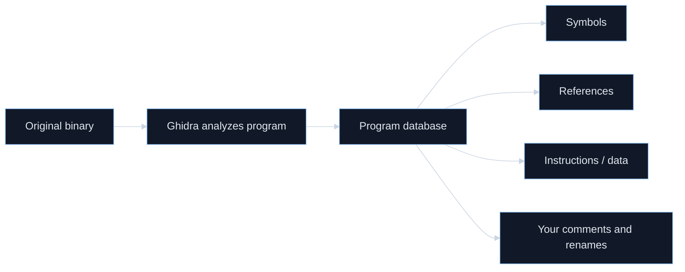
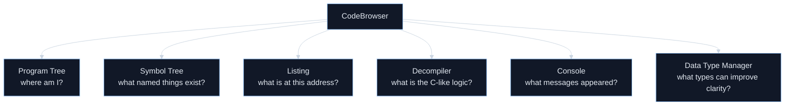

# Homework 1 Week 5: Ghidra Tool Literacy

Week 5 is for a beginner student preparing for a Ghidra-based crackme or binary-analysis assignment. It focuses on tool literacy: opening a program, letting Ghidra analyze it, and moving around the result without getting lost.

That matches the official beginner Ghidra course very closely. Its stated goals are to teach you how to create and customize projects, perform code analysis, markup, navigation, searching, and basic data creation, and use the decompiler, program tree, symbol table/tree, function graph, and function call tree in reverse engineering. ([Ghidra][1])

## Week 5 mission

By the end of this week, you should be able to:

* create a Ghidra project and import a binary,
* run and understand Auto-Analysis at a beginner level,
* navigate the CodeBrowser without panic,
* list functions and strings,
* use xrefs to answer “who uses this?”,
* use the Function Graph to understand branch structure,
* and read the decompiler as a **helpful reconstruction**, not as perfect original source. ([Ghidra][1])

## One running example for the week

Use one tiny toy program all week if possible. If you do not have one yet, a harmless self-made checker program is ideal:

```c
#include <stdio.h>
#include <string.h>

int verify(const char *s) {
    return strcmp(s, "mcp{demo}") == 0;
}

int main(int argc, char *argv[]) {
    if (argc < 2) {
        printf("Usage: %s <key>\n", argv[0]);
        return 1;
    }

    if (verify(argv[1]))
        printf("OK\n");
    else
        printf("Wrong\n");

    return 0;
}
```

Why this is perfect for you:

* it has a `main`,
* it has a suspicious `verify` function,
* it has useful strings like `Usage`, `OK`, and `Wrong`,
* and later in Ghidra you can practice functions, strings, xrefs, and decompiler reading on something small enough to understand.

If you do not have your own toy binary, the official beginner guide explicitly says its exercises were written to work with **any program**, so you do not need a special sample just to start practicing. ([Ghidra][1])

---

## Week 5 overview

| Day    | Theme                                          | Main question                                                |
| ------ | ---------------------------------------------- | ------------------------------------------------------------ |
| Day 29 | What reverse engineering with Ghidra really is | What is Ghidra actually helping me do?                       |
| Day 30 | Projects, import, and auto-analysis            | How do I get a program into Ghidra correctly?                |
| Day 31 | CodeBrowser layout                             | What are all these panes, and which one do I trust for what? |
| Day 32 | Functions, symbols, and structure              | How do I find likely important functions quickly?            |
| Day 33 | Listing and searching                          | How do I search for strings, bytes, and text clues?          |
| Day 34 | References and function graph                  | How do I move from a clue to the code that uses it?          |
| Day 35 | Decompiler mini-lab                            | How do I combine everything into one beginner workflow?      |

---

## Day 29 — What reverse engineering with Ghidra really is

## Goal

Stop thinking of Ghidra as “a scary hacker window” and start thinking of it as a **reverse-engineering workbench**.

## Core lesson

Officially, Ghidra describes itself as an IDE for reverse-engineering tasks. The beginner guide says it is highly extensible, mostly platform-independent because it is written in Java, and organized around five major parts: **Programs, Plugins, Tools, Project Manager, and Server**. It also says program information is stored in Ghidra’s own program database, including symbols, bytes, references, instructions, data, and comments. ([Ghidra][1])

## Plain-English meaning

For you, this means Ghidra is doing two jobs at once:

1. it is a **viewer** for low-level program information, and
2. it is a **notebook** where your own labels, comments, renamed functions, and discoveries get stored.

So when you use Ghidra, you are not just “looking at code.”
You are gradually **building a cleaner map** of the program.

## Visual model



## Student-style example

Imagine your school gives you a campus map with room numbers but no room names.

At first you only see:

* Room A102
* Room A103
* Room A104

Then, as you explore, you annotate it:

* A102 = library
* A103 = lab
* A104 = teacher office

That is exactly what reverse engineering feels like in Ghidra:

* default names first,
* human meaning later.

## Today’s practice

Open Ghidra, or if you do not have it ready yet, read the first pages of the official beginner guide and write down:

* What is Ghidra?
* What are its five major parts?
* What kinds of information does Ghidra store in the program database?

Then write one sentence:

> “Reverse engineering in Ghidra means turning unknown program structure into labeled, explained structure.”

## Checkpoint

What is the difference between:

* the original binary file, and
* the Ghidra project database?

A strong answer:

* the binary is the thing being analyzed,
* the Ghidra project stores analysis results and your annotations about it. ([Ghidra][1])

---

## Day 30 — Projects, importing, and Auto-Analysis

## Goal

Learn the “front door” workflow correctly.

## Core lesson

In the official beginner guide, the Project Manager is the place where you create/open/archive projects, import programs, open programs in tools, create subfolders, manage tools, and view project contents. The guide says you should first create a **non-shared** project if you are working alone, choose a project directory and name, and then import a program through `File -> Import File...` or by dragging a file into a Project Manager folder. Ghidra can import formats such as PE, ELF, raw binary, Intel hex, and Ghidra zip files. ([Ghidra][1])

## Why this matters for you

Your future assignment will probably feel hard for conceptual reasons, but a surprising number of beginner failures happen much earlier:

* imported the wrong file,
* chose the wrong format/language,
* skipped analysis,
* or opened the file but did not realize Ghidra was waiting for Auto-Analysis.

Getting the front door right saves a lot of fake confusion.

## Auto-Analysis, in plain English

The beginner guide says that when a program first opens in a tool, Ghidra normally prompts for Auto-Analysis, and that you can also run it later from `Analysis -> Auto Analyze`. At minimum, Auto-Analysis starts at entry points, disassembles by following flows, creates functions at called locations, and creates cross-references. ([Ghidra][1])

That means Auto-Analysis is not “solving the reverse engineering for you.”
It is more like a very fast assistant that says:

* “I think code starts here,”
* “I think this is a function,”
* “I think this instruction points to that data.”

## Quick SOP — The front door workflow

1. Create a **non-shared** project if you are working alone.
2. Import the binary and check the detected format/language before clicking through.
3. Open the imported file in a tool, usually CodeBrowser.
4. Let Auto-Analysis run with default options the first time.
5. Wait for functions, disassembly, and references to appear before judging the binary as “empty.”
6. Write down what changed after analysis so you build the habit of noticing what Ghidra added.

## Student-style example

Think of Auto-Analysis as the first rough draft of lecture notes made by a classmate:

* useful,
* often surprisingly good,
* but still something you need to inspect and improve.

## Today’s practice

Do this once, slowly:

1. Create a new non-shared project.
2. Import your toy binary or any safe small executable.
3. Use the auto-detected format/language if Ghidra recognizes it.
4. Open the program in a tool.
5. Let Auto-Analysis run with defaults.
6. Write down what new things appeared after analysis.

## What to notice

After analysis, you should start seeing:

* function names or default function labels,
* disassembled code,
* references,
* and a much richer browsing experience than before analysis. ([Ghidra][1])

## Checkpoint

What are the minimum four things Auto-Analysis does?

A strong answer:

* starts at entry points,
* follows flows to disassemble,
* creates functions at called locations,
* creates cross-references. ([Ghidra][1])

---

## Day 31 — CodeBrowser layout: learning what each pane is for

## Goal

Make the interface feel organized instead of chaotic.

## Core lesson

The official beginner guide says the default CodeBrowser layout includes the **Program Tree, Symbol Tree, Data Type Manager, Listing, Console, and Decompiler**. It also says extra windows live under the `Windows` menu, and that the CodeBrowser is the default tool configured with plugins that support disassembly, navigation, and documenting assembly code. It is meant to provide the basic functionality needed to reverse engineer a program. ([Ghidra][1])

## The beginner mental model

Here is the simplest useful mapping:

* **Program Tree** = “where in the binary am I?”
* **Symbol Tree** = “what named things exist?”
* **Listing** = “what is actually at this address?”
* **Decompiler** = “what does this look like in C-like logic?”
* **Console** = “what did Ghidra or scripts tell me?”
* **Data Type Manager** = “what types can I apply to make this cleaner?”

## Visual pane map



## Why this matters for your assignment

Later, when you are hunting for a checker function, you will bounce constantly between:

* functions table or symbols,
* listing,
* decompiler,
* strings,
* and xrefs.

If you do not know which pane answers which question, the whole process feels random.

## Useful built-in help

The guide explicitly says:

* `F1` gives help for hovered actions or open windows,
* `F4` can set key bindings,
* and extra common windows include things like Function Graph, Symbol Table, Symbol Tree, Decompiler, and more. ([Ghidra][1])

That means you do not need to memorize everything at once.
You can use Ghidra’s own help system as part of learning.

## Today’s practice

Open a program in the CodeBrowser and make a small table for yourself:

| Pane         | What question does it answer? |
| ------------ | ----------------------------- |
| Program Tree |                               |
| Symbol Tree  |                               |
| Listing      |                               |
| Decompiler   |                               |
| Console      |                               |

Fill it in using your own words, not mine.

Then click one address in the Listing and see what changes elsewhere.

## Checkpoint

Which pane would you trust first for:

* raw address-level detail,
* named items,
* C-like logic?

A strong answer:

* raw detail → Listing
* named items → Symbol Tree / functions-related tables
* C-like logic → Decompiler ([Ghidra][1])

---

## Day 32 — Program Tree, Symbol Tree, and the Defined Functions / Strings tables

## Goal

Learn the fastest beginner routes to “interesting places.”

## Core lesson: Program Tree

The beginner guide says the Program Tree lets you see the basic program structure, organize the program, select whole memory blocks, change the current view in the Listing, and determine what part of the program your cursor is in. It can also have multiple trees with different organizations. ([Ghidra][1])

## Plain-English meaning

The Program Tree is your **map of regions**.

You may not fully understand what each region means yet, but it helps you avoid the feeling that the binary is one giant undifferentiated blob.

## Core lesson: Symbol Tree

The beginner guide says the Symbol Tree organizes symbols by type in a tree view, nests symbols under related items, and can track the Listing. It can also be used to create classes and namespaces. ([Ghidra][1])

## Plain-English meaning

The Symbol Tree is your **map of named things**:

* functions,
* labels,
* variables,
* namespaces,
* and other symbols.

When you are new, you do not need every category. You mainly care that names and categories give you shortcuts into the program.

## Core lesson: Defined Functions / Strings

The guide says:

* `Window -> Functions` opens the defined functions table,
* `Window -> Defined Strings` opens the strings table,
* and those tables list all defined functions or strings in the current program. ([Ghidra][1])

This is huge for your use case.

Because later, in a crackme-style assignment, two of the fastest beginner questions are:

* “What functions exist?”
* “What strings exist?”

## Student-style example

Suppose your toy program has:

* `main`
* `verify`
* strings like `Usage`, `OK`, `Wrong`

Even if you cannot read assembly yet, those names already give you a starting plan:

* `main` probably controls the overall flow,
* `verify` probably checks something,
* `Wrong` is probably on the failure path,
* `OK` is probably on the success path.

That is real reverse-engineering progress.

## Today’s practice

In Ghidra:

1. Open `Window -> Functions`.
2. Scroll through the function list.
3. Open `Window -> Defined Strings`.
4. Write down 5 items that look suspicious or meaningful.
5. Pick one function and one string to inspect tomorrow.

If the program has ugly default names, that is normal.

## Checkpoint

What is the practical difference between:

* Program Tree,
* Symbol Tree,
* Functions table,
* Strings table?

A strong answer:

* Program Tree = memory / structural view
* Symbol Tree = named items by category
* Functions table = all defined functions
* Strings table = all defined strings ([Ghidra][1])

---

## Day 33 — Listing and searching: finding clues without guessing

## Goal

Learn how to search intelligently instead of wandering.

## Core lesson: Listing

The beginner guide says the Listing contains typical assembly-code fields such as **address, bytes, mnemonics, operands, comments, labels**, and more, and that these fields can be customized with the Field Editor. ([Ghidra][1])

## Plain-English meaning

The Listing is the most literal answer to:

> “What is actually here?”

It is the pane closest to the low-level ground truth that you will use every day.

## Core lesson: Search Program Text and Search Memory

The guide says:

* `Search -> Program Text` searches markup text such as comments, labels, and fields,
* while `Search -> Memory...` searches bytes in program memory and can search values entered as hex, string, decimal, binary, float, double, or regular expression. It can also be limited to a selection. ([Ghidra][1])

## Core lesson: Search for Strings

The guide also says `Search -> For Strings...` searches for potential strings in all or selected memory, supports ASCII/Unicode/Pascal, lets you filter results, and even lets you create strings and labels directly from the results table. By default it searches null-terminated ASCII and Unicode strings. ([Ghidra][1])

## Why this matters for you

This is the day where beginner reverse engineering starts to feel less mystical.

Instead of asking:

> “How do I magically find the answer?”

you start asking:

> “What clues exist in the binary, and what search mode best finds them?”

That is a much more powerful habit.

## Student-style example

For a toy verifier, good beginner searches might be:

* `OK`
* `Wrong`
* `Usage`
* `flag`
* `key`
* `secret`

In a real binary, even one or two good strings can pull you directly toward the important code.

## Quick SOP — Which search should I use?

1. Use **Program Text** when you want labels, comments, names, or other markup text.
2. Use **For Strings** when you suspect a human-readable clue like `OK`, `Wrong`, or `Usage`.
3. Use **Memory** when you need raw bytes, encoded values, or a literal data pattern.
4. Start with the narrowest search that matches your clue.
5. When a search result looks promising, jump to it immediately and inspect nearby code or data.

## Today’s practice

Do all three:

1. Use **Program Text** search for `main` or `verify`.
2. Use **For Strings** search for `OK`, `Wrong`, `Usage`, or `flag`.
3. If you want extra practice, use **Memory** search for a literal byte or short ASCII fragment.

Then make a note:

* which search felt most useful,
* which one felt too broad,
* and which one gave you the first “real clue.”

## Checkpoint

When would you use each one?

A strong answer:

* Program Text = search labels/comments/markup
* Memory = search raw bytes or encoded values
* For Strings = search likely string data in memory ([Ghidra][1])

---

## Day 34 — References, xrefs, and Function Graph

## Goal

Learn how to move from a clue to the code that uses the clue.

## Core lesson: References / XRefs

The beginner guide explains that the XRef Field in the Listing shows all addresses that reference the current address or item, and that each reference has a type indicator. For code references, examples include call `(c)` and jump `(j)`; for data references, examples include pointer `(*)`, write `(W)`, and read `(R)`. The guide also says the XREF Header shows how many references there are, and you can double-click it or use `References -> Show References To` to bring up a table. ([Ghidra][1])

## Plain-English meaning

An xref answers the question:

> “Who points to this thing?”

That is one of the most important questions in all reverse engineering.

Because finding a useful string is only half the job.
The real progress happens when you ask:

> “Which function uses this string?”

## Core lesson: Function Graph

The official guide says the Function Graph represents a function as a directed cyclic graph where:

* nodes are code blocks,
* edges represent control flow,
* green/red edges show conditional directions,
* blue edges show unconditional or switch flow,
* and calls do not break a block. It also says you can open it from `Window -> Function Graph`. ([Ghidra][1])

## Plain-English meaning

The Function Graph is the “see the whole maze at once” view.

The Listing is excellent for exact detail.
The Function Graph is excellent for overall branch shape.

For a checker function, that often means you can visually spot:

* one path to success,
* one or more paths to failure,
* and a series of checks in between.

## Student-style example

Suppose you find the string `Wrong`.

With xrefs, you can ask:

* which address uses `Wrong`?
* which function contains that address?

Then, in Function Graph, you can often see:

* the block that prints `Wrong`,
* the branch that leads there,
* and nearby blocks that perform comparisons before failure.

That is exactly how beginners begin finding verifier logic.

## Visual clue-to-code path

```mermaid
%%{init: {
  "theme": "base",
  "themeVariables": {
    "darkMode": true,
    "background": "#0f172a",
    "primaryColor": "#1e293b",
    "primaryTextColor": "#e2e8f0",
    "primaryBorderColor": "#93c5fd",
    "lineColor": "#cbd5e1",
    "textColor": "#e2e8f0",
    "mainBkg": "#111827",
    "edgeLabelBackground": "#0b1220",
    "noteBkgColor": "#1f2937",
    "noteTextColor": "#f8fafc"
  }
} }%%
flowchart LR
    A["Interesting string<br/>e.g. Wrong"] --> B["Open xrefs"]
    B --> C["Find referencing address"]
    C --> D["Find referencing function"]
    D --> E["Open Listing / Decompiler"]
    E --> F["Open Function Graph"]
    F --> G["Understand success vs failure branches"]
```



## Today’s practice

Choose one interesting string from yesterday.
Then do this:

1. Navigate to the string.
2. Open its references.
3. Write down the function names or addresses that reference it.
4. Open Function Graph for one suspicious function.
5. Count how many obvious branch paths it has.

You do not need to understand every block.
You only need to understand the **shape**.

## Checkpoint

What is the practical difference between:

* a string table entry,
* an xref to that string,
* and the Function Graph of a referencing function?

A strong answer:

* string entry = the clue itself
* xref = who uses the clue
* Function Graph = how the using function branches and flows ([Ghidra][1])

---

## Day 35 — Decompiler day and the first real mini-lab

## Goal

Pull the whole week together into one beginner reverse-engineering workflow.

## Core lesson: what the decompiler is

The official beginner guide says the decompiler converts **assembly to p-code to C code**, warns that assembly and C are **not a one-to-one match**, and notes that decompiler output may change when the program changes. It also says selections and navigation in the Listing and Decompiler track one another. ([Ghidra][1])

## Plain-English meaning

The decompiler is not the original source code.
It is a **smart translation** that tries to reconstruct readable logic.

That means two things are true at once:

* you should rely on it a lot,
* and you should not worship it blindly.

## Core lesson: improving the decompiler

The beginner guide says you can edit data types, labels, parameters, local variables, return types, and function signatures from the Decompiler or Listing, and those edits are reflected across both views. It also notes that the more correct data-type information you provide, the better the decompiler output becomes. The more advanced “Improving Disassembly and Decompilation” material says one of the best ways to clean up decompiled code is to apply data types, and that Ghidra can help with structure creation from the decompiler in some situations. ([Ghidra][1])

## Why this matters for you

This is the day where your future assignment starts to become realistic.

Your actual target later is not “read all assembly.”
It is much closer to:

1. find functions,
2. search strings,
3. follow xrefs,
4. open suspicious function in decompiler,
5. rename and annotate,
6. infer what the checker is doing.

That is a very manageable beginner workflow.

## Mini-lab

Use your toy binary or any safe tiny executable.

### Phase 1 — import and analyze

* Create/open project
* Import binary
* Run Auto-Analysis

### Phase 2 — survey

* Open Functions table
* Open Defined Strings table
* Pick 1 suspicious function
* Pick 2 suspicious strings

### Phase 3 — connect clues

* Open xrefs for a suspicious string
* Find the function that uses it
* Open that function in the Decompiler

### Phase 4 — explain it

In the Decompiler:

* rename one obviously meaningful function if you are confident,
* add one comment,
* write 5 plain-English sentences explaining what the function seems to do.

### Phase 5 — screenshot habit

Take screenshots of:

* functions table,
* strings table,
* one xref view,
* one decompiler view.

That habit will help a lot when you later need evidence for coursework.

## Checkpoint

Finish this sentence:

> “The decompiler is useful because it turns low-level behavior into C-like logic, but I still need the Listing and xrefs because…”

A strong ending is:

* because the decompiler is a reconstruction, not perfect source, and xrefs/listing show concrete addresses, references, and low-level details. ([Ghidra][1])

---

## End-of-week self-test

Try answering these without notes:

1. What does the Project Manager do?
2. What is Auto-Analysis doing at minimum?
3. What are the default main panes in CodeBrowser?
4. What does the Program Tree help with?
5. What does the Symbol Tree help with?
6. Where do you see all defined functions?
7. Where do you see all defined strings?
8. What is the Listing best at?
9. What is the decompiler best at?
10. What does an xref answer?
11. What does the Function Graph help you see?
12. Why is the decompiler helpful but not perfect?

If you can answer 9 or more cleanly, you are in a very good place for a beginner.

---

## Further reading, chosen for you

For **your** situation, I would keep the reading stack very focused.

The single most important reading is the **official Ghidra Beginner Student Guide**. It is almost exactly the syllabus for this week: projects, importing, auto-analysis, CodeBrowser, searching, program tree, symbol table/tree, decompiler, and function graph. It also explicitly says the exercises can be done with any program, which makes it friendly for a beginner practicing on a toy binary. ([Ghidra][1])

When you are actively using Ghidra, use **F1 help inside the tool**. The beginner guide specifically calls out F1 as the built-in help path for hovered actions and open windows. That is a much better beginner habit than opening ten random tabs and getting lost. ([Ghidra][1])

After you finish this week, the next best official reading is the **Intermediate Ghidra Student Guide**, but only selectively. For your stage, the valuable preview topics are advanced data types, memory map, comparing programs, scripting development, and headless mode. You do not need to study them now; just know where the next staircase is. ([Ghidra][2])

When your decompiler output starts looking messy or incomplete, the best next official document is **Improving Disassembly and Decompilation**. That material explains how Ghidra finds functions, how to improve decompilation, and why applying better data types can make the output dramatically cleaner. That is a “Week 5.5 or Week 6” reading for you, not a Day 1 reading. ([Ghidra][3])

If you are still installing or checking environment compatibility, the same beginner guide also lists supported platforms and basic installation expectations, so that is the cleanest official place to confirm setup basics. ([Ghidra][1])

---

## What success looks like at the end of Week 5

Week 5 has succeeded if you can now say:

* “I can create a Ghidra project and import a program.”
* “I know what Auto-Analysis gives me.”
* “I know where functions and strings live.”
* “I know how to move from a string to the code that uses it.”
* “I know how to open the Function Graph and the Decompiler.”
* “I can explain a small suspicious function in plain English.”

That is the exact foundation you want before Week 6, where the focus shifts from **learning the tool** to **using the tool to analyze crackme-style logic**.

The clean next step is **Week 6: beginner crackme analysis with functions, strings, branches, key format clues, and simple verifier logic**.

[1]: https://ghidra.re/ghidra_docs/GhidraClass/Beginner/Introduction_to_Ghidra_Student_Guide.html "https://ghidra.re/ghidra_docs/GhidraClass/Beginner/Introduction_to_Ghidra_Student_Guide.html"
[2]: https://ghidra.re/ghidra_docs/GhidraClass/Intermediate/Intermediate_Ghidra_Student_Guide.html "https://ghidra.re/ghidra_docs/GhidraClass/Intermediate/Intermediate_Ghidra_Student_Guide.html"
[3]: https://ghidra.re/ghidra_docs/GhidraClass/Advanced/improvingDisassemblyAndDecompilation.pdf "https://ghidra.re/ghidra_docs/GhidraClass/Advanced/improvingDisassemblyAndDecompilation.pdf"
