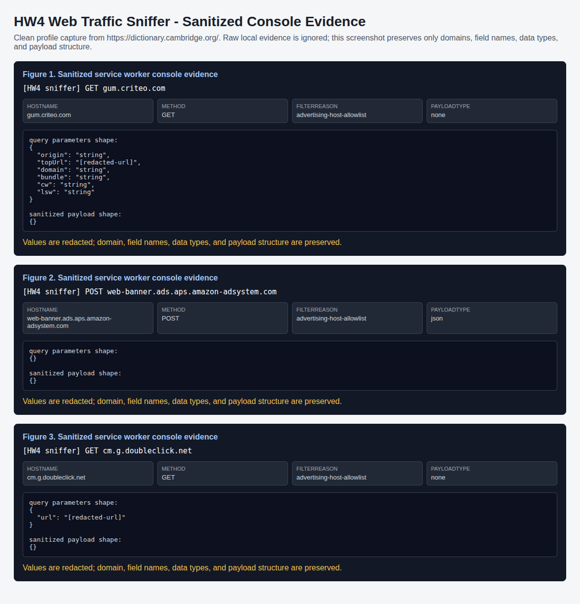

# Sanitized Console Evidence

| Figure | Domain | Payload type | Filter reason | Redaction |
| --- | --- | --- | --- | --- |
| Figure 1 | `gum.criteo.com` | `none` | `advertising-host-allowlist` | Values redacted; structure preserved |
| Figure 2 | `web-banner.ads.aps.amazon-adsystem.com` | `json` | `advertising-host-allowlist` | Values redacted; structure preserved |
| Figure 3 | `cm.g.doubleclick.net` | `none` | `advertising-host-allowlist` | Values redacted; structure preserved |
