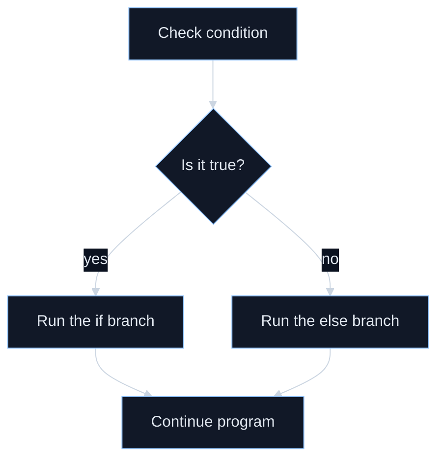
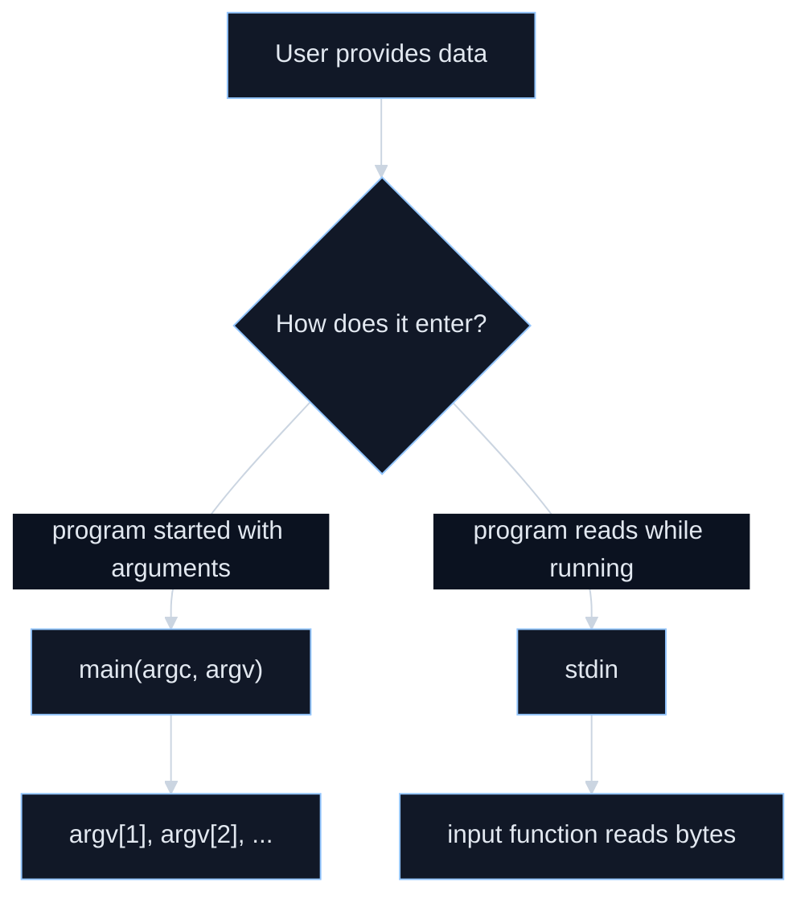
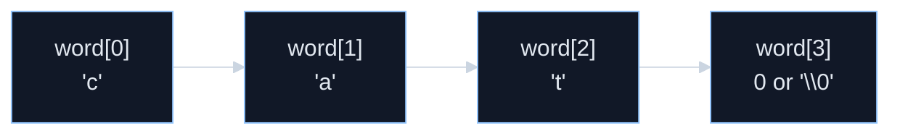

For you, Week 3 is **not** about becoming a full C programmer. It is about learning enough **C-shaped thinking** that later, when Ghidra shows you C-like decompiler output, you can read it without freezing. Ghidra’s own beginner guide says the decompiler goes from **assembly to p-code to C code**, and the GNU C manual describes C as a relatively simple language that gives close access to hardware. That is exactly why this week matters for reverse engineering. ([Ghidra][1])

---

# Week 3 mission

By the end of this week, you should be able to:

* read simple variable declarations and assignments,
* follow `if` / `if-else` logic,
* trace `while` and `for` loops,
* understand what a function does and how `main` starts a program,
* recognize how a program gets input through `argv` or standard input,
* understand that C strings are `char` sequences ending in a null byte,
* and read a tiny checker-style C program from top to bottom. ([gnu.org][2])

---

# Week 3 overview

| Day    | Theme                                 | Main outcome                                                            |
| ------ | ------------------------------------- | ----------------------------------------------------------------------- |
| Day 15 | Variables and program state           | You understand how C stores values during execution                     |
| Day 16 | Conditions and branching              | You can read `if` / `if-else` logic                                     |
| Day 17 | Loops                                 | You can trace repeated checks step by step                              |
| Day 18 | Functions                             | You understand how programs are split into reusable parts               |
| Day 19 | Input, output, and `main`             | You can tell where data enters and leaves a C program                   |
| Day 20 | Strings, arrays, and memory intuition | You understand the most important data shapes for key-checking programs |
| Day 21 | Reading a tiny verifier program       | You connect the whole week into one realistic example                   |

---

# Day 15 — Variables and program state

## Goal

Understand what a variable is and why programs need state.

## Core lesson

In C, a variable declaration has a structure like `keywords basetype decorated-variable [= init];`, and a simple example is `int foo;`. When you declare a variable inside a function, it becomes **local** to that block. GNU C also warns that ordinary local variables are usually automatic variables whose lifetime ends when the block ends, and if you do **not** initialize one, it starts with garbage rather than a safe built-in default. On most computers, `int` is typically 32 bits, while `signed char` is 8 bits and commonly used for character-like data. ([gnu.org][2])

## Plain-English meaning

A variable is a **named box for a value**.

Example:

```c
int attempts = 0;
char first = 'A';
```

That means:

* `attempts` stores a number,
* `first` stores one character-like byte.

As the program runs, those values can change. That changing information is called **state**.

## Why this matters for your future assignment

Later, when you read decompiler output, you will constantly see local variables that mean things like:

* current input length,
* current loop index,
* comparison result,
* success flag,
* pointer to text.

You do **not** need to know the exact CPU details yet. You just need the habit of asking:

> “What value is this variable holding right now?”

## Student-style example

Imagine a school login checker.

```c
int attempts = 0;
int is_valid = 0;
```

This could mean:

* `attempts`: how many times a student tried logging in
* `is_valid`: whether the ID check passed

That is already very close to checker logic in security exercises.

## Today’s practice

Write three declarations of your own:

1. a variable for a quiz score
2. a variable for the first letter of your name
3. a variable for the number of times a key-check loop runs

Then answer:

* Which one stores a number?
* Which one stores one character?
* Which ones should probably be initialized right away?

## Checkpoint

Why is this dangerous?

```c
int x;
printf("%d\n", x);
```

Because an uninitialized local variable does not start with a guaranteed meaningful value. ([gnu.org][3])

---

# Day 16 — Conditions and branching

## Goal

Understand how a program makes decisions.

## Core lesson

An `if` statement computes a condition and executes the following statement only when that condition is true, meaning **nonzero**. An `if-else` chooses between two alternatives. GNU C also points out that each branch is only **one statement** unless you group multiple statements into a block with braces. ([gnu.org][4])

## Plain-English meaning

Branching is the part of a program that says:

* if this is true, do one thing;
* otherwise, do another thing.

Example:

```c
if (score >= 60)
    printf("Pass\n");
else
    printf("Fail\n");
```

That is the programming version of a rule.

## Visual branch shape



## A very important C idea

In C, a condition is not “magic true/false language.”
It is based on values:

* `0` means false
* nonzero means true ([gnu.org][4])

That matters later because decompiled code often uses integer-looking conditions.

## Student-style example

Suppose a school gate system checks whether a student card is recognized:

```c
if (card_ok)
    open_gate();
else
    show_error();
```

That is the same shape as:

```c
if (key_ok)
    print_flag();
else
    print_wrong();
```

## Reverse-engineering connection

Later, one of the most important things you’ll do is find the branch where the program decides:

* correct key → success path
* wrong key → failure path

So this day is secretly very important.

## Today’s practice

Translate these into C-style `if` logic in plain English:

1. If the password length is 8, continue. Otherwise, reject.
2. If the first character is `m`, continue. Otherwise, reject.
3. If score is below 60, print “retake.”

## Checkpoint

What is the difference between these two?

```c
if (x)
    do_one_thing();
```

```c
if (x)
    do_one_thing();
else
    do_other_thing();
```

The first has only a “true” action.
The second has both a “true” and a “false” action. ([gnu.org][4])

---

# Day 17 — Loops

## Goal

Understand how a program repeats work.

## Core lesson

A `while` loop checks its test at the beginning of each iteration and keeps repeating while the test stays true. A `for` loop packages three pieces together: how to start, how to test whether to continue, and how to advance for the next round. GNU C explains the `for` shape as `for (start; continue-test; advance) body`. ([gnu.org][5])

## Plain-English meaning

A loop is how a program says:

> “Do this again and again until the stopping rule says stop.”

### `while`

```c
while (condition)
    body;
```

### `for`

```c
for (start; continue_test; advance)
    body;
```

## When to use each mentally

For beginner reading:

* use `while` when you think “repeat until condition changes”
* use `for` when you think “count through positions 0, 1, 2, 3…”

## Quick SOP — How to trace a loop by hand

1. Write down the starting value before the loop begins.
2. Check the loop condition exactly as written.
3. If the condition is true, record what the loop body does this round.
4. Apply the update step such as `i++` or `x = x - 1`.
5. Repeat until the condition becomes false, then stop immediately.

## Student-style example

Suppose you want to check every character of a student ID:

```c
for (i = 0; i < 8; i++)
    check_one_character();
```

That means:

* start `i` at 0,
* keep going while `i < 8`,
* after each round, add 1 to `i`.

That exact pattern shows up constantly in key verifiers.

## Why this matters later

Many checker programs do things like:

* scan each character,
* count length,
* sum values,
* compare each position,
* search for a null terminator.

All of those are loop-shaped tasks.

## Today’s practice

Mentally trace this:

```c
int i;
for (i = 0; i < 4; i++)
    printf("%d\n", i);
```

Write down:

* What is `i` at the start?
* What values get printed?
* When does the loop stop?

Then do the same for:

```c
int x = 3;
while (x > 0)
{
    printf("%d\n", x);
    x = x - 1;
}
```

## Checkpoint

What are the three jobs inside a `for` loop header?

1. start
2. test
3. advance ([gnu.org][6])

---

# Day 18 — Functions

## Goal

Understand how programs are split into parts.

## Core lesson

A function definition has the general shape:

```c
returntype
functionname(parameters)
{
    body
}
```

GNU C also explains that a function does nothing until it is called, and that a call expression looks like `function(arguments…)`. Program execution starts by automatically calling `main`. In the GNU C manual’s complete example, `main` calls `printf` and also calls `fib(20)` as part of that output. ([gnu.org][7])

## Plain-English meaning

A function is a **named mini-tool** inside a program.

Instead of writing one giant blob of code, you split work into parts.

Example:

```c
int square(int n)
{
    return n * n;
}
```

Then elsewhere:

```c
int answer = square(5);
```

## Why this matters for your assignment

Later, you will almost certainly analyze a binary by finding functions that behave like:

* read input
* verify length
* compare prefix
* compute checksum
* print success
* print failure

So Week 3 is training your eyes to see programs as **cooperating functions**, not as one giant mystery.

## Student-style example

Think of school office work:

* one person checks student ID,
* one person checks tuition payment,
* one person prints the receipt.

That is function-style design.

A verifier program might do the same thing:

* `check_length`
* `check_format`
* `verify_key`

## Today’s practice

Take this English task:

> “Check whether a score is passing.”

Split it into two function ideas:

* one function that decides pass/fail,
* one function that prints the result.

Then write just the names and what each returns.

## Checkpoint

What is the difference between a **function definition** and a **function call**?

* definition = what the function is
* call = using it during execution ([gnu.org][7])

---

# Day 19 — Input, output, and `main`

## Goal

Understand where a C program gets data and where it sends results.

## Core lesson

The GNU C manual says C itself has **no built-in** facilities for common tasks like input/output and string manipulation; those are provided by functions in the standard library. In the GNU example, `#include <stdio.h>` brings in the usual I/O functions such as `printf`. The GNU C Library manual also explains that when `main` begins, three standard streams already exist: `stdin` for normal input, `stdout` for normal output, and `stderr` for diagnostics. ([gnu.org][8])

## Command-line parameters

If a program is started with arguments, `main` can receive them through `argc` and `argv`. GNU C explains that `argv` is an array of strings, `argc` tells you how many strings there are, and `argv[0]` is the invoked command name. ([gnu.org][9])

Example shape:

```c
int main(int argc, char *argv[])
{
    /* use argv here */
}
```

## Visual input paths



## Why this matters for your future assignment

A checker program may take input in two common ways:

1. **command-line argument**
   like `./checker mykey`

2. **standard input**
   like the program starts and then waits for you to type

You do not need to master all I/O yet. You do need to notice **which style a program is using**.

## About `scanf`

`scanf` exists, but the GNU C Library manual warns that it requires **pointers** to the objects being filled, returns the number of assigned values, and can be tricky to use correctly. For your level, the important thing is mostly recognition: when you see `scanf`, think “formatted input is being read.” ([Sourceware][10])

## Student-style example

A student record viewer could be started like this:

```bash
./viewer 11223344
```

Then `argv[1]` might be the student ID.

A different program could instead say:

```text
Enter student ID:
```

and read from standard input.

Same overall purpose, different input path.

## Today’s practice

Look at this shape and explain it in English:

```c
int main(int argc, char *argv[])
{
    printf("Program name: %s\n", argv[0]);
    return 0;
}
```

Then answer:

* What is `main`?
* What does `argv[0]` usually represent?
* Why is `printf` output, not input?

## Checkpoint

What is the difference between:

* `argv[1]`
* `stdin`

One is a command-line argument already given when the program starts; the other is the standard input stream the program can read from while it runs. ([gnu.org][9])

---

# Day 20 — Strings, arrays, and memory intuition

## Goal

Understand the data shapes that matter most in verifiers.

## Core lesson: arrays

To declare an array, C puts `[length]` after the name. GNU C explains that array indexing starts at **0**, not 1, and the largest valid index is one less than the number of elements. It also warns that C does **not** check bounds for you, so out-of-range indices access memory outside the array. ([gnu.org][11])

Example:

```c
int scores[5];
scores[0] = 90;
scores[4] = 75;
```

Valid indices are `0` through `4`.

## Core lesson: strings

GNU C defines a string as a sequence of `char` elements terminated by a **null character** with code zero. To store a non-constant string, you declare a `char` array, and you must leave room for the terminating null byte. For example, `char text[] = "Hello";` stores the letters plus the final null terminator. ([gnu.org][12])

This is one of the most important ideas in the whole week.

### Example

```c
char word[] = "cat";
```

This is really storing:

* `'c'`
* `'a'`
* `'t'`
* `0`

So the array needs 4 slots, not 3. ([gnu.org][12])

## Visual string layout



## Two library functions you will meet constantly

### `strlen`

The GNU C Library manual says `strlen` returns the length of the string stored, measured in bytes, which is the offset of the terminating null byte. It does **not** return the full allocated size of the array holding that string. ([Sourceware][10])

### `strcmp`

The GNU C Library manual says `strcmp` compares two strings, and when they are equal, it returns **0**. That surprises many beginners because “equal” does not mean “returns 1” here. ([Sourceware][10])

## Memory intuition, but still beginner-friendly

GNU C notes that automatic local variables are generally stored in the run-time stack. For this week, you do not need to know stack internals in depth. The important beginner intuition is:

* local arrays and local variables live inside a function’s working space,
* if you go out of bounds, you may touch memory that does not belong to that array,
* and that is one reason C is powerful but unforgiving. ([gnu.org][3])

## Student-style example

Suppose a verifier expects something shaped like:

```text
mcp{abc}
```

A program might:

* store the input as a `char` array,
* loop through each character,
* check the prefix `mcp{`,
* check the closing `}`,
* compare the inside text.

That is exactly why strings + arrays + loops belong together in your head.

## Today’s practice

Answer these without running code:

1. How many elements are needed for `"A"`?
2. How many elements are needed for `"hello"`?
3. What does `strcmp("cat", "cat")` return?
4. What is wrong with accessing `a[5]` when `a` has length 5?

## Checkpoint

Why is this dangerous?

```c
char id[4] = "ABCD";
```

Because `"ABCD"` needs room for four letters **plus** the null terminator. ([gnu.org][12])

---

# Day 21 — Read a tiny verifier program line by line

## Goal

Combine everything into one realistic miniature example.

Here is a small teaching example:

```c
#include <stdio.h>
#include <string.h>

int verify(char *s)
{
    if (strcmp(s, "mcp{ok}") == 0)
        return 1;
    else
        return 0;
}

int main(int argc, char *argv[])
{
    if (argc < 2)
    {
        printf("Usage: %s <key>\n", argv[0]);
        return 1;
    }

    if (verify(argv[1]))
        printf("OK\n");
    else
        printf("Wrong\n");

    return 0;
}
```

## How to read it

The GNU C manual’s “complete program” example is useful here because it shows the same big pattern: include needed headers, define a helper function, define `main`, call functions, print output, and `return 0` to report success. Ghidra’s own guide says its decompiler presents code in a C-like form, so practicing on a tiny verifier like this is exactly the bridge from “I know the words” to “I can read the logic.” ([gnu.org][13])

### Walkthrough

`#include <stdio.h>`
Brings in ordinary I/O declarations such as `printf`. The GNU line-by-line example explicitly calls this out. ([gnu.org][14])

`#include <string.h>`
Gives access to string functions such as `strcmp`, which the GNU C Library documents as a string comparison function. ([Sourceware][10])

`int verify(char *s)`
This defines a function named `verify` that takes a string-like pointer argument and returns an integer. That matches the general function-definition pattern from GNU C. ([gnu.org][7])

`if (strcmp(s, "mcp{ok}") == 0)`
This means “if the given string equals `mcp{ok}`.” The key fact is that `strcmp` returns 0 when the strings are equal. ([Sourceware][10])

`return 1;` / `return 0;`
This function is using integers as a simple success/failure signal.

`int main(int argc, char *argv[])`
This is the program entry point, and `argc`/`argv` are how command-line arguments arrive. ([gnu.org][9])

`if (argc < 2)`
This checks whether the user supplied a key after the program name.

`printf("Usage: %s <key>\n", argv[0]);`
This prints a help message showing how to run the program.

`verify(argv[1])`
This sends the first user-supplied argument into the verification function.

`return 0;`
In the GNU line-by-line example, `return 0` is explained as terminating the program and reporting success. ([gnu.org][14])

## Why this exact exercise is good for you

This tiny program contains almost every pattern you need this week:

* variable-like values (`argc`, `argv`, `s`)
* `if` / `else`
* function definition
* function call
* command-line parameter access
* string comparison
* output with `printf`

That is enough to start reading simple decompiled verification logic with much less panic.

## Quick SOP — How to read a tiny verifier

1. Find where input enters the program, usually `argv[...]` or standard input.
2. Mark each condition that can reject the input.
3. Note each helper function call and guess its job from its name or arguments.
4. Watch for string checks such as `strcmp`, length checks, and fixed literals.
5. Identify the exact lines that print success and failure so you can trace what reaches them.

## Today’s practice

Print the code and annotate it by hand:

1. circle every function name
2. underline every condition
3. box every string literal
4. label which line checks for missing input
5. label which line decides correct vs wrong

Then write a 6-sentence explanation of the whole program in plain English.

---

# What you should be able to do at the end of Week 3

By the end of the week, success looks like this:

* you can explain what a local variable is,
* you can trace a small `if` / `else`,
* you can walk through a `for` loop one step at a time,
* you can explain what `main`, `argc`, and `argv` are,
* you know that C strings end with a null byte,
* you know that `strcmp(...) == 0` means equality,
* and you can read a tiny checker program without treating it like alien text. ([gnu.org][3])

---

# Further reading, chosen for you

Because you are learning this for **a reverse-engineering assignment**, I would keep your reading **narrow and surgical**, not broad and intimidating.

The GNU C manual itself says that someone who already understands basic programming concepts but knows nothing about C can read it from the beginning, while true programming beginners may prefer gentler languages first because C exposes low-level memory issues more directly. Since you already did the earlier weeks on programs, files, paths, and the command line, you are in a good place to use **selected sections** of the GNU C manual instead of trying to conquer all of C at once. ([gnu.org][8])

Start with the GNU C manual sections on the **complete example**, because they show a whole program and then explain it line by line. After that, read the sections on **Basic Integers**, **Variable Declarations**, **Local Variables**, **if Statement**, **if-else Statement**, **while Statement**, **for Statement**, **Function Definitions**, **Function Calls**, **Accessing Command-Line Parameters**, **Declaring an Array**, and **Strings**. That set maps almost perfectly onto this week’s goals. ([gnu.org][13])

For library functions, use the GNU C Library manual only for a few high-value pages this week: **standard streams** (`stdin`, `stdout`, `stderr`), **string length** (`strlen`), **string comparison** (`strcmp`), and the cautionary notes on `scanf`. That gives you the exact small slice of library knowledge that shows up over and over in beginner C code and in simple verifier logic. ([Sourceware][10])

For assignment relevance, keep Ghidra’s beginner student guide bookmarked. The most important line for you right now is its decompiler overview: Ghidra explicitly frames the decompiler as going from assembly to p-code to C code. That means every hour you spend getting comfortable with C-shaped logic is directly useful later. ([Ghidra][15])

As an optional bonus for curiosity, the `gcc` manual page is worth skimming just enough to notice that invoking GCC normally involves **preprocessing, compilation, assembly, and linking**. That will become much more important in Week 4, but a quick preview can help you see how source code becomes the executable you later reverse engineer. ([man7.org][16])

---

# My advice for how to study this week

For you, the winning strategy is:

* read **small code**, not huge code,
* explain every line in plain English,
* trace by hand,
* and keep tying each concept back to a checker or verifier.

Do **not** worry about pointers in depth yet. Do **not** worry about writing elegant C. This week is about being able to look at a small piece of program logic and say:

> “I know what data comes in, what gets checked, and what decision the program makes.”

That is the exact mindset you want before the later reverse-engineering weeks.

The clean next step is **Week 4: compilation, machine code, assembly, and why decompiled C is only an approximation of the original program**.

[1]: https://ghidra.re/ghidra_docs/GhidraClass/Beginner/Introduction_to_Ghidra_Student_Guide.html?utm_source=chatgpt.com "Introduction to Ghidra"
[2]: https://www.gnu.org/software/c-intro-and-ref/manual/html_node/Variable-Declarations.html "https://www.gnu.org/software/c-intro-and-ref/manual/html_node/Variable-Declarations.html"
[3]: https://www.gnu.org/software/c-intro-and-ref/manual/html_node/Local-Variables.html "https://www.gnu.org/software/c-intro-and-ref/manual/html_node/Local-Variables.html"
[4]: https://www.gnu.org/software/c-intro-and-ref/manual/html_node/if-Statement.html "https://www.gnu.org/software/c-intro-and-ref/manual/html_node/if-Statement.html"
[5]: https://www.gnu.org/software/c-intro-and-ref/manual/html_node/while-Statement.html "https://www.gnu.org/software/c-intro-and-ref/manual/html_node/while-Statement.html"
[6]: https://www.gnu.org/software/c-intro-and-ref/manual/html_node/for-Statement.html "https://www.gnu.org/software/c-intro-and-ref/manual/html_node/for-Statement.html"
[7]: https://www.gnu.org/software/c-intro-and-ref/manual/html_node/Function-Definitions.html "https://www.gnu.org/software/c-intro-and-ref/manual/html_node/Function-Definitions.html"
[8]: https://www.gnu.org/software/c-intro-and-ref/manual/html_node/index.html "https://www.gnu.org/software/c-intro-and-ref/manual/html_node/index.html"
[9]: https://www.gnu.org/software/c-intro-and-ref/manual/html_node/Command_002dLine-Parameters.html "https://www.gnu.org/software/c-intro-and-ref/manual/html_node/Command_002dLine-Parameters.html"
[10]: https://sourceware.org/glibc/manual/latest/pdf/libc.pdf "https://sourceware.org/glibc/manual/latest/pdf/libc.pdf"
[11]: https://www.gnu.org/software/c-intro-and-ref/manual/html_node/Declaring-an-Array.html "https://www.gnu.org/software/c-intro-and-ref/manual/html_node/Declaring-an-Array.html"
[12]: https://www.gnu.org/software/c-intro-and-ref/manual/html_node/Strings.html "https://www.gnu.org/software/c-intro-and-ref/manual/html_node/Strings.html"
[13]: https://www.gnu.org/software/c-intro-and-ref/manual/html_node/Complete-Example.html "https://www.gnu.org/software/c-intro-and-ref/manual/html_node/Complete-Example.html"
[14]: https://www.gnu.org/software/c-intro-and-ref/manual/html_node/Complete-Line_002dby_002dLine.html "https://www.gnu.org/software/c-intro-and-ref/manual/html_node/Complete-Line_002dby_002dLine.html"
[15]: https://ghidra.re/ghidra_docs/GhidraClass/Beginner/Introduction_to_Ghidra_Student_Guide.html "https://ghidra.re/ghidra_docs/GhidraClass/Beginner/Introduction_to_Ghidra_Student_Guide.html"
[16]: https://man7.org/linux/man-pages/man1/gcc.1.html "https://man7.org/linux/man-pages/man1/gcc.1.html"
