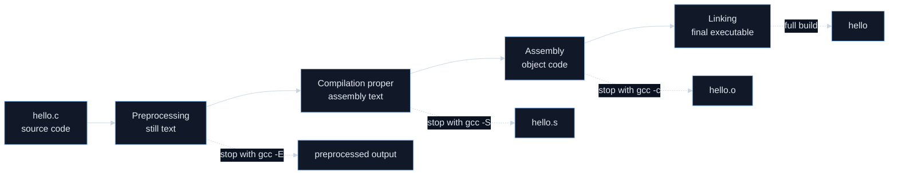
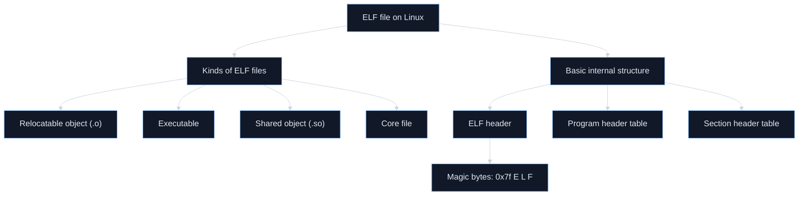
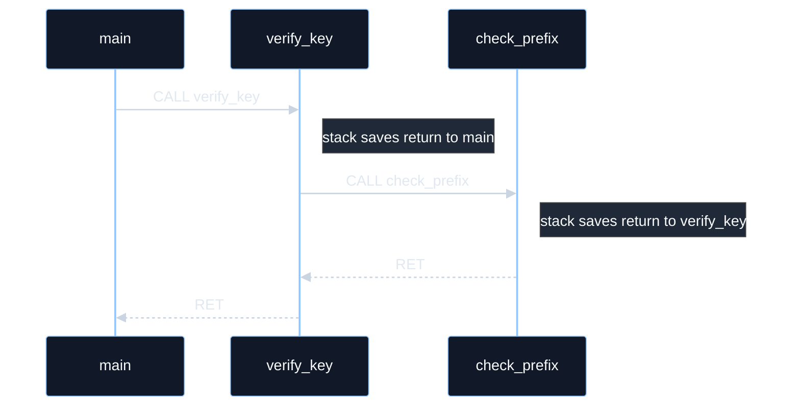

# Homework 1 Week 4: From C To Executables

Week 4 is the bridge between beginner C reading and the binary-analysis or Ghidra workflow needed later in the assignment.

Up to now, you have learned:

* what programs are,
* how Linux files and commands work,
* and how simple C logic is written.

This week is the bridge between **human-written C** and **machine-executed binaries**. GCC’s official documentation says compilation can pass through **preprocessing, compilation proper, assembly, and linking**, and Ghidra’s beginner guide says its decompiler works by going from **assembly to p-code to C**, while warning that assembly and C are **not a one-to-one match**. That is the whole point of Week 4: learning why the executable you reverse later is related to the original source, but never identical to it. ([GCC][1])

---

# Week 4 mission

By the end of this week, you should be able to:

* explain how a C file becomes an executable,
* tell the difference between source code, assembly, object files, and executables,
* recognize what an ELF file is,
* read very small low-level control-flow patterns,
* understand the basic role of registers, the stack, and function calls,
* and explain why decompiled C is only an approximation of the original program. ([GCC][1])

---

# Week 4 overview

| Day    | Theme                              | Main outcome                                                |
| ------ | ---------------------------------- | ----------------------------------------------------------- |
| Day 22 | From C source to executable        | You understand the build pipeline                           |
| Day 23 | ELF, object files, and executables | You can tell what kind of binary file you are looking at    |
| Day 24 | Assembly as “tiny steps”           | You stop seeing assembly as random symbols                  |
| Day 25 | Registers and low-level state      | You understand where temporary machine-level values live    |
| Day 26 | Calls, returns, and the stack      | You can explain how functions work at run time              |
| Day 27 | Why decompiled C is approximate    | You understand why Ghidra output helps but is never perfect |
| Day 28 | Review and mini-lab                | You connect the whole week into one workflow                |

---

# Day 22 — From C source to executable

## Goal

Understand the full journey from a `.c` file to a runnable program.

## Core lesson

GCC’s official manual says compilation can involve **four stages**, always in this order: **preprocessing**, **compilation proper**, **assembly**, and **linking**. The same manual also says `-E` stops after preprocessing, `-S` stops after compilation proper and leaves you with assembly, and `-c` stops after assembly and leaves you with an object file. If you do not specify `-o`, GCC’s default executable output name is `a.out`. ([GCC][1])

Here is the beginner-friendly meaning of those stages:

**1. Preprocessing**
This handles things like `#include` and macros.
It is still text.

**2. Compilation proper**
This turns the preprocessed C into assembly code.
It is no longer “nice human source code,” but it is still a readable text form.

**3. Assembly**
This turns assembly into machine-oriented object code.
Now you are in binary territory.

**4. Linking**
This combines one or more object files—and any needed library pieces—into the final executable. ([GCC][1])

## Visual build pipeline



## School-style analogy for you

Think of writing a report:

* **source code** = your editable draft
* **preprocessing** = automatically inserting required reference pages
* **compilation** = translating your ideas into a stricter formal format
* **assembly** = turning that format into machine-usable pieces
* **linking** = stapling your pages together with the shared appendix pages you referenced

The final booklet is not your original draft. It is the finished product that gets handed out.

## Why this matters for your future assignment

Your reverse-engineering homework does **not** start with source code. It starts with the **finished linked executable**. So to work backward, you first need to know what steps produced that executable in the first place. ([GCC][1])

## Tiny teaching example

Suppose you write this:

```c
int main(void)
{
    return 0;
}
```

You can think of the build stages like this:

* `gcc -E hello.c` → “show me the preprocessed text”
* `gcc -S hello.c` → “show me the assembly text”
* `gcc -c hello.c` → “make an object file, but do not link”
* `gcc hello.c -o hello` → “produce the final executable” ([GCC][1])

## Today’s mini practice

If you have GCC available, run these:

```bash
gcc -E hello.c | head
gcc -S hello.c
gcc -c hello.c
gcc hello.c -o hello
```

Then answer:

1. Which step still gives you text?
2. Which step gives you `.s`?
3. Which step gives you `.o`?
4. Which step gives you the runnable file?

If you do **not** have GCC installed yet, that is fine—trace the commands conceptually and explain what each one is supposed to stop after.

## Checkpoint

What is the difference between:

* `gcc -S hello.c`
* `gcc -c hello.c`
* `gcc hello.c -o hello`

A strong answer is:

* first stops at assembly,
* second stops at object code,
* third goes all the way to an executable. ([GCC][1])

---

# Day 23 — Object files, executables, and ELF

## Goal

Understand what kind of binary files Linux uses.

## Core lesson

The Linux `elf(5)` manual says ELF is the format of **Executable and Linking Format** files, and that ELF covers several related file types: **normal executable files, relocatable object files, core files, and shared objects**. It also explains that an ELF executable consists of an **ELF header**, followed by a **program header table** or a **section header table**, or both. ([man7.org][2])

That means a Linux binary is not just “a blob of bytes.” It has structure.

## Plain-English meaning

An **ELF file** is a Linux-style binary file with a standard internal layout.

In beginner terms, you can think of it as:

* the **container** that holds compiled program data,
* plus the **labels and structure** that tell tools and the operating system how to understand that data.

So ELF is not the program logic by itself. It is the organized file format that wraps that logic in a way Linux tools can inspect and the operating system can load.

That is why commands like `file` and `readelf` are useful: they are not guessing blindly. They are reading a file that follows a known format.

A very useful beginner distinction is:

* **Object file (`.o`)** = a partly finished compiled piece
* **Executable** = the final thing the OS can run
* **Shared object (`.so`)** = reusable compiled library code loaded at run time ([man7.org][2])

## Beginner examples

Here are a few beginner-friendly examples of what that means in real life:

**1. `hello.o`**

If you compile with:

```bash
gcc -c hello.c
```

you get `hello.o`.
That file is usually an **ELF relocatable object file**.
It is real compiled machine-level code, but it is usually **not** the final runnable program yet.

**2. `hello`**

If you compile with:

```bash
gcc hello.c -o hello
```

you get `hello`.
That file is usually an **ELF executable**.
This is the one the operating system can try to run directly.

**3. `libsomething.so`**

A file ending in `.so` is usually a **shared object**.
You can think of it as compiled library code that another program can use at run time instead of copying all that code into every executable.

**4. A core file**

If a program crashes and the system saves its memory state for debugging, that saved file can also be an ELF-related file type called a **core file**.
You do not normally “run” it. It is more like a snapshot for investigation.

So a beginner-friendly summary is:

* `hello.o` = one compiled piece
* `hello` = the runnable program
* `libsomething.so` = shared compiled helper code
* core file = crash snapshot for debugging

## Visual structure tree



## The magic number idea

The ELF header begins with a magic identifier. The ELF man page shows the first bytes as `0x7f`, then `E`, `L`, `F`. That is one of the simplest ways tools can recognize “this is an ELF file.” ([man7.org][2])

## Two practical tools you should know this week

The `file` command classifies files by testing them in stages, including filesystem tests and “magic” tests, and its manual explains that executable formats are often recognized by fixed identifying bytes near the beginning of the file. The `readelf` tool displays information about ELF object files, and `readelf -h` specifically shows the ELF header at the start of the file. ([man7.org][3])

So for a beginner, these two commands are gold:

```bash
file hello
readelf -h hello
```

The first answers, “what kind of file is this?”
The second answers, “what does its ELF header say?” ([man7.org][3])

## Quick SOP — First look at an unknown Linux binary

1. Run `file target` to classify the file before guessing what it is.
2. If it is ELF, run `readelf -h target` to inspect the header.
3. Check whether it is a relocatable object file, an executable, or a shared object.
4. Confirm the ELF identity starts with the magic bytes `0x7f`, `E`, `L`, `F`.
5. Only then move on to deeper tools like `objdump` or Ghidra.

## School-style analogy for you

Think of an object file as a half-finished group project page. It has real content, but it is not yet the final submitted report. Linking is the stage where the separate pages get assembled into the final submission.

An ELF executable is that final submitted report—but with a very strict internal layout so the operating system knows how to load and run it.

## Today’s mini practice

If you built a small program on Day 22:

```bash
file hello.o
file hello
readelf -h hello
```

Then answer:

1. Which file is relocatable / object-like?
2. Which file is executable?
3. Where do you see the ELF identity?

## Checkpoint

Why is an object file not usually runnable by itself?

Because it is compiled code that has not necessarily been fully linked into a complete executable yet. ELF explicitly distinguishes relocatable object files from normal executable files. ([man7.org][2])

---

# Day 24 — Assembly as “many tiny steps”

## Goal

Stop seeing assembly as mysterious nonsense.

## Core lesson

Ghidra’s beginner guide says the decompiler converts **assembly → p-code → C**, and it explicitly warns that assembly and C are **not one-to-one**. That means assembly is not “broken C”; it is a lower-level description of what the machine is doing. `objdump` is one of the standard tools for displaying information about object files, including disassembly-related views when you ask for them. ([Ghidra][4])

The right beginner mindset is this:

A C statement often expresses **one big human idea**.
Assembly usually expresses that same idea as **many tiny machine steps**.

For example, a C statement like:

```c
if (x == 8) ok();
```

may turn into a lower-level pattern like:

1. load or fetch a value,
2. compare it,
3. branch to one place if equal,
4. branch somewhere else if not.

You do **not** need the exact real instruction syntax first.
You need to recognize the **shape of the logic**.

## A teaching example in pseudo-assembly

Here is a deliberately simplified fake example:

```text
load x
compare x with 8
jump_if_not_equal fail
call ok
```

That is not meant to be precise machine syntax.
It is meant to train your eyes to see that low-level code often expresses logic as:

* move data,
* test data,
* branch,
* call another piece of code.

## Why this matters for your assignment

When you later analyze a verifier, you are often looking for exactly this kind of pattern:

* compare input length,
* compare a character,
* jump to failure,
* continue to next test,
* eventually call success code.

So the real skill is not “memorize all instructions.”
It is “notice the logic hiding inside many small steps.”

## Extended example for you

Imagine a strict exam invigilator following this checklist:

* read student ID
* compare to roster
* if not found, send to office
* if found, allow entry

That is exactly what assembly often feels like: a line-by-line procedure with no unnecessary storytelling.

## Today’s mini practice

Take this C:

```c
if (length != 8)
    return 0;
```

Rewrite it in plain English as tiny machine-like actions.
A good answer sounds like:

* get `length`
* compare it to `8`
* if different, go to the “return 0” path

## Checkpoint

Why is assembly harder for beginners than C?

Because C groups ideas into larger human-friendly statements, while assembly exposes many smaller operations and control-flow jumps. Ghidra’s documentation explicitly warns that assembly and C are not one-to-one, which is why reverse engineering takes interpretation. ([Ghidra][4])

---

# Day 25 — Registers and low-level program state

## Goal

Understand where the machine keeps temporary working values.

## Core lesson

The AMD64 ABI says the architecture provides **16 general-purpose 64-bit registers**. The same ABI material also names `%rsp` as the **stack pointer** and `%rbp` as the **frame pointer**, while noting that some code may use `%rsp` directly instead of `%rbp` as a frame pointer. GCC’s optimization documentation adds that `-fomit-frame-pointer` avoids setting up and restoring a frame pointer in functions that do not need one, and on some targets leaf functions omit it anyway. ([Linux Foundation Specs][5])

For your level, the main idea is:

**Registers are tiny, fast, named storage spots the CPU uses while working.**

You do **not** need to memorize all 16 registers this week.
You mostly need to remember these roles:

* general registers can temporarily hold values,
* `%rsp` tracks the top of the stack,
* `%rbp` often helps describe a stack frame in easier-to-read builds,
* but optimized code may skip `%rbp` entirely. ([Linux Foundation Specs][5])

## School-style analogy for you

Think of registers as sticky notes on your desk while solving a math problem.

* The big notebook on the shelf = memory
* The sticky notes right in front of you = registers

You reach for the sticky notes constantly because they are fast and convenient.

## Why this matters for reverse engineering

Later, when a decompiler looks confusing, one of the hidden questions is often:

> “What value is the machine keeping in a temporary place right now?”

That temporary place may originally have been a register.

## A helpful beginner warning

Do not fall into the trap of thinking:

* registers = magical,
* memory = mysterious black hole.

At this stage, just think:

* registers = fast temporary holders,
* memory = larger stored data.

That is enough to start.

## Today’s mini practice

Suppose a verifier is checking input length.

Which storage location sounds more likely to hold each of these during active computation?

1. the current loop index
2. the full user input string
3. the current comparison result
4. a saved return address

A good beginner intuition is:

* small active numbers and temporary results often feel register-like,
* larger stored text feels memory-like,
* return information ties into stack behavior, which you study next.

## Checkpoint

Why is it useful to remember `%rsp` even if you do not memorize all other registers?

Because `%rsp` is tied to the stack, and the stack is central to understanding function calls, returns, and local working state. ([Linux Foundation Specs][5])

---

# Day 26 — Function calls, returns, and the stack

## Goal

Understand how low-level control jumps into a function and comes back.

## Core lesson

The AMD64 ABI notes that the return address is stored at `0(%rsp)` rather than in a physical register, and Intel documentation explains the basic idea of the classic `CALL` / `RET` pattern: a `CALL` pushes the address of the next instruction onto the stack, and a `RET` uses that saved address to return control afterward. GCC’s docs also explain that some optimized code omits the frame pointer, so real compiled functions do not always have the “nice textbook” frame layout. ([Linux Foundation Specs][5])

Here is the beginner mental model:

When one function calls another, the machine needs to remember:

* where to come back to,
* what temporary local working space is needed,
* and how to restore things afterward.

The **stack** is the machine’s very orderly “working pile” for that process.

## School-style analogy for you

Imagine you are solving a hard problem and ask a classmate to quickly check one sub-part.

Before you hand it off, you mark where you should resume.
Then your classmate does the sub-task.
Then you come back to the exact place you paused.

That “resume marker” is like the saved return address.

## Why this matters later

When you later look at a verifier binary, a big part of understanding it is recognizing function structure:

* setup,
* local work,
* calls to helper functions,
* return to caller.

That is also why stack traces are meaningful. The `gdb` manual lists `bt` (“backtrace”) as the command that displays the program stack. ([man7.org][6])

## Visual model

Think of this call chain:

```text
main -> verify_key -> check_prefix
```

Here is the same idea as a call / return timeline:



A rough stack picture while `check_prefix` is running is:

```text
top of stack
[ return to verify_key ]
[ local data for check_prefix ]
[ return to main ]
[ local data for verify_key ]
...
```

This is simplified, but it is the right intuition.

## Today’s mini practice

Draw a three-level function call on paper:

```text
main
  calls verify
    calls helper
```

Then answer:

1. When `helper` finishes, where does control go?
2. Why must the machine remember a return address?
3. Why can nested function calls be represented as a stack-like structure?

## Checkpoint

What is the stack doing during function calls?

A strong answer is:

* storing return information and working state in an orderly nested way so execution can return correctly. ([Linux Foundation Specs][5])

---

# Day 27 — Why decompiled C is useful, but never perfect

## Goal

Understand why Ghidra helps so much—and why you still need judgment.

## Core lesson

Ghidra’s beginner guide says the decompiler converts **assembly to p-code to C** and explicitly states that **assembly and C are not one-to-one**. It also notes that decompiler output can change when program information changes, such as data types or the functions being called. GCC’s optimization docs make this even more important: at `-O0`, most optimizations are disabled, but at optimization levels like `-O1`, `-O2`, and `-Os`, GCC may inline functions; in particular, a static function called once can be integrated into its caller and may not be emitted as separate assembler code at all. GCC also documents frame-pointer omission as another reason compiled code may not look like simple classroom examples. ([Ghidra][4])

That means a decompiler is **not** a time machine that recovers the exact original source.
It is more like a very smart reconstruction tool.

## Beginner-friendly translation analogy

Suppose a teacher only has:

* a printed worksheet,
* some margin notes,
* and the final answer sheet,

and is trying to reconstruct the original lesson plan.

They may recover the logic very well.
But they may not recover:

* the exact original variable names,
* the exact formatting,
* every helper function boundary,
* or the author’s original style.

That is what decompilation feels like.

## Why optimization matters so much

This is one of the most important conceptual points in the whole week.

A beginner often assumes:

> “If the original source had three small functions, the binary will also clearly show three small functions.”

Not always.

Optimization can:

* inline a function into its caller,
* reorder work,
* omit frame-pointer setup,
* or otherwise change the low-level shape. ([GCC][7])

So when Ghidra shows a function that looks “weird,” that does **not** necessarily mean the source was weird. It may simply mean the compiled code was optimized.

## Quick SOP — How to read decompiled C safely

1. Start with the decompiled C to recover the big picture and main branches.
2. Treat variable names, inferred types, and formatting as helpful guesses, not guaranteed originals.
3. If a function boundary or branch looks strange, consider that optimization may have inlined or rearranged code.
4. Cross-check suspicious details in disassembly before trusting them.
5. Write down recovered logic, not claims about the exact original source text.

## Today’s mini practice

Answer these in plain English:

1. Why can two different C programs compile into similar-looking low-level code?
2. Why can one simple C function disappear as a separate function in optimized output?
3. Why should you trust the decompiler as a guide, but not treat it as perfect source recovery?

## Checkpoint

Finish this sentence:

> “Decompiled C is helpful because it summarizes low-level behavior in a more readable form, but it is not exact original source because…”

A strong ending is:

* because compilation and optimization change structure, and Ghidra itself says assembly and C are not one-to-one. ([Ghidra][4])

---

# Day 28 — Review and mini-lab

## Goal

Turn the week into one connected workflow.

## The full conceptual chain

By now, your mental model should be:

1. Human writes C source.
2. GCC preprocesses, compiles, assembles, and links it.
3. The result on Linux is often an ELF executable.
4. Tools like `file` and `readelf` can inspect the binary’s type and header.
5. Disassembly shows many tiny machine-level actions.
6. Registers and the stack hold temporary execution state.
7. Function calls and returns rely on saved control-flow information.
8. Ghidra reconstructs a C-like view, but it is only an approximation. ([GCC][1])

## Mini-lab

If you have a compiler available, do this with a tiny program:

```c
int main(void)
{
    return 0;
}
```

Then try:

```bash
gcc -S tiny.c
gcc -c tiny.c
gcc tiny.c -o tiny
file tiny.o
file tiny
readelf -h tiny
```

What you should notice:

* `.s` is assembly text,
* `.o` is an object file,
* `tiny` is the executable,
* `file` tells you what kind of file each one is,
* `readelf -h` shows ELF header information. ([GCC][1])

If your environment also has `objdump`, treat it as an optional preview tool this week rather than a requirement. The official docs describe it as a tool for displaying information about object files; it becomes more useful once you are comfortable reading disassembly at all. ([man7.org][8])

## End-of-week self-test

Try answering these without notes:

1. What are the four GCC stages?
2. What is the difference between `-S` and `-c`?
3. What does ELF stand for?
4. What is an object file?
5. Why does an executable have internal structure instead of being random bytes?
6. Why is assembly harder to read than C?
7. What is a register?
8. What does the stack help with during function calls?
9. Why can optimized code look different from source?
10. Why is decompiled C only approximate?

If you can answer 7 or more cleanly, Week 4 is working.

---

# Further reading, chosen for you

Since you are learning this **for a reverse-engineering assignment**, your reading should be focused and practical.

The single most important official reading for Day 22 is **GCC’s “Overall Options”** page. It is the cleanest source for the four-stage pipeline and for what `-E`, `-S`, `-c`, and `-o` actually do. It is the best “source-to-binary” reference for this entire week. ([GCC][1])

For Day 23, read **`elf(5)`** slowly, but only the beginning sections first. You do not need the entire spec. For now, you mainly want:

* what ELF is,
* what file kinds it covers,
* that the ELF header is at the start,
* and that executable/shared-object structure is formally defined. Pair that with **`file(1)`** and **`readelf(1)`** so the format stops feeling abstract. ([man7.org][2])

For Day 24 and Day 27, the most important reading is the **Ghidra Beginner Student Guide**, especially the decompiler overview. That one page quietly teaches one of the most important reverse-engineering truths: decompiler output is useful, but it is still a reconstruction. ([Ghidra][4])

For Day 25 and Day 26, read just enough of the **AMD64 ABI** material to recognize `%rsp`, `%rbp`, and the idea that return information lives on the stack. This is not something to memorize line-by-line; it is there so the stack stops feeling magical. As a preview tool, the `gdb` man page is also worth skimming because it introduces `bt` for backtraces, which is a very concrete way to think about nested function calls. ([Linux Foundation Specs][5])

For Day 27, read only the relevant slice of **GCC’s optimization options**: `-O0`, `-Og`, inlining, and frame-pointer omission. That material explains a lot of the “why doesn’t the binary look like the source?” frustration that beginners feel when they first open a compiled program in Ghidra. ([GCC][7])

---

# What success looks like at the end of Week 4

Week 4 has succeeded if you can now say:

* “I know how source becomes a binary.”
* “I know what an ELF executable is.”
* “I know why object files and executables are not the same thing.”
* “I know that low-level code is many tiny steps.”
* “I know that registers and the stack hold execution state.”
* “I know that Ghidra’s decompiled C is a reconstruction, not the original source.”

That is exactly the understanding you need before Week 5, where the focus shifts from theory to **actually using Ghidra to navigate functions, strings, and control flow**.

[1]: https://gcc.gnu.org/onlinedocs/gcc/Overall-Options.html "https://gcc.gnu.org/onlinedocs/gcc/Overall-Options.html"
[2]: https://man7.org/linux/man-pages/man5/elf.5.html "https://man7.org/linux/man-pages/man5/elf.5.html"
[3]: https://man7.org/linux/man-pages/man1/file.1.html "https://man7.org/linux/man-pages/man1/file.1.html"
[4]: https://ghidra.re/ghidra_docs/GhidraClass/Beginner/Introduction_to_Ghidra_Student_Guide.html "https://ghidra.re/ghidra_docs/GhidraClass/Beginner/Introduction_to_Ghidra_Student_Guide.html"
[5]: https://refspecs.linuxbase.org/elf/x86_64-abi-0.99.pdf "https://refspecs.linuxbase.org/elf/x86_64-abi-0.99.pdf"
[6]: https://man7.org/linux/man-pages/man1/gdb.1.html "https://man7.org/linux/man-pages/man1/gdb.1.html"
[7]: https://gcc.gnu.org/onlinedocs/gcc/Optimize-Options.html "https://gcc.gnu.org/onlinedocs/gcc/Optimize-Options.html"
[8]: https://man7.org/linux/man-pages/man1/objdump.1.html "https://man7.org/linux/man-pages/man1/objdump.1.html"
