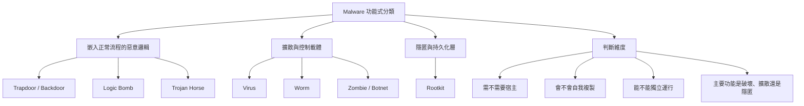
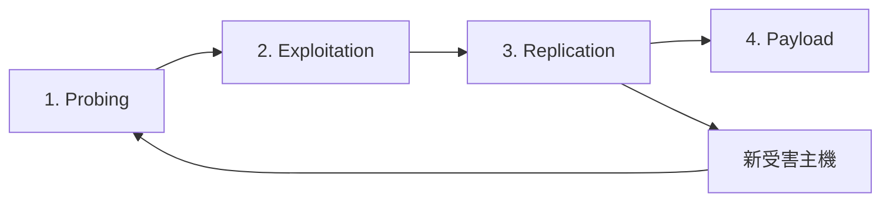
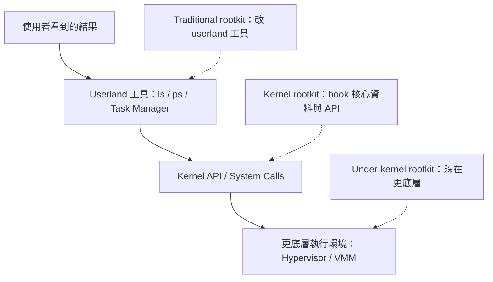
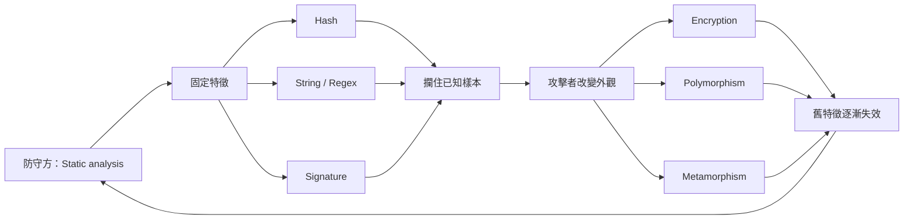
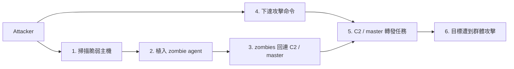

# B1 Malware Deep Dive

This slide note has two layers: a structured reconstruction of the malware lecture's teaching line, followed by research-oriented extensions for modern cases, trends, and paper ideas.

## 0. 先用一句話抓住整堂課

這份講義真正要教你的，不只是「什麼叫 virus、worm、trojan」，而是：**攻擊者如何讓惡意邏輯進得去、傳得快、藏得久、控得住、最後還能賺到錢**。從 trapdoor、logic bomb、trojan horse，到 virus、worm、botnet、rootkit，最後到 ransomware，其實是在看同一條演化線：**未經授權的控制權如何被自動化、規模化、隱形化與商業化**。投影片第 7 頁的 taxonomy、第 15 頁的 worm lifecycle、第 40–42 頁的 rootkit classification，以及第 52–56 頁的 detection vs. evasion，就是這條主線的骨架。

---

## 1. 結構化筆記（主題分類）

### 1.1 歷史演化：malware 是怎麼一路長大的

投影片第 2–6 頁把 malware 歷史分成 discovery、transition、fame and glory、mass cybercrime 四個時期。早期例子像 Elk Cloner、Brain、Virdem、Morris worm、Chameleon，重點在「第一次出現什麼能力」：boot sector 感染、檔案感染、buffer overflow、polymorphism。接著進入轉型期，開始出現 logic bomb、macro virus、CIH 這種更實用、破壞性更高的型態。再往後，Melissa、LoveLetter、Code Red、Nimda、MyDoom、Storm、Zeus、Conficker、Koobface、Aurora、Stuxnet 等例子，顯示攻擊從「技術展示」逐漸變成「大規模感染、遠端控制、偷憑證、打關鍵系統」。換句話說，**歷史不是在背年份，而是在看攻擊者優化了哪一個能力：感染、傳播、隱匿、控制、變現**。

### 1.2 分類方法：不要只背名詞，要看功能

第 7 頁那張 taxonomy 很重要。它不是單純在列名詞，而是在暗示你應該用幾個維度來分類惡意程式：
第一，它需不需要宿主程式；第二，它會不會自我複製；第三，它能不能獨立運行；第四，它主要是在「做壞事」還是在「幫自己躲起來」。
所以 trapdoor、logic bomb、trojan horse 比較像「嵌進正常流程裡的惡意邏輯」；virus、worm、zombie 比較像「擴散與控制載體」；rootkit 則是「隱匿與持久化層」。這種功能式分類，比背定義更接近真實世界。

可以先把這種功能式 taxonomy 視覺化成下面這張圖：

### 1.3 傳播機制：速度本身就是攻擊力

第 15–32 頁幾乎都在講 worm。第 15 頁直接把 worm 拆成 **Probing → Exploitation → Replication → Payload**。後面用 Morris、Code Red、SQL Slammer、Nimda 再把這四步放大給你看。Morris 用 sendmail debug、fingerd buffer overflow、trusted logins、弱密碼找路；Code Red 與 Slammer 則展示「已知漏洞 + 高速掃描」如何在極短時間讓大量主機失守；Nimda 更進一步，把 email、預覽窗格、web page、IIS 弱點、shared drive、既有 backdoor 都串起來。教授真正想說的是：**有時候最可怕的不是 payload 本身，而是傳播速度、重複感染與資源耗盡造成的系統性癱瘓**。

如果把 worm 的核心機制壓成一張流程圖，就是：

### 1.4 隱匿與持久化：看不到，比進來更可怕

第 40–51 頁從 rootkit 講到 keylogger，再講到從 Task Manager 隱身。這一段的核心是：**攻擊者真正想要的，通常不是只跑一次，而是留下來，而且不被你發現**。第 41–42 頁把 rootkit 分成 traditional、kernel-level、under-kernel/VMM 這幾層，意思是隱匿可以發生在 user program、kernel、甚至 kernel 底下。第 43–44 頁用 keylogger 圖示說明，惡意程式可以攔截你以為屬於正常 UI 的輸入流程。第 45–51 頁更進一步展示 DLL injection、hook `NtQuerySystemInformation`、修改 IAT 等概念，說明 malware 可以改寫「你怎麼看見系統」，而不是只改寫系統本身。

這段也很適合用「你如何看見系統」的層次圖來理解：

### 1.5 偵測與反偵測：這是一場持續的軍備競賽

第 52–56 頁先講 static analysis、pattern matching、hash、string pattern、regular expression、ClamAV signatures，接著馬上講 encryption、polymorphism、metamorphism。這個安排不是偶然。它在教你一個很本質的安全觀念：**只要防守方依賴固定特徵，攻擊方就會想辦法摧毀固定特徵**。加密是把內容藏起來；polymorphism 是讓解密器或外觀一直變；metamorphism 則連程式碼本體都改成語意等價但長得不同的版本。也就是說，malware detection 從第一天開始就是一個「你抓外型，我改外型」的對抗問題。

把這場軍備競賽畫成循環會更直觀：

### 1.6 這份 lecture 的整體教學結構

如果把整份投影片縮成一句研究語言，它其實是在教一個非常標準的 kill chain：
**initial access → execution → propagation → persistence → stealth → command/control → monetization**。
只是課堂用的不是今天 SOC 常見的詞，而是經典 malware vocabulary。這一點非常值得你記住，因為它讓這份看起來「很老派」的 lecture，其實仍然和現在的 EDR、ATT&CK、IR、RaaS、生態系供應鏈攻擊有直接關聯。

---

## 2. 核心概念（Definition，用最簡單語言、教高中生）

### Trapdoor / Backdoor

這就是「偷偷留的門」。正常人進系統要走帳號密碼、權限檢查，但 trapdoor 讓特定人可以繞過正常流程。你可以把它想成工程師為了維護方便，先藏了一把備用鑰匙；問題是，只要那把鑰匙被別人拿到，它就不是方便，而是破口。投影片第 8 頁特別點出它可能是特定 user identifier 或 password，也可能藏在 compiler 之類的地方。

### Logic Bomb

它平常不動，等某個條件成立才爆。條件可能是日期、某個檔案存在或不存在、某個使用者登入，或其他事件。你可以把它當成「寫在程式裡的延遲炸彈」。它的可怕之處在於：平常看起來完全正常，一旦條件成立，就開始刪檔、改檔、破壞系統。第 9–10 頁就是在講這個概念。

### Trojan Horse

木馬最簡單的理解就是「包裝成正常工具的惡意程式」。你以為自己在跑 `ls`、安裝更新、開發票下載器、瀏覽器更新，其實你是在替對方執行惡意操作。第 11 頁特別強調 trojan 有 overt effect 和 covert effect：表面行為看起來正常，暗地裡卻違反安全政策。重點是，它通常利用的是**使用者的信任**，而不是先靠高超 exploit。

### Virus

virus 會把自己的程式碼附著到別的程式或檔案裡，等宿主被執行時再一起跑。它像寄生蟲：不一定自己單獨活，但會靠別人的身體擴散。第 12–14 頁還補了很多重要細節：virus 常常沒有明顯外顯行為、會盡量不被發現、會感染 boot sector、可執行檔或 macro file，還會用 resident、stealth、encryption、polymorphism、metamorphism 等手法躲偵測。

### Worm

worm 跟 virus 最大的差別是：**它不需要宿主程式**。它自己就是完整程式，會主動在網路上找下一台可感染的機器。你可以把 worm 想成「會自己跑出去找下一個受害者的惡意生物」。第 15 頁說得很清楚：它會先 probing，再 exploitation，接著 replication，最後執行 payload。這就是為什麼 worm 常常能造成大範圍事件。

### Zombie / Botnet

zombie 是已經被攻擊者控制的電腦；很多 zombie 組起來，就是 botnet。第 33–39 頁用六張圖示範了完整流程：攻擊者先掃描脆弱主機，再偷偷裝 zombie agent，接著讓這些機器「phone home」連到 master server，最後由 master server 同步下命令去打目標。你可以把 botnet 想成一群被遙控的殭屍電腦軍隊。它們可以拿來做 DDoS、spam、phishing、credential theft。

### Rootkit

rootkit 不是單純的「另一種病毒」，而是「幫攻擊者隱形」的一整組技巧。第 40 頁定義得很直接：在系統已被攻破後，rootkit 用來隱藏攻擊者存在、並提供容易再進來的 backdoor。簡單 rootkit 會改 `ls`、`ps` 這種 userland 工具；更厲害的會改 kernel，甚至躲到更底層的虛擬化層。你可以把 rootkit 想成隱形斗篷加秘密通道。

### Keylogger

keylogger 是專門偷你輸入內容的東西。它最簡單的版本就是把你鍵盤打下去的資料記起來，所以密碼、信用卡、搜尋內容、聊天內容都有可能被收走。第 43–44 頁用圖示說明 keyboard hook 與 shared memory 的概念，重點不是某個 API 名字，而是：**malware 可以直接攔截人機互動的訊號流**。

### Ransomware

ransomware 是把你的資料或系統鎖住，再要求付錢的惡意程式。最簡單的版本是加密檔案；更現代的版本通常會先偷資料，再用外洩威脅施壓。投影片第 57 頁只用一張圖帶過，但放在整份講義最後，非常有象徵性：前面那些感染、傳播、隱匿、控制，最後都很容易收斂到一件事——**變現**。

---

## 3. 教授講的重點（From Lecture）

### Key Idea 1：分類 malware 的真正方法，是看它「怎麼工作」

教授表面上是在逐一介紹 trapdoor、trojan、virus、worm、rootkit；但其實更深的教學目標是要你用 **功能與機制** 看 malware：它怎麼進入、怎麼取得執行權、怎麼擴散、怎麼躲避偵測、怎麼控制受害系統。你一旦抓到這個框架，就不會只停留在「背定義」。

### Key Idea 2：worm 的危害常常來自「傳播速度」，不是 payload 複雜度

Morris、Code Red、Slammer、Nimda 這幾個例子串起來，就是一堂「網路規模效應」的示範。投影片第 27 頁甚至強調 Slammer 的 code 只有 376 bytes，但仍然能在不到 10 分鐘感染脆弱族群。教授要你看到的是：**一個很小、很單純的程式，只要利用對了環境與網路連通性，就能造成極大的系統性影響**。

### Key Idea 3：偵測與變形是永遠互咬的

第 52–56 頁安排得非常像辯論：前半段說 signature-based detection 怎麼做，後半段立刻說 malware 怎麼靠 encryption、polymorphism、metamorphism 逃掉。這等於在告訴你，**沒有一種 detection method 可以永久穩贏**；防守者抓什麼，攻擊者就調整什麼。

### Hidden assumption 1：這些類別其實不是互斥的

這是整份 lecture 沒明講、但最重要的隱含前提之一。真實世界的惡意程式，很少只屬於一個類別。今天一個樣本可以同時是 trojan（靠社工進來）、downloader（先拉第二階段）、rootkit（隱匿）、keylogger（偷資料）、bot（接受 C2 指令），最後再掉 ransomware。換句話說，課堂上的分類是為了教學拆解；真實攻擊則是**能力堆疊**。這點從經典案例到現在的勒索入侵都成立。 ([Internet Crime Complaint Center][1])

### Hidden assumption 2：真正的脆弱點常常是「信任結構」，不是單一漏洞

Morris 不是只靠一個 bug，而是把 sendmail、fingerd、`.rhosts`、弱密碼一起用；Nimda 不是只靠一個傳播向量，而是把 email、preview pane、web page、IIS、shared drive、既有 backdoor 全部串起來。這暗示一個更大命題：**攻擊者最擅長的是借用系統內建的信任關係、管理工具與使用者習慣**。現代 incident response 報告也一再指出，攻擊成功往往來自可視性不足、過度授權、控制不一致、身份信任過大，而不只是單一零時差。  ([Palo Alto Networks][2])

---

## 4. 例子（Examples）

### 4.1 課堂例子

#### Morris worm：第一個真正讓整個網路社群驚醒的大型例子

第 18–24 頁把 Morris worm 講得很完整。它利用的是 Unix 系統裡多個入口：sendmail debug feature、fingerd buffer overflow、trusted logins、弱密碼。它本身沒有像後來 ransomware 那樣直接勒索或大量毀檔，但因為重複感染與大量 fork process，造成主機與網路資源被耗盡，導致大規模停機。這個例子告訴你：**惡意程式造成的 damage，不一定來自惡意 payload，也可能來自 uncontrolled self-replication**。

#### SQL Slammer：小到誇張，但快到可怕

第 25–27 頁的 Slammer 非常經典。它的重點不在功能複雜，而在極端壓縮的 exploit 與高速隨機掃描。投影片用封包與 shellcode 拆解圖強調「Slammer’s code is 376 bytes」，這其實是在提醒你：**最危險的惡意程式不一定最大、最花俏，而可能是最短、最專注、最適合網路環境擴散的那種**。

#### Nimda：multi-vector infection 的早期代表

第 28–31 頁的 Nimda 很值得研究，因為它已經非常像現代攻擊鏈。它不只會 email itself，也能利用 IE preview、修改 web page、感染 IIS、複製到 shared drives，還掃描其他 worm 留下的 backdoor。Nimda 告訴你一件事：**一旦攻擊者學會把多種弱點與入口串成一條路徑，防守就不再能用單點思維處理**。

#### Rootkit / Keylogger / Task Manager hiding：malware 不只是進來，還要改變你看到的世界

第 43–51 頁示範 keylogger 與 Task Manager hiding，不是要你背 API，而是讓你理解「觀察介面可以被操控」。使用者看到的 process list、security tool 顯示、鍵盤輸入流程，都可能已經被 malware 截斷或改寫。也就是說，**觀測層本身也是攻擊面**。

### 4.2 生活例子（你可以拿去講給非本科的人）

最簡單的生活例子是「假更新程式」。你收到一封信，說報稅系統要更新、電子發票要下載、瀏覽器要升級、公司安全軟體要重裝。你點下去後，畫面可能真的出現一個像樣的安裝器，但背景實際在下載第二階段 payload、偷 session token、或建立遠端控制通道。這就是 trojan：看起來像正常服務，實際上把你的信任轉成對方的執行權。近年的台灣在地案例裡，FortiGuard 觀察到 Winos 4.0/ValleyRat 反覆利用稅務查核通知、報稅安裝程式與電子發票下載等本地化題材，並結合 LNK downloader、DLL sideloading 與 BYOVD。([Fortinet][3])

另一個生活例子是「假客服或假 IT 協助」。過去使用者熟悉的是 email phishing，但現在攻擊者越來越常用更互動的方式，例如語音社工、ClickFix 這種假 CAPTCHA/假修復流程，誘導你自己去執行 PowerShell 或下載假的更新。Mandiant 2026 指出 voice phishing 已升到第二常見的初始感染向量，Interlock 也被 FBI/CISA 觀察到會透過 ClickFix 與受害合法網站上的 drive-by download 取得初始存取。([Google Cloud][4])

### 4.3 工程例子（AI / Security）

#### 例子 A：browser session stealer 是現代版 keylogger + trojan

課堂的 keylogger 主要偷 keystroke，但今天很多攻擊更想偷的是 **browser session token、stored credential、OAuth token、cloud PAT**。Microsoft 2025 指出 infostealer 正在大幅增加，Lumma Stealer 甚至在 2025 年被 Microsoft 與多方聯手打掉超過 2,300 個惡意網域；M-Trends 2025 也指出 stolen credentials 已是第二大初始感染向量，占調查案件 16%。所以如果你把第 43–44 頁的 keylogger 想成「人機輸入層被攔截」，現代版其實就是「瀏覽器與身份層被攔截」。([Google Cloud][5])

#### 例子 B：supply-chain trojan 是今天的高級木馬

課堂上的 trojan horse 例子是假的 `ls`，今天更危險的版本是「你信任的 package、security tool、CI/CD action、AI gateway 被做成 trojan」。2026 年 Unit 42 報告指出 TeamPCP 連續針對 Trivy、KICS、LiteLLM 與 Telnyx Python SDK 發動供應鏈攻擊，把 infostealer 直接植進 GitHub Actions 與 PyPI 發布流程。這是很典型的現代木馬：**外表是安全工具，實際上成了惡意載體**。([Unit 42][6])

#### 例子 C：AI agent 可能成為新型 backdoor

如果把 trapdoor/backdoor 的觀念搬到 agent 系統，今天的「秘密入口」未必是硬編碼密碼，而可能是過度授權的 service account、tool permission、memory channel、connector token。Unit 42 在 2026 年對 Vertex AI Agent Engine 的研究顯示，過度寬鬆的預設權限與單一 service agent 被濫用後，可能導向資料外洩與權限擴張。這個案例說明：**未來的 backdoor 不一定藏在 binary 裡，也可能藏在 agent runtime 的 permission model 裡**。([Unit 42][7])

#### 例子 D：indirect prompt injection 很像「文件層的 logic bomb」

logic bomb 是程式中藏一段平常不動、特定條件才觸發的惡意邏輯。對 AI agent 來說，間接提示注入其實有點像文件層、網頁層的 logic bomb：網頁表面是正常內容，但當 agent 去讀、總結、審核時，隱藏指令才開始發作。Unit 42 在 2026 年公開了 web-based indirect prompt injection 在野外被觀察到的案例，目標是騙 AI 審核系統放行原本應該拒絕的廣告。這個類比對 AOSA/agent 研究很有啟發。([Unit 42][8])

---

## 5. 本質理解（Deep Insight）

### 這一段最重要

### 5.1 為什麼會有 malware？

因為攻擊者想把別人的裝置、帳號、資料、運算資源與網路權限，變成自己的延伸手臂。從這個角度看，malware 的本質不是「壞檔案」，而是 **unauthorized automation of control**。
Trapdoor 解決「怎麼再進來」；logic bomb 解決「什麼時候動手」；trojan 解決「怎麼騙人執行」；virus/worm 解決「怎麼擴散」；rootkit 解決「怎麼躲」；botnet 解決「怎麼規模化」；ransomware 解決「怎麼變現」。這樣看之後，整份 lecture 就會變得非常一致。

### 5.2 malware 解決的是攻擊者的哪幾個問題？

如果用攻擊者視角，malware 通常在解五個工程問題：

第一，**initial access**：我怎麼拿到第一個 foothold？
第二，**persistence**：我怎麼留下來，不要一下就被清掉？
第三，**stealth**：我怎麼不要被看見、不要被太早看見？
第四，**scale**：我怎麼從一台變一百台、一千台？
第五，**monetization**：我怎麼把控制權變成收入、勒索壓力或戰略效果？

這五件事在今天仍然完全成立。Microsoft 2025 指出目前多數攻擊是金錢驅動，主要動機就是 extortion、ransomware 與 data theft；Unit 42 2026 則指出 extortion 正從「一定要加密」轉成「資料外洩 + 直接施壓也能賺」，顯示 monetization 已經比單一 payload 更核心。([Microsoft][9])

### 5.3 malware 的本質不是「程式」，而是「路徑」

這是我認為最值得你記住的洞見。
大多數人學 malware 時，會把焦點放在 sample、binary、family name。可是教授這份 lecture 一路從 worm、botnet、rootkit 講到 ransomware，真正呈現的是一條 **path**：
漏洞或社工 → 執行 → 複製 / 橫向移動 → 隱匿 → 命令控制 → 資料竊取 / 破壞 / 勒索。
所以防守方若只盯著「這個檔案像不像 malware」，會永遠慢半拍。更高一層的問題應該是：**哪些 execution path、identity path、data path、tool path 本來就不該被這樣串起來？** 這也是為什麼近年的研究一直往 provenance graph、workflow graph、cross-surface telemetry 走。 ([USENIX][10])

### 5.4 為什麼 detection 這麼難？

因為你抓的是「表現形式」，而攻擊者改的是「表現形式」。
signature 依賴固定字串、固定位元模式、固定結構；但 malware 可以 pack、encrypt、polymorph、metamorph，或乾脆改成多階段攻擊，把真正惡意行為延後到記憶體、腳本、遠端回傳、合法工具濫用之後才發生。這也是為什麼傳統偵測越來越容易被躲，研究才會往語意、流程、圖結構與跨時間泛化前進。NDSS 2025 專門處理 malware concept drift，指出 drift-invariant CFG/GNN 表徵可以減少新型樣本出現時的性能崩落；LAMD 與其他 LLM 研究則想用語意推理去補 explainability 與 drift 的弱點，但也都承認 context、成本與穩定性仍是硬限制。 ([NDSS Symposium][11])

### 5.5 limitation 是什麼？

malware 自己也有極限，而且這些極限很適合變成研究問題。

**第一個限制是速度與隱匿的拉扯。**
傳播越快，越容易 noisy；躲得越深，越不一定能大規模擴散。Morris 的資源耗盡其實就是沒有控制好這個 trade-off。現代 Unit 42 報告也指出，攻擊速度越來越快，最快四分之一的入侵在 2025 年只要 72 分鐘就完成外洩，但這也意味著攻擊更依賴前期快速壓縮流程與既有 access partner。 ([Palo Alto Networks][2])

**第二個限制是泛化與可靠性的拉扯。**
一套 evasive 技巧不一定能跨 OS、跨 compiler、跨工具鏈穩定工作。這在 binary/assembly 分析也很明顯：同一段高階邏輯經不同最佳化之後，assembly 長相可能差很多。Nova 之所以要做 assembly-specific foundation model，就是因為 assembly 資訊密度低、最佳化差異大，導致一般 code LLM 直接套上去不夠好。([OpenReview][12])

**第三個限制是 human workflow。**
攻擊者不只要寫得出來，還要讓這套東西在真實世界可部署、可維運、可回收利益。防守者也一樣：就算模型很準，若 SOC 看不懂、警報太多、成本太高，也很難落地。USENIX 2025 對 provenance IDS 的全面分析甚至直接指出，很多學術系統雖然報告高偵測率，但實務上不可部署；相反地，較簡單的模型反而更輕、更快、更即時。([USENIX][10])

### 5.6 這份 lecture 最深的一句話，我會怎麼替教授補完？

**Malware 的演化，其實就是「借用信任」的演化。**
以前借的是 boot process、`.rhosts`、弱密碼、macro、IIS service；今天借的是 browser session、OAuth token、CI/CD secret、signed driver、合法 RMM、SaaS integration、甚至 AI agent 的 tool authority。這句話一旦想通，你的研究視角就會從「找壞程式」升級成「找被濫用的信任鏈」。 ([Microsoft][13])

---

## 6. 與你的研究連結（AOSA / Agent / Cybersecurity）

### 6.1 在 AOSA 中怎麼看這堂課？

如果你的 AOSA 是在研究 agent、runtime、policy、tool authorization、action governance 這一類問題，那這堂課根本就是非常好的前導。因為 malware 的核心從來都不是單一步驟，而是一串「不應該被允許連起來的 action chain」：
下載檔案 → 解壓 → 執行 loader → 載入 DLL → 關閉防護 → 建立持久化 → 連 C2 → 外洩或加密。
AOSA 可以做的，就是定義：哪些 action 可以自動執行、哪些要 human approval、哪些要留下不可竄改的 provenance、哪些權限永遠不能被 agent 自己升高。這跟 lecture 裡的 trojan/rootkit/botnet/ransomware，不是兩回事，而是同一個控制問題的不同年代版本。 ([Unit 42][7])

### 6.2 在 Agent 研究中怎麼連？

現在的 agentic AI 同時讓防守變強，也讓攻擊變快。Google 2025–2026 一直在推 agentic SOC，讓 alert triage 與 malware analysis agent 協助分析與回應；Microsoft 2025 也強調 AI agents 可在秒級做停權、重設密碼與通知管理員。另一方面，Unit 42 在 2025 的模擬裡用 agentic AI 把完整勒索攻擊壓到 25 分鐘，2026 又公開了 AI agent 權限模型與 indirect prompt injection 的真實風險。對研究者來說，這表示未來的問題不只是「做一個更聰明的 agent」，而是**做一個有邊界、有審計、有最小權限、能安全失敗的 agent runtime**。([Palo Alto Networks][14])

### 6.3 在 Cybersecurity 研究中怎麼連？

這份 lecture 非常適合延伸到三條研究主軸。

第一條是 **drift-aware malware detection**。
惡意樣本會隨時間、家族、編譯方式、逃避策略改變，模型不能只在靜態資料集上表現好。NDSS 2025、LAMD、以及 decompilation-driven LLM work 都在提醒同一件事：**新威脅與舊威脅之間有 distribution shift，研究若不做 time-split evaluation，很容易高估效果**。([NDSS Symposium][11])

第二條是 **representation learning for binaries / workflows**。
Nova、Binary-30K 這類工作說明研究社群正把重點從「只看 bytes 或 signatures」轉向 assembly-aware、cross-platform、long-context 的表示學習。這表示你可以把 malware 看成 binary representation 問題，也可以看成 event/provenance/workflow representation 問題。([OpenReview][12])

第三條是 **human-grounded investigation systems**。
ORTHRUS 之類的工作開始強調 attack summary graph 與 analyst workload，Bilot 等人則提醒很多 provenance IDS 雖然 paper 成績漂亮，但並不實用。這對你很重要，因為 reviewer 現在越來越在乎「detect 之後怎麼用」，而不是只有 classification score。([USENIX][15])

---

## 7. 延伸知識（Expansion）

## 最新趨勢（AI / Industry / Research, 2025–2026）

### 7.1 初始入侵不再只靠 email：身份、互動社工、已知存取被大量放大

Mandiant 的 M-Trends 2025 指出 exploits 仍是第一大初始感染向量，而 stolen credentials 已升到第二名，占 16%；到 M-Trends 2026，exploit 依舊第一，但 voice phishing 升到第二，email phishing 則從 2024 的 14% 掉到 2025 的 6%。更值得注意的是，Mandiant 觀察到從「初始 access partner」到「後續高衝擊攻擊群」的 hand-off 中位時間，已從 2022 年超過 8 小時縮到 2025 年只剩 22 秒。這代表今天很多看起來像小感染、假更新、ClickFix、malvertising 的事件，其實已經是勒索或資料外洩的前置供應鏈。([Google Cloud][5])

### 7.2 現代 malware 越來越像「identity + browser + SaaS」問題

Unit 42 2026 的 incident response 報告指出，identity 弱點在近九成調查中扮演重要角色，48% 的入侵涉及 browser-based activity，而且 87% 的入侵橫跨多個 attack surface。Microsoft 2025 也強調「adversaries aren’t breaking in; they’re signing in」，在 2025 上半年 identity-based attacks 又增長 32%，其中超過 97% 是 password-focused 攻擊。這跟 lecture 裡的 keylogger、trojan、botnet 其實是同一脈絡，只是今天被偷的不只是密碼鍵入，而是 session token、OAuth token、cloud identity 與 SaaS trust path。([Palo Alto Networks][2])

### 7.3 勒索軟體已經從「加密」走向「extortion pipeline」

這份講義最後只放了一張 ransomware 圖，但今天的 reality 更複雜。Unit 42 2026 指出 extortion cases 中出現 encryption 的比例已從 2024 的 92% 掉到 2025 的 78%，表示攻擊者越來越把加密當成「可選工具」而不是唯一手段；data theft 仍穩定出現在超過一半案件中。該報告同時指出最快四分之一的入侵在 2025 年只要 72 分鐘就能完成外洩。M-Trends 2026 甚至把這個方向概括成 **recovery denial**：不只是鎖檔案，而是直接打備份、身份服務、虛擬化管理面，逼你根本回不來。([Palo Alto Networks][2])

### 7.4 infostealer 是今天很多大型事件的上游

Microsoft 2025 特別點名 infostealer 的角色，並在 2025 年對 Lumma Stealer 發動全球行動，查封或阻斷超過 2,300 個惡意網域。M-Trends 2025 把 stolen credentials 列為第二大初始向量，也呼應這個現象：很多高衝擊入侵的真正開頭，其實不是勒索，而是先有 infostealer 偷走 credentials 和 session，再由 access broker 或其他犯罪集團接手。對應到 lecture，這就像把 keylogger、botnet、trojan 做成犯罪生產線。([Microsoft][9])

### 7.5 台灣在地案例顯示：localization + sideloading + BYOVD 已很成熟

FortiGuard 在 2025 和 2026 兩次針對台灣的報告都指出，Winos 4.0/ValleyRat 活動利用台灣的稅務查核、報稅工具、電子發票下載等主題做 phishing，後續結合 LNK downloader、DLL sideloading、UAC bypass、BYOVD、security tool termination 與 registry-based module storage。這是一個非常好的研究背景，因為它同時包含 social engineering、regionalized lure、Windows defensive evasion、driver abuse 與 memory-resident execution。([Fortinet][3])

### 7.6 supply chain 已經變成現代版 trojan horse

USENIX Security 2025 的 MalGuard 在 PyPI 新上架套件監測中識別出大量先前未知的惡意 package；到 2026，Unit 42 又公開了 TeamPCP 對 Trivy、KICS、LiteLLM、Telnyx SDK 的多階段供應鏈攻擊。這些案例都在告訴我們：今天最危險的木馬不一定偽裝成一個 `.exe`，它也可能是你 build pipeline 中自動拉下來的 action、package、security scanner 或 AI gateway。([USENIX][16])

### 7.7 防守面正在從 signature 走向 graph、drift、foundation model、analyst-centered workflows

研究上有幾個很明顯的方向。NDSS 2025 專門處理 real drifted malware；ICLR 2025 的 Nova 把 assembly 當成需要專門 foundation model 的對象；Binary-30K 則提供跨 Windows/Linux/macOS/Android、15+ 架構的 heterogeneous binary dataset；關於 LLM + RE 的 SoK 也指出目前文獻雖快速成長，但仍存在 benchmark 分裂、reproducibility 不足與 hallucination 風險。這表示未來的研究不會只是「再做一個 classifier」，而會更重視 **time robustness、cross-platform generalization、grounded explanation、analyst integration**。([NDSS Symposium][11])

### 7.8 agentic AI 同時是 defense multiplier，也是新攻擊面

Google 2025–2026 一直把 agentic SOC 當成重要方向，包含 alert triage agent 與 malware analysis agent；Microsoft 2025 也強調 AI agents 能在秒級對 suspected threats 做回應。不過，Google/Mandiant 也同時在談 adversaries 從實驗性 AI 使用轉向更 adaptive 的自動化；Unit 42 2026 則公開 agent runtime 權限風險與 web-based indirect prompt injection 的實例。換句話說，**下一代 malware 研究不只要看 binary，也要看 agent 能被授權做什麼、怎麼被誘導做錯事、以及如何留下可稽核證據**。([Google Cloud][17])

---

## 8. 實際應用案例（拿來寫報告或論文 intro 很好用）

### Case 1：Medusa — 現代 RaaS 的標準樣板

FBI、CISA、MS-ISAC 在 2025 的 advisory 指出，Medusa 自 2021 起活躍，到 2025 年 2 月已影響超過 300 個受害者；它採 affiliate model，但重要操作如談判仍由開發者集中控制。它使用 double extortion，會加密資料，也威脅外洩；同時會終止安全與備份相關服務、刪除 shadow copies，甚至手動關閉並加密虛擬機。這個案例很適合對應 lecture 中的 trojan/rootkit/ransomware 能力堆疊。([Internet Crime Complaint Center][1])

### Case 2：Interlock — 用合法網站與 ClickFix 取得初始存取

Interlock 在 2025 的聯合 advisory 中被描述為一個很值得注意的家族，因為 FBI/CISA 觀察到它會透過被入侵的合法網站做 drive-by download，這在勒索家族中相對少見；也會利用 ClickFix 假 CAPTCHA 讓使用者自己執行惡意 payload。它有 Windows 與 Linux encryptor，還被觀察到加密虛擬機，並採 double extortion。這個案例很好地說明：**現代勒索並不是「突然跳出一張勒索畫面」，而是一整條結合社工、下載器、RMM、資料外洩與加密的流程**。([Internet Crime Complaint Center][18])

### Case 3：Winos 4.0 / ValleyRat targeting Taiwan — 台灣場域最有研究價值的案例之一

FortiGuard 在 2025–2026 對台灣觀測到的 Winos 4.0/ValleyRat 活動，使用的是高度在地化的誘餌：國稅局、查稅名單、綜所稅申報繳稅、電子發票。技術上則混合惡意 LNK、DLL sideloading、UAC bypass、BYOVD、security software kill list 與 registry-resident modules。它很好地把 lecture 中的 trojan、keylogger/rootkit 思維，延伸到現代 Windows evasion 與在地化社工。對台灣研究者來說，這類案例也特別容易說服 reviewer：你做的不是抽象 general malware，而是和本地實際攻擊高度相關。([Fortinet][3])

### Case 4：Lumma Stealer — 今天很多大事件的第一塊骨牌

Lumma 是一種 MaaS infostealer，可從多種瀏覽器與應用程式竊取資料。Microsoft 在 2025 年說它是被數百個威脅行為者廣泛使用的工具，並透過法律與技術行動查封或阻斷超過 2,300 個網域。這很適合當成「為什麼 lecture 裡的 keylogger / credential theft 到今天還是核心問題」的現代版本。因為一旦 session token 與憑證被偷，後續攻擊者就不一定需要 exploit，他們只要「登入」即可。([The Official Microsoft Blog][19])

### Case 5：TeamPCP compromise of security / AI tooling — 最新的 trojan lesson

2026 年 Unit 42 將 TeamPCP 描述為對 Trivy、KICS、LiteLLM、Telnyx SDK 進行多階段供應鏈攻擊的群體，把 infostealer payload 注入 GitHub Actions 與 PyPI registry，偷 cloud token、SSH key、Kubernetes secret。這個案例非常震撼，因為它讓你看到一個現代事實：**保護者本身也能被武器化**。如果你要把 lecture 的 trojan horse 更新成 2026 版本，這就是最貼切的例子之一。([Unit 42][6])

---

## 9. 可以怎麼變成 paper idea？

下面我不只給題目，還會給你「為什麼值得做、可以怎麼做、怎麼評估」。

### Idea 1：Drift-Aware Workflow Graph Malware Detection

**核心問題**：
傳統 malware detection 看的是 sample；但 sample 會被 polymorphism / metamorphism / packer / loader 搞得一直變。能不能改看 **workflow graph**，也就是 process、file、registry、network、identity event 如何串起來？

**研究假設**：
比起 byte pattern 或單一 CFG，只要把事件串成跨時間的 workflow/provenance graph，模型就比較能抓到「能力結構」而不是「外觀」，因此對新家族與 concept drift 更穩。這個方向也直接呼應 lecture 的 worm phases、botnet steps、rootkit hiding。

**方法設計**：
收集受控 sandbox 與 EDR/ETW/Sysmon 類 telemetry，把每個 attack chain 轉成時間有向圖。節點可以是 process、file、socket、identity；邊代表 execute、spawn、write、connect、inject、load module 等關係。模型可比較三種 baseline：byte-level classifier、CFG/GNN、workflow GNN。再加入 time-split evaluation，讓 train 用舊樣本，test 用新月份/新家族樣本。NDSS 2025 對 drift 的討論與 provenance 類研究會是很好的理論基礎。([NDSS Symposium][11])

**評估指標**：
不只看 AUROC / F1，還要看：

1. 新家族 drop 幅度。
2. 少量新標註樣本下的 recover speed。
3. analyst 可讀性。
4. false positive 對 operational cost 的影響。
   因為 provenance 系統的一大問題就是 paper 分數高，但實務上告警品質不好。([USENIX][10])

**論文賣點**：
你的 main claim 可以不是「我比較準」，而是「我比較耐 drift、比較容易解釋、比較接近 SOC workflow」。這種 framing 比單純刷 benchmark 更有辨識度。([NDSS Symposium][11])

### Idea 2：LLM Malware Copilot with Evidence Grounding and Abstention

**核心問題**：
LLM 很會寫摘要，但在 malware/reverse engineering 任務上常出現 hallucination、上下文不足、缺乏 grounding。那能不能做一個 **會幫 analyst 節省時間、但遇到不確定就選擇 abstain** 的 copilot？

**研究假設**：
單靠 vanilla LLM 不夠，但若把它限制在 evidence-grounded summaries、retrieval、tool outputs、disassembly/decompilation snippets，並要求每個結論附上證據與信心，能提升 analyst productivity，同時把亂猜的傷害降到最低。SoK 2025 對 LLM-based RE 的總結明確指出 hallucination、benchmark 分裂與 reproducibility 是核心問題。([arXiv][20])

**方法設計**：
輸入可以是 decompiled code、API call trace、CAPA/AV output、ATT&CK mapping evidence。系統分兩層：
第一層是 extraction，抽取 observable behaviors；
第二層是 reasoning，生成 capability summary、可能家族、惡意意圖與不確定點。
RAG 可以接 API docs、ATT&CK、已知 capability templates。然後你設計一個 abstention policy：只要 evidence 不夠就回「需要 analyst review」，而不是強行下結論。這條線和 Android malware 的 LLM 語意分析、LAMD、decompilation-driven LLM work 都能接上。([arXiv][21])

**評估指標**：
除了 accuracy，還要量：

1. hallucination rate；
2. calibrated confidence；
3. analyst time-to-triage；
4. 錯誤但自信的比例；
5. analyst 對 explanation 的採信度。
   這會比只報 F1 更有研究說服力。([arXiv][20])

### Idea 3：Bounded Agentic SOC for Ransomware Interception

**核心問題**：
現在很多廠商都在推 agentic SOC，但真正難的不是「讓 agent 自動做事」，而是「讓 agent 安全地做對事」。能不能設計一個 **bounded-response agent**，專門攔截勒索攻擊鏈？

**研究假設**：
在勒索前期，如果 agent 能以 bounded autonomy 處理低風險動作，例如拉情資、整理證據、封鎖可疑 token、要求帳號重設、建立 case graph，而把高風險動作留給 human approval，整體 mean time to contain 會顯著下降，同時避免 agent 自己成為風險。Google 和 Microsoft 在 2025–2026 都把這個方向當重點，但公開敘事多半偏產品層，學術上還很缺嚴謹的 governance evaluation。([Google Cloud][17])

**方法設計**：
建立多代理流程：
一個 agent 做 alert triage；
一個 agent 做 malware/腳本 quick analysis；
一個 agent 讀 policy；
一個 agent 評估 blast radius；
一個 agent 只能提出 remediation proposal，不可直接執行高風險動作。
你可以把這個系統做成 AOSA 風格：每個 action 都有 capability token、scope、TTL、audit trail、rollback requirement。Unit 42 的 25 分鐘 AI 模擬與 Vertex AI 權限風險，剛好一攻一守，形成很好的論文背景。([Palo Alto Networks][14])

**評估指標**：

1. Mean time to detect / contain。
2. 誤封鎖成本。
3. Human override rate。
4. Policy violation rate。
5. Investigator workload。
   這樣你就不是在做「酷炫 demo」，而是在做可驗證的安全系統。([Google Cloud][17])

### Idea 4：Taiwan-Centric BYOVD and Sideloading Detection

**核心問題**：
台灣近期案例顯示，攻擊者越來越愛用合法或看似合法的 driver、DLL sideloading、security tool termination。能不能做一個專門針對 **BYOVD + sideloading 行為鏈** 的在地化偵測研究？

**研究假設**：
對台灣場域，若把 phishing lure、installer lineage、driver loading sequence、security process kill chain、registry persistence 與 C2 bootstrap 放在同一條關聯圖中，偵測效果會比只看單一 driver hash 或 AV signature 更穩，尤其對變種與基礎設施輪替特別有幫助。FortiGuard 的 Winos 4.0 報告就明確指出其基礎設施高度易變，傳統 static domain blocking 不足。([Fortinet][3])

**方法設計**：
做一個台灣 focused corpus：
釣魚郵件主題、下載檔名、合法 loader、惡意 DLL、driver 族譜、被終止的 security products、惡意 registry key、C2 解析方式。
模型可以從規則起步，再進一步做 sequence model 或 graph model。
這條線很容易和政府、金融、醫療、教育場域的實務需求接上。([Fortinet][3])

### Idea 5：Cross-Lingual CTI to Attack-Workflow Generation

**核心問題**：
同一個活動的資訊常分散在英文 threat report、中文 phishing lure、組織內部 SOP、SOC case notes。能不能做一個把多語情資自動正規化成 **attack workflow / provenance story** 的系統？

**研究假設**：
跨語系 CTI normalization 若做得好，會直接改善調查速度與地區性威脅辨識，特別適合台灣這種中文場域但技術報告常以英文為主的環境。對 localized phishing campaign 尤其有價值。([Fortinet][3])

**方法設計**：
做 multilingual entity extraction、TTP linking、timeline alignment、domain/lure clustering，再把輸出接到一個 analyst-facing graph 或 report generator。
這條線可以同時吃到 NLP、cybersecurity、HCI 和 threat intelligence，還很容易做 user study。([arXiv][20])

### Idea 6：Securing the Agent Toolchain as the New Malware Surface

**核心問題**：
今天的惡意軟體不只感染 endpoint，也開始感染 developer/agent toolchain。Trivy、LiteLLM、CI/CD action、service account、AI runtime 都是新表面。能不能把這些系統當成「現代 trojan surface」來研究？

**研究假設**：
若把 agent runtime、package registry、CI/CD pipeline、cloud secret store 看成一體化的攻擊面，並建立最小權限、可審計、可重建的 runtime policy，能同時降低 supply-chain 與 agent misuse 風險。這方向和 lecture 的 trojan/rootkit/backdoor 精神非常一致，只是場景從單機轉成 cloud-native / AI-native。 ([Unit 42][6])

---

## 10. 相關 paper / keyword（分主題給你）

### 10.1 Malware drift / robust detection

1. **Adaptation to Real Drifted Malware with Minimal Samples**（NDSS 2025）
   重點是處理真實 concept drift，而不是靜態資料集上的漂亮分數。很適合拿來當「為什麼 time-split evaluation 必要」的核心引用。([NDSS Symposium][11])

2. **LAMD**（Android malware, 2025 preprint）
   把 LLM 拿來做 explainable Android malware detection，主打 zero-shot 推理、可讀性、處理 dataset bias / drift，但也坦白講 context 與成本限制。([arXiv][22])

### 10.2 Binary / assembly foundation models

3. **Nova: Generative Language Models for Assembly Code**（ICLR 2025）
   如果你想碰 binary analysis、reverse engineering、malware semantics，這篇很值得看。它明確指出 assembly 的低資訊密度與 compiler optimization 差異，讓一般 code LLM 不夠用。([OpenReview][12])

4. **Binary-30K**（2025 preprint / dataset）
   跨 Windows、Linux、macOS、Android，15+ CPU architectures 的 heterogeneous dataset，特別適合做 cross-platform generalization 與 long-context binary learning。([arXiv][23])

### 10.3 LLM + reverse engineering / malware analysis

5. **Exploring Large Language Models for Semantic Analysis and Categorization of Android Malware**（2025 preprint）
   偏向用層級摘要與 prompt engineering 去幫 analyst 理解 Android malware。比較像 analyst augmentation，而不是單純分類器。([arXiv][21])

6. **SoK: Potentials and Challenges of Large Language Models for Reverse Engineering**（2025 preprint）
   這篇很適合你做 literature review 起手式。它整理了 44 篇研究與 18 個開源專案，也明確指出 hallucination、reproducibility、benchmark fragmentation 等問題。([arXiv][20])

7. **A Decompilation-Driven Framework for Malware Detection with Large Language Models**（2026 preprint）
   一個很好的反面提醒：LLM 有潛力，但即使 fine-tune 後，面對 newer malware 還是會明顯退化，還不到能取代傳統 AV 的程度。這個限制其實很適合當你 paper 的 motivation。([arXiv][24])

### 10.4 Provenance / workflow / analyst usability

8. **Sometimes Simpler is Better: A Comprehensive Analysis of State-of-the-Art Provenance-Based Intrusion Detection Systems**（USENIX Security 2025）
   這篇很重要，因為它提醒你很多 paper-style 高準確率系統不一定 practical。若你要做 workflow/provenance detection，這篇幾乎是必讀。([USENIX][10])

9. **ORTHRUS**（USENIX Security 2025）
   強調 node-level attribution 與 attack summary graph，和 analyst workload 非常有關。若你想做 human-facing malware investigation，這篇很有價值。([USENIX][15])

10. **TAPAS**（USENIX Security 2025）
    重點在 task-guided provenance segmentation，直接碰到性能、儲存與長期圖成長問題。([USENIX][25])

### 10.5 Supply chain / malicious packages

11. **MalGuard**（USENIX Security 2025）
    關注 PyPI ecosystem 中的惡意套件偵測，適合把 lecture 的 trojan 概念延伸到現代軟體供應鏈。([USENIX][16])

### 10.6 你可以直接用來搜 paper 的 keyword

`malware concept drift`, `drift-aware malware detection`, `workflow graph`, `provenance graph intrusion detection`, `binary foundation model`, `assembly LLM`, `LLM reverse engineering`, `analyst-centered malware analysis`, `BYOVD detection`, `DLL sideloading`, `agentic SOC`, `bounded autonomy`, `cross-lingual CTI`, `malicious package detection`, `AI agent security`, `indirect prompt injection`. ([NDSS Symposium][11])

---

## 11. 問題（Reflection）

## 我還不懂什麼？

下面這些問題，我覺得是你讀完 lecture 後最值得追的：

### 問題 1：我在偵測的是「惡意檔案」，還是「惡意行為鏈」？

這是最關鍵的一題。如果你只看 sample，很容易被 polymorphism、packers、loaders、memory-only techniques 打爆；如果你看 workflow，又會面臨 provenance 開銷、圖過大、難部署、ground truth 難標。這題沒有標準答案，但它會決定你整個研究方法。([USENIX][10])

### 問題 2：LLM 到底是 detector、copilot，還是 explanation layer？

現在很多論文把 LLM 放在不同位置：有的拿來分類，有的拿來摘要，有的拿來做 reasoning，有的拿來生成規則。SoK 與 decompilation-driven work 都顯示：LLM 很有幫助，但離「完全可信的主偵測器」還有距離。你要先決定它在系統中的角色。([arXiv][20])

### 問題 3：最能抗 drift 的 representation 到底是什麼？

bytes、API sequences、CFG、DFG、call graph、provenance graph、decompiled text、multi-view hybrid，各有優缺點。這題是很好的 paper 起點，因為它不是只比 accuracy，而是比「哪種 representation 對未來樣本比較不脆弱」。([NDSS Symposium][11])

### 問題 4：能不能做出「人真的會用」的研究？

這點常常被忽略。若你的系統很準，但輸出一團巨大圖或一堆無法判讀的 explanation，SOC 不會買單。現在實務與學術都越來越在乎 workload、explainability、quality of alerts、actionability。([USENIX][10])

### 問題 5：Agent/AI 系統裡，什麼算 malware 的新等價物？

是惡意 package？過度授權的 tool？被污染的 memory？間接提示注入？還是會自我改寫的 agent workflow？這題很新，也很適合 AOSA。因為這不是沿用舊分類就能解決的，你很可能要提出新的能力型 taxonomy。([Unit 42][7])

---

## 12. 可以怎麼實驗？（給你一個真的能落地的研究路線）

### 路線 A：最穩的 malware detection 研究

1. 先選一個明確任務：
   惡意/良性分類、家族分類、drift adaptation、extortion workflow detection，四選一。
2. 不要只做 random split，一定做 **time split**。
3. 先準備三個 baseline：
   byte-based、graph-based、LLM-based。
4. 把 explainability 變成正式指標。
5. 至少做一個 analyst study 或 simulated triage task。
6. 所有樣本都在隔離環境分析，保留 hash、metadata、trace，不要在一般校園網路或個人日常機器上跑。
   這條路線最穩，也最容易寫成一篇結構完整的 paper。([NDSS Symposium][11])

### 路線 B：AOSA / Agent 方向的高辨識度研究

1. 先選一個具體場景：
   alert triage、malware summarization、credential abuse response、ransomware pre-encryption interception。
2. 定義 agent 可做的 action set。
3. 為每個 action 加 scope、risk level、approval policy、audit trail。
4. 設計 bounded autonomy：
   低風險動作自動化，高風險動作人工批准。
5. 評估不只看效率，也看：
   policy violation、誤動作成本、rollback 難度、override rate。
   這條線很適合你如果想把 agent security 與 security operations 接在一起。([Google Cloud][17])

### 路線 C：台灣在地 threat intel / CTI 研究

1. 聚焦 Winos 4.0 / ValleyRat 這類本地化活動。
2. 收集 lure 文案、下載鏈、檔名、domain 模式、driver lineage、security kill list。
3. 做 cross-lingual normalization 與 campaign clustering。
4. 把結果接成 attack narrative graph。
5. 評估「找出同一活動不同波次」的能力。
   這條線的優勢是：很在地、很新、很容易跟實務單位或國內情境接起來。([Fortinet][3])

### 一個四週可做完的最小可行版本（MVP）

**第 1 週**：選題 + 收集小型資料集 + 定義 task。
**第 2 週**：做 byte baseline 與簡單 LLM summary baseline。
**第 3 週**：做 graph / workflow representation，開始 time-split evaluation。
**第 4 週**：做 error analysis，整理出 3–5 個 failure mode，寫成 research memo。
你只要把 failure mode 寫得夠漂亮，常常就已經有 paper 的雛形了。([arXiv][24])

---

## 13. 最後幫你收斂成一個研究級結論

這份 Malware lecture 表面上是在教經典惡意程式分類，實際上它在教的是：

**攻擊者如何把控制權做成一條可重複、可擴散、可隱匿、可商業化的工作流。**

如果你要把它接到你的研究，最有價值的方向不是「再做一個更準的 malware classifier」，而是這幾個升級版問題：

1. **把 malware 從 sample 問題升級成 workflow 問題。**
2. **把 detection 從 static pattern 升級成 drift-aware representation 問題。**
3. **把 LLM 從神奇分類器降回 evidence-grounded copilot。**
4. **把 agent 從自動化工具升級成需要安全治理的 delegated actor。**
5. **把傳統 malware surface 延伸到 identity、SaaS、CI/CD、supply chain 與 AI runtime。**

這樣一來，你的研究就不會只停在「懂 lecture」，而是真的能從 lecture 長出一個有辨識度的論文方向。

下一步最值得做的，是從上面 6 個 paper idea 裡挑 1 個，我再幫你把它收斂成正式 proposal：**title、research question、hypothesis、method、dataset、metrics、expected contributions、threats to validity**。

[1]: https://www.ic3.gov/CSA/2025/250312.pdf "https://www.ic3.gov/CSA/2025/250312.pdf"
[2]: https://www.paloaltonetworks.com/resources/research/unit-42-incident-response-report "https://www.paloaltonetworks.com/resources/research/unit-42-incident-response-report"
[3]: https://www.fortinet.com/blog/threat-research/massive-winos-40-campaigns-target-taiwan "https://www.fortinet.com/blog/threat-research/massive-winos-40-campaigns-target-taiwan"
[4]: https://cloud.google.com/blog/topics/threat-intelligence/m-trends-2026 "https://cloud.google.com/blog/topics/threat-intelligence/m-trends-2026"
[5]: https://cloud.google.com/blog/topics/threat-intelligence/m-trends-2025 "https://cloud.google.com/blog/topics/threat-intelligence/m-trends-2025"
[6]: https://unit42.paloaltonetworks.com/teampcp-supply-chain-attacks/ "https://unit42.paloaltonetworks.com/teampcp-supply-chain-attacks/"
[7]: https://unit42.paloaltonetworks.com/double-agents-vertex-ai/ "https://unit42.paloaltonetworks.com/double-agents-vertex-ai/"
[8]: https://unit42.paloaltonetworks.com/ai-agent-prompt-injection/ "https://unit42.paloaltonetworks.com/ai-agent-prompt-injection/"
[9]: https://www.microsoft.com/en-us/corporate-responsibility/cybersecurity/microsoft-digital-defense-report-2025/ "https://www.microsoft.com/en-us/corporate-responsibility/cybersecurity/microsoft-digital-defense-report-2025/"
[10]: https://www.usenix.org/system/files/usenixsecurity25-bilot.pdf "https://www.usenix.org/system/files/usenixsecurity25-bilot.pdf"
[11]: https://www.ndss-symposium.org/wp-content/uploads/2025-830-paper.pdf "https://www.ndss-symposium.org/wp-content/uploads/2025-830-paper.pdf"
[12]: https://openreview.net/pdf?id=4ytRL3HJrq "https://openreview.net/pdf?id=4ytRL3HJrq"
[13]: https://www.microsoft.com/en-us/security/blog/2025/05/21/lumma-stealer-breaking-down-the-delivery-techniques-and-capabilities-of-a-prolific-infostealer/ "https://www.microsoft.com/en-us/security/blog/2025/05/21/lumma-stealer-breaking-down-the-delivery-techniques-and-capabilities-of-a-prolific-infostealer/"
[14]: https://www.paloaltonetworks.com/blog/2025/05/unit-42-develops-agentic-ai-attack-framework/ "https://www.paloaltonetworks.com/blog/2025/05/unit-42-develops-agentic-ai-attack-framework/"
[15]: https://www.usenix.org/system/files/usenixsecurity25-jiang-baoxiang.pdf "https://www.usenix.org/system/files/usenixsecurity25-jiang-baoxiang.pdf"
[16]: https://www.usenix.org/system/files/usenixsecurity25-gao-xingan.pdf "https://www.usenix.org/system/files/usenixsecurity25-gao-xingan.pdf"
[17]: https://cloud.google.com/blog/products/identity-security/the-dawn-of-agentic-ai-in-security-operations-at-rsac-2025 "https://cloud.google.com/blog/products/identity-security/the-dawn-of-agentic-ai-in-security-operations-at-rsac-2025"
[18]: https://www.ic3.gov/CSA/2025/250722.pdf "https://www.ic3.gov/CSA/2025/250722.pdf"
[19]: https://blogs.microsoft.com/on-the-issues/2025/05/21/microsoft-leads-global-action-against-favored-cybercrime-tool/ "https://blogs.microsoft.com/on-the-issues/2025/05/21/microsoft-leads-global-action-against-favored-cybercrime-tool/"
[20]: https://arxiv.org/pdf/2509.21821 "https://arxiv.org/pdf/2509.21821"
[21]: https://arxiv.org/abs/2501.04848 "https://arxiv.org/abs/2501.04848"
[22]: https://arxiv.org/pdf/2502.13055 "https://arxiv.org/pdf/2502.13055"
[23]: https://arxiv.org/abs/2511.22095 "https://arxiv.org/abs/2511.22095"
[24]: https://arxiv.org/pdf/2601.09035 "https://arxiv.org/pdf/2601.09035"
[25]: https://www.usenix.org/system/files/usenixsecurity25-zhang-bo-tapas.pdf "https://www.usenix.org/system/files/usenixsecurity25-zhang-bo-tapas.pdf"

我先把整份 lecture 的主線先講透：

這份《B1. Malware》其實不是在叫你背一堆惡意程式名詞而已，它真正要教的是一條完整攻擊鏈：**怎麼進來、怎麼擴散、怎麼躲起來、怎麼維持控制、怎麼賺錢，以及怎麼跟防禦機制互相軍備競賽**。講義從早期的 Elk Cloner、Brain、Morris worm，一路講到 LoveLetter、Code Red、Nimda、Zeus、Stuxnet，再延伸到 rootkit、keylogger、反偵測技巧與 ransomware。

---

## 1. 核心概念（Definition）

### 用最簡單的語言講

**Malware（惡意程式）**，就是「讓電腦做出**使用者沒同意、系統也不該允許**的事情」的程式。
它不一定只是「把電腦弄壞」；更常見的是：

* 偷資料
* 偷密碼
* 偷控制權
* 幫攻擊者開後門
* 自己擴散到更多電腦
* 躲起來不被發現
* 最後把控制權換成金錢、勒索、情報或破壞力。 

### 用教高中生的方式講

你可以把不同類型想成不同「壞人策略」：

* **Trapdoor / Backdoor（陷門、後門）**：像偷偷留一把備用鑰匙。
* **Logic Bomb（邏輯炸彈）**：平常不動，等到某個日期或條件才爆。
* **Trojan Horse（木馬）**：外表看起來正常，裡面偷偷做壞事。
* **Virus（病毒）**：寄生在別的檔案裡，靠別人幫它帶出去。
* **Worm（蠕蟲）**：不用寄生，自己就會到處鑽、到處複製。
* **Zombie / Botnet（殭屍 / 殭屍網路）**：被攻擊者遙控的一堆電腦。
* **Rootkit（根套件）**：不是只做壞事，還會幫自己穿隱身衣。
* **Keylogger（鍵盤側錄）**：偷看你鍵盤打了什麼。
* **Ransomware（勒索軟體）**：把你的檔案鎖起來，再跟你收錢。 

### 一個你一定要抓住的核心差別

很多人最容易搞混的是 **Trojan、Virus、Worm**：

* **Trojan** 重點是「騙你執行」。
* **Virus** 重點是「感染別的程式」。
* **Worm** 重點是「自己獨立擴散」。 

所以，**木馬是「借你的信任」**，**病毒是「借別的檔案的身體」**，**蠕蟲是「借網路自己跑」**。這個差別超重要。

---

## 2. 教授講的重點（From Lecture）

### Key Idea 1：惡意程式不是單一物種，而是一整個家族

講義先給了一個 taxonomy：trapdoors、logic bombs、Trojan horses、viruses、worms、zombies、rootkits。這個分類很重要，因為教授不是只想說「惡意程式很多種」，而是要你看到：**不同類型解決的是不同攻擊問題**。
有的重點是進入系統，有的重點是延後觸發，有的重點是自我複製，有的重點是隱藏，有的重點是維持長期控制。

### Key Idea 2：歷史演化其實是在優化四件事

從講義的歷史線看，很明顯是在優化：

1. **傳播速度**：Morris → Code Red → Slammer，越來越快。
2. **感染途徑多樣性**：Nimda 走 5 條路。
3. **隱蔽性**：rootkit、加密、多型、變形。
4. **商業化 / 犯罪化**：Zeus、botnet、ransomware。 

也就是說，malware 不只是技術秀，它後來變成**有經濟模型的攻擊工程**。

### Hidden assumption（教授沒明講，但其實超重要）

我覺得這份 lecture 裡最重要但最容易被忽略的隱含前提是：

**攻擊者最愛的，不是只有漏洞，而是「正常功能背後的信任假設」。**

例如：

* sendmail 的 debug mode 原本是功能，不是漏洞本身；
* Office macro 原本是生產力工具；
* IE preview pane 原本是方便使用者；
* Windows hook / IAT / LoadLibrary 原本是正常 OS 機制；
* 開機流程（MBR / VBR / bootstrap）原本就是系統必要組件。 

也就是說，malware 常常不是「憑空創造能力」，而是**把系統原本的好功能反過來用**。

再更深一層講：

> **資安的本質，很多時候不是「壞東西進來」而已，而是「誰被信任、誰能動手、誰能改寫你看到的世界」這三件事出了問題。**

---

## 3. 例子（Examples）

### 課堂例子 1：Morris Worm

Morris worm 是 lecture 的關鍵案例，因為它幾乎把 worm 的核心精神一次演給你看：
它利用 Unix 上的 `fingerd`、`sendmail`、trusted logins（`.rhosts` / `host.equiv`）和弱密碼來入侵，然後把自己複製到其他主機。更重要的是，它的主要破壞不一定來自「刻意刪檔」，而是**重複感染、過量進程、資源耗盡**，最後把整個網路和系統拖垮。這個案例讓你知道：**自動化擴散本身就能造成巨大損害**。

### 課堂例子 2：SQL Slammer

SQL Slammer 的 lecture 重點不是「它有多複雜」，反而是「它有多小」。
講義特別標出它只有 **376 bytes**，而且是用單一 UDP 封包就把 buffer overflow 打進 SQL Server 2000 的 1434/UDP 服務，再進入亂數掃描與持續傳送。這件事超有啟發性：**攻擊不一定要大，夠短、夠快、夠直接，破壞力反而更大**。

### 課堂例子 3：Nimda

Nimda 是多重感染向量的代表。它會：

* 寄 e-mail 附件，
* 利用 IE preview pane，
* 在網頁插 JavaScript，
* 掃 IIS directory traversal，
* 複製到網路分享磁碟，
* 還會掃舊 worm 留下來的 backdoor。 

這代表什麼？
代表攻擊者知道單一路徑很脆弱，所以他們設計的是**「只要你有一條沒補好，我就能進來」**。

### 課堂例子 4：Keylogger + Hiding from Task Manager

這兩頁其實是 lecture 裡最工程味的部分。
Keylogger 用 Windows hook 攔截鍵盤事件，Task Manager hiding 用 DLL injection、API hooking、IAT replacement 去騙管理工具，讓使用者看到的是「被篡改過的現實」。這兩個例子一起看，你就會理解：

* **資料可以在你加密前就被偷走**（keylogger）
* **觀察工具也可能被餵假資料**（process hiding） 

### 生活例子（我幫你補）

你可以把木馬想成：
你下載一個「免費 PDF 閱讀器」，它真的能讀 PDF，但也偷偷裝了遠端控制元件。
這就是 Trojan horse：**表面功能是真的，暗中效果也是真的，只是你不知道**。

你可以把 logic bomb 想成：
某人把惡意條件埋在公司系統裡，等「自己離職後第 30 天」才刪檔。
平時看不出來，出事時已經晚了。

### 工程例子（AI / Security）

在 AI agent 世界裡，**prompt injection** 很像 Trojan horse。
表面上它只是「文件內容」，但裡面偷偷夾帶「忽略原規則、改做別的事」的指令。
對 agent 來說，這就是** overt effect（看起來在讀文件） + covert effect（其實在偷換控制權）**。

而 worm 的概念也可以對應到 agent 系統：
若某個 agent 能跨 repo、跨聊天室、跨工作區，自動複製 prompt、token、腳本或權限設定，那它就會很像「worm-like propagation」。

---

## 4. 本質理解（Deep Insight）

### 👉 這一段最重要

## 為什麼會有這個東西？

因為現代電腦系統本來就是為了這些目標設計的：

* **方便**：preview pane、macro、dynamic loading、shared libraries
* **相容**：舊 API、舊 trust model、舊檔案格式
* **可擴充**：hooks、plugins、scripts、DLL
* **高效**：網路服務長時間開著、可遠端管理、可自動執行

而 malware 的天才之處，就是**它不跟系統對著幹，它是順著系統設計最有力的地方鑽進去**。

### 解決什麼問題？（從攻擊者視角）

如果你把整份 lecture 重新抽象化，會發現每一類惡意程式都在解一種攻擊工程問題：

* **Trapdoor**：解決「以後怎麼回來」。
* **Logic bomb**：解決「怎麼延後觸發、避開當下偵測」。
* **Trojan horse**：解決「怎麼借受害者自己的授權做壞事」。
* **Virus**：解決「怎麼利用既有檔案生態系擴散」。
* **Worm**：解決「怎麼高速、無人值守地橫向擴張」。
* **Zombie / Botnet**：解決「怎麼把單點入侵變成大規模遙控資源」。
* **Rootkit**：解決「怎麼讓你就算被感染了也看不見我」。
* **Keylogger**：解決「怎麼在加密、防護、登入驗證前就拿到秘密」。
* **Ransomware**：解決「怎麼把存取權直接換成現金」。 

所以 malware 的本質不是「壞軟體」這麼簡單。
它其實是：

> **對「權限、流程、觀測、信任、時間差」的系統性濫用。**

### 一個更深的統一模型

我會把整份 lecture 濃縮成一個公式：

**malware = 未授權能力取得 + 擴散/持久化 + 隱蔽/觀測欺騙 + 目標達成（偷、控、毀、勒索）**

也就是說，它一定至少碰下面幾件事中的幾個：

1. **能力（Capability）**：拿到不該有的讀寫執行能力
2. **傳播（Propagation）**：讓傷害變成規模
3. **持久化（Persistence）**：下次還能回來
4. **隱蔽（Stealth）**：降低被抓包機率
5. **變現 / 任務（Monetization / Mission）**：賺錢、偷資料、破壞、間諜

這樣看之後，你會發現 lecture 裡所有案例都能放進這個框架。

### limitation 是什麼？

惡意程式再強，也有本質限制：

#### 1. 速度和隱蔽常常互相衝突

像 Slammer 極快，但也很吵；
rootkit 很藏，但通常比較複雜、維護成本更高。

#### 2. 借系統功能越深，對版本越敏感

hook、IAT、kernel module、bootkit 這些東西都很吃 OS 版本、記憶體結構、呼叫約定。
也就是說：**低階越強，移植性越差**。

#### 3. 很多攻擊依賴「先有入口」

worm 需要未修補服務，Trojan 需要你執行，keylogger 需要先進到系統，ransomware 需要先取得足夠權限。
所以 patching、least privilege、segmentation、MFA、backup 仍然非常有用。

#### 4. 分類本身會重疊

現代惡意程式很少只屬於單一類。
它可能同時是：

* 木馬（因為騙你執行）
* worm（因為會傳）
* rootkit（因為會藏）
* bot（因為會接 C2）
* ransomware（因為最後加密勒索）

這也是為什麼只背名詞沒有用，你要看的是**行為組合**。

---

## 5. 與我的研究連結

這部分我覺得跟你做的 **AOSA / Agent / Cybersecurity** 非常接。

### 把 malware lecture 轉成 agent security 的語言

你可以直接把 lecture 的類型映射到 agent 風險：

* **Trapdoor** → 未公開的系統提示、工具旁路、隱藏 admin flag
* **Logic bomb** → 延遲執行 / 條件觸發的危險 action
* **Trojan horse** → prompt injection、惡意文件、偽裝正常的 tool request
* **Worm** → 跨 session / repo / app 的自動擴散行為
* **Rootkit** → trace tampering、log hiding、觀測層被污染
* **Keylogger** → 憑證、token、session 先於保護機制被攔截
* **Ransomware** → 大量不可逆寫入、加密、刪除備份、阻斷恢復

這個映射的關鍵價值在於：
**你不需要把 agent 當成「像人一樣會犯錯」而已，你可以把它當成「可能表現出 malware-like side effects 的執行體」來治理。**

### 在 AOSA / governed runtime 裡可以怎麼用

你如果站在 action governance 的角度看，lecture 其實就在提醒你要管 5 件事：

1. **Capability exposure**：這個 agent 能不能拿到某能力？
2. **Venue admissibility**：這個動作能在哪裡跑？
3. **Approval path**：什麼時候必須進人工審核？
4. **Trace sufficiency**：事後能不能重建它到底做了什麼？
5. **Reversibility**：這個 side effect 可不可以回滾？

這剛好就是把 malware 問題從「內容偵測」轉成「動作治理」的方向。

### 可以怎麼變成 paper idea？

我給你幾個我覺得很有機會的題目：

#### Paper Idea 1

**Malware-Inspired Risk Taxonomy for Agentic Systems**
把 trapdoor / Trojan / worm / rootkit / ransomware 這些傳統 malware primitive，重新定義到 agent action space。
貢獻會是：提出一套「agent-side malicious behavior ontology」，不只是說 prompt injection，而是更完整地描述 propagation、stealth、persistence、irreversibility。

#### Paper Idea 2

**Governed Runtime Against Malware-Like Agent Behaviors**
不做內容分類，而做 runtime gating。
例如對高風險動作（大量寫檔、壓縮匯出、載入外部程式、建立排程、修改安全設定）做 deny / review / authorize。
重點是把 lecture 裡的 malware behaviors 轉成 runtime policy predicates。

#### Paper Idea 3

**Evidence-Grounded Malware / Ransomware Triage Copilot**
讓 LLM 幫 SOC / analyst 做：

* CTI 摘要
* TTP 對齊
* 證據鏈整理
* 置信度與不確定性標示
* 最後由人決定 containment / escalation

這種 paper 比「LLM 會不會看懂 malware」更有價值，因為它落在高風險工作流的 human-in-the-loop 設計。

#### Paper Idea 4

**Benchmark for Agent Stealth, Persistence, and Unsafe Commit**
一般 agent benchmark 很少真正測：

* 能不能偷偷做事不被發現
* 能不能跨步驟維持惡意狀態
* 會不會把不可逆 side effect commit 出去

你可以用 lecture 的 malware 行為當 scenario generator，做出一個更有安全意義的 benchmark。

### 我認為最強的一句研究 framing

你可以把整個方向濃縮成一句：

> **Malware 教我們的，不只是如何辨識惡意樣本，而是如何在「意圖變成權力、權力變成副作用」的那條邊界上做治理。**

這句跟 AOSA 很合。

---

## 6. 延伸知識（Expansion）

### 最新趨勢（AI / Industry）

2025–2026 的產業面，有幾個很明顯的訊號。

第一，**ransomware 仍然是主戰場**。CISA 在 2025 年對 Medusa 的公告指出，至 2025 年 2 月，相關開發者與 affiliate 已影響超過 300 個關鍵基礎設施部門受害者；Verizon 2025 DBIR 也指出，ransomware 與 75% 的 system intrusion breaches 有關。([CISA][1])

第二，**攻擊流程越來越像專業分工的供應鏈**。M-Trends 2026 指出，在 2025 年，initial access partner 與後續高衝擊行動者之間的 hand-off 中位時間，已從 2022 年的超過 8 小時，縮到只剩 **22 秒**。這表示攻擊不是單一駭客慢慢敲，而是高度模組化與近乎即時交接。([Google Cloud][2])

第三，**資料外洩與虛擬化環境成為 ransomware 的關鍵重點**。Google Threat Intelligence / Mandiant 在 2026 年的 ransomware TTPs 分析裡提到，約三分之一事件的初始存取與漏洞利用有關，77% 的分析事件包含疑似資料竊取，約 43% 會鎖定 virtualization infrastructure，而且 2025 年資料外洩站點的受害者數創新高。([Google Cloud][3])

第四，**初始入侵仍大量回到基本面：漏洞、憑證、社工**。M-Trends 2025 指出，2024 年最常見的初始感染向量是 exploit（33%），其次是 stolen credentials（16%），再來是 email phishing（14%）。這件事跟 lecture 的 Morris / Nimda 其實是同一精神：入口永遠圍繞在信任、修補延遲、使用者行為。([Google Cloud][4])

第五，**AI 在攻防兩邊都在長出來**。一方面，LLM4Security 的系統性文獻回顧指出，LLM 已經被拿來做漏洞分析、malware analysis、入侵偵測，甚至開始走向 autonomous agents；另一方面，SOC 領域的 survey 也強調，LLM 的價值在 log analysis、triage、threat intelligence 整理，但可靠度、幻覺、解釋品質仍是硬問題。([arXiv][5])

### 相關 paper / keyword

你如果要往 research 走，我建議先抓這些：

* **LLM4Security / Large Language Models for Cyber Security**：看全景地圖。([arXiv][5])
* **CTIBench**：專門評估 LLM 在 CTI 任務的 benchmark；它的定位很適合你做 threat intelligence / SOC / ransomware triage。([arXiv][6])
* **AthenaBench**：CTIBench 的後續延伸，重點之一是即使強模型，reasoning-intensive 的 CTI 任務仍然不好做。([arXiv][7])
* **SoK: Automated TTP Extraction from CTI Reports**：很值得看，因為它提醒你現實世界裡「傳統 NLP 不一定輸 generative model」。([USENIX][8])
* **LLMs for SOC Survey**：把 LLM 放進 SOC workflow 的視角整理得很清楚。([arXiv][9])

### Keyword 建議

你之後做 literature review，可以沿這些字查：

* malware behavior semantics
* CTI / TTP extraction
* MITRE ATT&CK alignment
* ransomware triage
* evidence-grounded summarization
* uncertainty calibration in cyber LLMs
* provenance / auditability
* human-AI collaboration in SOC
* BYOVD / LOTL
* virtualization-targeted ransomware
* policy brokering / trace-gated commit
* irreversible side-effect governance

---

## 7. 問題（Reflection）

### 我還不懂什麼？

你可以用下面這幾題檢查自己是否真的懂了：

1. **為什麼 Morris worm 沒有大量刪檔，卻還是造成重大災害？**
   因為自動化擴散與重複感染本身就能讓系統資源崩潰。

2. **為什麼 rootkit 難抓？**
   因為它不是只藏自己，它還會改「你拿來看的工具」。

3. **為什麼 SQL Slammer 可以這麼快？**
   因為它非常小、無狀態、用 UDP、單包 exploitable，而且直接進入掃描傳播。

4. **Encryption / Polymorphism / Metamorphism 到底差在哪？**
   這三者不是都在「躲 signature」，但層次不同：

   * encryption：主體藏起來
   * polymorphism：連解密器都變
   * metamorphism：連主體結構都改寫成等價形式

5. **為什麼 Trojan horse 特別危險？**
   因為它借的是「合法使用者的授權」，不是單純暴力突破。

6. **在 agent 系統裡，什麼東西最像 rootkit？**
   我認為是：log / trace / memory / observation layer 被偷偷污染，讓治理者看見的不是完整真相。

### 可以怎麼實驗？

我建議你做 **安全、可發 paper、又不需要跑 live malware** 的實驗：

#### 實驗 1：Malware Primitive Matrix

自己做一張矩陣，把 lecture 中每個案例標成：

* entry vector
* trigger
* propagation
* persistence
* stealth
* privilege source
* monetization
* defender visibility

做完你會對 malware 有「結構理解」，不會只是背故事。

#### 實驗 2：CTI/TTP Extraction

拿公開 malware / ransomware 報告，測 LLM 或 RAG 系統能不能：

* 抽 TTP
* 對齊 ATT&CK
* 分辨 evidence vs inference
* 標出 uncertainty

這很適合你做 Agent / AOSA / Cybersecurity 交集。

#### 實驗 3：Governed Action Benchmark

做一組 synthetic tasks，把 lecture 的惡意模式轉成 agent tasks：

* 邏輯炸彈類：延遲或條件觸發的危險 action
* 木馬類：表面 benign、暗中 side effect
* 蠕蟲類：跨 app / 跨 workspace 複製
* 勒索類：不可逆大量改寫
* rootkit 類：隱藏或篡改 trace

然後測 policy engine / runtime governance 能不能擋住。

#### 實驗 4：Human Factors

給 analyst 看同一個 malware case 的三種介面：

* 只有結論
* 結論 + 證據
* 結論 + 證據 + 不確定性 + provenance

量測：

* time-to-safe-action
* justified override rate
* analyst trust calibration

#### 實驗 5：Ransomware Containment Policy

針對以下動作定義 deny / review / authorize：

* mass encryption
* shadow copy deletion
* unsigned driver loading
* external bulk export
* startup persistence creation

看哪種 policy 最能減少不可逆傷害。

---

## 8. 講義中的 scripts / instances 解讀（安全分析版）

你特別說希望我把 lecture 裡的 scripts 和 instances 盡量講清楚。
下面這段我會用「**它在攻擊鏈上扮演什麼角色**」的方式解讀，不把它寫成操作手冊。

### 8.1 第 3 頁：Win64/Rovnix bootkit 圖

這張圖在講的核心是：
**惡意程式不一定等到 Windows 開起來才動手，它可以在 OS 之前就先佔位置。**

圖上把磁碟切成 MBR、VBR、Bootstrap Code、File System Data。感染前後最大的差別是：

* VBR / bootstrap 區塊被改寫
* 惡意碼卡在開機早期路徑
* 後面還可能帶出壓縮資料與 unsigned driver。 

本質意思是：
**如果攻擊者控制了開機鏈，你後面在 OS 裡看到的一切都可能已經是被污染過的世界。**

---

### 8.2 第 11 頁：Trojan horse 的 `ls` 範例

這頁最重要的不是 Linux 指令本身，而是「**overt effect + covert effect**」這個概念。

教授放的例子大意是：

* 先偷偷準備一個 shell 在隱藏位置；
* 再把它設成帶有特權效果的可執行檔；
* 然後把使用者以為會執行的 `ls` 替換掉；
* 最後表面上還是照常列出目錄內容。 

所以使用者看到的是：

> 「喔，`ls` 有正常跑。」

但系統真正發生的是：

> 「你剛剛幫攻擊者放了一個以後能回來的後門。」

這頁的靈魂是：
**木馬不是靠“看起來很壞”成功，而是靠“看起來很正常”成功。**

---

### 8.3 第 12 頁：Virus 偽程式

那段偽碼其實非常漂亮，因為它把 virus 的邏輯濃縮成幾步：

1. 如果符合擴散條件
2. 掃一批目標檔案
3. 還沒感染的就插入自己
4. 做惡意動作
5. 最後還執行原本程式。 

最值得注意的是最後一步：**Execute normal program**。
這一步是病毒能長期生存的關鍵，因為它讓宿主程式仍然「看起來能正常工作」。
你可以把它理解成：
**病毒不是把宿主關掉，而是把自己疊在宿主身上。**

---

### 8.4 第 18–24 頁：Morris worm 為什麼是教科書級案例？

這幾頁其實是整份講義最值得反覆看的部分。

#### (a) 它有兩段式結構

講義說 Morris worm 有兩部分：

* 一段負責找下一台受害主機
* 一段小小的 vector program（99 行 C）先在被害機器上編譯與執行，再去抓主體。 

這代表一個很重要的攻擊工程思想：

> **初始 payload 可以很小，真正複雜的主體之後再搬進來。**

#### (b) sendmail debug feature 那頁在教什麼？

那頁不是要你記 SMTP 指令，而是要你看懂：

* 攻擊者利用原本給管理者除錯的功能，
* 讓遠端資料被送進 shell，
* 再由小程式去抓主體、編譯、啟動。 

這告訴你：
**有些最危險的路徑，不是「明顯的漏洞」，而是「高權限功能 + 錯誤信任模型」。**

#### (c) fingerd + `gets` 在教什麼？

這頁是典型 buffer overflow 思維：

* `fingerd` 預期你輸入一段字串
* 但 `gets` 沒檢查長度
* 超長輸入就會把資料溢到 stack
* 最後覆蓋 return address
* 控制流程被改道到攻擊者想去的位置。 

這頁非常重要，因為它是很多 exploit 的原型：
**不是“資料錯了”而已，而是“資料變成控制流程”。**

#### (d) `.rhosts` / `host.equiv` 在教什麼？

這部分在講「trust relationship」怎麼被濫用。
如果 A 信任 B，而你又能進到 B，很多時候你就等於半隻腳也進了 A。
再加上弱密碼 dictionary attack，攻擊就會像滾雪球。 

#### (e) 最有意思的是它怎麼藏

Morris 會：

* 在 `ps` 裡把自己顯示成 `sh`
* 改 `argv` 讓名字不明顯
* 檔案開啟後就 unlink 掉，硬碟上看不到名字，但 process 還活著
* fork 子程序持續感染其他主機。 

這一整套就是在告訴你：
**「檔案存在」跟「程式還在跑」是兩件不同的事。**

#### (f) 它的真正災難點

lecture 特別說它沒有刻意大規模刪檔、沒有搶 root，但它沒有避免重複感染，導致進程數暴增、機器過載、整個網路壓垮。

這是非常深的 lesson：
**有時候攻擊傷害不是來自 payload 本身，而是來自 uncontrolled automation。**

---

### 8.5 第 27 頁：SQL Slammer 那張十六進位圖到底在看什麼？

那頁是 lecture 裡很棒的一張 exploit anatomy 圖。

圖上教授把整個封包切成幾段：

* UDP header
* 一個告訴 SQL Server 把內容放進 buffer 的 byte
* 一大串 `0x01` 去把 buffer 塞滿、一路溢到 return address
* 覆寫的 return address 會把控制權跳到 `sqlsort.dll` 附近，再轉到 stack
* 中間有 NOP slide
* 後面是設定 socket 與亂數種子的 payload
* 最後主迴圈就是不停產生隨機 IP、send、再 loop。 

這頁最該學會的，不是背位元組，而是理解：

> **一個 worm 為什麼能快到爆？**

答案是：

* 單包就能 exploit
* 用 UDP，不用 TCP handshake
* 不用落地檔案
* 不用編譯
* 不用等使用者
* 主體很小，幾乎全是傳播功能。 

所以 Slammer 是極端的「**把所有複雜度都砍掉，只保留擴散效率**」。

---

### 8.6 第 28–31 頁：Nimda 的 e-mail header、JavaScript、GET request

Nimda 很適合拿來學「多型態、多管道」的攻擊。

#### (a) `readme.exe` 偽裝成 `audio/x-wav`

這表示攻擊者知道：

* 使用者看檔名會誤判
* 某些郵件 / 客戶端對 content type 的處理也可能有洞。 

本質是：**社工 + 格式欺騙**。

#### (b) `window.open("readme.eml", ...)`

這段 JavaScript 的精神不是「炫技」，而是「讓使用者少一個明確點擊動作」。
lecture 特別點 preview pane，就是在說：
**只要你把“需要使用者確認”這件事吃掉一點，感染率就可能暴增。** 

#### (c) 一大串編碼怪異的 GET 路徑

像 `%255c`、`%c1%1c`、`%252f` 這些，看起來亂，但背後邏輯很清楚：

* 不同伺服器、不同 decoder、不同 filter 對 encoding 的處理不一樣
* 攻擊者就把同一個 traversal 概念包成很多變體
* 目的是提高至少一條能穿過去的機率。 

這就像一把鑰匙不行，就帶十幾把形狀很像的鑰匙。

#### (d) `Nimda fix` Trojan

這頁還放了一個很經典的 meta 攻擊：
趁大家害怕 Nimda，再丟一個叫 `FIX_NIMDA.exe` 的假修補程式給你。

也就是說：

> **攻擊者不只利用技術弱點，也利用防禦者的焦慮。**

---

### 8.7 第 34–39 頁：Zombie / Botnet 六步圖

這幾頁其實是「distributed attack pipeline」的教科書圖。

1. 攻擊者先掃脆弱機器
2. 安裝 zombie agent
3. 殭屍回連 master server
4. 攻擊者下命令
5. master 再轉發給 zombies
6. 受害目標被淹沒，正常使用者進不去。 

如果把這六步直接畫成 Mermaid，大概會長這樣：

你要抓到的重點是：

* **入侵** 跟 **濫用** 是兩階段
* 真正造成 DDoS 的不是攻擊者自己，而是一整群被借來的機器
* 這就是為什麼 botnet 這麼可怕：
  **它把單點弱點變成群體資源。**

---

### 8.8 第 44 頁：Keylogger 的 hook 圖

這頁很有代表性，因為它在講 Windows GUI 事件模型怎麼被反過來用。

圖上重點是：

* `Keylogger.exe` 是控制端
* `HookDLL.dll` 裡有 `KeyboardProc()`
* 用 `SetWindowsHookEx(WH_KEYBOARD, ...)` 把這個 callback 掛上去
* 鍵盤事件進到受害程式（例子是 `firefox.exe`）時，hook 先看到
* 再透過 shared memory 把資料送回去。 

這一頁最重要的資安 lesson 是：

> **攻擊者可以在資料被 TLS 保護前、在表單送出前、在瀏覽器幫你處理前，就先把它偷走。**

所以 keylogger 很可怕，因為它攻擊的是「輸入點」，不是「傳輸中的資料」。

---

### 8.9 第 45–51 頁：Hiding from Task Manager / IAT hooking

這幾頁是在講「**怎麼騙監控工具**」。

#### (a) 為什麼要 inject 到 `taskmgr.exe`？

因為如果你能把惡意 DLL 載到 Task Manager 本身裡面，你就不是躲在外面了，你是在**改觀察者自己的眼睛**。

#### (b) `NtQuerySystemInformation` 為什麼重要？

很多 userland 工具列 process list，底層會用到這類 API。
所以如果你 hook 住它，回傳前把某些 process 從結果裡刪掉，Task Manager 就會誤以為那個 process 不存在。

#### (c) `Change Import Address Table`

IAT replacement 的本質是：

* 原本模組要呼叫某個 API
* 但我把它的函式位址換成我的版本
* 於是它以為自己在問 OS，實際上是在問我。 

所以這一頁真正教的是：

> **觀測不是中立的；只要 API path 被改了，你看到的真相就可能是假象。**

#### (d) 這跟 rootkit 的差別

lecture 後面 rootkit classification 又把層次拉高：

* 傳統 rootkit：改 `ls`、`ps` 這種工具
* kernel rootkit：改核心
* under-kernel：甚至用 VMM 蓋在更底下。 

所以 Task Manager hiding 這個案例可以看成是「userland deception」的版本；
而 rootkit slides 是把這個思想往更底層推。

---

### 8.10 第 54–56 頁：Encryption / Polymorphism / Metamorphism

這三頁是反偵測的核心。

#### (a) Encryption

加密版病毒的邏輯是：

* 主體先被加密
* 只有一小段 decryptor 留在外面
* 執行時先解密，再跳進主體。 

所以 signature 如果只看 body，就容易失效。

#### (b) Polymorphism

多型不是只有「把 body 加密」，而是**每次複製連 decryptor 本身都長得不太一樣**。
lecture 那頁故意給了一個 decryptor instance，就是要告訴你：
**功能一樣，外觀可以很多種。** 

#### (c) Metamorphism

變形更狠。
它不是「同一段東西包不同殼」，而是把等價指令整個重寫：

* 換寄存器
* 換常數拆法
* 換指令序列
* 但語意不變。 

所以：

* encryption：藏內容
* polymorphism：變解密器
* metamorphism：連內容骨架都改寫

這就是為什麼單純 signature matching 會越來越吃力。

---

## 最後幫你收斂成一個考試 / 研究都很好用的總結

你看任何惡意程式，都可以強迫自己回答 5 個問題：

1. **它怎麼進來？**
2. **它怎麼擴散？**
3. **它怎麼藏？**
4. **它怎麼維持控制？**
5. **它最後要換到什麼價值？**（錢、資料、破壞、情報、影響力）

你一旦會用這 5 題看 lecture，這堂課就不再是背年份、背樣本名，而會變成真正的**攻防系統思維**。

若你接下來要，我可以把這份再整理成「期中考/口試版精華筆記」，或直接幫你做成「paper framing 版」的一頁式研究摘要。

[1]: https://www.cisa.gov/news-events/cybersecurity-advisories/aa25-071a "https://www.cisa.gov/news-events/cybersecurity-advisories/aa25-071a"
[2]: https://cloud.google.com/blog/topics/threat-intelligence/m-trends-2026 "https://cloud.google.com/blog/topics/threat-intelligence/m-trends-2026"
[3]: https://cloud.google.com/blog/topics/threat-intelligence/ransomware-ttps-shifting-threat-landscape "https://cloud.google.com/blog/topics/threat-intelligence/ransomware-ttps-shifting-threat-landscape"
[4]: https://cloud.google.com/blog/topics/threat-intelligence/m-trends-2025 "https://cloud.google.com/blog/topics/threat-intelligence/m-trends-2025"
[5]: https://arxiv.org/abs/2405.04760 "https://arxiv.org/abs/2405.04760"
[6]: https://arxiv.org/abs/2406.07599 "https://arxiv.org/abs/2406.07599"
[7]: https://arxiv.org/abs/2511.01144 "https://arxiv.org/abs/2511.01144"
[8]: https://www.usenix.org/conference/usenixsecurity25/presentation/buechel "https://www.usenix.org/conference/usenixsecurity25/presentation/buechel"
[9]: https://arxiv.org/abs/2509.10858 "https://arxiv.org/abs/2509.10858"
