好，這版我直接幫你改寫成 **「期中考版精華筆記」**，目標不是只看懂，而是讓你能拿去背、拿去寫申論、拿去做選擇題判斷。
我會用這個順序整理：**先抓整份課的主線 → 再背名詞差異 → 再背經典案例 → 再背後半段 scripts / 圖解 → 最後整理成考試答題模板。**
整份投影片大致可以分成五塊：**歷史演化（2–6頁）→ taxonomy 與基本定義（7–15頁）→ worm 與經典案例（16–32頁）→ zombie/botnet、rootkit、keylogger、hiding（33–51頁）→ detection / evasion / ransomware（52–57頁）**。

---

# 一、期中考先背這 10 句

這 10 句幾乎是整份 lecture 的骨架，先背起來最有效。

1. **Malware** 是讓系統做出「使用者沒授權、系統也不該允許」的事。
2. **Trapdoor / Backdoor** 是偷偷留下的秘密入口，繞過正常安全程序。
3. **Logic Bomb** 平常不動，等條件成立才觸發。
4. **Trojan Horse** 表面正常，暗中做違反安全政策的事，而且常常是靠「使用者自己授權」完成。
5. **Virus** 會感染別的程式或檔案；**Worm** 不需要宿主，自己就能獨立傳播。
6. **Worm 的四階段** 是：**Probing → Exploitation → Replication → Payload**。
7. **Morris worm** 是第一個 major Internet worm，也是 lecture 最重要的案例之一。
8. **Botnet** 是一群被控制的殭屍主機，加上一個 command-and-control 架構。
9. **Rootkit** 的核心不是傳播，而是**隱藏自己 + 留下再進來的能力**。
10. **Malware detection 與 evasion** 是軍備競賽：你抓 pattern，它就靠 encryption、polymorphism、metamorphism 改外表。

---

# 二、整份課真正的主線

這份 lecture 表面上在講很多種類，但其實都圍繞同一條攻擊鏈：

**進入系統 → 取得執行權 → 擴散 / 複製 → 隱藏 / 持久化 → 遙控或偷資料 → 破壞 / 勒索 / 變現**

你只要用這條線去看所有內容，就不會覺得投影片是分散的名詞堆。
例如：

* Trapdoor 解決「以後怎麼回來」
* Logic bomb 解決「什麼時候發作」
* Trojan 解決「怎麼騙人執行」
* Virus / Worm 解決「怎麼擴散」
* Zombie / Botnet 解決「怎麼規模化控制」
* Rootkit 解決「怎麼躲」
* Keylogger 解決「怎麼在保護前就偷到資料」
* Ransomware 解決「怎麼把控制權換成錢」

**一句話統整：**
這門課不是在背 malware 名字，而是在學 **攻擊者如何把未授權能力做成可擴散、可隱藏、可控制、可獲利的系統**。

可以把這條主線直接記成下面這張圖：

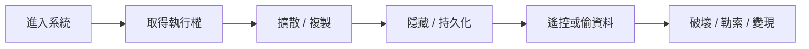

---

# 三、必背名詞整理（考試定義版）

## 1. Trapdoor（陷門 / 後門）

### 一句話

系統裡的**秘密入口**，讓特定人能繞過正常 security procedure。

### 投影片重點

* 可能是特殊 user ID 或 password
* 常見於 developer 為了方便測試或維護而留下
* 甚至可能被放進 compiler 裡面。

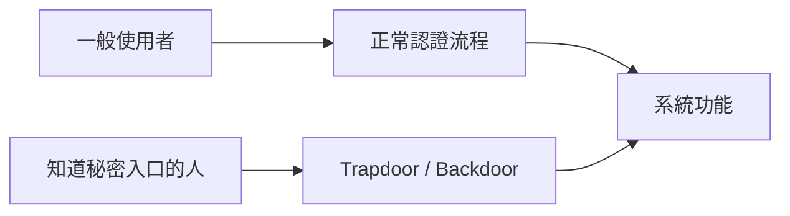

### 考試怎麼寫

> Trapdoor is a secret entry point into a system that circumvents normal authentication or security checks.

### 易混淆點

* Trapdoor 不一定會自我複製
* 它的核心不是破壞，而是**繞過控制機制**

---

## 2. Logic Bomb（邏輯炸彈）

### 一句話

嵌在合法程式中的惡意邏輯，**指定條件成立才啟動**。

### 投影片重點

* 可能由檔案存在 / 不存在觸發
* 可能由日期、時間、特定使用者觸發
* 觸發後通常會刪檔、改檔、破壞磁碟。

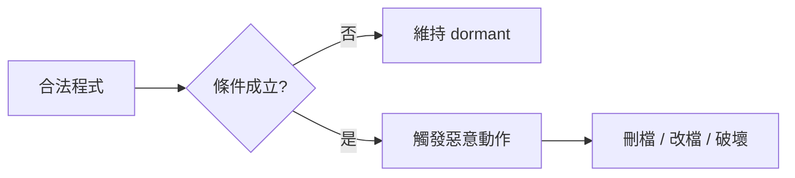

### 經典例子

第 10 頁提到 1982 年的 **Trans-Siberian Pipeline incident**，被當成 logic bomb sabotage 的例子。

### 考試關鍵句

> Logic bomb remains dormant until a specific condition is satisfied, then performs destructive actions.

### 易混淆點

* 它不是靠傳播出名
* 它的重點是 **trigger condition**

---

## 3. Trojan Horse（木馬）

### 一句話

外表看起來正常，實際上做了**隱藏的惡意行為**。

### 投影片最重要的概念

Trojan horse 有兩層效果：

* **Overt effect**：使用者期待、也確實看到的正常功能
* **Covert effect**：暗中進行、違反 security policy 的行為。

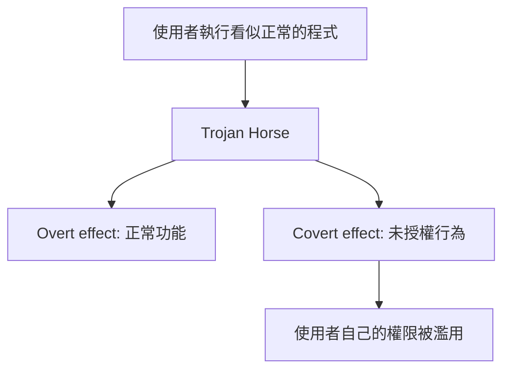

### 為什麼危險

因為 covert effect 常常是**用使用者自己的授權執行的**。
也就是說，它不是硬闖進來，而是你自己幫它開門。

### 期中必背句

> Trojan horse appears normal to the user, but secretly performs unauthorized actions with the user’s own authority.

---

## 4. Virus（病毒）

### 一句話

**自我複製的程式碼**，會把自己附著到其他正常程式或檔案中。

### 投影片重點

* self-replicating code
* 像會複製的 Trojan horse
* 會把正常程式改成 infected version
* 通常沒有 overt action
* 盡量不被發現
* 在 infected code 被執行時一起運作。

### 感染向量（第 13 頁）

* Boot sector
* Executable：`.com .cpl .exe .dll .ocx .sys .scr .drv ...`
* Macro files。

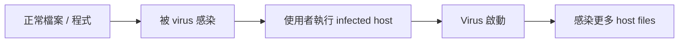

### Virus 的重要性質（第 14 頁）

1. **Terminate and Stay Resident (TSR)**
   程式主體雖然結束，但病毒留在記憶體中，之後可以感染更多檔案。

2. **Stealth**
   透過攔截讀檔或執行呼叫，讓感染看起來不存在。

3. **Encrypt virus code**
   讓 signature 難抓。

4. **Polymorphism**
   改變解密器 / 外觀，避免 signature。

5. **Metamorphism**
   把程式改寫成等價但長得不同的形式。

### 期中最常考的差異

Virus 需要「感染宿主」，Worm 不需要。

---

## 5. Worm（蠕蟲）

### 一句話

**獨立運作**、不需要宿主、會把完整的自己傳到其他機器。

### 四階段一定要背

**Probing → Exploitation → Replication → Payload**。

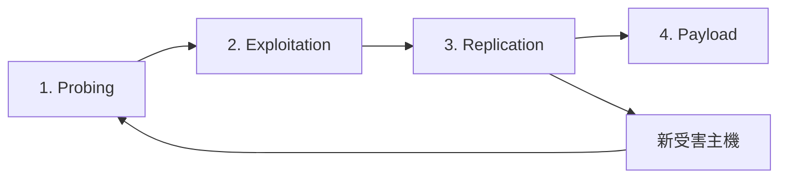

### 投影片強調的特色

* runs independently
* fully working version of itself
* payload 可能是 backdoor、spam relay、DDoS agent。

### 考試一句話

> A worm is a self-contained malicious program that independently spreads across machines without requiring a host file.

---

## 6. Zombie / Botnet

### 一句話

被攻擊者控制的主機叫 zombie；大量 zombie 組成 botnet。

### 投影片定義

Botnet 是一群 compromised machines，跑著 worm、Trojan、backdoor 等程式，受共同 command-and-control infrastructure 控制。用途包含：

* DDoS
* phishing
* spamming
* cracking。

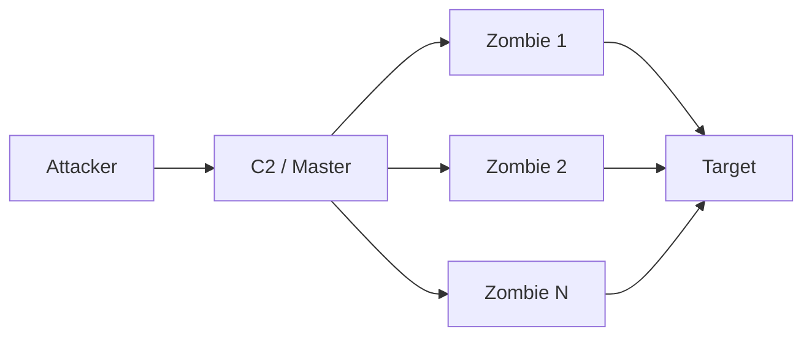

### 考試關鍵

Botnet 的核心不是「感染方式」，而是**集中控制 + 分散執行**。

---

## 7. Rootkit

### 一句話

在系統被攻破後，用來**隱藏攻擊者存在**並提供 backdoor 的工具或技術。

### 投影片重點

* Hide attacker’s presence
* Provide backdoors for easy reentry
* 簡單型 rootkit 改 user programs（如 `ls`, `ps`）
* 複雜型會改 kernel，本機 userland 更難看出來。

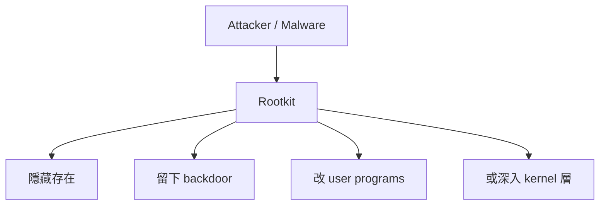

### 觀念重點

Rootkit **不是靠自我複製出名**，它是靠**隱身與持久化**出名。

---

## 8. Keylogger

### 一句話

攔截使用者鍵盤輸入，把輸入內容偷偷記錄下來。

### 這份投影片的示意

第 43–44 頁用 browser 輸入信用卡資料的畫面與 hook 流程圖說明：
惡意 DLL 透過 keyboard hook 攔截 victim process（例：firefox.exe）的 keystroke，再透過 shared memory 傳回給 keylogger 程式。

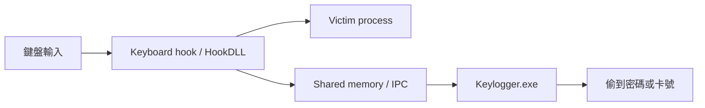

### 考試關鍵句

Keylogger 的恐怖在於：**它偷的是輸入點，不是傳輸中的資料。**

---

## 9. Ransomware

### 一句話

把使用者檔案加密、鎖住，再要求付錢換回解密。

### 這份課的呈現方式

第 57 頁放的是勒索畫面，包含倒數計時、加密檔案說明、付款方式。這一頁雖然簡短，但象徵整門課的最後結果：**前面那些入侵、傳播、隱匿、控制，最後都可以收斂成勒索變現。**

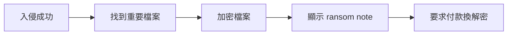

---

# 四、歷史演化（考試很愛出時間線）

這一段很適合放一張總覽圖，因為考試常考的是「從哪個時代走到哪個時代，以及每個時代的代表能力」。

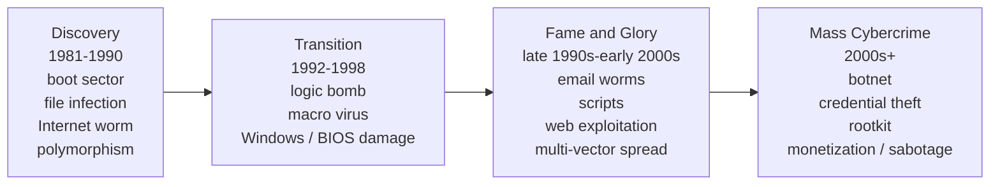

## 1. Era of Discovery（第 2 頁）

這一段很可能考「第一個」或「代表性突破」。

* **1981 Elk Cloner**：Apple II boot sector virus
* **1986 Brain**：IBM PC boot sector virus
* **1987 Virdem**：第一個 DOS file infector
* **1988 Morris worm**：第一個 Internet 上的 major computer worm，也被投影片說成 first to exploit buffer overflow vulnerability
* **1990 Chameleon**：第一個 polymorphic virus。

### 你要背的不是年份本身，而是「第一次發生什麼事」

* boot sector infection
* file infection
* Internet worm
* buffer overflow exploitation
* polymorphism。

---

## 2. Era of Transition（第 4 頁）

這段是從「好玩 / 技術展示」轉向「更實際破壞」。

* **1992 Michaelangelo**：logic bomb，3/6 觸發，覆寫 boot sector，讓電腦無法開機
* **1995 First Word macro virus**
* **1998 CIH（陳盈豪）**：Windows file infector，甚至會 flash BIOS。

### 考點

這一段代表：malware 開始利用文件、作業系統、韌體層。

---

## 3. Era of Fame and Glory（第 5 頁）

這時候 malware 開始變成「全世界都知道的大事件」。

* **Melissa**：Word macro virus，造成 e-mail system down
* **LoveLetter worm**：VBS email attachment
* **Code Red**：利用 buffer overflow
* **Nimda**：multiple infection vectors
* **MyDoom, Netsky, Sobig**
* **Samy worm**：XSS worm on MySpace。

### 考點

這一段重點是：
**病毒不再只靠單一路徑，而是開始跟 e-mail、script、web 服務、social platform 結合。**

---

## 4. Era of Mass Cybercrime（第 6 頁）

這一段超重要，因為它說明 malware 開始商業化、犯罪化。

* **Rogue AV**：假防毒，收費騙錢
* **Zeus bot**：偷網銀帳密
* **Storm worm**：P2P botnet，拿來 spam 與偷 credentials
* **Mebroot**：MBR rootkit
* **Conficker**：大規模 botnet，裝 pay-per-install software
* **Koobface**：社群網路散播
* **Aurora**：偷企業智慧財產
* **Stuxnet**：打工控系統。

### 核心理解

這裡是在告訴你：
**malware 已經從單純程式技巧，變成商業模式、犯罪產業鏈、甚至國家級攻擊工具。**

---

# 五、必背案例（申論題高頻區）

## A. Morris Worm（第 18–24 頁）

這是全份 lecture 最值得背的案例。

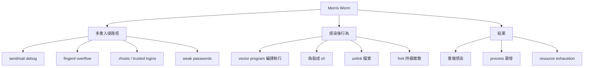

### 1. 為什麼重要

* 1988 發布
* spread through Digital、Sun workstations
* 利用 Unix security vulnerabilities
* 被視為第一個 major Internet worm。

### 2. 它攻擊哪些系統

* VAX computers
* SUN-3 workstations
* Berkeley UNIX 4.2 / 4.3。

### 3. 它的兩段式設計

投影片說 Morris worm 有兩部分：

1. **spreading program**：負責找可以感染的機器、找入侵方法
2. **vector program**（99 行 C）：在被感染機器上編譯執行，再去抓主體。

### 4. 它用了哪些弱點

* `fingerd`
* `sendmail`
* trusted logins（`.rhosts`）
* weak passwords。

### 5. sendmail 那段在教什麼

第 20 頁重點不是 SMTP 細節，而是：

* 開 TCP 到 SMTP port
* 開 debug mode
* 把資料導進 shell
* shell script 下載主體
* 寫一個暫時的 C 程式
* 編譯、執行，再把主體拉進來。

### 6. fingerd 那段在教什麼

第 21 頁是典型 buffer overflow 教學：

* `gets` 不檢查長度
* worm 寫超長字串進 512-byte buffer
* 溢到 stack
* overwrite return address
* 拿到 remote shell / privileged commands。

### 7. trust 與 password cracking 在教什麼

第 22 頁非常重要：

* 看 `/etc/host.equiv`、`.rhosts`
* 利用互信關係做 lateral movement
* 讀 `/etc/passwd`
* 用常見密碼與 local dictionary 做 dictionary attack。

### 8. 它怎麼躲

第 23 頁提到：

* `ps` 顯示成 `sh`
* 修改 `argv`
* 檔案開啟後就 unlink
* fork child 持續感染其他主機。

### 9. 最重要的教訓

它**沒有刻意刪系統檔、沒有安裝 trojan、沒有偷 decrypted passwords、沒有拿 superuser privileges**；
但因為 **重複感染、過多 process、資源耗盡**，結果系統仍然大面積癱瘓。

### 10. 申論題標準答法

> Morris worm is important because it demonstrated how a worm can exploit multiple Unix weaknesses, propagate automatically, hide itself, and cause large-scale disruption mainly through uncontrolled replication and resource exhaustion rather than explicit destructive payload.

---

## B. Code Red / SQL Slammer / Nimda（第 25–31 頁）

這三個一定要會比較。

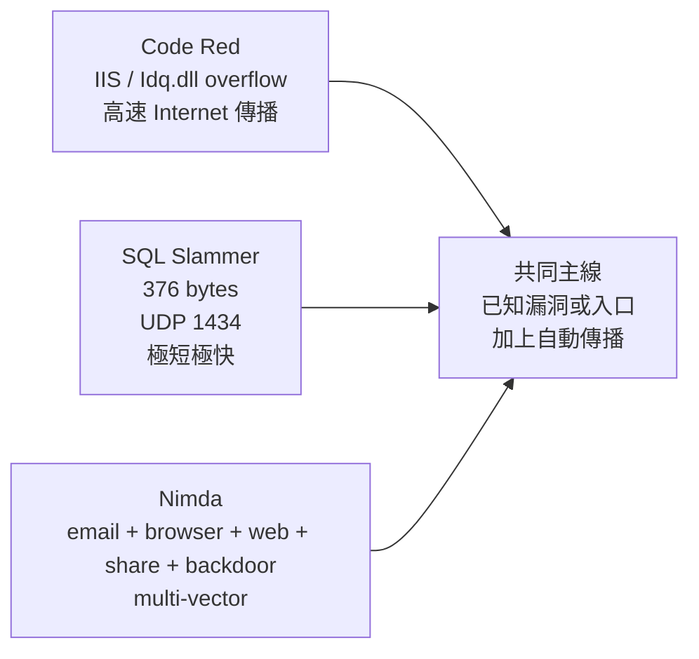

## 1. Code Red

* July 2001
* 打 Microsoft Index Server / IIS
* 利用 `Idq.dll` buffer overflow
* 360,000 vulnerable servers 14 小時內感染。

### 你要會講的點

Code Red 代表的是：
**已知漏洞 + Internet 規模傳播 = 高速大爆發。**

---

## 2. SQL Slammer / Sapphire

* January 2003
* 打 Microsoft SQL 2000
* 利用 Server Resolution service buffer overflow
* 目標服務聽在 **UDP 1434**
* 修補其實早就出了，但 vulnerable population 還是在不到 10 分鐘內被感染。

### 必背金句

**Slammer’s code is 376 bytes**。第 27 頁就是在強調它極短、極快。

### 重要意義

Slammer 告訴你：

* 惡意程式不必大
* 不必複雜
* 只要 exploit path 短、payload 小、掃描快，就能造成超大影響。

---

## 3. Nimda

投影片說它用 **5 種方法**傳播到 Windows PCs and servers：

1. e-mail attachment
2. preview pane 自動執行（利用 IE bug）
3. 把 JavaScript 附加到網頁
4. 掃 vulnerable IIS servers，利用 directory traversal
5. 複製到 shared disk drives。

另外它還會：

* 掃描 Code Red II 與 `sadmind/IIS` 留下的 backdoor
* 開啟 C: 為 `C$`
* 建立 Guest 帳號並加到 Administrator group
* 還出現假的 `FIX_NIMDA.exe` Trojan。

### Nimda 的核心意義

**multi-vector propagation**。
考試若問「為什麼 Nimda 特別危險」，標準答案就是：

> 因為它不是靠單一入口，而是同時結合 e-mail、瀏覽器、web page、server vulnerability、network share 和既有後門。

---

## C. Worm 攻擊成本（第 16 頁）

這一頁有時會被拿來當補充題。

* Morris worm：感染約 6,000 台，約 10% Internet computers，成本約 1,000 萬美元
* Code Red：超過 500,000 servers，約 26 億美元
* Love Bug：87.5 億美元。

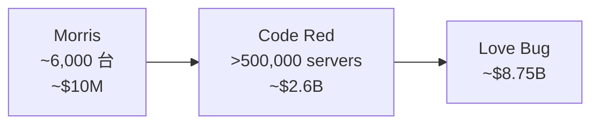

### 要懂的不是精確數字，而是趨勢

**Worm 的成本很大一部分來自 downtime、cleanup、網路中斷與連鎖效應。**

---

## D. Research Worms（第 32 頁）

這頁偏研究觀念，但很值得背。

* **Warhol Worms**：15 分鐘到 1 小時感染全部 vulnerable hosts，靠 optimized scanning、hit list、local subnet scanning、permutation scanning
* **Flash Worms**：30 秒感染全部 vulnerable hosts，直接內建完整 hit list
* 還提到 **Stealthy worms**。

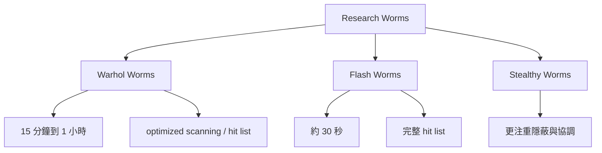

### 這頁的意義

教授要你知道，worm 不只是歷史事件，也是研究領域：
大家會研究如何更快、更 stealthy、更有 coordination。

---

# 六、Zombie / Botnet 六步驟（第 33–39 頁）

這一段非常適合考「流程題」。

## 六步驟直接背

1. **Attacker scans Internet** 找 unsecured systems
2. **Secretly installs zombie agents**
3. Zombie agents **phone home** 連到 master server
4. Attacker 對 master server 下命令
5. Master server 通知 zombies launch attack
6. Target system 被大量 zombie requests 淹沒，正常使用者被拒絕。

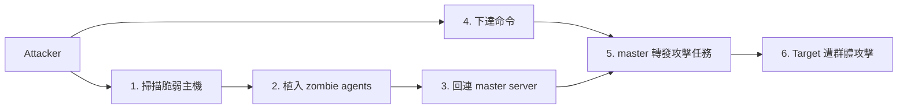

## 最好背的口訣

**掃 → 裝 → 回 → 下 → 打 → 癱**

## 申論一句話

> Botnet attack separates compromise from abuse: first compromise many hosts, then centrally command them to launch a distributed attack such as DDoS.

---

# 七、Rootkit / Keylogger / Hiding（第 40–51 頁）

## A. Rootkit（第 40–42 頁）

### Rootkit 的核心功能

* 隱藏攻擊者存在
* 留後門方便再進來。

### 分類一定要會

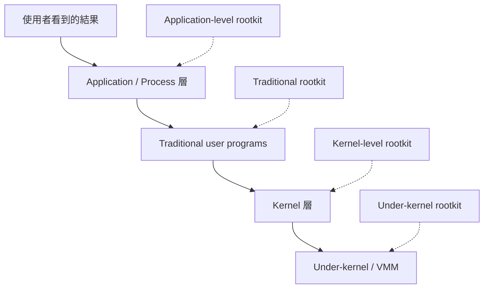

#### 1. Traditional RootKit

改 `login`, `ps`, `ifconfig` 這種 user programs。
好處是簡單，缺點是像 Tripwire 這種 integrity 工具比較容易抓到。

#### 2. Kernel-level RootKit

直接把惡意模組放到 kernel 層。
這比改 userland 工具更難從 userland 觀察出來。

#### 3. Application-level Rootkit

利用應用層或 process-level 技術影響觀察結果。
投影片列了 Hxdef、NTIllusion。

#### 4. Under-Kernel RootKit

藏在 kernel 更下面，例如 evil VMM。
投影片舉例 SubVirt、Blue Pill。

### 期中常考一句

**越往底層藏，越難從上層發現。**

---

## B. Keylogger（第 43–44 頁）

### 這兩頁要背什麼

不是背 code，而是背**資料流**。

### 資料流

* `Keylogger.exe` 控制端
* `HookDLL.dll` 裡有 `KeyboardProc()`
* `SetWindowsHookEx(WH_KEYBOARD, KeyboardProc, HookDLL.dll)` 把 hook 裝進 victim process
* 受害程式收到 keystroke 時，hook 先攔到
* 再透過 IPC（shared memory）把資料送回 keylogger。

### 這頁真正的 lesson

**就算網路傳輸有加密，keylogger 也可以在資料送出前先偷走。**

---

## C. Hiding from Task Manager（第 45–51 頁）

這段是後半最工程的一區，但其實很容易整理。

## 整體概念

攻擊者不是只藏在外面，而是**把 Task Manager 本身的觀測路徑改掉**。
所以使用者看到「沒有那個 process」，不是因為它不存在，而是因為**被刻意從查詢結果裡移除了**。

## 流程分三段背

### 第一段：把 HookDLL 放進 taskmgr.exe（第 46–47 頁）

投影片用的是典型 DLL injection 示意：

* 先取得 target process handle
* 在 target process 分配記憶體
* 寫入 DLL 路徑
* 讓 target process 載入那個 DLL。

第 47 頁程式片段出現的 API 名稱你可以認得，但考試通常不用背參數細節。
你要懂的是這一串 API 各自的角色：

* `OpenProcess`：拿到目標 process
* `VirtualAllocEx`：在目標 process 內開記憶體
* `WriteProcessMemory`：把 DLL 路徑寫進去
* `GetProcAddress(..., "LoadLibraryW")`：找到載入 DLL 的函式
* `CreateRemoteThread`：讓目標 process 自己去執行 LoadLibraryW。

### 第二段：Hook `NtQuerySystemInformation`（第 48 頁）

這一頁的意思是：

* 先保留原本的 `NtQuerySystemInformation`
* 寫一個假的 `hkNtQuerySystemInformation`
* 若查的是 `SystemProcessInformation`
* 就把 output buffer 清空，`ReturnLength` 設 0。

也就是說，**查詢本身有發生，但結果被洗掉了**。

### 第三段：改所有模組的 IAT（第 49–51 頁）

這幾頁在教的是 **Import Address Table hooking**。

#### 第 49 頁 `HookFunctionInAllModules`

邏輯是：

* 先找到原本函式位址
* 列出 process 裡所有 modules
* 對每個 module 呼叫 `ReplaceIAT()`，把原本 API 位址換成新 hook 位址。

#### 第 51 頁 `ReplaceIAT`

核心概念是：

* 走訪 PE import descriptors
* 找到目標 imported function
* 把原本 function pointer 改成 hook 版。

### 最簡單比喻

IAT 就像模組內建的「聯絡簿」。
原本要打給真正的 API，現在聯絡簿被偷偷改掉，所以每次呼叫都先打到惡意版本。

### 期中要會講的重點

> 這整段示範的是：先把 HookDLL 載入 Task Manager，再攔截列舉 process 的 API，最後透過 IAT rewriting 讓查詢都走到惡意函式，所以目標 process 可以從 Task Manager 消失。

---

# 八、Scripts / 圖解 / 實例的考試版解讀

這一段是你特別在意的，我把 lecture 裡的 code / instance 用考試可寫的方式整理。

## 1. 第 3 頁：Win64/Rovnix Bootkit 圖

這張圖在講：

* 感染前：`MBR → VBR → Bootstrap Code → File System Data`
* 感染後：active partition 的 bootstrap code 被改寫
* 惡意碼和 unsigned driver 被藏進 boot 流程與磁碟空間裡。

### 這張圖的考點

**惡意碼可以在 OS 起來之前就先卡進開機鏈。**
所以 bootkit / MBR / VBR infection 的危險在於：
它不是在 Windows 裡才開始壞，而是整個系統啟動過程都可能已被污染。

---

## 2. 第 11 頁：Trojan horse 的 `ls` 範例

這一頁的程式片段不是要你真的背 shell script，而是要你懂「**表面正常，暗中留後門**」。

### 片段背後的邏輯

* 複製 shell 到隱藏位置
* 改權限讓它之後可被濫用
* 仍然執行 `ls`，讓使用者看到正常輸出。

### 這頁最重要的一句

**Overt effect 正常，covert effect 卻違反 security policy。**

---

## 3. 第 12 頁：Virus 偽程式

這段 pseudo code 幾乎是 virus 的標準答案：

* 如果符合 spread condition
* 找 target files
* 沒感染過就把病毒插進去
* 執行 malicious action
* 最後再執行 normal program。

### 考試怎麼解讀

重點在最後一句 **Execute normal program**。
因為病毒不想讓宿主壞掉太明顯，它要讓宿主繼續看起來正常，自己才能活久一點。

---

## 4. 第 27 頁：SQL Slammer 十六進位圖

這一頁非常重要，但你不需要背 hex。

### 你要看懂的區塊

投影片已經標出來：

* UDP packet header
* 某個 byte 告訴 SQL Server 把封包內容放進 buffer
* 一長串 `0x01` 把 buffer 塞爆
* overwrite return address
* 跳到某個位置再跳回 stack
* NOP slide
* restore payload / setup socket / random seed
* 主迴圈：產生 random IP、send、loop。

### 這頁的真正考點

> 為什麼 Slammer 這麼快？
> 答案是：**單封包 exploit、UDP、不需檔案、code 極小、全部設計都服務於傳播速度。**

---

## 5. 第 44 頁：Keylogger Hook 圖

這張圖要背的是兩件事：

1. `SetWindowsHookEx(WH_KEYBOARD, KeyboardProc, HookDLL.dll)` 代表在 victim process 的鍵盤事件路徑上插入 hook
2. IPC shared memory 代表攔到的 keystroke 會傳回 keylogger 主程式。

### 額外加分點

下方 `#pragma data_seg(".keybuf")` 那段在示意「共享記憶體區段」，讓不同 process 之間能看到同一塊記憶體資料。

---

## 6. 第 47–51 頁：Task Manager hiding 這組 code

這幾頁合起來看，才是完整故事。

### 第 47 頁

把 DLL 放進目標 process。

### 第 48 頁

寫一個假的 `NtQuerySystemInformation`，查 process list 時回傳假的 / 空的結果。

### 第 49–51 頁

枚舉所有模組，改它們的 IAT，讓原本呼叫真正 API 的路徑全部改成先走 hook。

### 一句話統整

**Injection + Hook + IAT rewrite = 改變觀測層。**

---

## 7. 第 54 頁：Encryption 的 decryptor listing

這頁的 listing 在做什麼？

* 設定指標到 encrypted virus body
* 載入長度
* 取出 key
* 用 `xor` 一個 byte 一個 byte 解密
* 解完跳到 `Start` 執行真正主體。

### 考試版理解

這是最基本的「**主體藏起來，只留下小小的解密器**」。
所以 signature 若只抓 body，可能抓不到。

---

## 8. 第 55 頁：Polymorphism 的 decryptor instance

這頁的重點不在每一行 assembly，而是：

* 解密功能還在
* 但被拆成多個 routine
* 順序、表示法、寄存器使用方式都可以換
* 甚至出現 `call` / `pop` 這種抓位址的小技巧。

### 考試版一句話

**Polymorphism = 功能差不多，但 decryptor 外表一直變。**

---

## 9. 第 56 頁：Metamorphism 的 generations

這一頁對比早期與後期 generation：

* 早期 generation：直接用某些指令寫常數
* 後期 generation：改用不同寄存器、`push/pop`、`add` 等方式組出同樣的值
* 語意一樣，長相不同。

### 最重要一句

**Metamorphism 不只是換殼，它是把 code 自己改寫成等價版本。**

---

# 九、Detection vs Evasion（第 52–56 頁）

## 1. Detection of Malware

投影片列出的 detection 方法偏 **static analysis**：

* pattern matching
* hash
* string pattern
* regular expression
* static decryptor
* packer code
* X-ray scanning
* smart scanning
* ClamAV signatures
* ClamAV bytecode compiler。

### 考試怎麼理解

這些方法的共同點是：
**它們都在找某種固定特徵。**

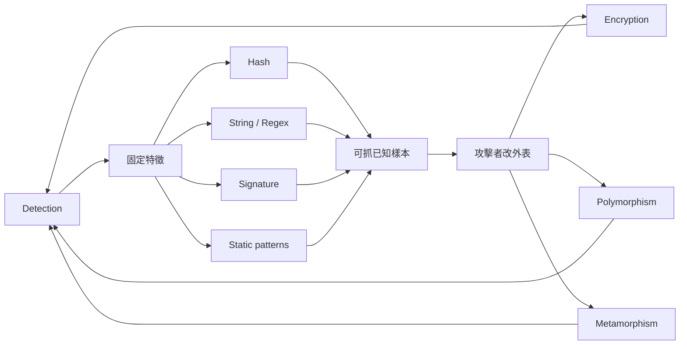

---

## 2. Evade Detection by Encryption

### 本質

把 body 加密，只留下 decryptor stub。

### 防守困難點

signature 對 body 的固定字串就不容易成立。

---

## 3. Evade Detection by Polymorphism

### 本質

每次複製都讓 decryptor 長得不一樣。

### 防守困難點

連 decryptor 這個原本可能穩定的 signature 都不再穩定。

---

## 4. Evade Detection by Metamorphism

### 本質

不用只靠加密，而是把整個程式本體改寫成等價 code。

### 防守困難點

你抓的不是「相同字串」，而對方連「語法長相」都換掉了。

---

## 5. 最好背的比較句

* **Encryption**：body 被藏起來
* **Polymorphism**：decryptor 也一起變
* **Metamorphism**：連 body 都改寫成不同樣子。

### 一句超好記的總結

**你抓外型，它改外型。**

---

# 十、常考比較題（直接可背）

## 1. Trapdoor vs Trojan Horse

* Trapdoor：秘密入口，核心是繞過 authentication / security control
* Trojan：偽裝正常程式，核心是騙使用者執行。

## 2. Logic Bomb vs Virus

* Logic bomb：條件觸發
* Virus：自我複製並感染其他檔案。

## 3. Virus vs Worm

* Virus 需要 host file / infected code execution
* Worm 可獨立運作並自我傳播。

## 4. Worm vs Botnet

* Worm：偏重「自我擴散」
* Botnet：偏重「集中控制已被攻陷的多台主機」。

## 5. Rootkit vs Keylogger

* Rootkit：隱藏存在、留後門
* Keylogger：攔截輸入、偷資訊。

## 6. Encryption vs Polymorphism vs Metamorphism

* Encryption：body 加密
* Polymorphism：decryptor 變形
* Metamorphism：body 本身改寫。

## 7. Morris vs Slammer vs Nimda

* Morris：多弱點 + 信任關係 + 重複感染導致 overload
* Slammer：超小、超快、單封包 UDP exploit
* Nimda：多感染向量、multi-vector worm。

---

# 十一、教授很可能怎麼出申論題

## 題型 1：Explain Trojan horse with the example in lecture

### 答題骨架

1. 定義 Trojan horse：overt effect + covert effect
2. 使用者只看到 overt effect
3. covert effect 違反 security policy
4. 第 11 頁 `ls` 範例中，使用者以為在跑正常 `ls`，但其實暗中複製 shell、改權限、留後門。

---

## 題型 2：Compare virus and worm

### 答題骨架

1. 兩者都可能 self-replicating
2. Virus 需感染宿主檔案
3. Worm 不需宿主、獨立運作
4. Worm 典型四階段：probing / exploitation / replication / payload
5. Worm 常更容易造成大規模網路傳播。

---

## 題型 3：Why was Morris worm a major attack?

### 答題骨架

1. 第一個 major Internet worm
2. 利用多個 Unix security weaknesses
3. 有兩部分：spread program + vector program
4. 利用 sendmail、fingerd、trusted logins、weak passwords
5. 傷害主要來自 reinfection 與 resource exhaustion，而非直接 destructive payload。

---

## 題型 4：Explain why SQL Slammer spread so fast

### 答題骨架

1. 利用 SQL Server 2000 UDP 1434 service
2. 單封包 buffer overflow
3. code 僅 376 bytes
4. 不需 host、不需檔案、不需使用者互動
5. 主體設計幾乎完全服務於 random scanning 與快速傳播。

---

## 題型 5：Why is Nimda dangerous?

### 答題骨架

1. 它不是單一路徑 worm
2. e-mail、preview pane、web page JS、IIS traversal、shared drive 都可傳
3. 還會利用舊 worm backdoors
4. 並建立更高權限與新弱點。

---

## 題型 6：Explain the botnet attack lifecycle

### 答題骨架

1. 掃 vulnerable hosts
2. 安裝 zombie agents
3. agents phone home 到 master server
4. attacker 對 master 下命令
5. master 通知 zombies
6. target system 被大量 request 淹沒。

---

## 題型 7：Explain rootkit classification

### 答題骨架

1. Traditional rootkit：改 user programs
2. Kernel-level rootkit：改 kernel
3. Application-level rootkit：應用層攔截 / 欺騙
4. Under-kernel rootkit：更底層的 VMM / hypervisor。

---

## 題型 8：Explain malware detection and evasion

### 答題骨架

1. Detection 常靠 static analysis / pattern matching / signatures
2. Encryption 先把 body 藏起來
3. Polymorphism 讓 decryptor 也改變
4. Metamorphism 讓整個 code 改寫成等價形式
5. 因此 signature-based detection 面對變形 malware 會越來越困難。

---

# 十二、選擇題最愛考的細節

這一段拿來考前衝刺超有效。

1. **first major Internet worm**：Morris worm。
2. **first polymorphic virus**：Chameleon。
3. **Word macro virus**：1995 first one，Melissa 也是 macro virus。
4. **CIH**：會 flash BIOS。
5. **Zeus bot**：偷 online banking credentials。
6. **Mebroot**：MBR rootkit。
7. **Stuxnet**：industrial control systems。
8. **Worm 四階段**：Probing / Exploitation / Replication / Payload。
9. **SQL Slammer**：UDP port 1434，376 bytes。
10. **Nimda**：multiple infection vectors。
11. **Rootkit**：hide attacker’s presence + easy reentry。
12. **Keylogger**：鍵盤 hook + shared memory。
13. **Traditional rootkit** 改 user programs，**kernel-level rootkit** 改 kernel。
14. **Encryption / Polymorphism / Metamorphism** 是反 signature 的三層進化。
15. **Ransomware**：加密檔案 + 倒數計時 + 贖金。

---

# 十三、考前最後 5 分鐘速背版

這一段你真的可以直接拿去背。

### 主線

**Malware = 入侵 + 複製 / 擴散 + 隱藏 + 控制 + 破壞 / 勒索。**

### 名詞口訣

**門、炸、馬、毒、蟲、殭、根、鍵、勒**

* 門：Trapdoor
* 炸：Logic bomb
* 馬：Trojan horse
* 毒：Virus
* 蟲：Worm
* 殭：Zombie / Botnet
* 根：Rootkit
* 鍵：Keylogger
* 勒：Ransomware。

### 三組最重要比較

1. **Trojan = 騙你執行**
2. **Virus = 感染宿主**
3. **Worm = 自己傳播**。

### 三大經典案例

* **Morris**：多弱點 + reinfection overload
* **Slammer**：小而快
* **Nimda**：多路徑感染。

### 後半段重點

* **Botnet**：掃、裝、回、下、打、癱
* **Rootkit**：藏起來
* **Keylogger**：偷輸入
* **Task Manager hiding**：改觀測層。

### 偵測與反偵測

* detection：signature / pattern / static analysis
* evasion：encryption → polymorphism → metamorphism。

---

# 十四、我幫你做的最終濃縮版結論

這份 lecture 最值得你用來應付期中考的理解是：

> **Malware 不是單一程式類型，而是一整套攻擊能力。**
> 有的負責進去，有的負責觸發，有的負責擴散，有的負責隱身，有的負責控制，有的負責變現。
> 真正的考點不是背名稱，而是理解每一種東西在攻擊鏈裡扮演什麼角色。

下一輪我可以直接幫你做成 **「期中考 30 題模擬題＋完整答案」**。
