好，我直接幫你跑。

我先照你前面定的 **Day 1 範圍：Introduction + Linux Security Basics + Malware** 來整理；**SetUID / SELinux / Bell-LaPadula** 我只在需要時補成「銜接觀念」，不把它們當成 Day 1 主體。課程地圖上，Malware 被放在 system-level attacks，而 Linux Security Basics 被放在 system-level defenses；整門課定位是進入 attack/defense research 的入口，先備知識是作業系統、電腦網路與程式能力，評分則是作業 50%、期中 20%、期末專題 30%。這些都很像老師在暗示：**考試不會只考名詞，會考你能不能把「機制、攻擊、限制」串起來。**（Introduction 第 2–4 頁）

---

# 📘 Day 1：完整教學筆記（考試導向）

## Part 1：整體理解（先建立腦中地圖）

這三份講義其實不是三塊分離的東西，而是一條很清楚的線：

**Introduction** 告訴你這門課在做什麼、會跨哪些安全領域。
**Linux Security Basics** 告訴你電腦系統最基本的「誰能對什麼做什麼」。
**Malware** 告訴你攻擊者怎麼利用系統、程式、權限與使用者行為來造成破壞。   

所以 Day 1 的核心，不是背一堆獨立定義，而是先懂這件事：

> **安全問題 = 權限模型 + 程式行為 + 攻擊者利用方式。**

為什麼一開始就學這些？
因為後面不管是 buffer overflow、network attack、web attack，最後都會回到幾個基本問題：

1. 這個程式現在是用誰的身分在跑？
2. 它能讀什麼、寫什麼、執行什麼？
3. 攻擊者是怎麼把正常功能變成惡意行為？
4. 防禦是要限制權限、限制資訊流，還是限制執行環境？

這就是 Day 1 的「出題母體」。

### Day 1 主線圖

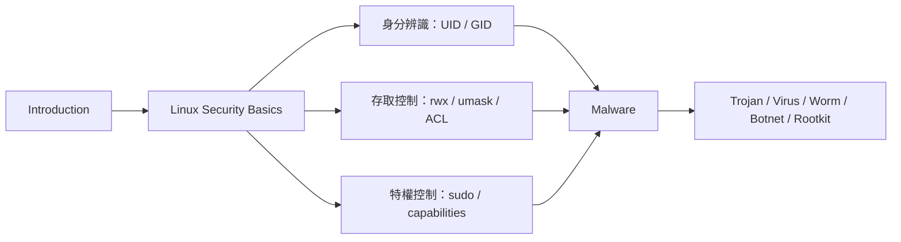

---

# Part 2：Linux Security Basics（超詳細）

Linux Security Basics 的正式範圍是四塊：**users and groups、permissions and access control、running commands with privilege、authentication**。這四塊幾乎每一塊都很容易變成名詞解釋題或比較題。（Linux Security Basics 第 2 頁）

## A. 核心概念列表

1. **User / UID**【背誦優先】【高機率考題】
2. **Group / GID**【背誦優先】
3. **檔案權限 rwx**【背誦優先】【高機率考題】
4. **目錄權限 rwx**【理解優先】【易混淆】
5. **umask**【理解優先】【高機率考題】
6. **ACL**【理解優先】【易混淆】
7. **sudo 與 privilege**【理解優先】【高機率考題】
8. **POSIX capabilities**【理解優先】【易混淆】
9. **/etc/passwd vs /etc/shadow**【背誦優先】【高機率考題】
10. **salt 的作用**【背誦優先】

---

## B. 每個概念完整拆解（5 層解釋）

### 1. User / UID

【背誦優先】【高機率考題】

**白話一句話**
Linux 不是真的靠「名字」認人，而是靠 **UID** 認人。

**正式定義**
在 Linux 中，每個使用者都被指派一個唯一的 user ID；使用者帳號資訊記錄在 `/etc/passwd` 中。講義例子裡 root 的 UID 是 0，seed 的 UID 是 1000，可用 `id` 指令查看。 （Linux Security Basics 第 4 頁）

**深入理解**
這個觀念超重要。
因為系統做權限判斷時，實際上不是看你叫 Alice 還是 Bob，而是看你對應的 UID / GID。也就是說：

* `username` 比較像「人類看得懂的標籤」
* `UID` 才是作業系統真正用來做 access control 的身分值

**實際例子**
講義中 `/etc/passwd` 的例子顯示：

* root → UID 0
* seed → UID 1000

而 `id` 指令會顯示目前程序的 uid/gid/groups。 （Linux Security Basics 第 4 頁）

如果你想在 CLI 中直接看到這類資訊，可以打：

```bash
grep -E '^(root|seed):' /etc/passwd
id
id root
id seed
```

你可能會看到像這樣的輸出：

```text
root:x:0:0:root:/root:/bin/bash
seed:x:1000:1000:seed:/home/seed:/bin/bash

uid=1000(seed) gid=1000(seed) groups=1000(seed),27(sudo)
uid=0(root) gid=0(root) groups=0(root)
uid=1000(seed) gid=1000(seed) groups=1000(seed),27(sudo)
```

其中：

* `grep ... /etc/passwd`：直接從帳號資料裡看到使用者名稱與 UID/GID
* `id`：看目前登入使用者的 UID/GID/groups
* `id root`、`id seed`：看指定使用者的 UID/GID/groups

⚠️ 實際數字與群組名稱會依你的 Linux 環境而不同，但 **root 的 UID 通常是 0**。

**考試會怎麼考 + 你怎麼寫**
題目常見寫法：

* 什麼是 UID？
* Linux 如何識別使用者？
* `/etc/passwd` 的作用是什麼？

可直接寫：

> Linux 以唯一的 user ID（UID）識別每個使用者。使用者帳號資訊存放於 `/etc/passwd`，系統在做權限控制時實際依據 UID/GID，而不是只看帳號名稱。

---

### 2. Group / GID

【背誦優先】

**白話一句話**
Group 是把多個使用者綁在一起，方便一次授權。

**正式定義**
Group 代表一群使用者，可用於依群組指派權限；一個使用者可以屬於多個群組，且其 primary group 記錄在 `/etc/passwd` 中。 （Linux Security Basics 第 6–8 頁）

**深入理解**
如果沒有 group，權限要一個一個 user 設，很麻煩。
有了 group，你可以把「同一種角色的人」放同組，直接賦予整組權限。

**實際例子**
講義中用 `grep seed /etc/group`、`groups`、`id` 顯示 seed 同時屬於多個群組。也展示了用 `groupadd alpha`、`usermod -a -G alpha seed` 把使用者加入群組。 （Linux Security Basics 第 7–8 頁）

**考試怎麼考 + 你怎麼寫**

> Group 是 Linux 中用來集合多個使用者並統一授權的機制。一位使用者可屬於多個群組，藉此可更有效率地管理共享資源的存取權限。

---

### 3. 檔案權限 rwx

【背誦優先】【高機率考題】

**白話一句話**
檔案的 `rwx` 決定你能不能看、改、跑。

**正式定義**
對 file 而言：

* `r`：可讀取檔案內容
* `w`：可修改檔案內容
* `x`：可執行檔案（若是程式或 script）
  權限分成三組：**owner / group / other**。 （Linux Security Basics 第 10–11 頁）

**深入理解**
這是 Linux 最傳統的 permission model。
`ls -l` 裡像 `-rwxrwxrwx` 其實就是：

* 第一組 owner 權限
* 第二組 group 權限
* 第三組 other 權限

所以你要讀一個檔案，不是單純看「有沒有 r」，而是看：

1. 你是不是 owner
2. 不是 owner 的話，你是不是在 group 裡
3. 再不然才看 other

**實際例子**
講義用 `-rwx rwx rwx` 圖解 owner / group / other 三段。 （Linux Security Basics 第 11 頁）

**考試怎麼考 + 你怎麼寫**

> Linux 傳統檔案權限模型以 owner、group、other 三類主體描述對檔案的 read、write、execute 權限。對 file 而言，read 表示讀內容，write 表示改內容，execute 表示執行該檔案。

---

### 4. 目錄權限 rwx

【理解優先】【易混淆】【高機率考題】

**白話一句話**
**目錄的 x 不是執行程式，而是「能不能進去」。**

**正式定義**
對 directory 而言：

* `r`：可列出目錄內容
* `w`：可在目錄內建立檔案/子目錄
* `x`：可進入該目錄（例如 `cd`） （Linux Security Basics 第 10 頁）

**深入理解**
這裡最容易失分。
同樣是 `rwx`，**file 跟 directory 的意義不同**。

你要把它想成：

* file = 一份內容
* directory = 一個容器 / 索引空間

所以 directory 的 `x` 比較像「traverse」權限，不是「execute program」的 execute。

另外，`-rwxrwxrwx` 這種表示法，本質上是在描述 **owner / group / other 三類身分各自的權限規則**，不是直接告訴某個特定使用者「你最後一定有哪些權限」。
真正要判斷某個使用者的權限，還要再結合：

1. 該檔案/目錄的 owner 是誰
2. 該檔案/目錄的 group 是誰
3. 目前使用者的 UID 與 groups 是什麼

你可以先簡單記兩句：

* 如果 `ls -l` 權限字串後面有 `+`，代表還有 ACL，這時不能只看 `rwx` 三段
* 即使傳統 permission 看起來允許，還可能被 SELinux、MAC、其他安全機制再限制

**Structure Diagram（這段目前就是用 Mermaid 呈現）**

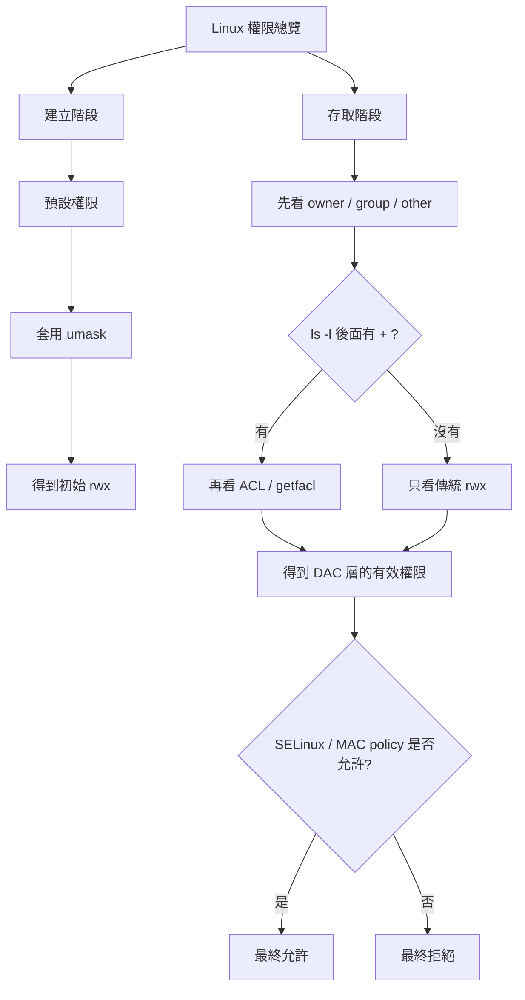

**補充 1：看到 `+` 代表什麼？**

假設你看到：

```text
-rw-r-----+ 1 seed seed 0 Apr  8 12:00 report.txt
```

這時你只能先知道：

* owner 有 `rw-`
* group 有 `r--`
* other 沒有權限
* 但因為後面有 `+`，表示還有額外 ACL 規則

例如實際上可能還有：

```text
user:alice:rw-
```

也就是說，即使 `alice` 不是 owner、也不在對應 group 裡，她仍可能因為 ACL 被額外授權。

如果你想在 CLI 中看到這件事，可以打：

```bash
touch report.txt
chmod 640 report.txt
setfacl -m u:alice:rw- report.txt
ls -l report.txt
getfacl report.txt
```

你可能會看到像這樣的輸出：

```text
-rw-r-----+ 1 seed seed 0 Apr  8 12:00 report.txt

# file: report.txt
# owner: seed
# group: seed
user::rw-
user:alice:rw-
group::r--
mask::rw-
other::---
```

**判讀流程**

1. 先用 `ls -l` 看 owner/group/other 的基本權限
2. 如果後面有 `+`，就知道不能只看三段 `rwx`
3. 再用 `getfacl` 看是否有特定 user / group 的額外授權
4. 最後把 `rwx` 與 ACL 一起判斷某位使用者的有效權限

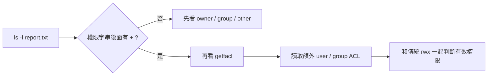

**補充 2：為什麼傳統 permission 允許，最後仍可能被拒絕？**

Linux 上的傳統 `rwx` 常可視為第一層檢查，但有些系統還會再套一層強制存取控制，例如 SELinux / MAC。

你可以把它想成：

* **DAC / 傳統 permission**：先看 owner / group / other 是否允許
* **MAC / SELinux**：再看安全政策是否允許

假設某檔案傳統權限非常寬鬆：

```text
-rwxrwxrwx 1 seed seed 0 Apr  8 12:00 demo.txt
```

看起來好像誰都能動，但如果：

* 目前系統是 `SELinux: Enforcing`
* 存取者是被限制在某個 domain 的 process，例如 `httpd_t`
* 檔案的 security context 不符合 policy

那麼最終仍可能被拒絕。

在 CLI 中，常會用這些指令輔助觀察：

```bash
ls -l demo.txt
ls -Z demo.txt
getenforce
ps -eZ | grep httpd
```

你可能會看到像這樣的資訊：

```text
-rwxrwxrwx 1 seed seed 0 Apr  8 12:00 demo.txt
unconfined_u:object_r:user_home_t:s0 demo.txt
Enforcing
system_u:system_r:httpd_t:s0 1234 ? 00:00:00 httpd
```

這時考試上你就要知道：**傳統 permission 只是看起來允許；最終還要看 SELinux policy 是否允許 `httpd_t` 存取 `user_home_t`。**

**判讀流程**

1. 先看 `ls -l`，確認 DAC / 傳統 `rwx` 是否放行
2. 再看 `getenforce`，確認 SELinux 是否啟用且為 Enforcing
3. 用 `ls -Z` / `ps -eZ` 看 object context 與 process domain
4. 最後由 policy 決定 allow 或 deny

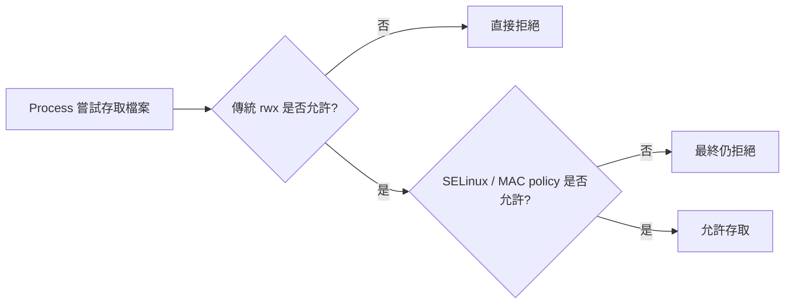

**實際例子**
假設一個資料夾有 `r` 沒 `x`，你可能知道裡面有什麼名字，但不一定能實際進去使用。
如果有 `x` 沒 `r`，你可能能進入，但不能方便列出清單。
雖然講義沒有把這兩種組合展開，但這就是考試最愛玩的地方。 （Linux Security Basics 第 10 頁）

**考試怎麼考 + 你怎麼寫**

> 在 Linux 中，directory 的 read、write、execute 與 file 的意義不同。directory 的 read 表示列出內容，write 表示新增或刪除其中項目，execute 表示進入或 traversing 該目錄。

---

### 5. umask

【理解優先】【高機率考題】【易混淆】

**白話一句話**
`umask` 不是「給權限」，而是**把預設權限遮掉**。

**正式定義**
`umask` 決定新檔案建立時的預設權限。講義用例子說明：初始 permission 為 `0666`，若 `umask = 0022`，則最後權限為 `0644`。 （Linux Security Basics 第 12–13 頁）

**深入理解**
新手最常錯成「0666 + 0022」。
不是加法，是**遮罩移除**。

你記法很簡單：

* file 預設起點常看成 `666`
* directory 預設起點常看成 `777`
* `umask` 把某些 bit 關掉

所以：

* `666 - 022 = 644`
* `777 - 022 = 755`

**實際例子**
講義示範：

* `umask 0002` 建出來的檔案較寬鬆
* `umask 0022` 產生 `rw-r--r--`
* `umask 0777` 甚至可讓新檔案幾乎沒權限。 （Linux Security Basics 第 12–13 頁）

**它會不會出現在上面的 access check 圖裡？**

通常**不會直接放進**「傳統 `rwx` 是否允許？ → SELinux / MAC policy 是否允許？」那張圖裡，因為 `umask` 和 access check 不在同一個階段。

你可以把它分成兩步：

1. **建立階段**：系統先用預設權限搭配 `umask`，產生這個新檔案/目錄最初的 `rwx`
2. **存取階段**：之後有人真的要讀、寫、執行時，系統才去看 `rwx`、ACL、SELinux / MAC

所以，`umask` 比較像是在回答：

> **「這個新檔案一出生時，權限會長什麼樣？」**

而不是回答：

> **「現在某個 process 來存取時，最後放不放行？」**

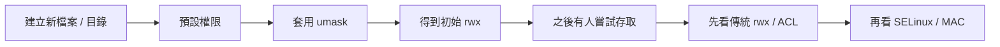

**最短記法**

* `umask`：決定「初始權限」
* `rwx / ACL / SELinux`：決定「存取當下能不能做」

**考試怎麼考 + 你怎麼寫**

> umask 是用來限制新建檔案或目錄預設權限的遮罩值。其作用不是增加權限，而是從初始權限中移除對應 bit，例如 file 的初始值 0666 在 umask 0022 下會得到 0644。

---

### 6. ACL（Access Control List）

【理解優先】【易混淆】【高機率考題】

**白話一句話**
傳統權限只有 owner/group/other 三段；ACL 是更細的「點名授權」。

**正式定義**
ACL 是 fine-grained access control，可對個別 user 或 group 指派權限，並與傳統 permission model 共存。講義示範以 `setfacl` / `getfacl` 操作 ACL。 （Linux Security Basics 第 14–15 頁）

**深入理解**
傳統模型很簡潔，但很粗。
例如你想讓 Alice 只能讀、faculty 群組可讀寫，單靠 owner/group/other 很難漂亮表達，這時 ACL 就很好用。

**實際例子**
講義示範：

* `setfacl -m u:alice:r-- example`
* `setfacl -m g:faculty:rw- example`
* `getfacl example`

而 `ls -l` 後面若出現 `+`，表示該檔案有 ACL。 （Linux Security Basics 第 15 頁）

如果你想在 CLI 中自己做出這個例子，可以打：

```bash
touch example
ls -l example
setfacl -m u:alice:r-- example
setfacl -m g:faculty:rw- example
ls -l example
getfacl example
```

你可能會看到像這樣的輸出：

```text
-rw-r--r-- 1 seed seed 0 Apr  8 12:00 example
-rw-rw-r--+ 1 seed seed 0 Apr  8 12:00 example

# file: example
# owner: seed
# group: seed
user::rw-
user:alice:r--
group::r--
group:faculty:rw-
mask::rw-
other::r--
```

其中：

* `touch example`：先建立一個空檔案
* 第一次 `ls -l example`：先看還沒加 ACL 前的普通權限
* `setfacl -m ...`：用 modify 模式新增 ACL entry
* 第二次 `ls -l example`：檔名權限後面出現 `+`，表示有額外 ACL
* `getfacl example`：把 ACL 的詳細內容列出來

⚠️ 實際的 owner、group、時間、mask，還有 `alice` / `faculty` 是否存在，都會依你的 Linux 環境而不同；但 **`+` 與 `getfacl` 顯示額外條目** 這個觀察重點是一樣的。

**考試怎麼考 + 你怎麼寫**

> ACL 提供比傳統 owner/group/other 模型更細緻的授權方式，可直接為個別使用者或群組設定存取權限，因此能與傳統 Linux 權限模型互補。

---

### 7. sudo 與 privilege

【理解優先】【高機率考題】

**白話一句話**
`sudo` 是「借 root 身分做一件事」，不是叫你整天當 root。

**正式定義**
`sudo`（Super-user Do）讓被授權的使用者以 superuser 身分執行命令；使用者是否能用 sudo 由 `/etc/sudoers` 控制。講義也提醒：不建議長期進入 root shell，應盡量對單一命令使用 sudo。 （Linux Security Basics 第 17–20 頁）

**深入理解**
這裡的安全核心叫 **least privilege**。
你不是不要管理權，而是不要在「不需要的時候」長時間持有完整管理權。

所以：

* `sudo command`：相對安全
* `sudo -s` / `sudo bash`：方便但風險更高
* 長時間 root shell：容易誤操作

**實際例子**
講義提到 Ubuntu 20.04 root account 是鎖住的，不能直接登入，但可以用：

* `sudo -s`
* `sudo bash`
* `sudo su`
  取得 root shell；同時也示範 `sudo -u bob id` 用別的使用者身分跑命令。 （Linux Security Basics 第 19–20 頁）

**考試怎麼考 + 你怎麼寫**

> sudo 允許被授權的使用者暫時以 root 或其他指定使用者身分執行命令。其目的在於避免直接長時間使用 root 帳號，較符合最小權限原則。

---

### 8. POSIX capabilities

【理解優先】【易混淆】【高機率考題】

**白話一句話**
capability 是把 root 的「超能力」拆成比較小包。

**正式定義**
POSIX capabilities 將 root privilege 拆分成較小的 privilege units，例如 `CAP_DAC_READ_SEARCH`、`CAP_NET_RAW` 等，可賦予程式特定能力而非完整 root 權限。 （Linux Security Basics 第 21–25 頁）

**深入理解**
這是老師很可能喜歡的申論點：
**不是只有「一般使用者」和「root」兩種狀態，中間還可以拆更細。**

這樣做的好處是：

* 程式只拿到需要的能力
* 出事時損害比較局部
* 更符合 least privilege

**實際例子**
講義舉兩個很重要的例子：

* `ping` 使用 raw socket，所以有 `CAP_NET_RAW`
* Wireshark 的 GUI 不需要特權，真正需要 privilege 的 sniffing 工作由 `dumpcap` 執行，`dumpcap` 具備 `cap_net_admin` 與 `cap_net_raw`。 （Linux Security Basics 第 24–25 頁）

**考試怎麼考 + 你怎麼寫**

> POSIX capabilities 是將 root 權限細分成多個較小能力，程式可只取得執行任務所需的那部分權限。例如 ping 只需 `CAP_NET_RAW`，不需完整 root 權限。

---

### 9. /etc/passwd vs /etc/shadow vs salt

【背誦優先】【高機率考題】

**白話一句話**
帳號資料在 `/etc/passwd`，密碼雜湊在 `/etc/shadow`，salt 用來防破解。

**正式定義**
`/etc/passwd` 儲存使用者帳號資訊，不再儲存密碼本身；密碼雜湊儲存在 `/etc/shadow`。shadow 條目中也包含演算法、salt 與 hash 結果。salt 的作用是對抗 dictionary attack 與 rainbow table attack。 （Linux Security Basics 第 28–31 頁）

**深入理解**
這一題很容易考成「為什麼不把密碼放在 passwd？」
因為 `/etc/passwd` 需要比較寬鬆可讀，讓很多系統功能能查帳號資訊；但密碼雜湊太敏感，所以分離到更受保護的 `/etc/shadow`。

salt 的作用則是：

* 同密碼也不一定得到相同 hash
* 預先算好的 rainbow table 失效
* 提高批次破解成本

**實際例子**
講義指出 shadow 條目可看出演算法、salt、password hash；也用例子說明多個帳號使用同樣密碼，但有 salt 後不會變成一樣的雜湊。 （Linux Security Basics 第 30–31 頁）

你可以把 salt 直接記成：

> **salt 是在做密碼 hash 時，額外加進去的一段隨機值；它不是密碼，也不是加密金鑰。**

**簡單例子**

假設 Alice 和 Bob 都用了同一個密碼 `hello123`：

* Alice 的 salt = `X7m2`
* Bob 的 salt = `Q9p8`

那系統不會直接只算 `hash(hello123)`，而是會算像這樣的東西：

* `hash(X7m2 + hello123)`
* `hash(Q9p8 + hello123)`

所以即使兩人密碼一樣，最後存進 `/etc/shadow` 的 hash 也會不同。

**為什麼 salt 有用**

* 防止「同密碼 → 同 hash」被一眼看出來
* 讓預先算好的 rainbow table 很難直接重用
* 迫使攻擊者要對每個 salt 個別重算，批次破解成本更高

**Workflow 1：設定密碼時**

1. 使用者輸入新密碼
2. 系統產生一段隨機 salt
3. 系統用「密碼 + salt + 指定演算法」計算 hash
4. 系統把演算法資訊、salt、hash 一起存到 `/etc/shadow`

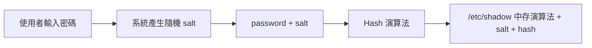

**Workflow 2：登入驗證時**

1. 使用者輸入密碼
2. 系統從 `/etc/shadow` 取出該帳號的演算法與 salt
3. 用相同 salt 和相同演算法重新計算一次
4. 把新算出的結果和 shadow 內的 hash 比較
5. 一樣就通過，不一樣就拒絕

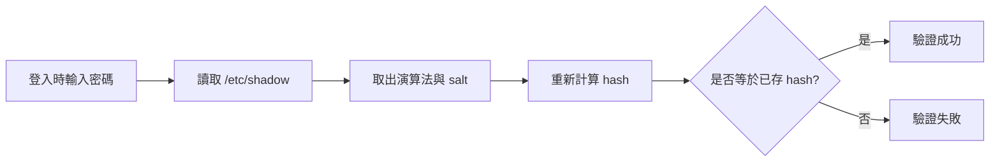

**補充：為什麼驗證時要先算 hash，而不是直接比對密碼**

你可以把這件事記成：

> **系統要驗證的是「你知不知道正確密碼」，不是把真正密碼明文一直存著。**

**簡要定義**

登入驗證時，系統通常不保存明文密碼，而是保存 hash。  
因此使用者輸入密碼後，系統必須用相同演算法與 salt 重新算一次 hash，再和資料庫中已存的 hash 比對。

**簡單例子**

假設真正密碼是 `hello123`，系統不會把它直接存成：

```text
password = hello123
```

而是存成像這樣：

```text
salt = X7m2
hash = hash(X7m2 + hello123)
```

登入時如果使用者輸入 `hello123`，系統就重新計算：

```text
hash(X7m2 + hello123)
```

若結果和已存 hash 一樣，就代表密碼正確。

**如果不先算 hash，直接比對會怎樣？**

通常就代表系統得保存明文密碼，這會帶來幾個很大的風險：

* 資料庫一旦外洩，攻擊者直接拿到真正密碼
* 使用者若重複使用密碼，其他網站帳號也可能一起受害
* 管理員、惡意程式或入侵者若能讀到資料庫，就能直接看到密碼內容
* 這種做法違反現代系統的基本安全設計

**Workflow：hash-based password verification**

1. 使用者輸入密碼
2. 系統讀取該帳號已存的 salt 與 hash
3. 用相同 salt 和演算法重新計算輸入值的 hash
4. 比對「新算出的 hash」和「原本存的 hash」
5. 相同則接受，不同則拒絕

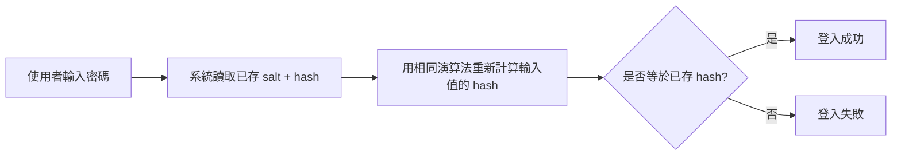

**系統怎麼知道這個帳號原本的 salt？**

一句話記法：

> **salt 是在設定密碼時由系統產生，之後就和演算法資訊、hash 一起存進 `/etc/shadow`。**

你也可以先簡單記成：**`/etc/shadow` 的密碼欄位內，至少可理解為有三項核心資訊：salt、演算法資訊、hash 結果。**

所以登入驗證時，系統不是去「猜 salt」或「從 hash 反推出 salt」，而是直接：

1. 讀取該帳號在 `/etc/shadow` 的紀錄
2. 取出裡面的演算法與 salt
3. 再用輸入密碼重新計算 hash

也就是說，**salt 通常不是秘密值；它是驗證流程中本來就會被保存的參數。**

**和直接比對明文的差別**

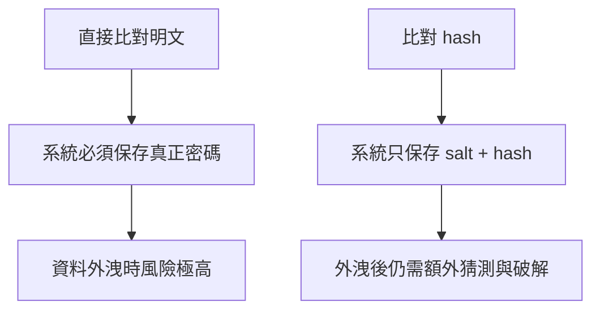

**補充：什麼是 rainbow table**

你可以把 rainbow table 記成：

> **rainbow table 是預先算好的「常見密碼候選值 ↔ 對應 hash」對照表，攻擊者拿到 hash 後可直接查表，加速破解。**

**簡單例子**

假設系統裡存的是某個沒有 salt 的 hash，攻擊者拿到後：

1. 去查自己事先準備好的 rainbow table
2. 發現這個 hash 對應到常見密碼 `123456`
3. 於是不用重新大量計算，就能很快猜到原始密碼

這也是為什麼「沒有 salt 的同密碼會有同 hash」很危險，因為同一張表可以重複打很多帳號。

**Workflow：rainbow table 攻擊怎麼運作**

1. 攻擊者先離線預算很多常見密碼的 hash
2. 把結果整理成可查詢的對照表
3. 之後一旦拿到某系統洩漏的 password hash
4. 就直接查表找對應密碼，而不是每次從頭暴力重算

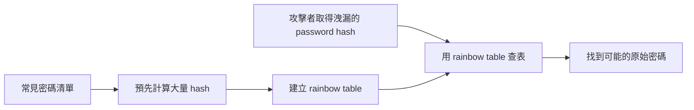

**為什麼 salt 能讓 rainbow table 變難用**

* 沒有 salt：同密碼會得到同 hash，查一張表就能重複用
* 有 salt：同密碼在不同帳號上會變成不同 hash，攻擊者得針對每個 salt 重新算，原本的表幾乎不能直接重用

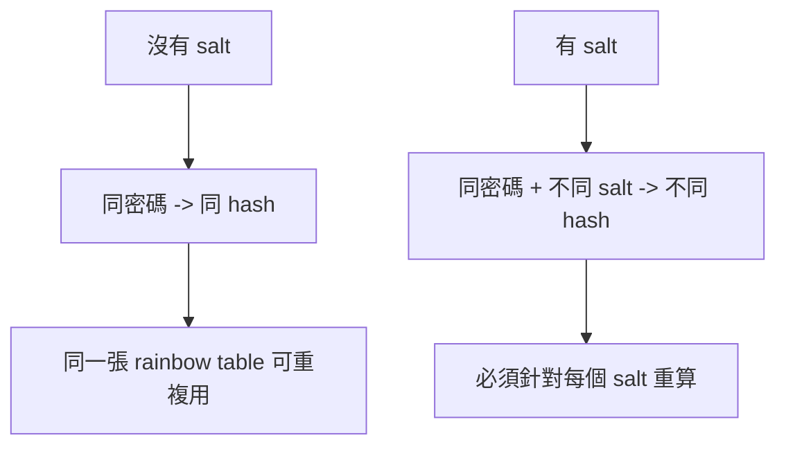

**你要避免的誤解**

* salt 不是秘密值，通常就和 hash 一起存放
* 安全性不是靠「把 salt 藏起來」，而是靠它讓預先計算攻擊失效
* salt 不能單獨阻止暴力破解，但能顯著降低大規模預先計算攻擊效率

**考試怎麼考 + 你怎麼寫**

> Linux 將帳號資訊與密碼雜湊分離存放：`/etc/passwd` 保存帳號基本資訊，`/etc/shadow` 保存密碼雜湊。salt 可防止同密碼產生相同雜湊，並降低 dictionary 與 rainbow table 攻擊效果。

---

## C. 容易混淆整理

| 觀念            | 很多人會寫錯    | 正確寫法                               |
| ------------- | --------- | ---------------------------------- |
| file 的 x      | 能進資料夾     | 錯。file 的 x 是可執行                    |
| directory 的 x | 可執行程式     | 錯。directory 的 x 是可進入/traverse      |
| umask         | 是增加權限     | 錯。umask 是遮掉預設權限                    |
| ACL           | 取代傳統權限    | 錯。ACL 與傳統模型共存                      |
| sudo          | 等於永久 root | 錯。是暫時以特權身分執行命令                     |
| capability    | 等於完整 root | 錯。只是 root 權限的一部分                   |
| `/etc/passwd` | 存密碼       | 現代 Linux 不這樣；密碼雜湊在 `/etc/shadow`   |
| salt          | 是加密金鑰     | 不精確。salt 是加入 hash 過程的隨機值，用來抗預先計算攻擊 |

---

## D. 最容易考的題目（至少 5 題）

### 題 1：說明 Linux 傳統 permission model，並比較 file 與 directory 的 rwx 意義。

**擬答**

> Linux 傳統權限模型以 owner、group、other 三類主體描述對資源的 read、write、execute 權限。對 file 而言，read 表示讀檔案內容，write 表示修改內容，execute 表示執行該檔案；對 directory 而言，read 表示列出目錄內容，write 表示在其中建立或刪除項目，execute 則表示可進入或 traversing 該目錄。兩者雖然都寫成 rwx，但語意不同，特別是 directory 的 execute 是最容易混淆之處。 （Linux Security Basics 第 10–11 頁）

### 題 2：什麼是 umask？請說明它如何影響新檔案權限。

**擬答**

> umask 是新建檔案或目錄時的權限遮罩，用來限制預設權限，而不是增加權限。建立一般檔案時可視初始權限為 0666，若 umask 為 0022，則最後權限為 0644；也就是 owner 可讀寫，group 與 other 僅可讀。umask 的本質是將對應 bit 關閉，因此是「扣掉」而不是「加上」。 （Linux Security Basics 第 12–13 頁）

### 題 3：ACL 與傳統 owner/group/other 權限模型有何差異？

**擬答**

> 傳統 Linux 權限模型只區分 owner、group、other 三類主體，因此表達能力有限。ACL 則提供 fine-grained access control，可對個別 user 或 group 指定權限，例如只允許某位使用者讀取某檔案，或讓特定群組具有讀寫權限。ACL 與傳統模型並非互斥，而是可以共存，用以補足傳統模型的粗粒度限制。 （Linux Security Basics 第 14–15 頁）

### 題 4：比較 sudo 與 POSIX capabilities。

**擬答**

> sudo 是讓被授權使用者暫時以 root 或其他指定使用者身分執行某個命令，其控制依據為 sudoers 設定；它本質上是「借用較高身分」。POSIX capabilities 則是把 root 權限拆成多個較小能力，讓程式只取得完成任務所需的權限，例如 CAP_NET_RAW 或 CAP_DAC_READ_SEARCH。相較之下，capabilities 更符合 least privilege，因為它避免把完整 root 權限一次交給程式。 （Linux Security Basics 第 17–25 頁）

### 題 5：為什麼 Linux 不把密碼直接存放在 `/etc/passwd`？salt 又有什麼作用？

**擬答**

> `/etc/passwd` 主要存放帳號資訊，需要較廣泛地被系統讀取，因此不適合再存放密碼雜湊。為了提高安全性，Linux 將密碼雜湊移至權限更嚴格的 `/etc/shadow`。此外，shadow 中使用 salt，使得即使多個使用者使用相同密碼，也不會得到相同雜湊，從而降低 dictionary attack 與 rainbow table attack 的效果。 （Linux Security Basics 第 28–31 頁）

### 題 6：為什麼老師會說不建議長時間使用 root shell？

**擬答**

> 長時間處於 root shell 代表程序持續持有最高權限，誤操作或程式被利用時可能造成較大損害。相較之下，以 sudo 執行單一命令能將特權使用限制在必要範圍內，更符合最小權限原則，因此較安全。 （Linux Security Basics 第 19 頁）

---

# Part 3：Malware（超詳細）

Malware 講義最值得考的不是歷史年份本身，而是：**分類、差異、傳播流程、隱藏機制**。老師已經把 taxonomy 畫得很清楚：trapdoors、logic bombs、Trojan horses、viruses、worms、zombies、rootkits。 （Malware 第 7 頁）

## A. 核心分類（taxonomy）

### 1. Trapdoor

【背誦優先】

白話：偷偷留一個祕密入口。
正式：繞過正常安全程序的 secret entry point，可是特定帳號、密碼或條件。講義還提醒，這種東西甚至可能被放進 compiler。 （Malware 第 8 頁）

### 2. Logic Bomb

【背誦優先】【高機率考題】

白話：平常不動，條件到了才爆。
正式：嵌入合法程式中的惡意邏輯，當特定條件成立時被觸發，例如某日期、某檔案是否存在、某特定使用者等；通常觸發後會破壞系統或修改/刪除資料。 （Malware 第 9–10 頁）

### 3. Trojan Horse

【背誦優先】【高機率考題】【易混淆】

白話：看起來正常，其實暗地裡做壞事。
正式：具有 overt effect 與 covert effect 的程式。使用者以為執行的是正常功能，但同時惡意行為也在使用者授權下發生。 （Malware 第 11 頁）

### 4. Virus

【背誦優先】【高機率考題】

白話：要黏在別的程式身上才能擴散。
正式：self-replicating code，會修改正常程式使其成為 infected version；通常在被感染程式執行時才運作。 （Malware 第 12–14 頁）

### 5. Worm

【背誦優先】【高機率考題】

白話：不用宿主，自己跑、自己傳。
正式：能獨立執行、無需 host program，並將完整可運作的自身複製到其他機器；典型 phases 為 **probing → exploitation → replication → payload**。 （Malware 第 15 頁）

### 6. Zombie / Botnet

【理解優先】【高機率考題】

白話：先把很多別人的電腦收成小兵，再一起打人。
正式：攻擊者秘密控制大量被入侵電腦，形成 botnet，並透過共同的 command-and-control infrastructure 發動 DDoS、phishing、spamming 等攻擊。 （Malware 第 33–39 頁）

### 7. Rootkit

【理解優先】【高機率考題】

白話：入侵成功後，幫攻擊者「藏起來」並方便下次再進來。
正式：在 system compromise 之後使用的軟體，目的是隱藏攻擊者存在、建立 backdoor、維持持久化；可能改 user program，也可能改 kernel。 （Malware 第 40–42 頁）

### 8. Keylogger

【理解優先】

白話：偷鍵盤輸入。
正式：攔截使用者按鍵事件並紀錄，講義例子以 hook keyboard event、在 victim process 中攔截按鍵，並透過 IPC（shared memory）回傳資料。 （Malware 第 43–44 頁）

---

## B. Virus / Worm / Trojan 完整比較

| 項目       | Trojan Horse                 | Virus                        | Worm                |
| -------- | ---------------------------- | ---------------------------- | ------------------- |
| 是否需要宿主程式 | 常偽裝成正常程式，但本質上可嵌在看似正常程式中      | **需要**附著在 host/infected code | **不需要**             |
| 是否自我複製   | 通常不是核心特徵                     | 是                            | 是                   |
| 主要啟動方式   | 使用者被騙去執行                     | 被感染程式執行時啟動                   | 自己獨立執行              |
| 主要傳播方式   | 社工、偽裝                        | 感染其他檔案/boot sector/macro     | 網路掃描、漏洞利用、複製到遠端     |
| 核心特徵     | overt effect + covert effect | 依附宿主並感染其他程式                  | 獨立、快速橫向擴散           |
| 考試最常錯    | 把 Trojan 寫成一定會自我複製           | 把 virus 寫成不需要 host           | 把 worm 和 virus 混成一樣 |

根據講義，virus 的重點是感染正常程式、在被感染程式執行時運作；worm 的重點是獨立運作與網路擴散；Trojan horse 的重點是偽裝與隱藏效果，不是「會不會複製」。 （Malware 第 11–15 頁）

---

## C. Worm 攻擊流程（一定要拆步驟）

### 通用版 worm infection flow

**Step 1：Probing**
掃描或尋找可感染的目標。

**Step 2：Exploitation**
利用漏洞、錯誤設定、信任關係或弱密碼取得執行機會。

**Step 3：Replication**
把自身完整副本送到新主機，並在那裡啟動。

**Step 4：Payload**
執行隱藏任務，例如 backdoor、spam relay、DDoS agent。 （Malware 第 15 頁）

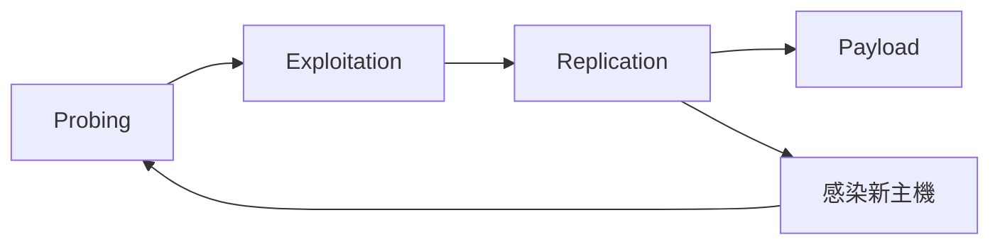

### Morris worm 考試版流程

這是超高機率申論素材。

**Step 1：找目標主機**
Morris worm 先尋找可感染的其他 Unix 主機。

**Step 2：選感染向量**
講義列出它使用多種 security vulnerabilities：

* sendmail debug feature
* fingerd buffer overflow
* trusted logins（`.rhosts` / `host.equiv`）
* weak passwords （Malware 第 19–22 頁）

**Step 3：取得遠端執行能力**
例如利用 fingerd 中 `gets` 造成 buffer overflow，覆寫 return address，進而執行遠端 shell；或利用 sendmail debug 機制讓 shell script 幫它拉主程式。 （Malware 第 20–21 頁）

**Step 4：下載/編譯向量程式與主程式**
講義提到它先在被感染主機上放一個小的 vector program，再取回 main program、編譯後繼續攻擊。 （Malware 第 19–20 頁）

**Step 5：繼續向外擴散**
成功感染後 fork child 繼續感染更多主機。 （Malware 第 23 頁）

**Step 6：造成系統與網路負載**
Morris worm 本身沒有立刻刪檔或奪 root，但因大量複製、密碼猜測與重複感染，導致系統負載爆炸，很多系統被迫關機防擴散。 （Malware 第 18、23–24 頁） 

**考試寫法重點**
Morris worm 最該寫的不是年份，而是：

> 它是一個典型 worm，透過多個 Unix 漏洞與信任機制進行遠端擴散；其破壞力主要來自 replication 帶來的 network/system overload。

---

## D. Botnet 攻擊流程（一定要拆步驟）

講義第 34–39 頁其實已經幫你畫成 6 步。這種圖超像考試申論。 （Malware 第 34–39 頁）

### Botnet lifecycle

**Step 1：掃描未受保護主機**
攻擊者在 Internet 上找可被 compromise 的 unsecured systems。

**Step 2：植入 zombie agent**
把這些主機變成 zombies。

**Step 3：Phone home / 連回 master server**
被感染主機會主動回連，掛到 master server / C2。

**Step 4：攻擊者對 master server 下指令**
例如指定 target、攻擊類型。

**Step 5：master server 對 zombies 發號施令**
所有 bots 同步開始動作。

**Step 6：target 被大量請求淹沒**
正常使用者的 request 被拒絕，形成 DDoS。 （Malware 第 34–39 頁）

**一段考場可直接寫的話**

> Botnet 是由大量被入侵主機組成的殭屍網路。攻擊者先掃描脆弱主機並植入 zombie agent，再由這些 agents 回連至 master server 形成 command-and-control 架構；當攻擊者下達命令後，master server 會協調所有 zombies 對目標發動大規模攻擊，例如 DDoS。

---

## E. Rootkit / Keylogger 機制

### Rootkit

【高機率考題】

**白話一句話**
Rootkit 是「入侵後的隱身工具包」。

**正式定義**
講義定義 rootkit 為：在系統被 compromise 後，用來隱藏攻擊者存在並提供 backdoor 以便重新進入的軟體。簡單 rootkit 會修改 `ls`、`ps` 等 user programs；更進階者會改 kernel，本地 userland 很難看出來。 （Malware 第 40 頁）

**分類**

1. Traditional rootkit：改 login / ps / ifconfig 等 user programs
2. Kernel-level rootkit：改 kernel module
3. Application-level rootkit：在應用層動手腳
4. Under-kernel rootkit：甚至躲到 VMM/虛擬化層下面 （Malware 第 41–42 頁）

**考試重點**
越往下層，越難偵測。

---

### Keylogger

【理解優先】

**白話一句話**
Keylogger 的核心不是「偷檔案」，而是「攔輸入事件」。

**正式定義**
講義範例顯示，keylogger 透過 keyboard hook 將 `KeyboardProc()` 注入或掛鉤到 victim process，攔截 keystroke，並透過 IPC/shared memory 把資料傳回惡意程式。 （Malware 第 43–44 頁）

**深入理解**
它針對的是「資料進系統的入口」。
你就算網站是正常的，只要輸入被攔截，帳號密碼、信用卡資料仍可能外洩。

**補一句考場很加分的觀念**
防毒不只要查惡意檔案，也要防止 hook、DLL injection、process hiding 這類行為。講義後面還展示了隱藏於 Task Manager 的方式，屬於更進階的 hiding 技術。 （Malware 第 45–50 頁）

---

## F. 最容易考題（至少 5 題）

### 題 1：說明 Trojan Horse、Virus、Worm 的差異。

**擬答**

> Trojan horse 是具有 overt effect 與 covert effect 的程式，使用者以為在執行正常功能，實際上同時完成惡意行為；virus 是依附於宿主程式的自我複製程式，會感染其他檔案或程式；worm 則不需要宿主程式，可獨立執行並透過網路主動擴散。三者差異的關鍵在於是否需要 host program，以及是否以 network-based self-propagation 為主要特徵。 （Malware 第 11–15 頁）

### 題 2：什麼是 logic bomb？

**擬答**

> Logic bomb 是嵌入合法程式中的惡意邏輯，平時不會啟動，只有在特定條件成立時才會被觸發，例如某日期、特定使用者、某檔案存在與否等。其觸發後通常造成破壞，例如刪除或修改檔案、破壞磁區等。 （Malware 第 9 頁）

### 題 3：請描述 worm 的一般攻擊 phases。

**擬答**

> Worm 的一般生命週期可分為 probing、exploitation、replication、payload 四階段。首先尋找可感染主機，接著利用漏洞或錯誤設定取得執行能力，再將完整副本複製到新主機並啟動，最後執行隱藏任務，例如建立 backdoor、寄送垃圾郵件或擔任 DDoS agent。 （Malware 第 15 頁）

### 題 4：為什麼 Morris worm 具有歷史代表性？

**擬答**

> Morris worm 被視為第一個重大 Internet worm 案例。它不只會自我擴散，還同時利用 sendmail debug feature、fingerd buffer overflow、trusted login 與 weak password 等多種 Unix 弱點進行感染。其主要衝擊不是直接刪檔，而是大量複製與重複感染造成的系統和網路過載。 （Malware 第 18–24 頁） 

### 題 5：請說明 botnet 如何形成並被用來做 DDoS。

**擬答**

> 攻擊者先在網路上掃描可被 compromise 的主機，植入 zombie agent，讓受害主機回連到 master server 形成 command-and-control 架構。之後攻擊者對 master server 下達命令，master server 再通知所有 zombies 同步向目標系統發送大量請求，最終使目標資源耗盡而拒絕正常使用者請求。 （Malware 第 33–39 頁）

### 題 6：什麼是 rootkit？為什麼它難偵測？

**擬答**

> Rootkit 是系統遭入侵後用來隱藏攻擊者存在、維持存取能力與建立 backdoor 的軟體。若只是修改 `ls`、`ps` 等 user programs，仍可被完整性檢查工具偵測；但若 rootkit 修改 kernel，甚至位於 under-kernel/VMM 層，從一般 userland 幾乎難以直接發現，因此偵測難度大幅增加。 （Malware 第 40–42 頁）

### 題 7：Keylogger 的核心機制是什麼？

**擬答**

> Keylogger 的核心機制是攔截鍵盤輸入事件，而不是單純竊取檔案。講義中的例子透過 keyboard hook 將處理函式掛入 victim process，截取 keystroke 後再透過 IPC/shared memory 傳回惡意程式，因此即使使用者在正常程式中輸入資料，敏感資訊仍可被竊取。 （Malware 第 43–44 頁）

---

# Part 4：Introduction（考試版重點）

## A. 課程架構（考試會怎麼問）

Introduction 最值得背的不是老師 email，而是三件事：

1. **課程定位**：doorway to security attack and defense research
2. **範圍很廣**：software / web / hardware / network / AI security / cryptography
3. **學習方式**：先備知識要求 OS、network、coding，所以這門課不是純概論，是會進到機制層。 （Introduction 第 2 頁）

如果考申論題「為什麼需要先備知識」，你可以這樣寫：

> 安全問題通常橫跨系統、網路與程式三層。若不了解 operating systems，就無法理解 process、memory、permission、privilege；若不了解 computer network，就無法理解通訊協定、封包、路由與遠端攻擊；若沒有 coding skills，則難以閱讀漏洞成因與攻擊行為。因此這些先備知識是修習攻防課程的必要基礎。
> 這段後半句是我根據課程地圖做的合理推論；講義明確列出了 OS / network / coding 為 prerequisite。 （Introduction 第 2、4 頁）

## B. 這門課的「出題邏輯」

這部分是推論，但推論很穩。

從課程地圖看，老師是按**層次**在教：

* system-level attacks / defenses
* network-level attacks / defenses
* software-level attacks
* web-level attacks （Introduction 第 4 頁）

所以考題很可能遵循這種模式：

1. **先問你定義**：這是什麼？
2. **再問你機制**：它怎麼運作？
3. **再問你風險**：攻擊者怎麼利用？
4. **最後問你對策/限制**：怎麼防？有什麼 trade-off？

你如果只背名詞，會死在第 2、3 小題。
你如果只懂故事，不會寫正式定義，會死在第 1 小題。

---

# Part 5：Day 1 必背 + 必懂整理

## ✅ 必背清單

1. UID / GID 定義
2. owner / group / other
3. file 的 rwx 意義
4. directory 的 rwx 意義
5. umask 是遮罩，不是加權限
6. ACL 是 finer-grained control
7. sudo 的用途
8. capability 是把 root privilege 拆小
9. `/etc/passwd` 存帳號資訊，不存密碼雜湊
10. `/etc/shadow` 存 password hash
11. salt 抵抗 dictionary / rainbow table attack
12. Trojan horse 定義
13. Virus 定義
14. Worm 定義
15. Worm phases：probing → exploitation → replication → payload
16. Botnet / zombie 定義
17. Rootkit 定義
18. Keylogger 核心是攔截 keystroke

## 🧠 必懂觀念

1. **同樣是 rwx，file 和 directory 的意思不同**
2. **帳號名稱不是系統真正判權限的核心，UID/GID 才是**
3. **權限管理不是只有 root / non-root 兩種，還有 ACL、capabilities 這種更細的設計**
4. **Trojan、virus、worm 的差別是 Day 1 最容易混的分類題**
5. **worm 的破壞力常來自擴散速度與資源耗盡，不一定是直接刪檔**
6. **rootkit 是 compromise 之後的隱匿與持久化工具，不是最初入侵手段本身**
7. **Day 1 的攻防不是兩條線，而是一體兩面：系統怎麼授權，惡意程式就怎麼利用**

## ⚠️ 易錯陷阱

1. 把 directory 的 x 寫成「執行」
2. 把 umask 當加法
3. 把 ACL 說成完全取代傳統 permissions
4. 把 sudo 說成永久取得 root
5. 把 Trojan horse 說成一定會自我複製
6. 把 virus 和 worm 寫成同一種東西
7. 把 rootkit 當成「病毒的一種」亂包
8. 只記 Morris worm 年份，不記它利用哪些向量
9. 只會講 botnet 能做 DDoS，不會寫形成流程
10. 把 salt 誤寫成加密密碼的金鑰

## 🎯 最可能考題 TOP 10

1. Linux file 與 directory 權限比較
2. umask 計算題
3. ACL 與傳統 permission model 比較
4. sudo 與 capabilities 比較
5. `/etc/passwd`、`/etc/shadow`、salt 的作用
6. Trojan horse、virus、worm 比較
7. worm 四階段流程
8. Morris worm 利用哪些弱點擴散
9. botnet 如何形成並發動 DDoS
10. rootkit 的目的與分類

---

# 你現在最該怎麼背

如果你時間很少，先背這三套模板：

### 模板 1：比較題

> X 與 Y 的差異在於是否需要 host program、是否能獨立執行、是否具有自我複製能力、主要傳播方式與攻擊目標。

### 模板 2：流程題

> 此攻擊可分為 Step 1 …、Step 2 …、Step 3 …、Step 4 …；其關鍵在於先取得執行能力，再完成複製/控制/隱藏。

### 模板 3：機制題

> 此機制的目的在於限制/授予特定權限；其核心做法是依據某種身分或屬性進行存取控制；安全上的價值在於降低攻擊面並符合最小權限原則。

---

你如果把這份吃熟，Day 1 已經不是「看懂」而是可以開始「寫答案」了。
