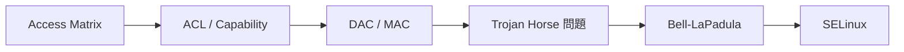
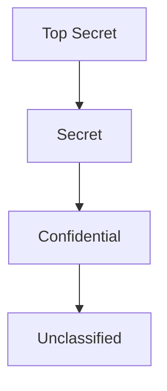
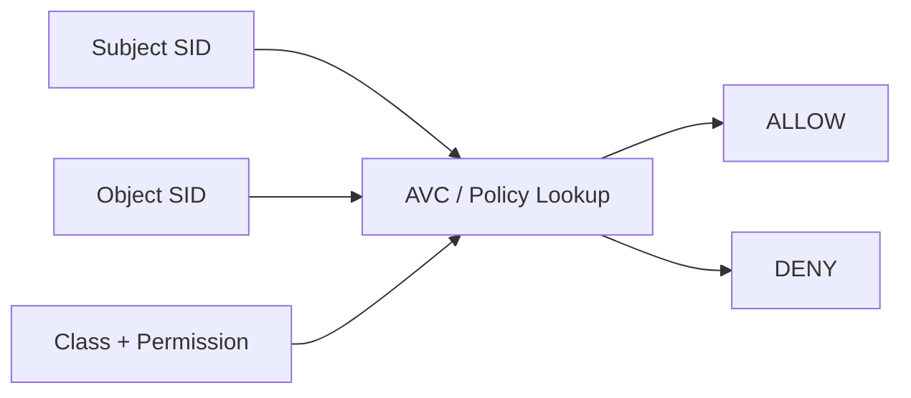

好，直接進入 **Day 2 考試版講義**。
我會把它寫成你現在拿去讀、之後拿去背、最後拿去考都能用的版本。

---

# Day 2：完整教學講義（考試導向）

這一天其實是在講同一條主線：

**Access Control Models → Bell-LaPadula → SELinux**

也就是：

1. 先學「系統怎麼決定誰可以做什麼」
2. 再學「如果重點是保密性，規則要怎麼設計」
3. 最後看「Linux 實際怎麼把這種想法做出來」

課程大綱也把這三份放在同一組 system-level defenses 裡面。

---

## Part 0：整體地圖

### 先用一句話講完 Day 2

* **Access Control Models**：講授權框架與表示法。
* **Bell-LaPadula, BLP**：講保密性導向的 Mandatory Access Control。
* **SELinux**：講 Linux 上的 MAC / type enforcement 實作。  

### 這三者的關係

* Access control 先告訴你：系統裡有 **subject、object、right**，可以用 **access matrix、ACL、capability** 來表示。
* 接著 DAC 與 MAC 分家：

  * **DAC**：權限可以被持有者傳播。
  * **MAC**：依安全標籤決定，不是你有權就能隨便傳。
* BLP 是一個 **MAC 的保密性模型**，重點是 **no read up / no write down**。
* SELinux 是 Linux 上的 **MAC 機制**，靠 security context、type/domain、policy 來限制行為；連 root 被攻陷後，破壞也會被政策限制。

### 老師最可能怎麼串題

常見出法會長這樣：

1. 先問 **ACL vs Capability**
2. 再問 **DAC vs MAC**
3. 再問 **為什麼 DAC 擋不住 Trojan Horse**
4. 再接 **BLP 的 simple security 與 *-property**
5. 最後問 **SELinux 怎麼把 MAC/BLP 風格落地**

這種題目最容易失分的地方，不是不懂，而是：

* 名詞混在一起
* 規則背反
* 不知道 Trojan Horse 到底在說什麼
* 不知道 SELinux 的 type / domain / role / level 各自是什麼

### Day 2 主線圖

---

# Part 1：Access Control Models

## 1. 核心概念：Subjects / Objects / Rights

### 一句話白話理解

系統裡要先分清楚：
**誰（subject）** 對 **什麼（object）** 可以做 **哪些事（rights）**。

### 正式考試定義

Access matrix model 的基本抽象是：

* **Subjects**
* **Objects**
* **Rights**
  矩陣中每個 cell 表示某個 subject 對某個 object 擁有哪些 rights。

### 為什麼重要

因為後面所有授權模型都建立在這三件事上。
你如果連這三個都分不清，後面 ACL、Capability、DAC、MAC、BLP 會全部亂掉。

### 補強觀念：user / principal / subject 不一樣

課堂特別強調：

* **User**：現實世界的人
* **Principal**：系統授權單位
* **Subject**：代表 principal 執行中的程式 / process 

### 考試最容易錯

⚠️ 很多人會把 user 跟 subject 當同一個。
但考試如果嚴格寫，**subject 是執行中的程式**，不是使用者本人。
這個差別後面跟 Trojan Horse 超有關。

### 作答模板

> In an access control model, a subject is an active entity such as a process executing on behalf of a principal, an object is a resource to be protected, and rights specify the allowed operations of the subject on the object.

---

## 2. Access Matrix

### 白話理解

你可以把它想成一張大表格：

* 列是 subject
* 欄是 object
* 格子裡寫可以做哪些操作

### 正式定義

Access matrix model 用矩陣表示授權關係；每個 cell 指定 row 對應的 subject 對 column 對應的 object 所具有的 rights。

### 為什麼重要

因為它是 ACL 與 Capability 的共同母體。
老師如果問「ACL 跟 Capability 其實是在存 access matrix 的哪一部分」，你要會答。

### ACL / Capability / Relation

課堂說 access matrix 可實作成三種：

* **ACL**：每個 object 存一欄
* **Capability list**：每個 subject 存一列
* **Access control triples / relations**：存成 `(subject, access, object)` 三元組，常見於 DBMS。

---

## 3. ACL vs Capability

### 一句話白話理解

* **ACL**：從「物件」角度看，誰能碰我？
* **Capability**：從「主體」角度看，我能碰誰？

### 正式考試版比較

| 比較點             | ACL                      | Capability                                               |
| --------------- | ------------------------ | -------------------------------------------------------- |
| 儲存方式            | 存 access matrix 的 column | 存 access matrix 的 row                                    |
| 焦點              | per-object               | per-subject                                              |
| 驗證需求            | 需要驗證 subject 身分          | 不一定靠 subject authentication，但必須確保 capability 不可偽造、不可任意傳播 |
| Access review   | 物件導向較方便                  | 主體導向較方便                                                  |
| Revocation      | per-object 較好            | per-subject 較好                                           |
| Least privilege | 較一般                      | 對短生命週期 subject 可更細緻                                      |

這些都是投影片直接點出的。

### 為什麼很多 OS 比較常用 ACL

因為大部分情況下，**檔案保護比較常從物件出發**。
所以投影片明講：per-object basis 通常贏，因此多數作業系統保護檔案時偏向 ACL，而且常簡化為 owner / group / other 三格。

### 超容易混淆點

⚠️ **ACL 不是比較安全，Capability 也不是比較進階就一定比較好。**
它們是「表示法與管理便利性」不同，不是單純高下之分。

### 申論模板

> ACLs store authorization information with objects, whereas capabilities store authorization information with subjects. ACLs are better for per-object access review and revocation, while capabilities are better for per-subject review and can support finer-grained least privilege for short-lived subjects. 

---

## 4. Context-based / Attribute-based Controls

### Context-based

例如：

* 不能用 remote login 存取機密資訊
* 薪資只能在年底更新
  這種是根據「情境」決定。

### Attribute-based

例如：

* 年滿 18 才能買酒
* 必須在校園內才能用學校訂閱資源
  這種是根據「屬性」決定。

### 考試寫法

如果題目問你 DAC/MAC 以外的方向，你可以答：

> Beyond traditional DAC and MAC, access control may also depend on context or attributes. Context-based control considers environmental conditions such as time or login method, while attribute-based control considers user or resource attributes such as age or location. 

---

## 5. DAC vs MAC

這是 **Day 2 第一個超高機率考點**。

### 白話理解

* **DAC**：我有權限，我就可能把它分享、轉授、帶出去。
* **MAC**：不是你有權就夠，還要看安全標籤規則。

### 正式定義

* **DAC** 允許 access rights 由一個 subject 傳播到另一個 subject；只要 subject 持有 access right，就足以取得對 object 的存取。
* **MAC** 則依 security labels 限制 subject 對 object 的存取。

### 為什麼 DAC 有先天弱點

投影片直接講：

> Unrestricted DAC allows information from an object which can be read to any other object which can be written by a subject.
> 也就是說：只要某 subject 同時能 **讀 A**、**寫 B**，資訊就可能從 A 流到 B。

### 這就是 Trojan Horse 問題

即使使用者本人沒有惡意，**Trojan Horse 也能利用使用者的合法權限**，把不該流動的資訊偷偷複製走。

### DAC vs MAC 表格

| 項目     | DAC               | MAC                        |
| ------ | ----------------- | -------------------------- |
| 核心控制基礎 | 主體持有的權限           | 安全標籤 / policy              |
| 權限可否傳播 | 可以，或較容易           | 受政策限制                      |
| 彈性     | 高                 | 較低                         |
| 安全性    | 對 Trojan Horse 較弱 | 對資訊外洩控制較強                  |
| 代表概念   | owner 決定、ACL 常見   | security label、BLP、SELinux |

### 考試直接可背答案

> DAC is flexible because access rights can be propagated by subjects, but this flexibility is also its weakness. A Trojan Horse executed by an authorized subject can exploit legitimate read and write privileges to copy sensitive information to another object. MAC addresses this problem by restricting access according to security labels instead of discretionary propagation. 

---

## 6. Trojan Horse 一定要會

### 正式定義

Trojan Horse 是由合法授權使用者無意間安裝或執行的惡意軟體；它表面上做使用者期待的事，但同時額外利用該使用者的合法權限造成安全破壞。

### 經典例子

投影片例子：

* File F：A 可讀可寫
* File G：B 可讀，A 可寫
* B 本來不能讀 F
* 但 A 執行 Trojan Horse 後，木馬可以讀 F 再寫到 G
* 於是 B 再去讀 G，就間接讀到 F 的內容。

### 你一定要會的考試說法

> Trojan Horse does not need to break the access control rules directly. Instead, it abuses the legitimate privileges of an authorized subject. Therefore, in DAC, if a subject can read one object and write another, the Trojan Horse can copy information between them and cause an information leak. 

### ⚠️ 最容易失分點

很多人只會寫：

> Trojan Horse 是偽裝成正常程式的惡意程式。

這句太淺。
在這堂課的脈絡裡，你一定要補上：

> **它利用 subject 的合法權限，造成資訊從高敏感物件流向低敏感物件。**

這樣才是考點核心。

---

## Part 1 小考題

### 題目 1：Explain the access matrix model.

**標準答案：**
Access matrix model represents authorization using three basic abstractions: subjects, objects, and rights. Each cell in the matrix specifies what rights a subject has over an object. It can be implemented as ACLs, capability lists, or access control triples. 

### 題目 2：Compare ACL and capability lists.

**標準答案：**
ACL stores authorization information with objects, while capability lists store authorization information with subjects. ACL is better for per-object review and revocation, whereas capability is better for per-subject review and can support finer-grained least privilege. Capabilities also require unforgeability and controlled propagation. 

### 題目 3：What is the difference between DAC and MAC?

**標準答案：**
DAC allows access rights to be propagated by subjects, so possession of the right is often sufficient for access. MAC instead restricts access according to mandatory security labels. DAC is more flexible, but MAC is stronger for controlling information flow. 

### 題目 4：Why is DAC vulnerable to Trojan Horses?

**標準答案：**
Because a Trojan Horse can exploit the legitimate privileges of an authorized subject. If the subject can read one object and write another, the Trojan Horse can copy information from the former to the latter, causing unauthorized information disclosure. 

---

# Part 2：Bell-LaPadula（最重要）

這一段是 **Day 2 核心中的核心**。

---

## 1. BLP 在做什麼？

### 一句話白話理解

BLP 是一個專門保護 **機密不外洩** 的模型。

### 正式定義

BLP 是 confidentiality model。
它把 subjects 的 clearance 與 objects 的 classification 放在多層級安全結構中，目的在防止高機密資訊流向低權限對象。

### 等級

投影片用軍事等級：

* Top Secret
* Secret
* Confidential
* Unclassified 

### 你要會畫的圖

高在上、低在下，資訊流應該往上，不應往下。
課堂也進一步講 security categories，形成 lattice。

---

## 2. Simple Security Property = No Read Up

### 白話理解

你不能往上讀比你等級更高的資料。

### 正式定義

Subject `s` can read object `o` iff:

* `L(o) ≤ L(s)`
* 且 `s` 對 `o` 有 read permission
  這叫 **simple security condition**，也就是 **no read up**。

### 為什麼

因為低等級主體如果能讀高等級資料，保密性當場破功。

### 例子

* Secret 使用者不能讀 Top Secret 文件
* Confidential 使用者不能讀 Secret 郵件檔案
  投影片示例 Tamara / Samuel / Claire / Ulaley 就是在說這個。

### 考試模板

> The simple security property states that a subject may read an object only if the subject’s security level dominates the object’s level. It is often summarized as “no read up.” 

---

## 3. *-Property = No Write Down

### 白話理解

你不能把高等級資訊寫到低等級物件。

### 正式定義

Subject `s` can write object `o` iff:

* `L(s) ≤ L(o)`
* 且 `s` 對 `o` 有 write permission
  這叫 ***-property**，也就是 **no write down**。

### 為什麼超重要

因為只擋 no read up 還不夠。
如果高等級 subject 讀了高機密，再把內容寫到低等級檔案，低等級使用者就還是看得到。

### Trojan Horse 解釋

這就是投影片為什麼特別放「Why no write-down」：

* A 可讀寫高檔 X，也可寫低檔 Y
* B 可讀 Y，不能讀 X
* 木馬偽裝成 A 執行，把 X 複製到 Y
* B 再讀 Y，就等於間接讀 X。

### 你考試一定要這樣寫

> The *-property is necessary because no-read-up alone cannot prevent information leakage. A Trojan Horse can exploit a high-level subject’s legitimate write access to copy sensitive information from a high object to a low object. Therefore, BLP also enforces “no write down.” 

---

## 4. Trusted Subjects、Current Level、Maximum Level

### 這題很容易被忽略，但老師愛考細節

投影片說：

* 有些 subject 可被標記為 **trusted subject**，不受 star property 限制
* 每個 subject 實際上有兩種 level：

  * **maximum level**
  * **current level**
* simple security 用 maximum level
* *-property 用 current level 

### 白話理解

* maximum level：你最高能碰到哪裡
* current level：你目前這一刻用哪個等級在運作

### 考試寫法

> In the full BLP model, a subject has both a maximum security level and a current security level. The simple security condition is based on the maximum level, whereas the *-property is based on the current level. Some trusted subjects may be exempted from the *-property. 

---

## 5. BLP 的 secure state 與 discretionary security property

### 你不一定要全部形式化背到死

但至少要知道：
BLP 的「secure」不是只有兩條規則，還包含：

* simple security condition
* *-property
* discretionary security property 

### discretionary security property 是什麼

如果 `(s, o, p)` 在當前可存取集合 b 裡面，那麼 `p` 必須也出現在 access control matrix `m[s,o]` 中。
意思就是：
**除了 label 規則外，原本 DAC 權限也要成立。** 

### 考試一句話

> A BLP-secure system must satisfy not only the mandatory properties, namely the simple security condition and the *-property, but also the discretionary security property. 

---

## 6. BLP 的缺陷：這是申論題大魔王

這裡超常考。

### 缺陷 1：Not sufficient

投影片直接說 BLP notion of security **is not sufficient**。
因為如果 subject 先在高等級讀完資料，之後改 current level 到 low，再去寫 low object，雖然每個 state 看起來都 secure，但整個 execution sequence 還是可能造成非法資訊流。

### 白話理解

**單看每個瞬間沒問題，不代表整段過程沒問題。**

### 缺陷 2：Not necessary

投影片也說 **is not necessary**。
也就是有些系統雖然違反 *-property 的形式條件，但不代表真的造成不安全。

### 白話理解

**規則太死，有時候會把其實沒害的情況也判成不安全。**

### 缺陷 3：Only confidentiality

BLP 只處理 confidentiality，不處理 integrity。

### 缺陷 4：Covert channels

BLP 的 *-property 只防 overt leakage，無法處理 covert channels。

### 申論模板

> The major limitation of Bell-LaPadula is that its notion of security is state-based. As a result, it is neither sufficient nor necessary to prevent illegal information flow across a sequence of states. In addition, BLP addresses confidentiality only, not integrity, and it cannot eliminate covert channels. 

---

## 7. Covert Channel 也要會一點

### 正式定義

Covert channel 是利用原本不是設計來溝通的系統資源，在 subjects 之間偷偷傳資訊的通道。

### 例子

投影片給了兩種：

* **resource exhaustion channel**
* **load sensing channel** 

### 白話理解

不是靠正常讀寫檔案傳資料，而是靠：

* 記憶體有沒有被占滿
* CPU 忙不忙
* 檔案鎖有沒有被佔用
  這些側面訊號來偷傳 bit。

### ⚠️ 最容易錯的點

不是 users 不可信，而是 **subjects 不可信**。
投影片非常強調：

* users 被假設必須可信
* subjects 不可信，因為可能被 Trojan Horse 感染。 

---

## Part 2 高機率考題

### 題目 1：What is the goal of Bell-LaPadula?

**答案：**
Bell-LaPadula is a confidentiality model for multilevel security. Its goal is to prevent unauthorized disclosure of information by controlling information flow between subjects and objects with security labels. 

### 題目 2：Explain simple security property.

**答案：**
The simple security property states that a subject may read an object only if the subject’s security level dominates the object’s level and the read right is allowed. This is the “no read up” rule. 

### 題目 3：Explain *-property.

**答案：**
The *-property states that a subject may write to an object only if the object’s security level dominates the subject’s current level and the write right is allowed. This is the “no write down” rule, which prevents information from leaking from high to low levels. 

### 題目 4：Why is no-write-down needed?

**答案：**
Because without it, a Trojan Horse can exploit a high-level subject’s legitimate privileges to copy information from a high object to a low object, making the information accessible to a lower-level principal. 

### 題目 5：What are the main flaws of BLP?

**答案：**
BLP is neither sufficient nor necessary to prevent illegal information flow, because it is based on secure states rather than secure state sequences. It also deals only with confidentiality and does not solve covert channel problems. 

---

# Part 3：SELinux

這一段你不要把它讀成「一堆 Linux 指令」。
真正重點是：

> **SELinux = Linux 上把 MAC / policy / label 做出來的機制**

---

## 1. 什麼是 SELinux

### 一句話白話理解

SELinux 是 Linux 上的 **Mandatory Access Control** 機制。

### 正式定義

投影片直接寫：

* Originally from NSA
* Mandatory Access Control for Linux
* Security contexts
* Users, roles, types (domains), security level, policies
* Unprivileged root user 

### 最重要觀念

即使某個 process 是 root 執行，只要在 SELinux policy 下沒被允許，它也不能亂來。
課程明講：如果 root process 被 buffer overflow 等方式攻陷，損害仍受 policy 限制。

### 這句很值得背

> SELinux can make root effectively “unprivileged” with respect to operations not allowed by policy. 

---

## 2. Security Context

### 你一定要背格式

對 file system label：

* `user:role:type:level` 

對 process label：

* `user:role:domain(type):level` 

### 白話理解

一個 SELinux label 不是只有「身分」，而是四段資訊：

1. user
2. role
3. type / domain
4. level

### 最常考的是哪個？

🔥 **type / domain 最重要**

因為 SELinux 日常最核心是 **type enforcement**。
實務上很多判斷幾乎都在看：

* subject type
* object type
* class
* permission

---

## 3. Type Enforcement（SELinux 核心）

### 一句話白話理解

SELinux 不是問「你是不是 root」，而是問：

> 這個 **domain/type** 能不能對那個 **type/class** 做這個 **operation**？

### 規則語法

投影片給的 rule syntax：
`rule_name source_type target_type : class perm_set;` 

例如 allow rule：
`allow passwd_t shadow_t:file ... ;`
代表 `passwd_t` 這個 subject type 對 `shadow_t` 這個 file type 擁有某些檔案權限。

### 為什麼 root 也不能亂動

因為 SELinux 看的是 policy，不是單看 UNIX uid。
這是它跟傳統 DAC 最大差別。

### 考試作答模板

> SELinux primarily enforces access through type enforcement. Access decisions are based on the source type of the subject, the target type of the object, the object class, and the requested permissions as specified in policy rules. 

---

## 4. SELinux 怎麼判斷 allow / deny

投影片有 kernel flow：

* 取 current process SID
* 取 file/inode 的 security context
* 經由 AVC 查詢 permission
* 回傳 allow / deny 

### 白話理解

流程就是：

1. 先看「誰在做」
2. 再看「對誰做」
3. 再看「要做什麼」
4. 去 policy 問准不准

### 你可以這樣背

> Subject SID + Object SID + Object class + Requested permission → AVC / policy → allow or deny. 

---

## 5. File Type vs Process Type

### 重點

SELinux 不只檔案有 type，process 也有 type。
投影片特別分開講：

* executable file
* process
* type transition 

### 白話理解

你執行一個檔案，不是單純把檔案打開而已。
**可能會觸發 domain transition，讓新 process 進入另一個 type/domain。**

---

## 6. Type Transition（超容易錯）

### 先講 process type transition

SELinux 預設會繼承 context：

* fork 時繼承 process context
* 建新檔 / 目錄時常繼承 parent directory context
  但 process 在執行 command 時，context 可以改變，只要滿足三條件：

1. target file 對 source domain 可執行
2. target file context 是 target domain 的 entrypoint
3. source domain 被允許 transition 到 target domain 

### 考試最常出的一句

`domain_auto_trans(source, target, new_type);` 

### 白話版理解

不是「執行哪個檔案就自然變身」，而是要同時滿足：

* 能執行它
* 它是合法入口
* 政策允許切換

### 為什麼這很重要

這樣才可以做到：

* 普通 shell 不會直接擁有 passwd 修改 shadow 的能力
* 但執行特定 entrypoint 時，可以切換到 `passwd_t` 這種受控 domain，再去做受控工作
  投影片用 passwd program 的例子就是在講這件事。

---

## 7. Object Type Transition

### 白話理解

新物件建立時，不一定只看目錄，還可能看「是誰建的」。

### 投影片重點

* 每個新建 object 有 default context
* 一般檔案 / 目錄預設繼承 parent directory context
* 但有時想讓新物件 type 依建立它的 process domain 決定
  例如：
* X server 在 `/tmp` 建的檔案 → `xdm_tmp_t`
* 一般 user process 在 `/tmp` 建的檔案 → `user_tmp_t` 

### 考試一句話

> SELinux object type transitions allow the type of newly created objects to depend not only on the parent directory but also on the creating process domain. 

---

## 8. Relabeling 與 audit log

### 你至少要知道

如果操作被拒絕：

* 去看 `/var/log/audit/audit.log`
* 可以用 `audit2allow` 產生政策草稿 

### 這題可能怎麼考

「如何分析 SELinux denied？」
你可以答：

1. 看 audit log
2. 找出缺的 permission
3. 用 audit2allow 輔助產生 policy
4. 編譯 / 安裝 policy module 

---

## 9. SELinux 的實用示範：unprivileged user

投影片有一段很值得記：

* `semanage login -a -s user_u hank`
* `setsebool user_ping off`
  可以把某 user 變成受限使用者，連 ping 都不能做；再 `setsebool user_ping on` 又能恢復。

### 這題背後想考什麼

不是要你背 ping。
是要你懂：

> SELinux policy 可以細到連某類使用者能不能使用某個程式 / 功能都能控管。

---

## Part 3 高機率考題

### 題目 1：What is SELinux?

**答案：**
SELinux is a Linux mandatory access control system originally developed from NSA research. It enforces security policy through security contexts, roles, types/domains, levels, and policy rules, and can limit even compromised root processes. 

### 題目 2：What is a security context in SELinux?

**答案：**
A security context in SELinux includes user, role, type/domain, and level. File labels use the format user:role:type:level, while process labels use user:role:domain:type/level style information. 

### 題目 3：What is type enforcement?

**答案：**
Type enforcement is the core of SELinux access control. A policy rule specifies whether a source type may access a target type of a certain class with a given permission set. 

### 題目 4：Why can root still be restricted in SELinux?

**答案：**
Because SELinux decisions are based on policy and type enforcement rather than only on the traditional UNIX root privilege. Therefore, even if a root process is compromised, its actions are still limited by policy. 

### 題目 5：What conditions are required for process type transition?

**答案：**
A process type transition requires that the target file be executable for the source domain, be marked as an entrypoint for the target domain, and that the source domain be permitted to transition to the target domain. 

---

# Part 4：Day 2 最後統整

## 必背清單

1. subject / object / rights
2. access matrix
3. ACL vs capability
4. DAC vs MAC
5. Trojan Horse 為什麼讓 DAC 出事
6. BLP 的目標是 confidentiality
7. simple security = no read up
8. *-property = no write down
9. BLP 缺陷：not sufficient / not necessary / no covert channel / no integrity
10. SELinux = MAC for Linux
11. security context = user / role / type / level
12. type enforcement rule syntax
13. type transition 三條件

## 必懂觀念

* **Trojan Horse 是 Day 2 的橋樑**

  * Access Control Models 裡它證明 DAC 有弱點
  * BLP 裡它解釋為何要 no write down
  * SELinux 裡它解釋為何不能只相信 root / 使用者身份

## 最容易錯的點

* 把 user、principal、subject 混為一談
* 把 ACL 與 capability 搞成同義詞
* 把 DAC 寫成「比較弱的 ACL」——不對
* 把 no read up / no write down 背反
* 不知道 *-property 是為了防止高資料往低處漏
* 不知道 SELinux 最核心是 **type enforcement**，不是單純 role

---

# 最可能考題 TOP 10

1. Explain the access matrix model and its implementations.
2. Compare ACL and capability lists.
3. Compare DAC and MAC.
4. Explain why DAC is vulnerable to Trojan Horses.
5. What is the Bell-LaPadula model?
6. Explain simple security property and *-property.
7. Why is no-write-down necessary? Use Trojan Horse to explain.
8. What are the major limitations of Bell-LaPadula?
9. What is SELinux and why can it restrict even root?
10. Explain SELinux type enforcement and type transition.

---

# 考前速背版

### 一句版

* **DAC**：有權限就可能傳播，Trojan Horse 容易利用。
* **MAC**：依安全標籤限制。
* **BLP**：保密性模型，**no read up, no write down**。
* **SELinux**：Linux 上的 MAC，靠 **security context + type enforcement + policy** 控制。

### 兩句版

* **Trojan Horse** 是 Day 2 最重要的例子，因為它證明「合法權限也能被惡意程式濫用」。
* **BLP** 用 `simple security` 與 `*-property` 阻止 overt information leakage，但對 covert channels、integrity、跨 state sequence 問題仍有限。

### 三句版

* **SELinux** 把 MAC 機制做進 Linux，label 包含 `user:role:type:level`。
* 它最核心的是 **type enforcement**，access decision 看 source type、target type、class、permission。
* 所以即使 root process 被攻陷，若 policy 不允許，仍不能任意存取。

---

如果你要，我下一則我可以直接幫你做 **Day 2 模擬考題＋標準答案版**。
