好，我直接把 Day 3 跑成「期中考私人家教版」。

依課程總覽，這一段就是從 Topic D 的 network-level attacks（Network Basics、UDP、TCP、MAC/ARP、DNS Security）進到 Topic E 的 network-level defenses（含 TLS）。你目前上傳、而且內容最完整對應 Day 3 主體的講義，核心就是《D1. TCP/IP》與《D2. End-to-End Encrypted Link》；所以我會把 TCP/IP、ARP spoofing、TCP session hijacking、SYN flood、SYN cookies、TLS/SSH/IPsec 講到你能直接寫考卷。DNS Security 在課綱裡有，但你這次可直接對應的主體內容集中在 D1/D2。

---

# Day 3：網路攻擊與防禦完整講義（考試導向）

## Part 0：先把整張地圖看懂

這天最容易失分，不是因為名詞多，而是因為很多人「知道名字，但不知道為什麼會發生」。

Day 3 的核心其實只有一句話：

> **網路原生協定先天比較重視「能通」與「效能」，不是先天就有「身分驗證、完整性驗證、加密」。**

所以才會出現三類典型問題：

1. **路由/轉送被騙**：像 ARP spoofing
2. **連線狀態被冒用**：像 TCP session hijacking
3. **資源被耗盡**：像 SYN flood
4. **因此後來才要補上加密與認證**：像 TLS / SSH / IPsec

D1 的總結頁甚至直接把這些問題整理成：route 會被 tamper（例如 ARP spoofing）、data 會有 confidentiality 問題（例如 sniffing）、integrity 問題（例如 replay、session hijacking），所以才需要 authentication 與 encryption。 

### Day 3 攻防地圖

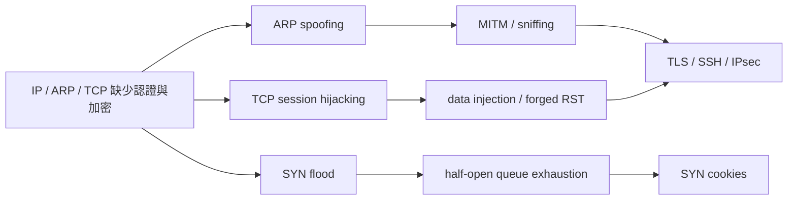

---

## Part 1：TCP/IP 基礎，考試會怎麼考

### 1. TCP/IP Stack 是什麼？ ⭐理解優先

D1 把網路協定堆疊分成四層：

| 層           | 作用    | 你考試要記什麼                      |
| ----------- | ----- | ---------------------------- |
| Application | 應用層協定 | HTTP、DNS、SSH、TLS/SSL 都在這附近運作 |
| Transport   | 傳輸層   | TCP / UDP                    |
| Internet    | 網際層   | IP，負責封包在網路中轉送                |
| Link        | 鏈路層   | Ethernet / Wi‑Fi，處理本地網路傳送    |

白話理解：
**TCP/IP stack 不是單一協定，而是一種分層合作的網路通訊架構。**
每一層只處理自己該負責的問題，上層不用直接理解底層細節，這樣設計的好處是模組化、好維護，也比較容易替換某一層的實作。

你可以把它想成「寄包裹的分工流水線」：

* Application 決定你要傳什麼內容
* Transport 決定怎麼可靠或快速地送
* Internet 決定要送到哪個 IP
* Link 負責在本地網路上真的把 frame 送出去

### 資料實際怎麼走？

送資料時，資料會**由上往下封裝（encapsulation）**；收資料時，則會**由下往上解封裝（decapsulation）**。

1. **Application layer**
   應用程式先產生資料，例如瀏覽器建立 HTTP request。
2. **Transport layer**
   傳輸層接手資料；如果使用 TCP，就補上連線、排序、ACK 等可靠性機制；如果使用 UDP，就用較輕量的方式傳送。
3. **Internet layer**
   IP 幫資料加上來源與目的 IP，決定封包如何跨網路轉送到遠端。
4. **Link layer**
   鏈路層把資料包成 frame，透過 Ethernet 或 Wi‑Fi 在區域網路上實際送出。
5. **Receiver**
   接收端收到後，會從 Link 往上拆回 Internet、Transport、Application，最後交給對應的應用程式。

### 分層觀念圖

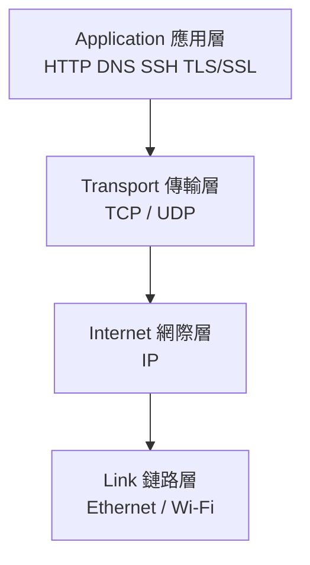

這張圖的重點是：資料在送出前，會從應用層一路往下交給下一層；每一層都會補上自己的控制資訊。

### 封裝 / 解封裝流程圖

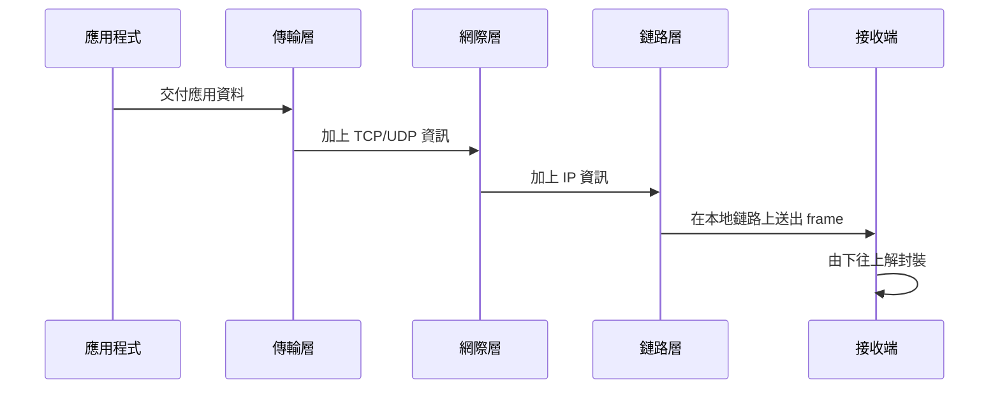

這張圖要背的不是圖形本身，而是流程：
**傳送端往下封裝，接收端往上解封裝。**

這題常見失分點是：
很多人把 TLS 認成「網路底層協定」。其實這份課程脈絡裡，TLS 比較像是架在 socket / transport 之上的安全機制，用來保護應用流量。

---

### 2. IP 為什麼本質上不安全？ 🔥必考

D1 明講：IP 提供的是 **best-effort、unreliable delivery**。也就是說，IP 不保證：

* 封包一定送到
* 不會重複
* 不會亂序
* 不會被竄改
* 不會被偽造來源

這個觀念很重要，因為後面 UDP、TCP、TLS 都是在補 IP 的不足。
IP 本身只是「盡力送」，不是「安全送」。 

**考卷可寫：**
IP protocol is a best-effort and unreliable network-layer protocol. It does not guarantee delivery, ordering, or protection against spoofing and eavesdropping; therefore, additional mechanisms such as TCP reliability and higher-layer cryptographic protection are needed.

---

### 3. IP 位址跟 MAC 位址差在哪？ ⚠️易錯

這是 ARP 題的前置觀念。

* **IP address**：拿來做網路層 routing
* **MAC address**：拿來在本地鏈路層實際送 frame

白話理解：
**IP 決定「資料要送去哪裡」；MAC 決定「在這個區域網路裡，這個 frame 要先交給哪一張網卡」。**

所以同一台主機如果要在區域網路裡把資料送給 gateway，不是只知道 gateway 的 IP 就夠了，還要知道 **那個 IP 對應的 MAC**。
這就是 **ARP** 存在的原因。 

換句話說，網路層知道「下一站是 gateway 的 IP」，不代表鏈路層就能直接把資料送出去；因為 Ethernet / Wi‑Fi 真正送 frame 的時候，看的是 **目的 MAC address**，不是 IP address。

### 這段話到底在說什麼？

當主機要把資料送到外部網路時，通常不會直接送給遠端主機的 MAC，而是會先送給 **default gateway**。這時候主機雖然已經知道 gateway 的 IP，但如果不知道 gateway 的 MAC，就無法在本地區域網路上組出正確的 frame，因此封包還是送不出去。

補充澄清：
這裡的 **gateway**，通常就是這個 LAN 對外的 **router 介面**。同一個 subnet 裡很多主機如果要和外部網路通訊，第一跳通常都是先把封包交給這台 gateway，再由它往外轉送。

而這裡說的 **gateway 的 MAC**，不是你的 MAC，也不是最終遠端主機的 MAC，而是：
**你所在這個區域網路中，default gateway 那個介面自己的 MAC address。**

要特別注意：

* **Destination IP** 仍然是最終遠端主機的 IP
* **Destination MAC** 則是第一跳要交付的對象，也就是 gateway 的 MAC

所以送往外部網路時，可以把它想成：

* IP 在表示「最後要送到誰」
* MAC 在表示「這一跳先交給誰」

另外，router 通常不只一個 MAC。它的每個網路介面都可能有各自的 IP 與 MAC；ARP 找到的，是**你這個 LAN 這一側**的 router 介面 MAC，不是整台 router 共用的一個 MAC。

所以這裡要記的不是「IP 不重要」，而是：

* **IP address** 用來決定邏輯上的下一跳
* **MAC address** 用來完成本地鏈路上的實際交付

### 實際流程怎麼跑？

1. 主機先看目的 IP 是不是和自己在同一個 subnet。
2. 如果不是同一個 subnet，就決定把封包先交給 default gateway。
3. 主機知道 gateway 的 IP，但鏈路層送 frame 前，還需要 gateway 的 MAC。
4. 主機先查自己的 ARP table，看有沒有 `gateway IP -> gateway MAC` 的快取。
5. 如果沒有，主機就送出 **ARP request** 廣播詢問：「誰是這個 IP？」
6. Gateway 回 **ARP reply**，告訴主機自己的 MAC address。
7. 主機把這組 IP-to-MAC 對應記進 ARP table。
8. 最後主機才會把 IP packet 包進 frame，並把目的 MAC 填成 gateway 的 MAC，送到本地網路上。

### Workflow 圖

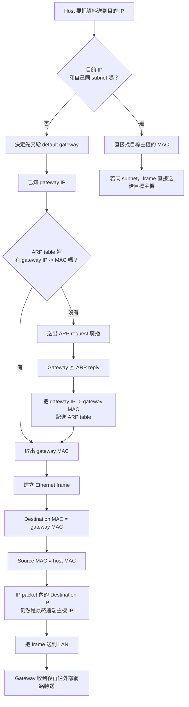

這張圖最重要的重點是：
**送到外部網路時，IP 還是指向最終目標，但第一跳的 MAC 會指向 gateway。**

**一句話總結：**
主機在 LAN 內送資料時，不能只知道下一跳的 IP，還一定要知道該 IP 對應的 MAC；而 ARP 的工作，就是把這個對應關係找出來。

---

### 4. ARP 是什麼？ 📌背誦優先

白話一句話：
**ARP 就是在問：「這個 IP 是哪一張網卡的 MAC？」**

正式定義：
ARP（Address Resolution Protocol）負責把 layer 3 的 IPv4 address 轉成 layer 2 的 Ethernet MAC address；每個 host 會維護一張 IP-to-MAC 對應表。D1 也列出它的訊息型態有 ARP request、ARP reply、ARP announcement。 

### ARP 的三種訊息型態在做什麼？

#### 1. ARP request

白話理解：
**ARP request 是在區域網路裡大聲問：「誰有這個 IP？請把你的 MAC 告訴我。」**

它通常在主機知道某個 IP、但還不知道對應 MAC 時使用。因為主機不知道目標是誰，所以 ARP request 常常是用 **broadcast** 的方式送到整個 LAN，讓所有主機都收到。

你可以把它記成：

* 目的：查 `IP -> MAC`
* 傳送方式：通常是廣播
* 典型句型：`Who has 192.168.1.1? Tell 192.168.1.10`

#### 2. ARP reply

白話理解：
**ARP reply 是擁有該 IP 的主機回答：「這個 IP 是我，我的 MAC 在這裡。」**

當真正擁有該 IP 的主機收到 request 後，就會回傳自己的 MAC，讓發問者可以把這組對應寫進 ARP table。ARP reply 的重點是：發問者拿到答案後，後續就能建立正確的 Ethernet frame。

你可以把它記成：

* 目的：回覆正確的 `IP -> MAC`
* 傳送方式：通常是直接回給發問者
* 典型句型：`192.168.1.1 is at AA:AA:AA:AA:AA:AA`

#### 3. ARP announcement

白話理解：
**ARP announcement 不是在問別人，而是在主動公告：「這個 IP 現在對應到我的 MAC。」**

它常用在主機剛連上網路、IP/MAC 發生變化、或想更新其他主機快取時。某些教材也會把它跟 **gratuitous ARP** 放在一起理解。重點不是「查詢」，而是「主動宣告自己的 IP-to-MAC 對應」。

常見用途有：

* 更新同一個 LAN 內其他主機的 ARP cache
* 宣告某個 IP 現在是由自己使用
* 幫忙偵測 IP 衝突

補充釐清：
**ARP announcement 的確可能讓其他主機看到「新的 IP-to-MAC 對應」；但它能不能被接受，要看你是在看哪一種表。**

這裡其實有兩張表，不要混在一起：

* **Host 端的 ARP cache**：在沒有保護的 LAN 裡，收到 announcement 後，主機可能真的會更新或覆蓋自己快取中的 `IP -> MAC` 對應。
* **交換器用來做驗證的 trusted binding table**：在有防護的網路裡，這張表通常不是被任意一包 announcement 更新，而是來自 **DHCP snooping**、管理員設定的 **static binding**，或 **trusted port** 上的合法設備。

所以重點是：

* **announcement 可以更新一般主機的 ARP cache**
* **announcement 不應該讓任何人任意改掉交換器拿來驗證的 authoritative binding**

合法變更通常會這樣處理：

1. 先由 DHCP 重新發 lease，或由管理員更新 static binding。
2. 交換器的可信綁定資料先更新。
3. 主機再送出 ARP announcement / gratuitous ARP，通知 LAN 上其他主機更新自己的 ARP cache。

所以如果你看到：
原本 `192.168.1.20 -> MAC A`，後來變成 `192.168.1.20 -> MAC B`
這在 **host 的 ARP cache** 裡可能是合法更新；但在有 DAI 保護的環境裡，交換器還是會檢查這個新對應是否和 trusted binding 一致，不一致就會被當成可疑 ARP。

你可以把它記成：

* request = 我在問別人
* reply = 我在回答別人
* announcement = 我主動通知大家

### 一般 ARP 查詢流程

1. Host A 想把資料送給某個 IP，例如 gateway `192.168.1.1`。
2. Host A 發現自己只有目標 IP，沒有對應 MAC。
3. Host A 先查本地 ARP table。
4. 如果沒有快取，就送出 **ARP request** 廣播詢問。
5. 擁有該 IP 的主機，例如 gateway，收到後回傳 **ARP reply**。
6. Host A 收到 reply，把 `192.168.1.1 -> gateway MAC` 記進 ARP table。
7. Host A 之後就能建立正確的 Ethernet frame，把資料送出去。

### ARP request / ARP reply Workflow 圖

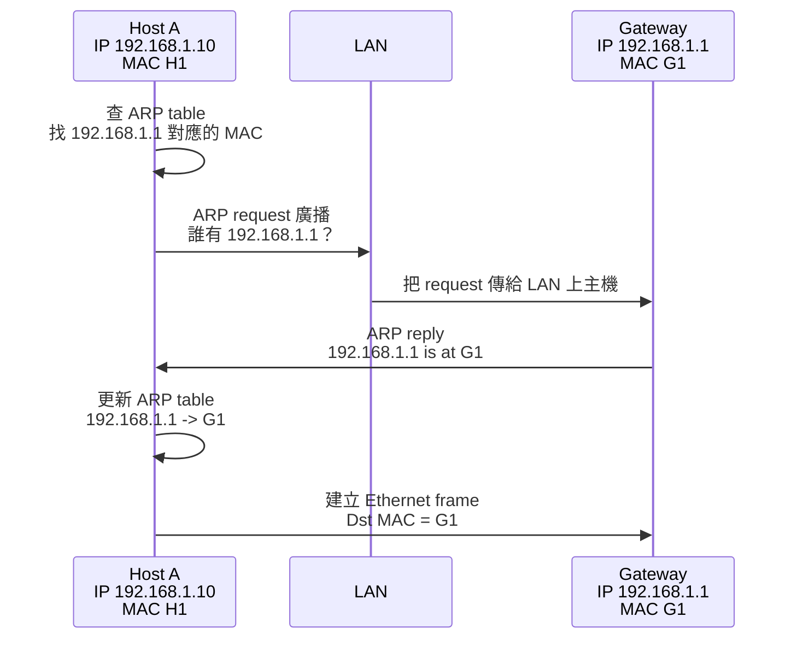

### ARP announcement 流程怎麼看？

ARP announcement 的邏輯不是「我缺答案」，而是「我主動把答案送出去」。

常見情境例如：

1. 主機剛開機或剛取得新的 IP。
2. 主機主動送出 ARP announcement。
3. LAN 上其他主機收到後，會更新或覆蓋自己 ARP cache 裡的對應。
4. 如果有人發現這個 IP 跟自己衝突，就可能觸發衝突檢查或警告。

### ARP announcement Workflow 圖

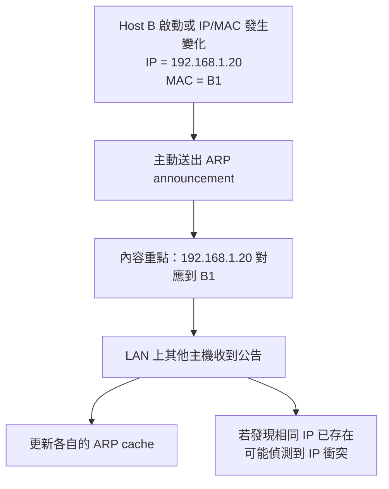

### 這三種訊息怎麼一起背？

* **ARP request**：我不知道 MAC，所以我發問。
* **ARP reply**：我知道答案，所以我回覆。
* **ARP announcement**：我不是被問才回答，而是主動公告自己的對應關係。

### 考試最短整理版

ARP request is broadcast to ask which host owns a given IP address.  
ARP reply returns the corresponding MAC address to the requester.  
ARP announcement is a host's unsolicited advertisement of its own IP-to-MAC mapping, often used to update caches or detect conflicts.

**考卷可寫：**
ARP is used to translate an IPv4 address at the network layer into a MAC address at the data-link layer. Hosts maintain ARP tables that cache IP-to-MAC mappings.

---

## Part 2：UDP vs TCP，這題很愛考比較

### 1. UDP vs TCP 比較表 🔥必考

| 項目    | UDP                  | TCP                                      |
| ----- | -------------------- | ---------------------------------------- |
| 連線    | 無連線                  | 有連線                                      |
| 建立連線  | 不需要                  | 需要三向交握                                   |
| 傳輸可靠性 | 不保證                  | 可靠                                       |
| 順序控制  | 無                    | 有                                        |
| 核心機制  | port + checksum      | sequence number + ACK + flags + checksum |
| 擁塞控制  | 無                    | 有                                        |
| 安全面   | 沒有加密；可 sniff / spoof | 同樣沒有加密；也可 sniff / spoof，還多了狀態攻擊面         |

D1 對 UDP 的描述是：IP + source/destination ports + checksum、no connection established、unreliable transmission；對 TCP 則是 reliable connection-oriented，靠 sequence number / ACK / flags 達成可靠排序。D1 也明講：從攻擊者角度看，UDP 沒有加密、checksum 不是簽章，所以 header / payload 都可 spoof；TCP 也沒有加密，因此同樣能被 sniff / spoof，只是還要滿足 sequence number window。 

### 2. 最容易失分的地方

很多人會背成：

* UDP = 不可靠
* TCP = 可靠

但考試真正要的是：

> **UDP 不可靠，是因為它沒有連線建立、沒有重傳、沒有順序控制。**
> **TCP 可靠，是因為它用 sequence number、ACK、flags 維護連線狀態與位元組流順序。**

---

## Part 3：TCP 三向交握（Three-way Handshake）🔥一定要會畫

白話一句話：
**TCP 要先確認雙方都準備好，而且雙方都能收、也都能送，連線才算真正建立。**

### 流程拆解

**Step 1：Client → Server：SYN**
Client 告訴 Server：「我想建立連線，這是我的初始 sequence number。」

**Step 2：Server → Client：SYN + ACK**
Server 回答：「我收到你的 SYN 了，這是我的初始 sequence number，而且我也同意建立連線。」

**Step 3：Client → Server：ACK**
Client 再確認一次：「我也收到你的 SYN+ACK 了。」
到這一步，連線才真正建立。 

### SYN、SYN+ACK、ACK 到底是什麼？

這三個都是 **TCP header 裡的控制旗標（flags）**，用來表示目前這個封包在連線建立流程中的角色。

* **SYN**：Synchronize
  白話就是：「我想建立連線，這是我的起始 sequence number。」
* **SYN+ACK**：Synchronize + Acknowledgment
  白話就是：「我收到你的 SYN 了，而且我也同意建立連線；這是我的起始 sequence number。」
* **ACK**：Acknowledgment
  白話就是：「我收到你的回應了，確認無誤。」

你可以把它背成：

* `SYN` = 發起連線
* `SYN+ACK` = 收到你的請求，也回覆我這邊準備好了
* `ACK` = 最後確認，連線正式成立

### 這一段的核心在考什麼？

考點不是只背三個縮寫，而是要知道 TCP 為什麼要做三次互動：

1. Client 用 `SYN` 表示自己想建立連線。
2. Server 用 `SYN+ACK` 同時完成「確認收到」與「送出自己資訊」兩件事。
3. Client 再用 `ACK` 告訴 Server：「你的回應我也收到了。」

這樣雙方才真的確認：

* 對方存在
* 對方收得到資料
* 對方也能送資料
* 雙方都知道彼此的初始 sequence number

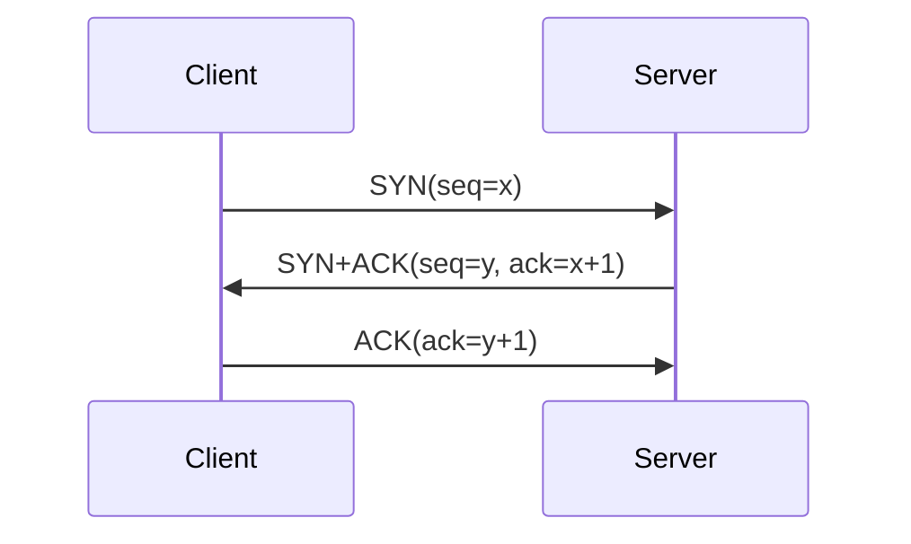

### 失分點提醒

最常錯的是這兩個：

1. **不是送出 SYN 就算建立連線**
   真正完成是在第三次 ACK 後。

2. **第二步不是只有 ACK，而是 SYN+ACK**
   因為 Server 也要把自己的 sequence number 送回去。

### 超短背誦版

`SYN` 是連線請求，`SYN+ACK` 是確認請求並送出自己的連線資訊，`ACK` 是最後確認收到；第三步完成後，TCP 連線才正式建立。

### 可直接寫的考卷版本

TCP uses a three-way handshake to establish a connection. First, the client sends a SYN to request connection establishment. Second, the server replies with SYN+ACK to acknowledge the request and provide its own initial sequence number. Third, the client sends an ACK. After the third step, both sides enter the connected state.

---

## Part 4：ARP Spoofing / ARP Poisoning 🔥🔥很重要

這一題幾乎是 Day 3 的經典題。

### 1. 白話一句話

**ARP spoofing 就是攻擊者騙大家：「某個 IP 對應的 MAC 是我。」**

### 2. 為什麼 ARP 能被騙？（核心）

D1 已經把根因寫得很直白：
**lack of ID validation**。
也就是 ARP 沒有強力驗證機制去證明「這個回覆的人真的擁有那個 IP」。而且還接受：

* fake ARP responses
* unsolicited ARP responses

所以只要主機相信這種 ARP reply，ARP table 就會被污染。 

### 3. 攻擊流程（一定要會拆 step）

假設：

* Victim 想跟 Gateway 通訊
* Attacker 在同一個 LAN 裡

**Step 1：Attacker 發送偽造 ARP reply**
對 Victim 說：「Gateway 的 IP 對應的 MAC 是我。」
對 Gateway 也可以說：「Victim 的 IP 對應的 MAC 是我。」

**Step 2：Victim / Gateway 更新 ARP cache**
因為 ARP 缺乏身分驗證，主機把錯誤對應寫進 ARP table。

**Step 3：原本該送給 Gateway 的 frame 被送到 Attacker 的 MAC**
因為主機現在相信「那個 IP 的 MAC 就是 Attacker」。

**Step 4：Attacker 進行 sniff / modify / forward**
如果只偷看，就是 sniffing。
如果一邊收一邊轉送，就形成 MITM。
D1 的範例頁也直接示範，在 switched network 裡，Victim 的登入密碼仍可被 sniff 到。

### Workflow 圖

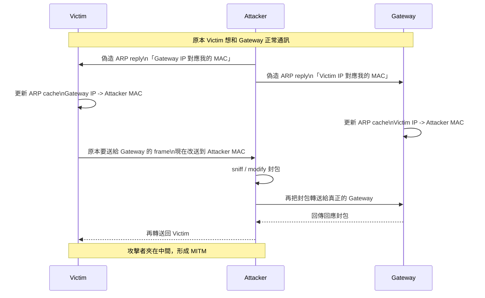

這張圖要抓住的主線是：
**攻擊者不是直接「搶走」封包，而是先騙 Victim / Gateway 改寫 ARP cache，讓雙方之後都自願把 frame 送到攻擊者那裡。**

### 4. 為什麼 switch 也擋不住？🔥超容易考

這是最常失分的點。

很多人以為：

> 「交換器不是只把封包送到正確埠嗎？那怎麼還會被攔？」

答案是：

> **因為 switch 只負責根據 MAC 轉送，不負責驗證『哪個 IP 應該對哪個 MAC』。**

ARP spoofing 成功之後，Victim 自己就相信 gateway IP 對應的是 attacker MAC。
於是 Victim 發出去的 frame，**目的 MAC 本來就寫成 attacker MAC**。
對 switch 來說，這是「合法轉送」，它當然會把流量送到攻擊者那個埠。

所以：

* switch 解決的是「不要像 hub 一樣全部廣播」
* 但 **解決不了主機自己的 ARP table 被騙**

這就是為什麼 D1 第 8 頁特別寫 **Switched Networking** 但仍然會有 **ARP Poisoning**。 

### 5. 防禦

講義點到的防禦是：

* DHCP snooping
* ArpON 

考試如果問「概念性防禦」，你可以寫：

* 驗證 IP-MAC 綁定關係
* 限制不可信主機偽造 ARP 回覆
* 使用能偵測或保護 ARP table 的機制

補充理解：
像 **DHCP snooping + Dynamic ARP Inspection (DAI)** 這類防護，核心不是「完全不准 IP/MAC 改變」，而是：
**只有和可信綁定一致的變更才接受，不一致的 ARP reply / announcement 就丟掉。**

### 6. 可直接寫的申論模板

ARP spoofing is possible because ARP lacks strong identity validation. An attacker can send forged or unsolicited ARP replies claiming that the gateway IP corresponds to the attacker’s MAC address. Once the victim updates its ARP cache, frames intended for the gateway are sent to the attacker instead. The attacker can then sniff, modify, or forward the packets, thereby achieving a man-in-the-middle position. A switch cannot fully prevent this attack because it forwards frames according to MAC addresses and does not verify whether the IP-to-MAC mapping is authentic.

---

## Part 5：TCP Session Hijacking 🔥🔥必懂

### 1. 白話一句話

**TCP session hijacking 就是攻擊者偽裝成連線中的一方，往既有 TCP 連線裡塞資料或重置連線。**

### 2. TCP 連線的「狀態」到底是什麼？

D1 說得很清楚，每個 TCP connection 都有 associated state，包括：

* client IP
* client port
* server IP
* server port
* client flow 的 sequence number
* server flow 的 sequence number 

也就是說，TCP 不是只看「來源 IP」而已。
它看的是整個 4-tuple 加上目前 sequence/ACK 狀態。

### 3. 為什麼可能被 hijack？

講義列的原因是：

* port numbers are standard
* sequence numbers often chosen in predictable way
* attacker may estimate current values
* if seq number falls within the acceptable window, forged packet may be accepted

這裡最容易失分的是：

> **不是隨便偽造一個 TCP packet 就能插進去。**
> 你必須猜中或估中「目前可接受的 sequence window」。

### 4. 攻擊流程

**Step 1：Attacker 觀察或推測既有連線狀態**
知道雙方 IP、port，並估計 sequence number。

**Step 2：Attacker 構造 forged TCP packet**
偽裝成 client 或 server。

**Step 3：Packet 的 sequence number 落在對方可接受 window 內**
這是關鍵。

**Step 4：Receiver 接受 forged packet**
於是 Attacker 就能：

* inject data
* send forged RST
* 造成 DoS
* 在某些情況下協助 MITM/弱加密協定攻擊 

### 5. 風險

D1 列的風險很完整：

* 對未加密流量注入資料（email、DNS zone transfer、FTP、HTTP）
* 隱藏攻擊來源
* 配合 MITM
* 送 forged RST 關閉連線造成 DoS
* 對 long-lived connections 特別有效，例如 BGP 

### 6. 容易混淆的點

**Session hijacking ≠ 一定要先 ARP spoofing**
ARP spoofing 是讓你更容易站到中間觀察流量。
但 TCP hijacking 的核心是 **偽造 TCP 狀態與 sequence**。
兩者常一起出現，但不是同一件事。

**RST attack 也是 hijacking / connection disruption 的一種表現**
因為攻擊者不是一定要注入應用資料，他也可以直接把連線打斷。

### 7. 防禦

從講義脈絡可整理成三個方向：

* sequence numbers 要高度不可預測
* 不要讓連線內容裸奔（用 TLS / SSH）
* 降低攻擊者觀察與注入能力

### 8. 可直接寫的考卷版本

TCP session hijacking targets an existing TCP connection. The attacker needs to know or estimate the connection state, including the IP addresses, port numbers, and acceptable sequence numbers. If the attacker can forge packets whose sequence numbers fall within the receiver’s valid window, the forged packets may be accepted. The attacker can then inject data into the session or send forged reset packets to terminate the connection. The attack is especially effective against long-lived and unencrypted TCP sessions.

---

## Part 6：SYN Flood 🔥🔥🔥超高機率

### 1. 白話一句話

**SYN flood 不是偷資料，而是把 server 的半開連線資源塞爆。**

### 2. 為什麼 TCP 會有這個弱點？

因為 TCP 是 connection-oriented。
也就是說，Server 在收到 SYN 後，還沒完成三向交握之前，就要先替這個「可能要建立的連線」保存一些狀態。

這個暫存區就是你考試很常要寫的：

> **half-open connection queue / SYN queue**

### 3. 攻擊流程（一定要拆）

**Step 1：Attacker 大量送出 SYN**
而且來源位址常常是 spoofed source addresses。

**Step 2：Victim server 為每個 SYN 配置資源**
並回 SYN+ACK，等待第三次 ACK。

**Step 3：因為來源位址是假的，最後 ACK 通常不會回來**
所以這些請求會卡在 half-open 狀態，直到 timeout。

**Step 4：SYN queue 被塞滿**
結果新的合法連線請求進不來，被 reject。 

### Workflow 圖

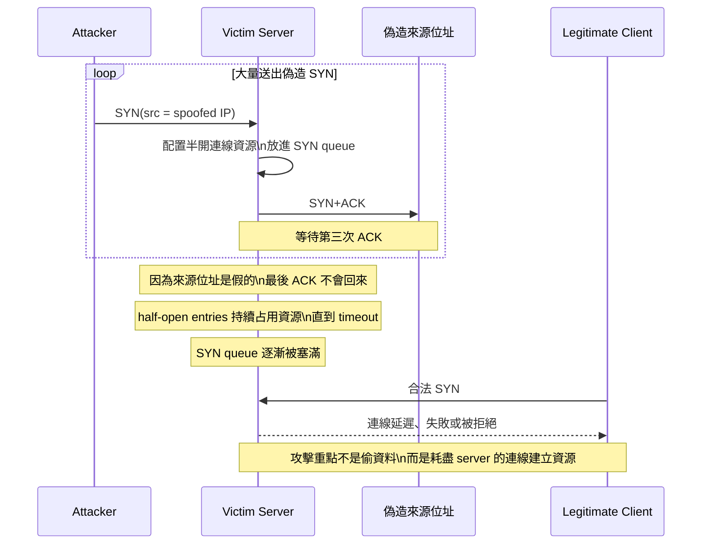

這張圖的主線要背成：
**攻擊者只要大量丟 SYN，server 就會先替每個請求保留半開連線狀態；因為等不到最後 ACK，這些 entry 會卡到 timeout，最後把 SYN queue 塞滿。**

### 4. 這題要寫的關鍵詞

* spoofed source addresses
* allocates resources
* half-open connection
* timeout
* resource exhaustion
* legitimate requests rejected

這些字幾乎就是得分點。

### 5. 為什麼叫「asymmetric allocation of resources」？ ⚠️易錯

因為對攻擊者來說：

* 只要一直丟 SYN 就好，成本很低

但對 server 來說：

* 每個 SYN 都要保留狀態、等 timeout、佔 queue

所以資源花費是不對稱的。
這就是 DoS 題目常愛考的「攻守成本不對稱」。

### 6. 老師可能喜歡補問的細節

D1 還提到一個歷史數字：
1996 年很多實作的 half-open queue 只有 **8 entries**，expire time 可到 **3 分鐘**。
這種系統更容易被簡單的 SYN flood 打垮。 

### 7. 可直接寫的考卷版本

In a SYN flood attack, the attacker sends a large number of SYN packets, often with spoofed source addresses, to a server. For each SYN, the server allocates state for a half-open connection and waits for the final ACK. Because the spoofed sources do not complete the handshake, these entries remain until timeout. As a result, the SYN queue becomes exhausted and legitimate connection requests are rejected.

---

## Part 7：SYN Cookies 🔥必考搭配題

### 1. 一句話先記住

**SYN cookie 不是 HTTP cookie。它是把原本要存在 server 端的半連線資訊，塞進 TCP sequence number 裡。**

這句一定要記，超多人會混。

### 2. 沒有 SYN cookie 時，server 做什麼？

收到 SYN 後，server 會先在 SYN queue 建立一筆紀錄，保存：

* MSS
* 其他 TCP options
* 半開連線狀態 

### 3. 有 SYN cookie 時，流程怎麼變？

**Step 1：Client 送 SYN**

**Step 2：Server 不真的建立 SYN queue entry**
改成把原本要記錄的資訊 **encode 到 SYN+ACK 的 initial sequence number** 裡，然後把本地狀態丟掉。

**Step 3：Client 回 ACK（seq+1）**

**Step 4：Server 從 ACK 還原先前資訊**
例如 deduce MSS，必要時才正式建立連線。 

### 補充理解：為什麼叫「先不要真的把完整 half-open state 塞進 queue」？

白話來說，傳統 TCP server 在收到 SYN 的當下，就會先想：

>「這個人可能真的要連進來，我先替他留一個位置。」

這個「先留位置」的動作，就是把 half-open connection state 放進 SYN queue。問題是：  
如果來的 SYN 有很多其實是假的，server 還是會先替它們保留位置，結果 queue 很快就被占滿。

SYN cookie 的核心修法就是：

> **收到 SYN 時，先不要急著替這條連線保留完整狀態；先把必要資訊編進 SYN+ACK 的 sequence number，等最後 ACK 真的回來，再正式建立連線。**

你可以把它想成：

* **沒有 SYN cookie**：有人來按門鈴，server 立刻幫他保留座位，等很久看他會不會真的進門。
* **有 SYN cookie**：有人來按門鈴，server 先發一張「驗證票」給他；只有真的拿著票回來的人，server 才正式留座位。

所以被延後的不是「整個 TCP 連線」，而是：

* 不先建立完整的 half-open queue entry
* 不先保存完整 per-connection state
* 等 ACK 回來並驗證通過，才建立真正的連線狀態

### 核心差異整理

* **傳統作法**：收到 SYN 就先 allocate state，代價早付
* **SYN cookie 作法**：收到 SYN 先回可驗證的 cookie，等 ACK 回來才 allocate state，代價延後付

### Workflow 圖：傳統 TCP vs SYN Cookies

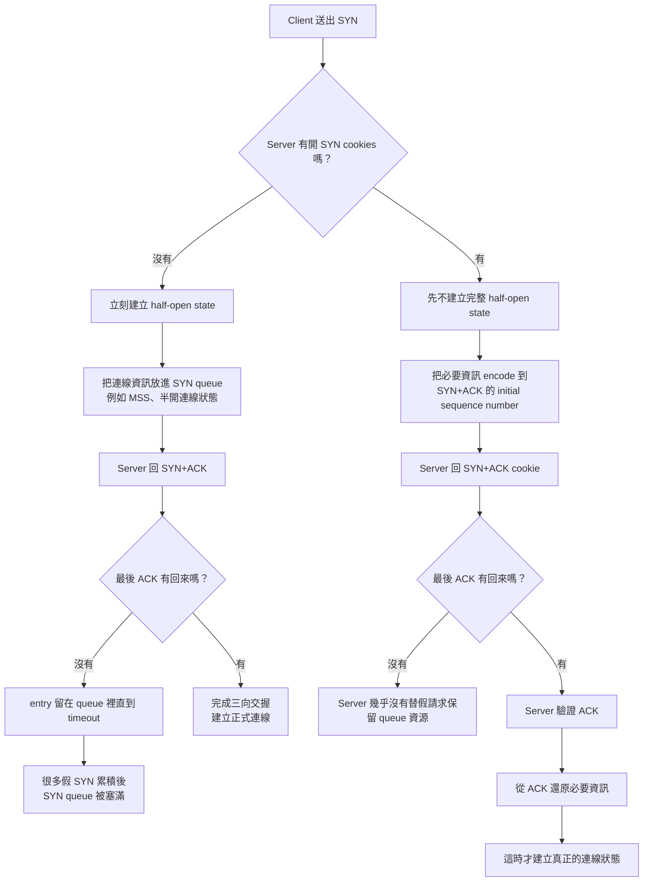

### 4. 它為什麼有效？

因為 SYN flood 的痛點就是：

> Server 太早替「還沒真正完成的連線」保留資源。

SYN cookie 的思路則是：

> **在 final ACK 回來前，我先不替你保留真正的 per-connection state。**

所以 queue 不容易被塞爆。

**一句話總結：**
SYN cookie 的本質不是把攻擊流量消失，而是把 server「太早分配資源」這個弱點改掉；沒有最後 ACK，就不值得替你真正佔住 half-open queue。

### 5. 優點與缺點

D1 明列：

**優點**

* Does not break TCP protocol specification

**缺點**

* sequence number 只有 32 bits
* 無法塞下所有 TCP options
* 若最後 ACK 遺失，connection may freeze
* 因此通常在 under attack 時才需要開啟 

### 6. 申論模板

SYN cookies mitigate SYN flood attacks by avoiding state allocation for half-open connections. Instead of storing connection information in the SYN queue after receiving a SYN, the server encodes essential information such as MSS into the initial sequence number of the SYN+ACK packet. The client later responds with ACK, and the server reconstructs the needed information from that acknowledgment. This reduces resource exhaustion on the server, although the approach has limitations because the 32-bit sequence number cannot encode all TCP options.

---

## Part 8：為什麼需要 TLS / SSL？ 🔥核心防禦題

### 1. 最核心的一句話

**因為 TCP/UDP 只負責傳，不負責把內容安全地傳。**

D1 已經說了：

* UDP 沒有加密，可 sniff / spoof
* TCP 也沒有加密，可 sniff / spoof，還有 session state 可被濫用 

所以如果你把帳號密碼、cookie、應用資料直接丟在裸 TCP 上，
ARP spoofing + sniffing、session injection、MITM 就都會變得很危險。

### 2. 講義怎麼定義 SSL/TLS？

D2 說：

* SSL/TLS 主要用來保護 Web traffic
* client/server 架構
* 提供 socket interface
* 保護對象是 **eavesdroppers** 與 **MITM**
* server 具有 X.509 certificate，client 也可能有 certificate 

所以你考試可以直接寫：

> TLS 的目的，是在應用資料開始傳送前，先協商安全參數、完成金鑰交換與身分認證，讓後續 session 受到加密與完整性保護。

---

## Part 9：TLS / SSL Handshake 🔥🔥🔥經典大題

這題你不要背成一坨，要拆成四階段：

1. **Negotiate parameters**
2. **Key exchange**
3. **Authentication**
4. **Session**

這就是講義第 11 頁直接列出的 sequence。 

### 流程（用課堂版本寫）

先注意：**TLS handshake 之前，先有 TCP three-way handshake。**
講義第 11 頁的圖就把 TCP handshake 和 TLS 1.2 handshake 放在一起。 

#### Step 1：ClientHello

Client 送出：

* 支援的 protocol versions
* cipher suites
* 隨機數
* 其他協商參數

#### Step 2：ServerHello

Server 回覆：

* 選中的版本
* 選中的 cipher suite
* 伺服器端隨機數

#### Step 3：Server Certificate

Server 提供 X.509 certificate，讓 client 能驗證：

* 這把 public key 是不是屬於這台 server
* 這份綁定有沒有被受信任 CA 簽署

講義第 6–8 頁還分別展示了 server certificate、CA certificates、client certificate。 

#### Step 4：Key Exchange

講義列出兩種：

* Diffie-Hellman key exchange
* RSA-based key exchange（client 把 secret 用 server public key 加密） 

#### Step 5：Authentication

如果是 DH 路線，server 會對 DH parameters 做簽章。
講義第 16 頁直接寫：**Sign Diffie-Hellman parameters**，而且這樣可以達成 **perfect forward secrecy**。 

#### Step 6：ChangeCipherSpec / Finished

講義第 17 頁說：使用 **ChangeCipherSpec** 開始加密資料。
之後雙方進入受保護 session，再傳 application data。 

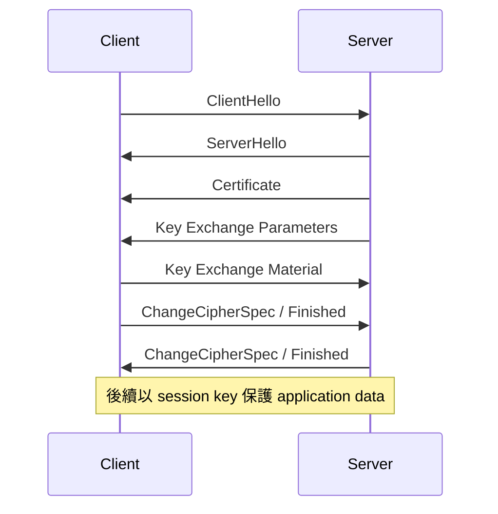

---

## Part 10：Certificate 到底在做什麼？ ⚠️易錯

很多人以為 certificate 是「拿來加密資料的」。
更精確地說：

> **certificate 的核心功能是「把 server 身分和 public key 綁在一起，並讓 client 能驗證這個綁定」。**

也就是：

* public key 本身不是身分
* certificate 才是「這把 key 屬於誰」的證明文件
* browser / OS 之所以能相信它，是因為內建 CA trust store

所以：

* **server certificate**：證明伺服器身分
* **CA certificate**：證明誰值得被信任去替別人簽證書
* **client certificate**：某些雙向認證場景下，client 也能向 server 證明自己 

---

## Part 11：Rollback Attack 🔥可能考觀念題

D2 第 12 頁明講：

* negotiation 階段要選 cipher suites、key exchange algorithms、protocol versions
* rollback attack 就是 **MITM chooses least secure parameters** 

### 白話理解

本來 client 和 server 都支援比較安全的版本。
但中間人如果能干擾協商，就會想辦法讓雙方退回較弱版本或較弱 cipher。

### 可直接寫

A rollback attack occurs during the negotiation phase of SSL/TLS. A man-in-the-middle attempts to force the client and server to use weaker protocol versions or cipher suites than they actually support, thereby reducing the security of the connection.

---

## Part 12：Forward Secrecy（Perfect Forward Secrecy）🔥必考

這題是 Day 3 的高分分水嶺。

### 1. 先講傳統 RSA-based HTTPS 怎麼做

講義第 19 頁描述：

* client 選一個 random session key
* 用 server 的 RSA public key 加密
* 把 encrypted session key 傳給 server
* server 用自己的 RSA private key 解開，得到 session key 

### 2. 問題在哪？

如果攻擊者今天先做不到破解，沒關係。
他可以先：

**Step 1：把你今天所有加密流量全部錄下來**

之後如果哪天：

**Step 2：他拿到或破解了 server 的 RSA private key**

那麼他就能：

**Step 3：回頭解開當年的 encrypted session key**

最後：

**Step 4：把你過去錄下來的 session 全部解密**

這就是為什麼「有加密」還不夠，還要問：

> **未來長期金鑰外洩時，過去流量會不會一起爆掉？**

### 3. Forward Secrecy 的定義

講義第 20 頁給的核心意思是：

> **如果未來某個 long-term key 被攻破，過去的 session key 仍不應因此被還原。** 

### 4. 怎麼做到？

講義答案很直接：

* 用 Diffie-Hellman 建立 session key
* session key **is not transmitted on the network**
* server private key 只拿來 **sign / authenticate** key exchange，避免 MITM
  而不是直接拿來解 session key 

### 5. 最容易失分的理解點

很多人會問：

> 「可是 server 還是有 private key 啊，為什麼之後被偷了，過去 session 不會一起爆？」

因為在 forward secrecy 設計裡：

* server 的 long-term private key **不是拿來直接解出 past session key**
* past session key 是雙方當時用 DH「導出來」的
* 它不是一個被公鑰加密後直接丟到網路上的固定祕密

所以，未來 server private key 外洩，不會讓攻擊者回頭把舊 session 全解開。

### 6. 可直接寫的高分版本

Forward secrecy means that compromise of a long-term private key in the future should not compromise previously established session keys. In traditional RSA-based key transport, an attacker who records encrypted traffic and later obtains the server’s RSA private key may recover past session keys and decrypt old sessions. To achieve forward secrecy, Diffie-Hellman is used so that the session key is derived rather than directly transmitted. The server’s long-term private key is used only to authenticate the key exchange, not to decrypt past session keys.

---

## Part 13：SSL / TLS 的其他考點

### 1. Reaction attack / padding error side channel

講義提到，如果 server 對「padding 錯誤」回不同 error，攻擊者可從錯誤反應推理 key 的資訊。修補方式包括：

* better padding
* 更好的作法：**不要明確送錯誤，假裝 key exchange 成功，用 bogus session key 繼續** 

這題通常比較偏觀念：
**錯誤訊息本身也可能成為 side channel。**

### 2. SSL pitfalls

講義也提醒：

* hard to set up
* certificates expensive
* resource-intensive
* users may ignore the lock icon / URL
* improper use 

所以「有 TLS」不代表「使用者真的安全」，因為人可能忽略警告、配置可能錯、CA 也可能出問題。

---

## Part 14：SSH vs TLS vs IPsec 🔥比較題

| 協定      | 主要層次/位置      | 典型用途                   | 身分驗證方式                                | PFS | 你考試要記的重點                                       |
| ------- | ------------ | ---------------------- | ------------------------------------- | --- | ---------------------------------------------- |
| TLS/SSL | 應用/Socket 上方 | HTTPS、Web 流量保護         | X.509 certificates / CA chain         | 可有  | 抵抗 eavesdropping 與 MITM                        |
| SSH     | 安全遠端登入通道     | Remote login、tunneling | 記住 host public key（TOFU）＋多種 user auth | 有   | 沒有 CA 憑證那套，但會記住 host key                       |
| IPsec   | IP layer     | Network-level 保護、VPN   | SA / key management / 認證機制            | 視設計 | AH/ESP、transport/tunnel；實務大成功是 VPN tunnel mode |

根據 D2：

* SSH 與 SSL 類似，但 **no certificates**，而是 **remember public key associated with host**；而且 SSH 也有 perfect forward secrecy 與 port forwarding。
* IPsec 有 **AH** 與 **ESP**，以及 **transport mode** 和 **tunnel mode**；一般部署有限，但 VPN 是它最成功的應用。

### 最容易混淆的地方

**TLS vs SSH**

* TLS：通常依賴 CA / certificate ecosystem
* SSH：常見是 TOFU，第一次見到 host key 就記住，以後若變了才警告

**AH vs ESP**

* AH：偏 authentication
* ESP：encapsulate + encrypt + authenticate

**Transport vs Tunnel**

* Transport：保護原始 IP packet 的 payload/相關部分，偏 end-to-end
* Tunnel：整個原始 datagram 被包起來，偏 gateway-to-gateway / VPN 

---

## Part 15：攻擊比較表（這張很適合考前看）

| 攻擊                    | 攻擊層次          | 利用的弱點                  | 想達成什麼     | 典型結果                              | 防禦方向                      |
| --------------------- | ------------- | ---------------------- | --------- | --------------------------------- | ------------------------- |
| ARP spoofing          | Link / LAN 邊界 | ARP 無身分驗證              | 攔流量、站中間   | sniff / MITM / redirect           | DHCP snooping、ARP 保護      |
| TCP session hijacking | Transport     | TCP state 可被推測、seq 可預測 | 注入資料或重置連線 | data injection / forged RST / DoS | unpredictable seq、TLS/SSH |
| SYN flood             | Transport     | server 提早分配半開連線資源      | 耗盡資源      | 合法連線被拒                            | SYN cookies               |
| Sniffing              | 多層            | 無加密                    | 偷看資料      | 密碼/內容外洩                           | TLS / SSH / IPsec         |

---

## Part 16：高機率考題 + 可直接寫的擬答

### Q1. 為什麼 IP 被稱為 best-effort protocol？

**擬答：**
IP provides best-effort and unreliable delivery. It does not guarantee successful delivery, correct ordering, absence of duplication, or protection against spoofing and eavesdropping. Therefore, higher-layer mechanisms are needed to provide reliability and security. 

### Q2. 比較 UDP 與 TCP。

**擬答：**
UDP is connectionless and does not provide reliable delivery or ordering. TCP is connection-oriented and uses sequence numbers, acknowledgments, and flags to provide reliable and ordered delivery. However, neither UDP nor TCP inherently provides encryption, so both can be sniffed or spoofed. 

### Q3. 什麼是 ARP？為什麼 ARP spoofing 能成立？

**擬答：**
ARP translates IPv4 addresses into MAC addresses on a local network. ARP spoofing is possible because ARP lacks strong identity validation, so hosts may accept forged or unsolicited ARP replies and update their ARP caches incorrectly.

### Q4. 為什麼 switch 不能阻止 ARP spoofing？

**擬答：**
A switch forwards frames according to MAC addresses, but it does not verify whether the IP-to-MAC mapping is authentic. After ARP poisoning, the victim itself sends frames to the attacker’s MAC, so the switch simply performs normal forwarding. 

### Q5. 說明 TCP three-way handshake。

**擬答：**
First, the client sends SYN. Second, the server replies with SYN+ACK. Third, the client sends ACK. After the third message, the connection is established and both sides enter the connected state. 

### Q6. 什麼是 TCP session hijacking？

**擬答：**
TCP session hijacking is an attack on an existing TCP connection. The attacker forges packets that match the connection state, including IP addresses, port numbers, and acceptable sequence numbers. If the forged packet falls within the valid sequence window, it may be accepted, allowing data injection or connection reset. 

### Q7. 為什麼 TCP sequence number 很重要？

**擬答：**
Sequence numbers are essential for maintaining the correct order and integrity of a TCP byte stream. From a security perspective, they must be unpredictable; otherwise, an attacker may estimate current values and inject forged packets into an active connection. 

### Q8. 說明 SYN flood 的原理。

**擬答：**
In a SYN flood, the attacker sends many SYN packets, often with spoofed source addresses. The server allocates state for each half-open connection and waits for the final ACK. Since those ACKs do not arrive, the half-open queue fills up and legitimate requests are rejected. 

### Q9. SYN cookies 如何緩解 SYN flood？

**擬答：**
SYN cookies avoid storing per-connection state in the SYN queue before the handshake is completed. The server encodes essential information into the sequence number of the SYN+ACK packet and reconstructs it only after receiving the client’s ACK. This reduces server-side resource exhaustion.

### Q10. TLS 的核心目的是什麼？

**擬答：**
TLS is designed to protect client-server communication, especially web traffic, against eavesdropping and man-in-the-middle attacks. It does so by negotiating security parameters, establishing keys, authenticating the server using certificates, and then encrypting the session.

### Q11. 什麼是 forward secrecy？為什麼重要？

**擬答：**
Forward secrecy means that compromise of a long-term private key in the future should not compromise past session keys. It is important because an attacker may record encrypted traffic today and try to decrypt it later after obtaining the server’s private key. Diffie-Hellman-based key exchange prevents this by deriving session keys rather than directly transmitting them. 

### Q12. 比較 TLS、SSH 與 IPsec。

**擬答：**
TLS mainly secures web/application traffic and usually relies on X.509 certificates. SSH is designed for secure remote login and typically remembers the host’s public key rather than relying on the web PKI model. IPsec works at the IP layer and provides AH/ESP with transport or tunnel modes; in practice, its most successful deployment is VPN tunnel mode.

---

## Part 17：考前最後總整理

### ✅ 必背

* TCP/IP stack：Application / Transport / Internet / Link
* ARP：IP → MAC
* UDP：connectionless、unreliable
* TCP：reliable、sequence number / ACK / flags
* TCP handshake：SYN → SYN+ACK → ACK
* ARP spoofing 根因：lack of ID validation
* SYN flood：half-open queue resource exhaustion
* SYN cookies：encode state into SYN+ACK sequence number
* TLS sequence：negotiation → key exchange → authentication → session
* Forward secrecy：未來 long-term key 外洩，不應解開過去 session

### 🧠 必懂

* 為什麼 switch 擋不住 ARP spoofing
* 為什麼 TCP hijack 一定會扯到 sequence number
* 為什麼 SYN flood 是「不對稱資源消耗」
* 為什麼 forward secrecy 不只是「有加密」而已
* SSH 為什麼不是靠 web PKI 那套信任模式

### ⚠️ 最容易錯

1. 把 SYN flood 和 session hijacking 混在一起
2. 以為 switch 天生能防 ARP poisoning
3. 以為 TCP 有可靠性就等於有安全性
4. 以為 certificate 是拿來「直接加密資料」
5. 以為 forward secrecy = 金鑰更長
6. 把 SYN cookie 跟瀏覽器 cookie 混為一談

### 🎯 我認為最可能考的 TOP 10

1. UDP vs TCP 比較
2. TCP three-way handshake
3. ARP 的功能
4. ARP spoofing 為什麼可能
5. 為什麼 switched network 還是會中 ARP spoofing
6. TCP session hijacking 與 sequence number
7. SYN flood 原理
8. SYN cookies 機制與限制
9. TLS handshake 流程
10. Forward secrecy 的意義

你先把這份讀熟，Day 3 最容易掉分的坑就會少很多。
