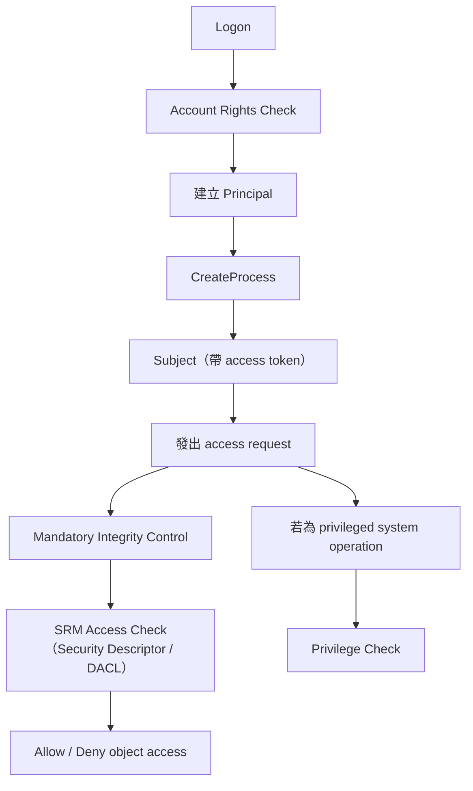
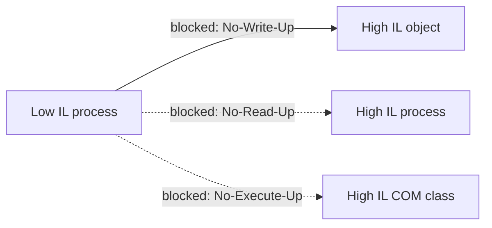

我直接幫你跑 Day 4。這版不是投影片摘要，而是「考試家教版」：我會把最容易失分、最容易混、最像申論題的地方講最細。

# Day 4：完整整合型教學講義（考試導向）

## Part 0：Day 4 的整體目標

這門課的系統層防禦主題，順序就是 Linux Security Basics、SetUID、Access Control Models、Bell-LaPadula、SELinux、Windows Security。也就是說，Windows Access Control 不是孤立新章節，而是前面整串「權限模型／強制控制／特權程式」的整合收尾。所以 Day 4 最重要的工作，不是再背一次名詞，而是把「Linux 傳統權限 → SetUID / capability → DAC/MAC → BLP → SELinux → Windows」串成一張腦內地圖。 

你現在最容易失分的點有 6 個：

1. 把 **user / principal / subject** 混成同一件事。
2. 把 **access token / security descriptor / DACL / SACL** 混成同一層。
3. 以為 Windows 只看 ACL，不知道 **MIC 還會先擋一次**。
4. 以為 **admin = 一定高權限執行中**，忽略 UAC 的 filtered token。
5. 把 **Bell-LaPadula** 誤寫成完整 OS 機制，而不是抽象保密模型。
6. 把 **Linux capability**、**access-control model 裡的 capability list**、**Windows privilege** 混成同名同物。

---

## Part 1：Windows Access Control（超詳細）

### A. 這個主題到底在講什麼

白話一句話：

> Windows Access Control 就是在回答：**誰**（principal 的身分）透過哪個**執行實體**（subject）想對哪個**資源**（object）做什麼事，而系統要根據 **token、DACL、privilege、MIC** 決定放不放行。 

你可以先把它記成三層：

* **身分層**：principal、SID、group SID
* **執行層**：subject、access token、privileges
* **資源層**：object、security descriptor、DACL / SACL
* **額外強制層**：MIC、integrity level、UAC、UIPI、session isolation

最常見考法不是背定義，而是問：

* principal / subject / object 差在哪？
* token 跟 security descriptor 差在哪？
* DACL 跟 MIC 先後順序與角色差在哪？
* UAC 到底是不是 security boundary？
* Windows 跟 Linux / SELinux 怎麼對照？

---

### B. 最重要的核心架構

Windows 講義其實已經把授權流程畫出來了。你考試最好寫成這個流程：



而且投影片還特別寫到，登入後第一個 subject 是 `Userinit.exe`。這種細節不是必背，但如果老師愛 Windows internals 風格，這句寫上去會很加分。 

---

### 1. Principal【背誦優先】【幾乎必考】

**一句話理解**
Principal 是「被系統拿來做授權判斷的身分單位」，不一定等於現實世界的一個人。

**正式定義**
Windows slides 把 principal 列成：**user、machine、service、group、domain**；每個 principal 以一組 **SIDs** 辨識。 

**深入解釋**
這裡最容易錯的是把 principal 寫成「登入中的使用者本人」。不夠準。
因為在存取控制裡，系統真正判斷的不是「現實世界的人」，而是「這個被授權的身分」。
這個想法其實和 Access Control Models 講義中的 **user → principal → subject** 是同一脈絡：user 是現實世界的人，principal 是授權單位，subject 是替 principal 執行的程式。  

**和 Linux 對照**
Linux 初學者常直接把「user account / UID」當授權主體；Windows 的 principal 概念更明顯地把 user、group、service、domain 都納入授權身分。

**老師怎麼問**
「What is a principal in Windows authorization model?」

**你怎麼答**
「A principal is the unit of authorization, such as a user, service, group, or domain. In Windows, principals are identified by one or more SIDs.」

---

### 2. Subject【理解優先】【易混淆】【幾乎必考】

**一句話理解**
Subject 是「真正跑起來替 principal 做事的東西」。

**正式定義**
Windows slides 定義 subject 是 **process、thread、or COM object**，代表 user 或 service 執行。每個 subject 都會關聯到 **access token**。 

**深入解釋**
這裡你一定要分清楚：

* principal 是「身分」
* subject 是「拿著這個身分去做事的執行個體」

同一個 principal 可以對應很多 subject。
例如同一個使用者同時開 Chrome、Word、PowerShell，這些 process 都是 subject。

**再進一步：thread impersonation 是超愛考陷阱**
投影片明說：process 有 token，但 **thread 也可能用不同 token**，這通常發生在 server 端程式 impersonate client 的情況。也就是說，**thread 不一定完全沿用 process 的身分內容**。 

**和 Linux / SetUID 對照**
Linux 你常把「process 的 EUID / capability」當下權限視為 subject 的安全上下文；Windows 對應就是 access token。

**老師怎麼問**
「Why is subject not the same as principal?」

**你怎麼答**
「A principal is an identity for authorization, while a subject is a running entity such as a process or thread acting on behalf of that identity. Authorization decisions are applied to the subject through its access token.」

---

### 3. SID 與 Access Token【幾乎必考】【易混淆】

#### SID【背誦優先】

**一句話理解**
SID 是 Windows 裡的身分識別碼。

**正式說法**
Principal 由一組 security identifiers（SIDs）識別。 

**你要會寫的重點**
不要只寫「SID 就是使用者 ID」。
更精確是：**SID 可代表 user，也可代表 group，甚至包含 integrity level 的特殊 SID。**

---

#### Access Token【幾乎必考】【理解優先】

**一句話理解**
Access token 是 subject 隨身帶著的「身分證 + 群組清單 + 特權清單 + 完整性標籤」。

**正式定義**
Windows slides 說 process 有 access token，用來描述其 security context，內容包含 user identity、privileges，以及建立新 object 時預設 ACL 所需資訊。  

**Access token 內你至少要背這些**
從圖上看，token 至少會帶：

* User SID
* Group SIDs
* Privileges
* Owner SID
* Primary Group SID
* Default ACL
* Integrity level 對應的 special SID（MIC 用）  

**深入解釋**
考試很容易問：

> token 跟 security descriptor 差在哪？

你一定要答出：

* **token 是 subject 的**
* **security descriptor 是 object 的**

也就是說：

* token 描述「我是誰、我有哪些群組與特權」
* descriptor 描述「誰可以對我做什麼」

**和 Linux 對照**
Linux process credentials 大概對應 Windows token。
其中：

* Linux EUID / supplementary groups ↔ token 內的 user SID / group SIDs
* Linux capabilities ↔ token 內的 privileges（但不是完全同一套概念）
* SELinux process context ↔ 另一種更強制的 subject 標籤

**老師怎麼問**
「What information is contained in an access token and why is it important?」

**你怎麼答**
「An access token represents the security context of a subject. It contains the user SID, group SIDs, privileges, ownership-related fields, a default ACL, and in modern Windows also an integrity SID. It is important because Windows uses the token during privilege checks, MIC checks, and DACL-based access checks.」

---

### 4. Security Descriptor / DACL / SACL【幾乎必考】【最容易一起混】

#### Security Descriptor【幾乎必考】

**一句話理解**
Security descriptor 是 object 身上的「保護設定總表」。

**正式定義**
每個 object 都有 security descriptor。其欄位包括：

* Revision
* Control flags
* Owner SID
* Group SID
* DACL
* SACL 

**深入解釋**
它不是只管 file。
Windows slides 特別強調 DACL 套用在很多 securable objects 上，不只檔案，還有 registry key、process、thread、mutex、shared memory 等等。這點比 Linux 傳統 rwx 權限模型更廣。 

---

#### DACL【幾乎必考】【易混淆】

**一句話理解**
DACL 決定「誰對這個 object 有什麼一般存取權」。

**正式定義**
DACL 位在 object 的 security descriptor 中，指定誰對 object 有哪些 access rights。 

**最容易失分的考點：沒有 ACE，不代表一定沒權限**
投影片用 `Windows_act.bat` 的例子說得很清楚：

* `Everyone:(R)`
* `Hank:(RX,W)`

Bob 雖然沒有專屬 ACE，**但他仍可能因為 token 裡有 Everyone 這個 SID 而取得 read**。
所以「沒有 Bob 的 ACE」≠「Bob 一定被拒絕」。
若想明確擋 Bob，slide 直接說：**solution: ACE with deny permission**。 

**考卷一定要寫出的觀念**
DACL 不是「看有沒有使用者名字那一列」而已；
它是拿 **token 裡所有 relevant SIDs** 去和 object 的 ACE 比對。

**Linux 對照**
Windows DACL 最接近 Linux 的 POSIX ACL。
但 Windows DACL 適用對象更廣，不只 file/directory。  

---

#### SACL【幾乎必考】【易混淆】

**一句話理解**
SACL 主要管「稽核」，而在這套講義裡還特別重要：**它也承載 object 的完整性標籤**。

**正式定義**
SACL 在 security descriptor 中，用來指定哪些操作該被 audit，並保存 object 的 explicit integrity level。 

**超重要對比**

* DACL：一般允許/拒絕
* SACL：audit + integrity label

這題很容易被寫成「SACL 也是權限表」。不夠準。
考試上你最好直接寫：

> DACL answers ordinary authorization; SACL is for auditing and also stores the mandatory label used by MIC.

---

### 5. Account Rights vs Privileges【高機率考題】【超容易混】

**一句話理解**
Account rights 是「能不能登入/用某種方式登入」；privileges 是「做某些特殊系統操作的能力」。

**正式定義**
Windows slides 明講：**帶有 “log on” 字樣的是 account rights，其餘是 privileges。**
而 flow chart 也把 **Account Rights Check** 放在 logon，**Privilege Check** 放在 privileged system operations。 

**你要真的懂的版本**
這兩個不是同一層。

* **Account rights**：例如能不能 locally log on、能不能 log on through Remote Desktop
* **Privileges**：例如 shutdown、debug、change time 這種系統級操作能力

**和 Linux 對照**
Windows privilege 比較接近 Linux 的「capability / 特權位元」精神。
但注意：Linux 的 **POSIX capabilities** 是拆 root 權限；
Windows **privileges** 是 token 內被系統操作檢查的特殊能力。
兩者相似，但不是名稱對應就可以直接畫等號。  

**老師怎麼問**
「Differentiate account rights from privileges in Windows.」

**你怎麼答**
「Account rights determine whether an account can log on in a specific way, so they are checked during logon. Privileges authorize special system operations, so they are checked when a subject attempts privileged operations.」

---

### 6. Mandatory Integrity Control (MIC)【幾乎必考】【最易混淆】【一定要讀懂】

這是 Day 4 最重要的一塊。

#### 先講為什麼 DACL 不夠

投影片的核心論點是：

* DACL 以 user / group 為基礎
* object owner 和 administrators 可改 ACL
* 但 **同一個 user account 內部沒有安全邊界**

所以如果 `Untrusted.exe` 跟 Alice 都在 Alice 帳號下跑，光靠 DACL，`Untrusted.exe` 可能就能改 Alice 擁有的物件。這就是 DACL 不夠的地方。 

**考試白話版**
DACL 解決「不同帳號/群組之間」的授權，
但不擅長解決「同一帳號底下，可信程式 vs 不可信程式」的隔離。

這就是 Windows 引入 MIC 的原因。

---

#### MIC 的基本機制

**一句話理解**
MIC 會替 subject 和 object 都貼上 integrity label，讓低完整性的程式即使在 DACL 看起來有權限，也可能先被完整性規則擋下。

**正式定義**

* subject 的 integrity level 存在 **access token 的 special SID**
* object 的 integrity level 存在 **security descriptor 的 SACL entry** 

Windows deck 第 34 頁的圖還列出 integrity SID 的例子，例如 Untrusted、Low、Medium；而第 35 頁表格直接列了 object mandatory policies。這兩頁你真的要熟。 

---

#### MIC 的三個規則（這題超可能考）

Windows 講義第 35 頁表格列出：

1. **No-Write-Up**：預設存在於 object 上
   低 integrity process 不能寫高 integrity object。

2. **No-Read-Up**：只用在 process objects
   避免低 integrity process 讀高 integrity process 的 address space，減少資訊外洩。

3. **No-Execute-Up**：只用在實作 COM classes 的 binaries
   限制低 integrity process 對較高完整性 COM class 的 launch / activation。 



**你考試最穩的寫法**
不要只背名詞。要寫出「它們不是都一樣廣泛適用」。

* No-Write-Up：最核心、最普遍
* No-Read-Up：特殊保護 process object
* No-Execute-Up：特殊保護 COM activation

---

#### MIC 和 DACL 的關係

這是老師超愛出的比較題。

你一定要寫：

> **DACL allow ≠ 最終一定可存取。**
> Windows 會先看 MIC，再做 SRM access check。
> 所以如果 integrity level 不夠，DACL 即使放行，最終仍可能被拒絕。  

這句真的非常重要。
因為很多人答題只講 ACL，完全漏掉 MIC。

---

#### Integrity level 的繼承與提升

投影片說：

* child process 通常繼承 parent 的 integrity level
* 若 executable file object 也有 integrity level，且 parent 至少 medium，child 會繼承兩者較低者
* 可以明確建立帶特定 IL 的 child
* **不能無故提高 integrity level，必須經 explicit elevation**。 

**直覺理解**
高的 parent 去執行一個低 IL 的東西，child 不會自動保持高；它可能被壓低。
這就是 sandbox 常見思路。

Chrome 的例子也很適合拿來想：main process 和 child process 可有不同 IL，child process 可被壓在較低完整性。 

---

#### MIC 跟 Bell-LaPadula 到底像不像？

**最安全、最不失分的答法：**

* 相似：兩者都屬於 **label-based mandatory control**
* 不同：

  * **Bell-LaPadula** 的目標是 **confidentiality**
  * **MIC** 的目標主要是 **integrity / anti-tampering**

所以 Bell-LaPadula 經典規則是：

* no read up
* no write down

而 MIC 最核心是：

* no write up

而且 no-read-up / no-execute-up 在 Windows 中是更狹義、特殊物件上的政策，不是完整照抄 BLP。
更精確地說，**MIC 的精神其實更接近 integrity 模型，而不是 confidentiality 模型。**
這也呼應了 Windows messaging 那段投影片：低權限 process 對高權限 process 發消息造成 privilege escalation，被 slide 直接說成 **violate Biba model**。  

**考卷建議模板**
「MIC and BLP are similar in that both use labels and mandatory rules, but BLP is a confidentiality model, whereas MIC is mainly an integrity-oriented Windows mechanism layered on top of discretionary access control. Therefore, MIC is not simply the Windows version of BLP.」

---

### 7. UAC【高機率考題】【易混淆】【很容易寫錯】

**一句話理解**
UAC 不是在「創造新安全邊界」，而是在「逼 legacy Windows 從預設 admin 文化，慢慢過渡到 least privilege」。

**投影片關鍵句**

* 理想目標：least privilege
* 現實：要考慮 backward compatibility
* 妥協：UAC
* admin user 先被當成 standard user 跑，使用 **filtered administrator token**
* 需要時再 prompt for elevation
* 而且 **UAC is not a security boundary / not a security mechanism**；它是協助轉型的工具。 

**這裡最容易失分的點**
很多人會寫：

> UAC 是 Windows 的主要安全邊界。

這句很危險。
照這份講義，**不對**。

更好的寫法是：

> 真正的強制限制來自 token、MIC、session isolation、UIPI 等機制；UAC 是讓使用者與舊軟體逐步接受 least privilege 的過渡工具。

**filtered administrator token 是什麼**
就是：
帳號雖然屬於 Administrator，但平常不直接以完整管理者權限執行；先用被過濾過的 token 跑成像 standard user。要做高權限操作時，再 elevation。 

**elevation 怎麼發生**
Windows deck 顯示 elevation prompt 由 **Consent.exe** 出現在 **Winlogon secure desktop**。
你可以把它理解成：這個提示框不是隨便普通桌面程式都能輕易偽造或干擾的。 

---

### 8. Sessions / Window Stations / Desktops / UIPI【理解優先】【申論常出】

這塊很像「Windows 圖形與多使用者安全邊界」。

#### Session

**一句話理解**
Session 是 Windows 為了多使用者環境建立的 namespace 與隔離單位。

**重點**

* 每個 logon user 自己一個 session
* kernel objects / messages / UI elements 都可依 session 分隔
* process 一旦啟動就綁定某個 session，不能再改。 

---

#### Window Station / Desktop

**一句話理解**
Window station 和 desktop 是更細的 GUI/訊息隔離邊界。

**重點**

* session 裡有 window stations
* window station 裡有 desktops
* 只有 **Winsta0** 能與使用者互動
* thread 綁定 desktop；process 綁定 window station。 

---

#### 為什麼這些邊界重要？

因為 Windows messaging system 允許程式彼此傳 message。
在 Vista 以前，同一 desktop 上低權限 process 可以傳 message 給高權限 process，甚至造成 privilege escalation；講義用 **Shatter Attack** 當例子，還明寫這會 **violate Biba model**。 

---

#### Session 0 Isolation 與 UIPI

**Session 0 Isolation**
把 system services 保護起來，假設 untrusted user programs 不和它們活在同一 session。
也就是把「服務」和「一般互動式應用」拆開。 

**但還不夠**
因為同一 desktop 上的 user apps 仍可能互相 send messages / hook each other。
所以還要 **UIPI**。

**UIPI 重點**

* low integrity process 不能送 message 給 high integrity process
* low integrity process 不能在 high integrity process 安裝 hooks 

**這一題的漂亮整合答法**
「Session 0 isolation 主要保護 system services 不受 user applications 影響；UIPI 則進一步在同一 desktop 內，以 integrity level 阻止 low-to-high 的 GUI/message injection。」

---

## Part 2：整合比較總整理

### A. 存取控制整合地圖

你可以把前幾天的東西串成這條線：

```text
Security Policy
→ Security Model
→ Access Matrix
→ ACL / Capability List（模型層）
→ DAC / MAC（控制哲學）
→ Bell-LaPadula（保密型 MAC 模型）
→ SELinux（Linux 上的 MAC / Type Enforcement / 可含 MLS）
→ Windows DACL + Privilege + MIC + UAC + Session/UIPI（混合式實作）
```

Linux 傳統權限、POSIX ACL、SetUID、sudo、POSIX capabilities 主要是 OS 實作用來處理一般授權與特權執行；Bell-LaPadula 則是抽象保密模型；SELinux 是 Linux 上更強的 mandatory 實作；Windows 則是 DACL、token、privilege、MIC、UAC、session isolation、UIPI 組成的混合式架構。      

---

### B. 哪些是抽象模型，哪些是 OS 實作？

| 類型           | 代表                                                          | 重點                                                      |
| ------------ | ----------------------------------------------------------- | ------------------------------------------------------- |
| 抽象模型         | Access Matrix, DAC/MAC, Bell-LaPadula                       | 用來描述安全政策與資訊流規則                                          |
| Linux 實作     | rwx、POSIX ACL、sudo、SetUID、POSIX capabilities                | 實際執行授權與特權操作                                             |
| Linux 強制控制實作 | SELinux                                                     | 用 security context、TE、type transition 限制 process/object |
| Windows 實作   | SID、access token、security descriptor、DACL、SACL、MIC、UAC、UIPI | 實際授權與隔離機制                                               |

---

### C. 最容易混淆的大比較表

#### 1) DAC vs MAC

| 面向   | DAC                | MAC                          |
| ---- | ------------------ | ---------------------------- |
| 決策基礎 | 擁有者/已持有的權限         | 系統定義的 label / policy         |
| 轉授權  | 容易                 | 通常受限                         |
| 優點   | 彈性高                | 控制強、較不靠使用者自律                 |
| 弱點   | Trojan horse 易外洩資訊 | 複雜、較不方便                      |
| 講義例子 | ACL, 傳統檔案權限        | BLP, SELinux, MIC 的 label 精神 |

DAC 的根本弱點是：只要 subject 同時能 read 高資料、write 低資料，就可能被 Trojan horse 利用來外洩。  

---

#### 2) ACL vs capability list vs POSIX capability vs Windows privilege

| 名稱                | 它是什麼                            | 權限綁在哪邊         | 你最容易搞錯的點                               |
| ----------------- | ------------------------------- | -------------- | -------------------------------------- |
| ACL               | 物件端的權限表                         | object         | Linux ACL、Windows DACL 都是這類            |
| capability list   | access matrix 的 row 觀點          | subject        | 這是模型裡的 capability，不等於 Linux capability |
| POSIX capability  | Linux 把 root 拆成的 privilege bits | process / file | 例如 CAP_NET_RAW、CAP_DAC_READ_SEARCH     |
| Windows privilege | token 內的特殊系統操作權                 | access token   | 例如 shutdown/debug/change time 等        |

ACL 與 capability list 是 **模型層** 對 access matrix 的兩種存法；Linux POSIX capabilities 與 Windows privileges 則是 **OS 層** 的細粒度特權設計。這是超常見混淆點。  

---

#### 3) SELinux vs Windows Access Control

| 面向         | SELinux                      | Windows                                           |
| ---------- | ---------------------------- | ------------------------------------------------- |
| subject 表示 | process security context     | access token                                      |
| object 表示  | file/process context         | security descriptor                               |
| 核心策略       | Type Enforcement / domain    | DACL + privilege + MIC                            |
| 強制層        | 很強，policy-centric            | 混合式，DACL 上再疊 MIC/UIPI                             |
| 程序轉移       | type transition / entrypoint | CreateProcess + token / elevation / impersonation |
| 管理者受限      | even root can be confined    | admin 也受 token、MIC、UAC、session/UIPI 影響            |

SELinux 更像「政策引擎先行」；Windows 更像「token/descriptor 的一般授權 + 特權檢查 + MIC 的強制層」。   

---

#### 4) Bell-LaPadula vs MIC

| 面向          | Bell-LaPadula                        | MIC                                                |
| ----------- | ------------------------------------ | -------------------------------------------------- |
| 安全目標        | Confidentiality                      | Integrity / anti-tampering                         |
| 經典規則        | no read up, no write down            | 核心是 no write up；另有 no-read-up / no-execute-up 特殊政策 |
| 層級          | 抽象模型                                 | Windows OS 機制                                      |
| label 對象    | subjects / objects 的 security levels | token 與 object SACL 的 integrity levels             |
| 能否處理所有資訊流問題 | 否，covert channels 仍在                 | 否，主要解決同帳號內低完整性程式亂改高完整性物件                           |

最不失分的說法是：**兩者形式相似，但目的不同；若談精神親緣，MIC 更靠近 integrity model。**   

---

#### 5) Linux 權限模型 vs Windows 權限模型

| 面向      | Linux                             | Windows                                          |
| ------- | --------------------------------- | ------------------------------------------------ |
| 基本身分    | UID/GID                           | SID / Group SID                                  |
| 一般物件授權  | owner/group/other + ACL           | DACL                                             |
| 特權細分    | POSIX capabilities                | privileges                                       |
| 臨時升權    | sudo / SetUID                     | elevation / filtered admin token / impersonation |
| 強制控制    | SELinux                           | MIC / UIPI / session isolation                   |
| 初學者最常犯錯 | 只背 rwx 不懂 EUID/capability/SELinux | 只背 ACL 不懂 token/MIC/UAC                          |

---

## Part 3：高頻考點總複習

### A. 一定要背的規則 / 定義

1. user ≠ principal ≠ subject
2. access token 是 **subject 的安全上下文**
3. security descriptor 是 **object 的保護設定**
4. DACL 管一般授權；SACL 管稽核與 integrity label
5. account rights 在 logon 檢查；privileges 在 privileged operations 檢查
6. DACL allow 不代表最後一定成功，MIC 可能先擋
7. Bell-LaPadula：**no read up / no write down**
8. DAC 弱點：Trojan horse
9. SELinux context：**user:role:type:level**
10. SELinux type transition 需要 executable / entrypoint / transition allowed
11. SetUID：RUID 與 EUID 分離，access control 看 EUID
12. `system()` 容易把 data 變 code；`execve()` 將 command 與 argument 分開較安全
13. UAC 不是 security boundary
14. low integrity 不能 message / hook high integrity（UIPI）
15. TLS forward secrecy 靠 DH：session key 不直接傳輸
16. SSH 沒有 CA 證書鏈，偏 TOFU/記住 host key
17. IPsec：AH 偏 authentication；ESP 偏 encrypt + authenticate；tunnel mode 常用於 VPN
18. TCP SYN flood 用 SYN cookies 緩解
19. UDP / TCP 本身都不提供加密
20. ARP spoofing 本質是 IP→MAC 映射缺乏身分驗證。   

### B. 一定要會比較的主題

* DACL vs SACL
* account rights vs privileges
* ACL vs capability list
* POSIX capability vs Windows privilege
* DAC vs MAC
* BLP vs MIC
* SELinux vs Windows Access Control
* SetUID vs UAC/elevation
* TLS vs SSH vs IPsec

### C. 一定要會畫流程的主題

* Windows authorization flow
* SetUID：normal program vs setuid program 的 RUID/EUID
* SELinux open/access 檢查
* TLS sequence / handshake
* TCP 3-way handshake + SYN flood

### D. 最容易失分的陷阱

* 把 **UAC** 寫成核心 security boundary
* 把 **MIC** 寫成「就是 ACL 的一部分」
* 把 **SACL** 只寫成 audit，漏掉 integrity label
* 把 **沒有 ACE** 寫成「一定拒絕」
* 把 **Bell-LaPadula** 當完整 OS 實作
* 把 **Linux capability** 跟 **capability list** 混為一談
* 把 **SELinux** 寫成「只是 Linux ACL 加強版」
* 把 **SetUID** 寫成「直接把 root 給使用者」而忽略它是給程式的。

---

## Part 4 + Part 5：模擬考題與標準答案

下面我直接把題目和標準答案一起給你，等於 Part 4 和 Part 5 合併跑。題目都照你這批講義的風格出。     

### 1. 說明 Windows authorization model 中 principal、subject、object 的差異。

**得分關鍵**：identity / executing entity / protected resource。
**擬答**：
Principal 是授權中的身分單位，例如 user、service、group、domain；subject 是代表 principal 執行的 process、thread 或 COM object；object 則是被保護的資源，例如 file、registry key、process、thread、mutex 等。Windows 以 SID 表示 principal，以 access token 表示 subject 的 security context，以 security descriptor 表示 object 的保護資訊。

### 2. Access token 的角色是什麼？至少列出 4 種內容。

**得分關鍵**：subject security context。
**擬答**：
Access token 描述 subject 的安全上下文，用於後續 privilege check、MIC 與 DACL access check。其內容至少包含 user SID、group SIDs、privileges、owner SID、primary group SID、default ACL，並可包含 integrity level 對應的 special SID。

### 3. Security descriptor 由哪些部分組成？DACL 與 SACL 分別做什麼？

**得分關鍵**：owner/group/DACL/SACL。
**擬答**：
Security descriptor 包含 revision、control flags、owner SID、group SID、DACL 與 SACL。DACL 指定哪些 principal 對 object 有哪些一般存取權；SACL 主要記錄哪些操作需要被 audit，且在這套講義中還承載 object 的完整性標籤，供 MIC 使用。

### 4. Account rights 與 privileges 有何不同？

**得分關鍵**：logon vs privileged system operations。
**擬答**：
Account rights 決定一個帳號能否以某種方式登入，例如 locally log on 或 RDP logon，因此在 logon 階段檢查。Privileges 則決定 subject 能否執行特殊系統操作，例如 debug、shutdown、change system time，因此在執行 privileged system operations 時檢查。

### 5. 為什麼在 Windows 中「沒有 Bob 的 ACE」不代表 Bob 一定不能讀檔？

**得分關鍵**：token 包含 group SID / Everyone。
**擬答**：
因為 access check 不是只看 Bob 自己那一列，而是拿 Bob 的 token 中所有 SID 去比對 ACE。若 object 的 DACL 中有 `Everyone:(R)`，而 Bob 的 token 含有 Everyone SID，Bob 仍可能因 group-based grant 而取得 read 權。若要明確排除 Bob，通常需要 deny ACE。

### 6. 為什麼 DACL 不夠？MIC 想補什麼洞？

**得分關鍵**：same-user boundary 缺失。
**擬答**：
DACL 主要基於 user/group 作授權，但同一 user account 內部沒有可信與不可信程式之間的邊界。因此若 Alice 帳號底下執行了不可信程式，它可能修改 Alice 擁有的物件。MIC 透過給 subject 與 object 貼上 integrity level，阻止低完整性程式對較高完整性物件做敏感操作，尤其是預設的 no-write-up。

### 7. 說明 MIC 中 no-write-up、no-read-up、no-execute-up。

**得分關鍵**：適用範圍不要寫錯。
**擬答**：
No-write-up 是 MIC 最核心政策，預設套在 object 上，限制低 integrity process 寫高 integrity object。No-read-up 主要用於 process objects，避免低完整性程式讀高完整性程序的記憶體空間。No-execute-up 則用於實作 COM classes 的 binaries，限制低完整性程式啟動較高完整性的 COM 元件。三者都屬 label-based mandatory checks，但適用範圍不同。

### 8. UAC 是什麼？為什麼講義強調它不是 security boundary？

**得分關鍵**：transition tool / filtered admin token。
**擬答**：
UAC 是 Windows 為了從「預設以 admin 執行」的舊生態，過渡到 least privilege 模式所採用的妥協工具。它常透過 filtered administrator token 讓 admin 帳號平常以較低權限執行，需要時再 prompt for elevation。講義強調 UAC 不是 security boundary，因為真正的強制限制仍主要來自 token、privilege checks、MIC、session isolation、UIPI 等機制。

### 9. 什麼是 filtered administrator token？

**得分關鍵**：admin account ≠ always fully elevated。
**擬答**：
Filtered administrator token 指的是：帳號雖屬於 Administrator 群組，但平常不直接以完整管理者權限執行，而是先以被過濾過的 token 運行，效果上更接近 standard user。當需要高權限操作時，再透過 UAC prompt 提升為真正的 administrator token。這表示「admin 身分」與「目前正在用完整高權限 token 執行」不是同一件事。

### 10. 說明 Session 0 isolation 與 UIPI 分別解決什麼問題。

**得分關鍵**：services vs same-desktop message injection。
**擬答**：
Session 0 isolation 的目的是將 system services 與一般互動式 user applications 分離，避免低權限應用與高權限服務共處同一 session 而互相影響。UIPI 則是在同一 desktop 內，利用 integrity level 阻止 low integrity process 向 high integrity process 發送 message 或安裝 hooks。前者保護服務邊界，後者保護 GUI/message 邊界。

### 11. 解釋 DAC 與 MAC，並說明為何 DAC 容易被 Trojan horse 利用。

**得分關鍵**：read-high/write-low copy。
**擬答**：
DAC 由 object owner 或已持有權限者決定授權，權限容易轉授，因此彈性高但較依賴使用者自律。MAC 則由系統依 label 與政策強制決定，較不受個別使用者意志左右。DAC 的弱點在於：若某 subject 既能讀某敏感 object，又能寫另一較低層物件，Trojan horse 就可利用使用者合法權限，把資料從高處複製到低處。

### 12. ACL 與 capability list 有何差別？

**得分關鍵**：column vs row / object vs subject。
**擬答**：
在 access matrix 模型中，ACL 是把 matrix 的「column」跟 object 綁在一起，也就是以物件為中心記錄誰能做什麼；capability list 則是把 matrix 的「row」跟 subject 綁在一起，以主體為中心記錄它持有哪些 object-right 組合。ACL 較適合 per-object review / revocation；capability list 則較適合 per-subject least privilege。注意這裡的 capability list 與 Linux POSIX capabilities 不是同一概念。

### 13. 說明 Linux SetUID 的工作原理，並解釋為何 `execve()` 比 `system()` 安全。

**得分關鍵**：RUID/EUID、code/data separation。
**擬答**：
SetUID 程式執行時，RUID 仍代表真正啟動程式的使用者，但 EUID 會變成程式擁有者；若程式由 root 擁有，則程式可以 root 權限執行。`system()` 會呼叫 shell，若把 user input 拼接進 command string，資料可能變成命令碼而導致 code execution。`execve()` 將 command name 與 arguments 分離，較能維持 code/data separation，因此在 privileged program 中更安全。

### 14. 說明 SELinux 的 type enforcement 與 type transition，並比較它和標準 Linux SetUID 的差異。

**得分關鍵**：passwd_t / shadow_t / entrypoint / transition。
**擬答**：
SELinux 以 security context 與 type enforcement 決定 subject type 對 target type 的 class/perm_set。程序在 `exec` 某 executable file 時，若滿足 executable、entrypoint 與 process transition allowed 等條件，就能從 source domain 轉到 target domain。與標準 Linux SetUID 直接把 EUID 拉高不同，SELinux 可以讓例如 passwd 程式進入特定 domain（如 passwd_t），只對 `shadow_t` 類型物件擁有必要權限，達到 even-root-can-be-confined 的效果。

### 15. 比較 TLS、SSH、IPsec，並解釋 forward secrecy 為什麼重要。

**得分關鍵**：位置層級、驗證方式、DH。
**擬答**：
TLS/SSL 主要保護應用程式的 socket-based 流量，常見於 Web，倚賴 X.509 憑證處理伺服器驗證；SSH 用於 remote login，沒有典型 CA 架構，而是記住主機公鑰並支援多種認證；IPsec 位在 IP 層，提供 AH 與 ESP，以及 transport / tunnel mode，其中 tunnel mode 常見於 VPN。Forward secrecy 的重要性在於：即使未來長期私鑰被破解，過去錄下來的 session traffic 仍不應被解密；講義把這點建立在 Diffie-Hellman session key establishment 上。

---

## Part 6：Day 4 考前濃縮版

### 1. 今天一定要帶走的 20 個重點

1. principal 是身分，不是執行個體。
2. subject 是 process/thread/COM object。
3. SID 是身分識別碼。
4. access token 屬於 subject。
5. security descriptor 屬於 object。
6. DACL 管一般授權。
7. SACL 管 audit，也放 integrity label。
8. account rights 在 logon 檢查。
9. privileges 在特殊系統操作檢查。
10. Windows 存取不只看 ACL。
11. MIC 先於 DACL access check。
12. no ACE 不代表 no access。
13. deny ACE 是常見排除手段。
14. MIC 主要在補「同帳號內」的隔離不足。
15. UAC 用 filtered admin token 做過渡。
16. UAC 不是 security boundary。
17. Session 0 isolation 保護 services。
18. UIPI 阻止 low IL message/hook high IL。
19. SELinux 是 policy-centric mandatory control。
20. Bell-LaPadula 是 confidentiality model，不等於 Windows MIC。

### 2. 考前一晚快速重看版本

只看這 5 題：

* Windows authorization flow 怎麼跑？
* token vs security descriptor vs DACL vs SACL 差在哪？
* DACL 不夠時，MIC 補了什麼？
* UAC / filtered token / MIC / UIPI 彼此各做什麼？
* BLP、SELinux、Windows 三者分別是「模型」、「Linux 強制控制實作」、「Windows 混合實作」的哪一層？

### 3. 只剩 30 分鐘時，最該看什麼

前 10 分鐘：背這 4 組

* principal / subject / object
* token / descriptor
* DACL / SACL
* account rights / privileges

中間 10 分鐘：背這 3 條

* no read up
* no write down
* no write up（再補 no-read-up / no-execute-up 的適用範圍）

最後 10 分鐘：練這 3 題申論

* 為什麼 DACL 不夠，需要 MIC？
* SELinux 和 SetUID 的差別是什麼？
* 為什麼 UAC 不是 security boundary？

這份 Day 4 的核心結論，壓成一句話就是：

> **Linux 傳統權限解決一般授權，SetUID/capability 解決特權操作；BLP 提供抽象保密模型；SELinux 在 Linux 上把強制控制做實；Windows 則用 token + descriptor + DACL + privilege + MIC + UAC + UIPI/session isolation 組成一套混合式授權與隔離架構。**

下一輪我可以直接把這 15 題改成「不附答案的限時模擬考」給你先寫。
