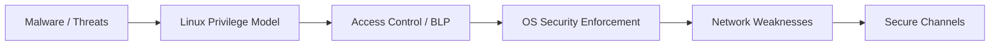
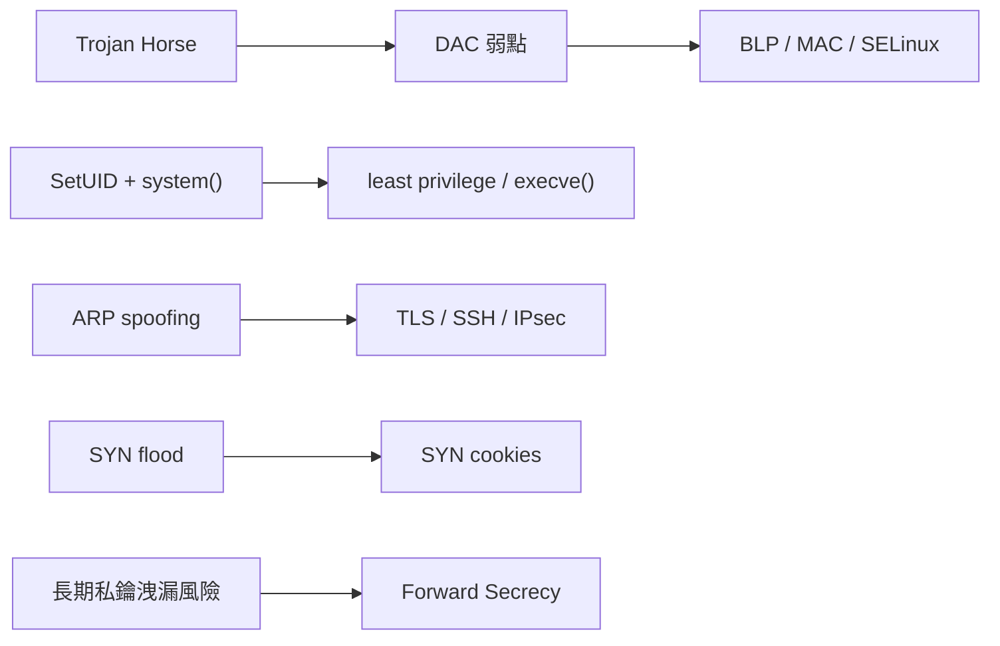

好，我直接幫你跑 **Day 5 考前衝刺版**。
今天不是再讀一輪新東西，而是把整科壓成你 **上考場能直接寫出來** 的版本：主線、比較、流程、申論模板、模擬題、最後速記。這門課目前上傳的內容，核心確實落在五條線：惡意程式與威脅型態、Linux 與特權程式、存取控制與機密性模型、作業系統安全實作、網路攻擊與安全通道。

# Day 5：考前最後衝刺總整理

## Part 0：考前總地圖

### 這門課最核心的 5 條主線

第一條是 **Malware / Worm / Botnet / Rootkit**，回答「攻擊者長什麼樣、怎麼傳播、怎麼隱藏」。第二條是 **Linux permissions / Environment Variables / SetUID**，回答「一般程式為什麼會被環境或特權機制放大風險」。第三條是 **Access Control Models / Bell-LaPadula**，回答「抽象上怎麼限制主體、客體與資訊流」。第四條是 **SELinux / Windows Access Control**，回答「抽象模型怎麼落地到真實作業系統」。第五條是 **TCP/IP / TLS / SSH / IPsec**，回答「網路本來哪裡不安全，以及安全通道怎麼補」。

### 哪些主題一定要連起來看

* **Linux permissions → Environment Variables → SetUID**
  因為你若不先懂 process、user/group、PATH 與環境變數，SetUID 為什麼危險、為什麼 `system()` 容易出事，就很難寫對。
* **Access Control Models → Bell-LaPadula → SELinux → Windows Access Control**
  因為這是一條從抽象模型到作業系統實作的主線。先有 ACL / capability / DAC / MAC，再有 confidentiality model，最後才看到 Linux 與 Windows 怎麼真正做授權與限制。
* **TCP/IP weaknesses → TLS / SSH / IPsec**
  因為 TLS、SSH、IPsec 不是平空出現，它們是在補「網路原本沒加密、可被竊聽、可被 MITM、可被 spoofing」的洞。

### 期中最可能落點

最容易出成完整分數題的區塊，通常是：

* **Virus / Worm / Trojan Horse 比較**
* **Environment variable 攻擊面**
* **SetUID：RUID / EUID、`system()` vs `execve()`、attack surface**
* **ACL vs Capability、DAC vs MAC**
* **Bell-LaPadula：no read up / no write down + 限制**
* **SELinux type enforcement**
* **Windows：token / DACL / MIC**
* **ARP spoofing / session hijacking / SYN flood / SYN cookies**
* **TLS / SSH / IPsec 比較**
* **Forward secrecy** 

### 高頻攻擊與防禦對照圖

---

## Part 1：全科超高頻考點總表

### 1. 名詞解釋題必背

* **Trapdoor**：秘密入口，繞過正常安全程序。
* **Logic Bomb**：藏在合法程式中，在特定條件觸發後破壞系統。
* **Trojan Horse**：表面做正常事，暗中利用使用者權限做違反政策的事。
* **Virus**：依附宿主程式、會感染其他檔案的自我複製程式。
* **Worm**：不需宿主、可獨立執行並自我傳播的惡意程式。
* **ACL**：把某個物件可被哪些主體怎麼存取，直接記在物件旁。
* **Capability**：把某個主體擁有哪些物件的哪些權限，直接記在主體旁。
* **DAC**：有權的人可把權限再傳出去。
* **MAC**：依安全標籤與政策強制限制，不由使用者自由轉授。
* **Simple Security Condition**：no read up。
* ***-Property**：no write down。
* **Security Context（SELinux）**：`user:role:type:level`。
* **Access Token（Windows）**：主體的安全身分與權限集合。
* **Security Descriptor（Windows）**：物件的擁有者、DACL、SACL 等安全資訊。
* **MIC**：同一個 user account 內再做完整性邊界。
* **ARP spoofing**：偽造 ARP 回覆，把 IP→MAC 對應騙走。
* **Session Hijacking**：利用 TCP 狀態與序號推測或竄改現有連線。
* **SYN Flood**：大量半連線請求耗盡 server 資源。
* **Forward Secrecy**：未來就算長期私鑰外洩，過去 session key 仍不該被解開。

### 2. 比較題必會

* Virus vs Worm vs Trojan Horse
* Shell variable vs Environment variable
* `system()` vs `execve()`
* ACL vs Capability
* DAC vs MAC
* SELinux vs Windows Access Control
* UDP vs TCP
* ARP spoofing vs Session hijacking vs SYN flood
* TLS vs SSH vs IPsec 

### 3. 流程題必畫

* Worm phases
* Botnet / zombie flow
* SetUID privilege flow
* DAC 被 Trojan Horse 利用的流程
* SELinux type enforcement / type transition
* Windows authorization flow
* TCP 三向交握
* SYN flood 與 SYN cookies
* TLS handshake 

### 4. 申論題必懂

* 為什麼 DAC 會被 Trojan Horse 打穿
* 為什麼 `system()` 比 `execve()` 危險
* Bell-LaPadula 為什麼要 no read up / no write down
* BLP 的限制為什麼常被考
* 為什麼只靠 DACL 不夠，還要 MIC
* SYN cookies 怎麼解決 SYN flood、又為什麼不是完美解
* 為什麼 forward secrecy 重要
* 為什麼 TLS / SSH / IPsec 不能混著答 

---

## Part 2：全科比較表

| 主題                                             | 核心差異                                                               | 你考試最短可寫法                                                                      | 最容易失分                                  |
| ---------------------------------------------- | ------------------------------------------------------------------ | ----------------------------------------------------------------------------- | -------------------------------------- |
| Virus vs Worm vs Trojan                        | Virus 要宿主且感染檔案；Worm 不需宿主且自我傳播；Trojan 表面正常、暗中作惡                     | Virus 是依附式自我複製；Worm 是獨立式自我傳播；Trojan 是偽裝式惡意程式                                  | 把 Trojan 說成一定會自我複製                     |
| Trapdoor vs Logic Bomb vs Trojan               | Trapdoor 是後門；Logic bomb 是條件觸發；Trojan 是偽裝執行                         | 三者分別是入口、觸發機制、偽裝程式                                                             | 把 Logic bomb 當成獨立傳播惡意程式                |
| Shell variable vs Environment variable         | shell variable 是 shell 內部變數；environment variable 會傳給 child process | environment variable 會影響新程式行為；shell variable 不一定會                             | 以為兩者完全相同                               |
| `system()` vs `execve()`                       | `system()` 會先叫 shell；`execve()` 直接執行程式                             | `system()` attack surface 較大，`execve()` 較安全                                   | 忘記 PATH / shell 影響                     |
| ACL vs Capability                              | ACL 以物件為中心；capability 以主體為中心                                       | ACL 好做 per-object review/revocation；capability 好做 per-subject least privilege | 只背一個比較點                                |
| DAC vs MAC                                     | DAC 可轉授；MAC 依 label 強制限制                                           | DAC 靈活但易被 Trojan horse 利用；MAC 較強但較不彈性                                         | 只講「DAC 比較自由」太空泛                        |
| Bell-LaPadula vs MIC                           | BLP 是 confidentiality model；MIC 是 Windows 內完整性邊界機制                 | BLP 管高低機密資訊流；MIC 限制低完整性程式影響高完整性物件                                             | 把 MIC 說成 BLP 的直接實作                     |
| SELinux vs Windows AC                          | SELinux 用 context/type/policy；Windows 用 token/descriptor/DACL/MIC  | 前者偏 Linux MAC/type enforcement；後者偏 Windows authorization + integrity          | 把 security context 跟 access token 混在一起 |
| Linux capability vs Windows privilege          | 都是在拆 root/admin 權限                                                 | 都是把大權限拆成較小權能，但掛載位置與授權邏輯不同                                                     | 直接說「一樣」                                |
| UDP vs TCP                                     | UDP 無連線不可靠；TCP 有連線可靠                                               | UDP 簡單快但可 spoof；TCP 有狀態，故會有 hijack/SYN flood                                  | 只背「UDP 快、TCP 慢」                        |
| ARP spoofing vs Session hijacking vs SYN flood | ARP 在 L2/L3 對應；session hijack 在既有 TCP 連線；SYN flood 在握手前期耗盡資源       | 三者分別是對應欺騙、連線劫持、半連線耗盡                                                          | 把 hijacking 跟 flood 混為 DoS             |
| TLS vs SSH vs IPsec                            | TLS 常保護 socket/web；SSH 做 remote login/port forwarding；IPsec 在 IP 層 | 三者層級不同、部署情境不同                                                                 | 一律都寫「加密通訊協定」                           |
| no read up vs no write down                    | 前者防低讀高；後者防高寫低                                                      | BLP 用兩條規則阻止高機密往低機密流                                                           | 只背口號不會解釋原因                             |

以上比較是依講義中的正式定義、案例與對照邏輯整理。

---

## Part 3：全科流程整理

### A. Worm propagation flow【幾乎必考】

1. **Probing**：找可攻擊主機
2. **Exploitation**：利用漏洞進入
3. **Replication**：把自己完整版本丟到別台
4. **Payload**：執行後門、DDoS、spam 等行為

**為什麼會成功**：因為 worm 不需宿主、可獨立運作，還常同時結合多種弱點。
**防禦點**：patch、限制暴露服務、阻斷橫向傳播。

### B. Botnet / zombie flow【幾乎必考】

1. 攻擊者掃描不安全主機
2. 裝上 zombie agent
3. zombie phone home 到 master server
4. 攻擊者對 master server 下指令
5. master server 對 zombies 下達攻擊
6. 大量 zombie 淹沒目標，形成 DDoS

**為什麼會成功**：把攻擊分散到很多被控主機。
**防禦點**：清除殭屍、C2 阻斷、異常流量偵測。

### C. Environment variable attack flow【高機率考題】

1. 使用者先設定惡意 environment variable
2. 程式或 dynamic linker、library、shell 間接讀到它
3. 變數影響程式找 library、找 command、格式化訊息或應用邏輯
4. 若程式是 privileged program，影響會被放大

**重點**：最危險的是「程式以為沒有讀使用者輸入，但其實偷讀了環境」。
**防禦點**：sanitize、`secure_getenv()`、避免讓 shell 參與、改用 service approach。

### D. SetUID privilege / attack surface flow【幾乎必考】

1. 使用者執行 root-owned SetUID program
2. process 的 **RUID = 使用者，EUID = 程式擁有者**
3. 存取控制依 EUID 做，因此程式暫時有高權限
4. 攻擊可從 user input、system input、environment variables、capability leaking 進入
5. 若程式處理不當，原本「受限制的特權」就變成 privilege escalation

**防禦點**：嚴格輸入驗證、避免 shell、先關閉已取得的 privileged capability、least privilege。

### E. DAC 被 Trojan Horse 利用的流程【老師超愛考】

1. A 對 File F 有 read
2. A 對 File G 有 write
3. B 本來不能讀 F
4. A 執行內含 Trojan 的程式
5. Trojan 以 A 的合法權限讀 F、寫 G
6. B 之後就能讀 G，等於間接讀到 F 內容

**核心**：DAC 只看「你有沒有權」，不看「你為誰搬資料」。
**防禦點**：MAC / information flow control。

### F. Bell-LaPadula 保護邏輯【幾乎必考】

1. 每個 subject / object 都有 security level
2. **no read up**：低不能讀高
3. **no write down**：高不能寫低
4. 再加上 discretionary security property，要求權限矩陣中本來就得允許
5. 目標是避免高機密資訊流向低層級

**最容易失分**：只背兩句英文，不會解釋「為什麼」。
**真正要會寫**：`no write down` 是為了防止高層 subject 把高資訊寫到低物件，避免 overt leakage。

### G. SELinux authorization / type enforcement flow【高機率考題】

1. process 與 file 都有 security context
2. kernel hook 攔截 open / execute 等操作
3. 取出 subject SID 與 object SID
4. 查 policy / AVC
5. 規則允許就 ALLOW，否則 DENY

**重點**：root 也會被 policy 限制。
**防禦點**：即使某個 root process 被攻陷，傷害也被限制在該 domain / type 可做的事。

### H. Windows authorization flow【高機率考題】

1. principal 登入
2. 系統建立 subject（process / thread）
3. subject 帶著 access token
4. subject 要存取 object
5. object 帶著 security descriptor
6. SRM 依 token 裡的 SID / privileges 與 descriptor 裡的 DACL / SACL / integrity level 做 access check
7. 通過才存取成功

**補一句很重要**：Windows 不是只有 DACL；後來又加了 MIC、Session 0 isolation、UIPI 等補洞。

### I. ARP spoofing flow【幾乎必考】

1. 攻擊者偽造 ARP reply
2. victim 更新錯誤的 IP→MAC 對應
3. 原本該去 gateway 的流量改送到攻擊者
4. 攻擊者可 sniff、relay、MITM

**為什麼會成功**：ARP 缺乏身分驗證，可接受 unsolicited ARP response。
**防禦點**：DHCP snooping、ArpON。

### J. TCP 三向交握【背誦優先】

1. Client 送 SYN
2. Server 回 SYN+ACK
3. Client 回 ACK
4. 進入 connected 狀態

**老師很愛考**：SYN flood 就是打在這裡。

### K. Session hijacking flow【高機率考題】

1. 攻擊者觀察或猜測連線四元組與 sequence state
2. 產生落在可接受 window 內的假封包
3. 注入資料、送 RST、或干擾既有連線
4. 達到資料竄改、MITM 或 DoS

**為什麼會成功**：TCP 本身不提供加密，header/payload 可 spoof。

### L. SYN flood + SYN cookies flow【幾乎必考】

**SYN flood**

1. 攻擊者大量送 SYN
2. 多半使用 spoofed source IP
3. server 為每個半連線分配 queue / state
4. connection 還沒完成前資源被卡住
5. 合法 client 被拒絕

**SYN cookies**

1. server 收到 SYN 時，不先存 queue entry
2. 把必要資訊編進 SYN+ACK 的初始 sequence number
3. 等 client 回 ACK
4. server 再從 ACK 反推出必要資訊並建立連線

**優點**：不違反 TCP 規格、降低半連線狀態成本。
**缺點**：32-bit 空間有限，裝不下所有 options；最後 ACK 遺失時可能有凍結問題。

### M. TLS handshake flow【幾乎必考】

1. 雙方 negotiation：版本、cipher suite、key exchange
2. key exchange：RSA 或 Diffie-Hellman
3. server 以 certificate 證明身分
4. 建立 session key
5. ChangeCipherSpec 後開始加密傳輸

**forward secrecy 版本重點**：用 Diffie-Hellman 建 session key，server 私鑰只拿來簽名認證交換，不直接解過往 session key。

---

## Part 4：老師很愛考、學生最容易自以為懂卻不會寫的申論題

下面每一題我都直接給你 **可默寫模板**。

### 1. 為什麼 DAC 會被 Trojan Horse 攻擊？【幾乎必考】

**默寫模板：**
DAC 的核心特性是，主體只要持有某項權限，就可以依該權限存取物件，且權限可以在主體之間傳播。其弱點在於，它只檢查「主體是否有權」，卻不檢查「資訊是否應該被轉移」。因此當合法使用者執行 Trojan Horse 時，惡意程式可利用該使用者原本對高敏感物件的讀權限，以及對低敏感物件的寫權限，將資訊由高物件複製到低物件。結果即使沒有直接違反 ACL，機密資訊仍透過合法權限被外洩。這說明 DAC 對 Trojan Horse 缺乏資訊流控制能力，也是 MAC / Bell-LaPadula 想補強的地方。

### 2. 為什麼 `system()` 比 `execve()` 危險？【幾乎必考】

**默寫模板：**
`system()` 的危險在於它不是直接執行目標程式，而是先呼叫 `/bin/sh`，再由 shell 去解讀指令字串並尋找命令。因此 shell 相關行為與 environment variables，例如 PATH，都會變成 attack surface。若 privileged program 使用 `system()`，攻擊者可能藉由操控 PATH 或把輸入資料轉成 command name，導致任意命令執行。相較之下，`execve()` 直接執行指定程式，並把 command name 與 input data 分開處理，不經 shell，因此 attack surface 較小，也較不受 environment variables 影響。簡言之，`system()` 容易混淆 code 與 data，而 `execve()` 則把兩者分離。

### 3. 請說明 SetUID 的原理與主要 attack surface。【高機率考題】

**默寫模板：**
SetUID 是 UNIX / Linux 用來讓一般使用者暫時以程式擁有者權限執行某個程式的機制。其核心在於 process 同時具有 Real UID 與 Effective UID，存取控制依 Effective UID 進行。當一般程式執行時，RUID 與 EUID 通常相同；但當 SetUID 程式被執行時，RUID 仍代表實際執行者，而 EUID 則變成程式擁有者，若程式由 root 擁有，就等於暫時取得 root privilege。
SetUID 的主要 attack surface 包括四類：第一，使用者明確輸入，例如 buffer overflow 或 format string；第二，system input，例如 race condition 或 symbolic link；第三，environment variables，例如 PATH、dynamic linker 相關變數；第四，capability leaking，例如 privilege downgrade 前未關閉已取得的 file descriptor。這些攻擊會使原本設計成「受限制執行特權任務」的程式，被利用成 privilege escalation 的入口。

### 4. Bell-LaPadula 為什麼要 no read up 與 no write down？【幾乎必考】

**默寫模板：**
Bell-LaPadula 是以 confidentiality 為核心的多層級安全模型。`no read up` 的目的，是防止低層級 subject 讀到高層級 object 中的機密資訊；`no write down` 的目的，則是防止高層級 subject 把已知的高機密資訊寫入低層級 object。前者阻止未授權閱讀，後者阻止資訊向低層級外洩。
其中 `no write down` 特別重要，因為就算 subject 合法擁有高資訊的讀權限，只要又能寫低物件，就可能像 Trojan Horse 一樣，把高資訊搬到低物件。因此 BLP 以這兩條規則限制 overt information flow，讓資訊只能往上流，不能往下流。

### 5. Bell-LaPadula 的限制是什麼？【老師很愛考】

**默寫模板：**
Bell-LaPadula 的主要限制有三點。第一，它只處理 confidentiality，不處理 integrity；第二，它無法處理 covert channels，因為即使 overt access 符合 no read up / no write down，資訊仍可能透過資源耗用或 timing 行為偷偷外洩；第三，它把 security 定義成 state-based property，因此在跨 state 的資訊流分析上既不充分也不必要。講義也指出，BLP notion of security 既非 sufficient 也非 necessary，且 Basic Security Theorem 並不能真正證明 BLP notion 本身就等於正確的 security definition。換言之，BLP 是重要的里程碑，但不是完美模型。

### 6. 為什麼只靠 DACL 不夠，Windows 還需要 MIC？【幾乎必考】

**默寫模板：**
只靠 DACL 不夠的原因，在於 DACL 主要以 user account 或 group 為基礎授權，因此在同一個 user account 內，所有程式通常共享相近的權限邏輯。這代表若某個不可信程式與使用者的正常程式都在同一帳號下執行，不可信程式可能仍能修改該使用者擁有的物件。
Windows 因此引入 Mandatory Integrity Control。MIC 讓 subject 的 access token 帶有 integrity level，object 的 security descriptor 也帶有 integrity label，進而形成額外的強制限制。這樣就算兩個程式屬於同一使用者，低完整性程式也不能隨意影響高完整性物件。MIC 的目的不是取代 DACL，而是補上 DACL 在同帳號內缺乏安全邊界的問題。

### 7. 請比較 SELinux 與 Windows Access Control。【高機率整合題】

**默寫模板：**
SELinux 與 Windows Access Control 都是在作業系統層實作更細緻的安全控制，但設計重點不同。SELinux 是 Linux 上的 Mandatory Access Control，核心概念是 security context 與 type enforcement。每個 process 與 file 都有 `user:role:type:level`，系統依 policy 判斷某個 domain 是否可對某種 type 執行特定操作，因此即使某個 process 以 root 身分執行，仍會被 policy 限制。
Windows Access Control 則以 principal、subject、object 架構為核心，subject 攜帶 access token，object 攜帶 security descriptor，並透過 DACL、SACL 與 MIC 執行授權與完整性控制。
簡單說，SELinux 比較像以 type / domain 為核心的 MAC 系統；Windows 則是以 token / descriptor 為核心，再疊上 integrity、session isolation、UIPI 等補強機制。

### 8. SYN flood 如何運作？SYN cookies 如何防禦？【幾乎必考】

**默寫模板：**
SYN flood 是利用 TCP 三向交握的不對稱資源分配設計。攻擊者大量送出 SYN 封包，且常使用偽造來源位址。Server 收到 SYN 後，會先替每個連線請求保留半連線狀態，等待最後 ACK 完成交握；但攻擊者通常不會回 ACK，導致 half-open queue 被塞滿，最後合法使用者的連線請求被拒絕。
SYN cookies 的作法是，server 不在收到 SYN 時立刻保留完整狀態，而是把必要資訊編碼進 SYN+ACK 的初始 sequence number，先把儲存責任暫時轉嫁給 client。只有在 client 回 ACK 時，server 才從該 sequence number 反推出資訊並真正建立狀態。
它的優點是減少 half-open queue 的負擔，且不破壞 TCP 規格；缺點是 32-bit sequence number 空間有限，無法容納所有 TCP options，且某些情況下連線行為會較受限制。

### 9. 為什麼需要 Forward Secrecy？【高機率考題】

**默寫模板：**
Forward Secrecy 的重要性在於，傳統以 server RSA private key 直接解開過往 session key 的設計，會讓攻擊者只要事後取得伺服器私鑰，就能解開之前錄下來的所有加密流量。這代表過去的機密性會在未來一次性崩潰。
Forward Secrecy 的目標是避免這種情況。其典型作法是使用 Diffie-Hellman 直接協商 session key，使 session key 不會直接在網路上傳送，也不會單純依賴長期私鑰解密。Server 的長期私鑰只負責簽名與認證交換過程，而不直接解出過去 session key。如此一來，就算日後長期私鑰外洩，也不應影響已完成連線的過往 session。

### 10. TLS、SSH、IPsec 有什麼差異？【高機率比較題】

**默寫模板：**
TLS、SSH、IPsec 都提供安全通訊，但工作層級與使用情境不同。TLS 主要位於 transport / socket 上層，常用於 Web 與一般 socket-based application，依賴 X.509 certificate 與 CA 生態。SSH 主要用於 remote login 與 secure channel，通常採用記住 host public key 的方式建立信任，並支援 port forwarding。IPsec 則在 IP 層運作，提供 AH 與 ESP，以及 transport 與 tunnel mode，最常見成功情境是 VPN。
因此，三者都能提供某種保護，但 TLS 最常見於 Web、SSH 最常見於遠端操作與 tunneling、IPsec 最常見於 gateway 間或 VPN 場景。考試若問差異，不能只寫「都是加密協定」，而要寫出層級、驗證方式與部署情境。

### 11. ARP spoofing 為什麼會成功？【老師很愛考但學生常寫空】

**默寫模板：**
ARP spoofing 之所以會成功，是因為 ARP 的設計本身缺乏強身分驗證。主機會維護 IP 位址到 MAC 位址的對應表，而 ARP reply 只要格式正確，受害主機往往就會更新表項，甚至接受未經請求的 unsolicited ARP response。攻擊者因此可以偽造回覆，宣稱某個重要 IP 對應到自己的 MAC 位址，使受害主機把原本要送給真正 gateway 或 server 的流量改送給攻擊者。
即使是在 switched network 中，這種攻擊仍成立，因為 switch 只根據 MAC 轉送 frame，不會幫你驗證 ARP 對應的真偽。這也是為什麼 ARP spoofing 能用來 sniff、relay 甚至做 man-in-the-middle。

---

## Part 5：模擬期中考（20 題）＋答案重點

### 題目

1. 定義 Trojan Horse。
2. 比較 Virus 與 Worm。
3. 解釋 shell variable 與 environment variable 的差別。
4. 為什麼 environment variables 會成為 SetUID attack surface？
5. 解釋 RUID 與 EUID。
6. 為什麼 `system()` 危險？
7. 比較 ACL 與 Capability。
8. 比較 DAC 與 MAC。
9. 為什麼 DAC 容易受 Trojan Horse 影響？
10. 說明 Bell-LaPadula 的 no read up 與 no write down。
11. Bell-LaPadula 有哪些限制？
12. 什麼是 SELinux type enforcement？
13. 什麼是 Windows access token？
14. 為什麼 Windows 需要 MIC？
15. 什麼是 ARP spoofing？
16. 比較 UDP 與 TCP 的安全面。
17. 什麼是 TCP session hijacking？
18. SYN flood 與 SYN cookies 的關係是什麼？
19. 什麼是 forward secrecy？
20. 比較 TLS、SSH、IPsec。

### 答案重點

1. 表面正常、暗中作惡，利用合法使用者權限造成安全破壞。
2. Virus 要宿主並感染；Worm 可獨立執行並自我傳播。
3. 前者是 shell 內部變數；後者會傳給 child process、影響新程式行為。
4. 因為使用者可設定它，而 privileged program 可能隱性讀到它。
5. RUID 代表真正使用者；EUID 代表程式目前用來做 access control 的權限身分。
6. 因為會先叫 shell，PATH 與指令字串解析都變成 attack surface。
7. ACL 以物件為中心；capability 以主體為中心。
8. DAC 可轉授；MAC 依 label / policy 強制限制。
9. 因為它只檢查主體是否有權，不控制資訊流向。
10. no read up 防低讀高；no write down 防高寫低。
11. 不處理 integrity、不處理 covert channels、state-based security 不充分也不必要。
12. 依 `source_type target_type : class perm_set` 的 policy 規則控制 domain 對 type 的操作。
13. subject 的安全身分集合，包含 SID、privileges、default ACL 等。
14. 因為只靠 DACL 無法在同一 user account 內建立完整性邊界。
15. 偽造 ARP reply，騙走 IP→MAC 對應，進而攔截流量。
16. UDP 無連線、可 spoof；TCP 有狀態、可被 hijack / SYN flood。
17. 利用 TCP 狀態與序號預測或插入封包到既有連線。
18. SYN flood 利用半連線耗盡資源；SYN cookies 把狀態編進初始序號以降低 queue 壓力。
19. 未來長期私鑰外洩，不應影響過去 session key 機密性。
20. TLS 常保護 web/socket；SSH 常保護遠端登入；IPsec 在 IP 層，常見於 VPN。

---

## Part 6：考前最後濃縮版

### A. 考前一天版本（2–3 小時）

先看這 10 個：

1. Virus / Worm / Trojan Horse
2. shell variable vs environment variable
3. `system()` vs `execve()`
4. SetUID：RUID / EUID + 四個 attack surface
5. ACL vs Capability
6. DAC vs MAC
7. BLP：no read up / no write down + 限制
8. SELinux：context + type enforcement
9. Windows：token / descriptor / DACL / MIC
10. ARP spoofing / session hijacking / SYN flood / TLS / PFS 

### B. 考前最後 1 小時版本

只看這 8 個默寫模板：

* DAC 為何怕 Trojan Horse
* `system()` 為何比 `execve()` 危險
* SetUID 原理與 attack surface
* BLP 為何要 no read up / no write down
* BLP 限制
* 為何 DACL 不夠、還要 MIC
* SYN flood / SYN cookies
* 為何需要 forward secrecy

### C. 考前最後 30 分鐘版本

這 20 個關鍵字一定要叫得出來：
Virus、Worm、Trojan、Trapdoor、Logic bomb、Environment variable、PATH、LD_PRELOAD、RUID、EUID、ACL、Capability、DAC、MAC、no read up、no write down、Type enforcement、Access token、MIC、Forward secrecy。

---

## Part 7：最後提醒——最容易失分的 10 個地方

1. **把 Trojan 說成會自我複製**
2. **把 shell variable 跟 environment variable 當同一件事**
3. **只寫 `system()` 會呼叫 shell，卻沒寫 PATH / code-data 混淆**
4. **SetUID 只寫「暫時拿 root」，沒寫 RUID / EUID**
5. **ACL vs Capability 只比較一個角度，沒提 per-object / per-subject**
6. **DAC vs MAC 只寫自由/不自由，沒寫 Trojan horse 與 label**
7. **BLP 只背 no read up / no write down，卻不會解釋 why**
8. **把 SELinux context、Windows token、descriptor 混在一起**
9. **把 SYN flood 跟 session hijacking 當成同一類攻擊**
10. **把 TLS / SSH / IPsec 一律寫成「加密協定」沒分層級與情境** 

---

## 你現在最值得最後再背的 20 個點

* virus 定義
* worm 定義與 phases
* botnet 6 steps
* shell vs environment variable
* `LD_PRELOAD` / PATH 風險
* `secure_getenv()` 概念
* RUID / EUID
* SetUID 4 attack surfaces
* `system()` vs `execve()`
* ACL / capability
* DAC / MAC
* Trojan horse 為何打穿 DAC
* BLP 兩條規則
* BLP 限制
* SELinux context
* type enforcement
* access token / security descriptor / DACL / MIC
* ARP spoofing
* SYN flood / SYN cookies
* forward secrecy

---

## 你現在最值得最後再練的 10 題

1. DAC 為何怕 Trojan Horse？
2. `system()` 為何比 `execve()` 危險？
3. SetUID 原理與風險。
4. ACL vs Capability。
5. DAC vs MAC。
6. BLP 的兩條規則與目的。
7. BLP 的限制。
8. 為何 Windows 還需要 MIC？
9. SYN flood 與 SYN cookies。
10. 為何需要 forward secrecy？

---

## Day 5 實際執行順序

先用 30 分鐘背 **Part 2 比較表**。
再用 40 分鐘背 **Part 3 流程**。
再用 60 分鐘練 **Part 4 的申論模板**。
最後 30 分鐘只看 **Part 6 與 Part 7**，不要再開投影片亂翻。

你回我 **「先考我」**，我就直接用這份內容出一輪模擬口試 / 筆試題。
