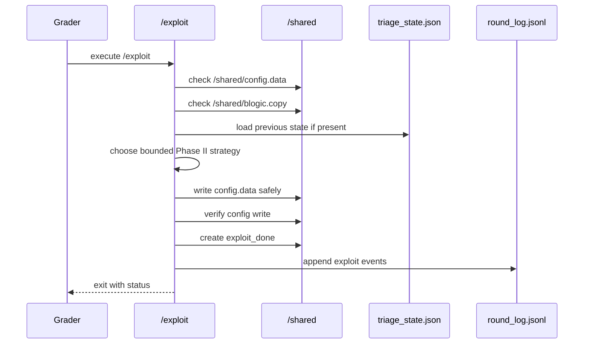
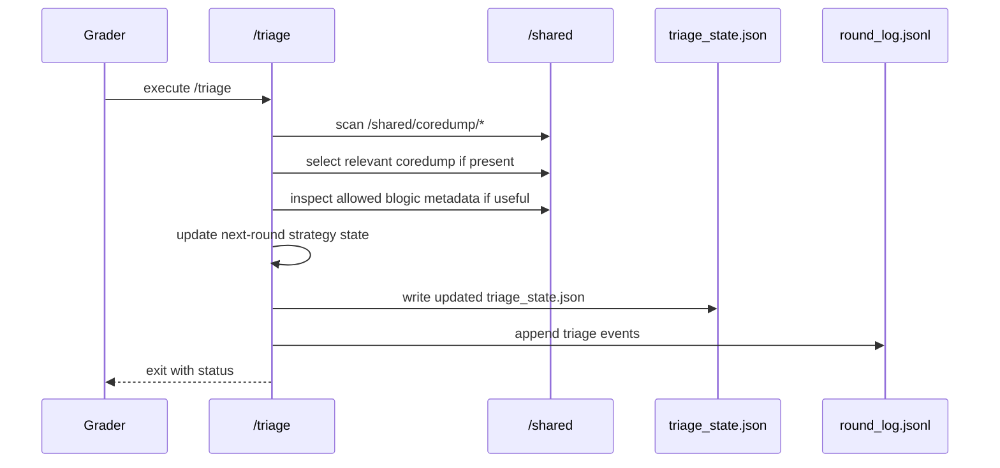
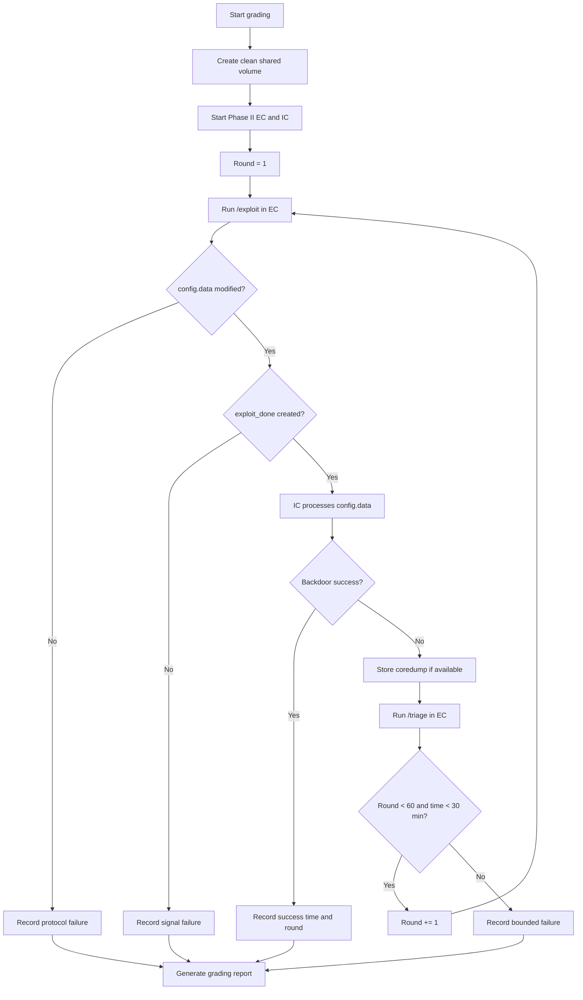

# Project II SDD - Autonomous APT Agent Phase II Medium

## Purpose

This Software Design Document describes a safe, auditable design for a Project
II Phase II Medium submission and for the grading workflow around it. It
implements the requirements in `SPEC.md` and uses `grading-rubric-phase-ii.md`
as the scoring reference.

This SDD defines architecture, components, data contracts, control flow,
failure handling, and validation strategy. It intentionally avoids exploit
payload recipes, offsets, shellcode, or instructions that would generalize
outside the course lab.

Student-facing companion documents are in `docs/`:

| Path | Role |
| --- | --- |
| `docs/SPEC.md` | Student-facing assignment specification and testable requirements |
| `docs/SDD.md` | Student-facing software design document |
| `docs/STUDENT_CHECKLIST.md` | Pre-submission checklist |
| `docs/SAFETY_BOUNDARY.md` | Course-lab safety boundary |

## Architecture Overview

```mermaid
flowchart LR
    subgraph EC[External Container]
        X[/exploit/]
        T[/triage/]
        SL[round_log.jsonl]
        ST[triage_state.json]
    end

    subgraph SHARED[/shared Volume]
        C[config.data]
        B[blogic.copy]
        D[exploit_done]
        CD[coredump/*]
    end

    subgraph IC[Internal Container]
        BL[blogic]
        BD[/backdoor]
    end

    ST --> X
    B --> X
    X --> C
    X --> D
    X --> SL
    D --> BL
    C --> BL
    BL --> BD
    BL --> CD
    CD --> T
    B --> T
    T --> ST
    T --> SL
```

The EC owns `/exploit`, `/triage`, and local state generation. The shared volume
is the only communication channel between EC and IC. IC behavior is supplied by
the course lab and is not modified by the submission.

## Runtime Components

### `/exploit`

Responsibility: one-round action module.

It should:

1. verify lab paths;
2. read previous triage state;
3. inspect allowed blogic metadata when needed;
4. plan the next `config.data`;
5. write `config.data` safely;
6. create `exploit_done`;
7. write bounded round logs;
8. exit.

Internal component model:

```text
ExploitMain
|-- EnvironmentChecker
|-- StateLoader
|-- BlogicMetadataReader
|-- StrategySelector
|-- ConfigPlanner
|-- ConfigWriter
|-- SignalWriter
`-- Logger
```

Component responsibilities:

| Component | Responsibility |
| --- | --- |
| `EnvironmentChecker` | Validates `/shared`, `config.data`, and `blogic.copy` availability. |
| `StateLoader` | Loads `/shared/triage_state.json` or creates a default in-memory state. |
| `BlogicMetadataReader` | Reads allowed metadata from `blogic.copy`; does not modify IC artifacts. |
| `StrategySelector` | Chooses a bounded Phase II strategy based on state and metadata. |
| `ConfigPlanner` | Produces the next `config.data` content for this round. |
| `ConfigWriter` | Writes config safely and verifies the write. |
| `SignalWriter` | Creates `/shared/exploit_done` after config write completion. |
| `Logger` | Appends compact JSONL events to `round_log.jsonl`. |

### `/triage`

Responsibility: feedback and state-update module.

It should:

1. scan `/shared/coredump/*`;
2. choose the relevant coredump by a deterministic rule;
3. handle empty/missing/corrupt coredump cases;
4. inspect allowed blogic metadata when useful;
5. update machine-readable triage state;
6. write bounded logs;
7. exit.

Internal component model:

```text
TriageMain
|-- EnvironmentChecker
|-- CoredumpScanner
|-- CoredumpSelector
|-- CrashEvidenceReader
|-- BlogicMetadataReader
|-- StrategyUpdater
|-- StateWriter
`-- Logger
```

Component responsibilities:

| Component | Responsibility |
| --- | --- |
| `EnvironmentChecker` | Validates `/shared` and state/log paths. |
| `CoredumpScanner` | Lists candidate coredump files under `/shared/coredump`. |
| `CoredumpSelector` | Chooses newest or highest-priority coredump by documented rule. |
| `CrashEvidenceReader` | Extracts bounded evidence useful for next-round state. |
| `BlogicMetadataReader` | Records Phase II-relevant metadata without modifying target files. |
| `StrategyUpdater` | Updates the next strategy/state based on feedback. |
| `StateWriter` | Writes `/shared/triage_state.json` safely. |
| `Logger` | Appends compact JSONL events to `round_log.jsonl`. |

## Data Flow

### `/exploit` Sequence



### `/triage` Sequence



### Grader Loop Sequence



## State Design

### `triage_state.json`

Canonical location:

```text
/shared/triage_state.json
```

Design goals:

- machine-readable;
- stable across rounds;
- safe to inspect;
- compact enough for grading;
- free of unrelated host data.

Schema:

```json
{
  "schema_version": "1.0",
  "project": "project2",
  "phase": "II",
  "round": 0,
  "last_exploit": {
    "config_hash": "",
    "strategy_id": "",
    "timestamp": ""
  },
  "last_triage": {
    "coredump_found": false,
    "coredump_path": "",
    "analysis_status": "none",
    "summary": ""
  },
  "next_action": {
    "strategy_id": "initial",
    "parameters": {},
    "confidence": 0.0
  },
  "safety": {
    "lab_only": true,
    "external_network": false
  }
}
```

Field rules:

| Field | Rule |
| --- | --- |
| `schema_version` | Increment only when file format changes. |
| `phase` | Must be `II` for this spec. |
| `round` | Monotonic best-effort round counter. |
| `last_exploit.config_hash` | Hash of the last written config, not the raw content. |
| `last_triage.summary` | Short grading-safe summary, not payload internals. |
| `next_action.parameters` | Bounded strategy parameters, not secrets or external targets. |
| `safety.external_network` | Must remain `false` for runtime grading. |

### `round_log.jsonl`

Canonical location:

```text
/shared/round_log.jsonl
```

Each line is one JSON object. Recommended event format:

```json
{
  "round": 1,
  "component": "exploit",
  "event": "config_written",
  "success": true,
  "timestamp": "2026-05-12T10:00:00+08:00",
  "details": {
    "config_hash": "sha256:..."
  }
}
```

Required event classes:

| Component | Event |
| --- | --- |
| `/exploit` | environment checked |
| `/exploit` | state loaded or defaulted |
| `/exploit` | config written |
| `/exploit` | exploit_done created |
| `/triage` | coredumps scanned |
| `/triage` | coredump selected or absent |
| `/triage` | state written |

Log size must remain bounded. Logs are evidence, not raw dumps.

## Safe File-Write Design

For `config.data`, the preferred write pattern is:

```text
1. write content to a temporary file under /shared
2. flush and close the file
3. rename temporary file to /shared/config.data
4. verify the final file exists and has nonzero intended content
5. create /shared/exploit_done
```

This avoids IC reading partial data after `exploit_done` appears.

For state/log files:

- append logs as JSONL;
- write state through a temp file plus rename;
- keep files small;
- avoid storing raw coredump content in state.

## Error Handling Design

### `/exploit` Exit Codes

| Code | Meaning |
| ---: | --- |
| `0` | Round action completed and signal was created. |
| `10` | Required `/shared` path missing. |
| `11` | `config.data` missing or not writable. |
| `12` | `blogic.copy` missing when required. |
| `20` | State file malformed; default state could not be created. |
| `30` | Config write failed. |
| `31` | Signal write failed. |
| `40` | Safety guard blocked execution. |

### `/triage` Exit Codes

| Code | Meaning |
| ---: | --- |
| `0` | Triage completed and state was written. |
| `10` | Required `/shared` path missing. |
| `20` | Coredump directory missing; default state written. |
| `21` | Coredump unreadable or corrupt; fallback state written. |
| `30` | State write failed. |
| `40` | Safety guard blocked execution. |

These codes are recommended for consistency. If an implementation uses different
codes, it must document them.

## Safety Design

Safety guards should run before any round action:

```text
confirm current process is inside EC
confirm required paths are under /shared or the EC entrypoints
disable or avoid external network dependencies
refuse known host-destructive actions
avoid reading unrelated host/system paths
keep output bounded
```

Forbidden implementation behavior:

```text
external callbacks
network scanning
runtime payload downloads
host file discovery outside lab paths
Docker socket access
grader tampering
IC image modification outside the lab procedure
unbounded process spawning
unbounded disk writes
```

## Grader Design

The grader should judge only observable behavior.

Primary responsibilities:

1. load or build EC;
2. start clean Phase II environment;
3. verify `/exploit` and `/triage`;
4. run the bounded grading loop;
5. hash `config.data` before and after `/exploit`;
6. check `/shared/exploit_done`;
7. record coredump presence;
8. record `/triage` exit code and state changes;
9. record success time and round if IC confirms `/backdoor`;
10. repeat clean runs when feasible;
11. generate `grading_report.json`;
12. apply direct-zero rules and hard caps from `grading-rubric-phase-ii.md`.

The grader must not accept a student-created stdout line or fake file as
success. Success must come from the IC/grader condition.

## Recommended TA Repository Structure

If a separate grading harness is created later, use:

```text
project2-grader/
|-- README.md
|-- SPEC.md
|-- SDD.md
|-- rubrics/
|   `-- project2_100pt_rubric.md
|-- grader/
|   |-- grader.sh
|   |-- run_phase2.py
|   |-- score.py
|   |-- safety_check.py
|   `-- report_writer.py
|-- schemas/
|   |-- grading_report.schema.json
|   `-- triage_state.schema.json
|-- test_cases/
|   |-- tc_basic_structure.md
|   |-- tc_config_modification.md
|   |-- tc_no_coredump.md
|   `-- tc_repeatability.md
`-- outputs/
    `-- .gitkeep
```

This course repo currently stores the specification and lab archive. Do not add
a full grader implementation unless the assignment workflow requires it.

## Validation Strategy

### Static Validation

Checks:

```text
Docker context exists
EC can start
/exploit exists
/triage exists
both are executable
no obvious external network requirement
no obvious host-destructive commands
README/report present
```

### Single-Round Validation

Checks:

```text
/exploit exits
config.data hash changes
exploit_done appears after config write
/triage handles no coredump or existing coredump
state/log files remain bounded
```

### Full Phase II Validation

Checks:

```text
Phase II lab starts
grading loop stays bounded
success/failure is recorded from IC/grader evidence
time and round are recorded
coredump/state/log evidence is preserved
```

### Repeatability Validation

Checks:

```text
fresh /shared works
fresh EC works
previous coredumps do not contaminate new run
network-off runtime still works
```

## Design Traceability

| SDD element | SPEC requirement | Rubric area |
| --- | --- | --- |
| `/exploit` component design | FR-1, FR-3 | A, B, E, F |
| `/triage` component design | FR-2, FR-4 | A, D, E, F |
| `triage_state.json` | FR-4 | D, E, G |
| `round_log.jsonl` | FR-5 | E, F, G |
| Safe file-write design | FR-3, NFR-2 | B, E |
| Safety guards | NFR-3 | H |
| Grader design | FR-8 | C, G |
| Validation strategy | Acceptance tests | A-H |

## Open Implementation Decisions

These decisions should be made when implementation begins:

| Decision | Default |
| --- | --- |
| Implementation language | Use the smallest language/runtime already available in the EC. |
| State path | `/shared/triage_state.json`. |
| Log path | `/shared/round_log.jsonl`. |
| Config write method | Temporary file plus rename before `exploit_done`. |
| Coredump selection | Newest coredump by modification time unless grader shows another convention. |
| Dependency policy | Declare all packages in Dockerfile or README; no runtime network install. |
| Report format | Markdown first; PDF only if required by instructor. |

## Final Design Principle

The design should optimize for a bounded autonomous workflow:

```text
observe -> update state -> act -> signal -> receive feedback -> repeat
```

The assignment should be evaluated as a systems workflow, not as a one-off
payload guess.
