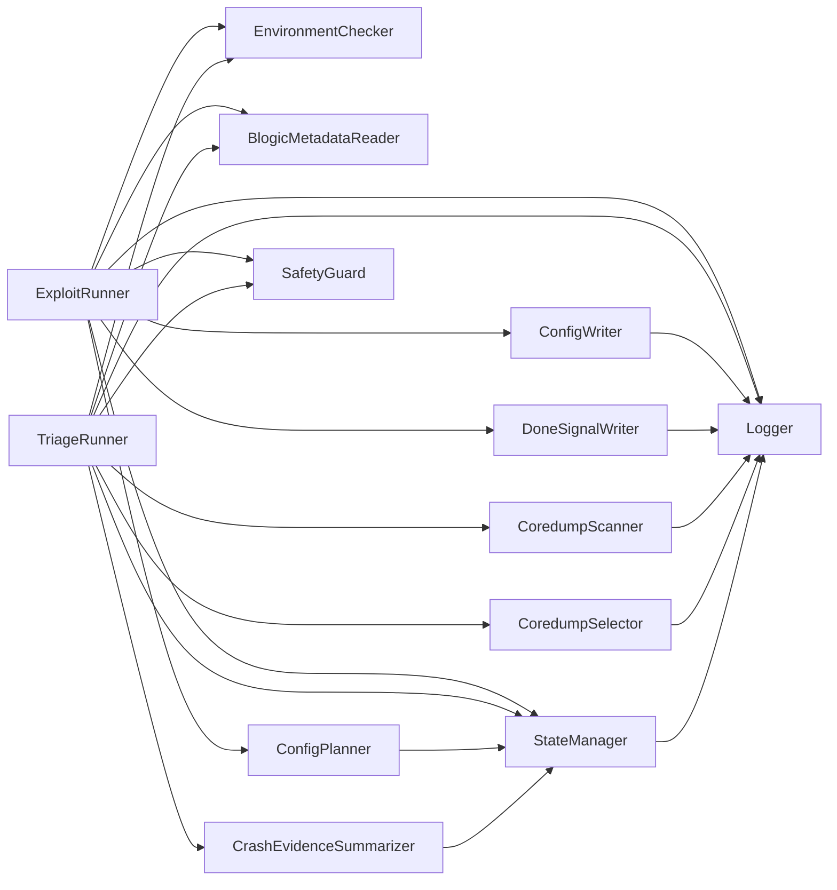
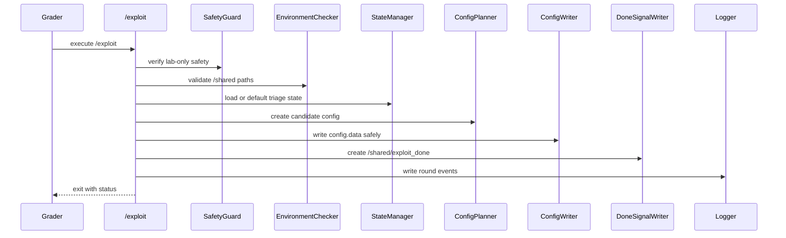
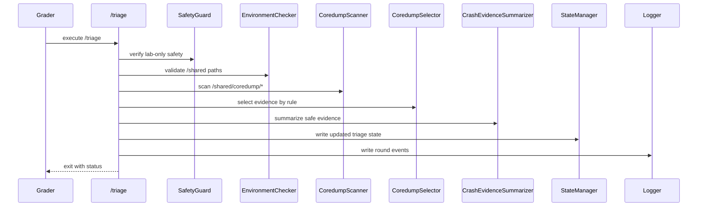

# Project II SDD - Software Design Document for Controlled Autonomous Lab Agent

## 1. Design Objective

The software design should separate action, feedback, state, logging, and
safety. The student should not build a one-shot manual script that only works
after interactive tuning. The EC should behave as a round-based autonomous
workflow:

```text
check environment -> read state -> prepare candidate config -> write safely
-> signal completion -> receive feedback -> summarize evidence -> update state
```

The design must remain inside the course Docker lab. This document does not
include payload code, shellcode, ROP chains, or real-world attack instructions.

## 2. High-Level Architecture



Design rules:

- `ExploitRunner` coordinates one action round.
- `TriageRunner` coordinates one feedback round.
- `SafetyGuard` is used by both entry points before doing work.
- `Logger` is shared and writes structured bounded logs.
- `StateManager` owns `triage_state.json`.
- No component should require manual stdin input during grading.

## 3. Component Responsibilities

### 3.1 EnvironmentChecker

Purpose: validate required paths and permissions.

Inputs:

```text
/shared/
/shared/config.data
/shared/blogic.copy
/shared/coredump/
```

Outputs:

```json
{
  "shared_exists": true,
  "config_exists": true,
  "blogic_copy_exists": true,
  "coredump_dir_exists": true,
  "shared_writable": true
}
```

Failure modes:

| Failure | Expected response |
| --- | --- |
| Missing `/shared` | Fatal error with clear log. |
| Missing `config.data` | `/exploit` exits with clear error. |
| Missing `blogic.copy` | Log and follow documented fallback only if allowed. |
| Missing `coredump/` | `/triage` creates safe no-evidence state or logs absence. |
| Unwritable `/shared` | Fatal error with clear log. |

Acceptance criteria:

- No silent failure.
- Useful error message.
- Meaningful status object.
- No manual path correction required.

### 3.2 StateManager

Purpose: read and write `/shared/triage_state.json`.

Inputs:

```text
/shared/triage_state.json
```

Outputs:

- in-memory state object;
- updated state JSON;
- state-related log events.

Failure modes:

| Failure | Expected response |
| --- | --- |
| Missing state | Create default state. |
| Invalid JSON | Preserve a log message and create safe fallback state. |
| Stale state | Detect by round/timestamp and avoid blindly trusting it. |
| Unwritable state path | Exit with meaningful error. |

Acceptance criteria:

- Missing state creates default state.
- Invalid state creates safe fallback.
- State writes are valid JSON.
- The component never crashes silently.

### 3.3 BlogicMetadataReader

Purpose: safely inspect `/shared/blogic.copy` at a high level.

Inputs:

```text
/shared/blogic.copy
```

Outputs:

```json
{
  "exists": true,
  "size_bytes": 0,
  "sha256": "placeholder",
  "binary_type": "placeholder",
  "phase_assumption": "II"
}
```

Allowed metadata:

- file exists;
- file size;
- hash;
- binary type;
- high-level Phase II assumptions.

Avoid:

- writing exploit instructions;
- embedding weaponized details into documentation;
- modifying `blogic.copy`;
- requiring external services.

Acceptance criteria:

- Metadata is safe and compact.
- The file is not modified.
- Missing file is handled with clear status.

### 3.4 ConfigPlanner

Purpose: create the next candidate config based on current state and safe
metadata.

Inputs:

- current state;
- safe metadata;
- previous round summary.

Outputs:

```json
{
  "strategy_id": "candidate-v1",
  "candidate_summary": "Safe high-level description",
  "content_hash_preview": "sha256:placeholder"
}
```

Acceptance criteria:

- Deterministic enough to audit.
- Records which state was used.
- Does not require manual input.
- Does not store dangerous construction details in logs or docs.

### 3.5 ConfigWriter

Purpose: write `/shared/config.data` safely.

Inputs:

- candidate config content;
- target path `/shared/config.data`.

Outputs:

- updated `/shared/config.data`;
- before/after hash log events.

Acceptance criteria:

- Write completes before `/shared/exploit_done`.
- Uses a safe write strategy.
- Logs hash before and after when safe.
- Does not delete or permanently move the expected path.

Recommended safe write strategy:

```text
write temporary file under /shared
flush and close
rename temporary file to /shared/config.data
verify final file
only then create /shared/exploit_done
```

### 3.6 DoneSignalWriter

Purpose: create `/shared/exploit_done` only after `config.data` write is
complete.

Inputs:

- config write result;
- marker path `/shared/exploit_done`.

Outputs:

- marker file;
- signal log event.

Acceptance criteria:

- Correct path.
- Correct order.
- No premature signal.
- Clear error if marker cannot be written.

### 3.7 CoredumpScanner

Purpose: find coredump files under `/shared/coredump/*`.

Inputs:

```text
/shared/coredump/*
```

Outputs:

```json
{
  "coredump_count": 0,
  "candidates": []
}
```

Acceptance criteria:

- Handles empty directory.
- Deterministic sorting.
- Does not copy raw coredump contents into logs.

### 3.8 CoredumpSelector

Purpose: choose the latest or most relevant coredump by explicit rule.

Inputs:

- sorted coredump list;
- current state.

Outputs:

```json
{
  "selected": "/shared/coredump/core.placeholder",
  "selection_rule": "newest-mtime"
}
```

Acceptance criteria:

- Explicit selection rule.
- Selected file is logged.
- Empty list is handled without crashing.

### 3.9 CrashEvidenceSummarizer

Purpose: summarize crash evidence safely for next-round state.

Allowed:

- high-level status;
- whether new evidence exists;
- selected evidence path;
- whether state should change;
- safe summary text.

Avoid:

- detailed exploit construction;
- real-world attack guidance;
- payload internals;
- secrets or external host data.

Acceptance criteria:

- Produces a bounded summary.
- Does not expose weaponized details.
- Can drive a state update.

### 3.10 TriageRunner

Purpose: coordinate coredump scanning, evidence summary, and state update.

Inputs:

- `/shared/coredump/*`;
- `/shared/blogic.copy`;
- existing state.

Outputs:

- updated `/shared/triage_state.json`;
- round log events;
- meaningful exit code.

Acceptance criteria:

- Non-interactive.
- Exits cleanly.
- Updates state when appropriate.
- Handles no-coredump and corrupt-evidence cases.

### 3.11 Logger

Purpose: write structured logs for grading and debugging.

Inputs:

- component name;
- event name;
- success flag;
- timestamp;
- safe details.

Outputs:

```text
/shared/round_log.jsonl
/shared/project2_agent.log
```

Acceptance criteria:

- JSONL preferred.
- Bounded size.
- No secrets.
- One event per line.
- No raw coredump content.

### 3.12 SafetyGuard

Purpose: prevent unsafe behavior before either entry point acts.

Checks:

- no external network dependency during grading;
- no host path writes;
- no grader modification;
- no destructive command;
- lab-only paths;
- bounded output.

Acceptance criteria:

- Blocks unsafe configuration.
- Logs why it blocked.
- Does not attempt to bypass the course workflow.

## 4. Runtime Sequence

### 4.1 Exploit Sequence



### 4.2 Triage Sequence



## 5. Data Design

### AgentState

```json
{
  "schema_version": "1.0",
  "project": "project2",
  "phase": "II",
  "round": 0,
  "last_exploit": {
    "config_hash": "placeholder",
    "strategy_id": "candidate-v1",
    "timestamp": "ISO-8601"
  },
  "last_triage": {
    "coredump_found": false,
    "selected_coredump": "",
    "analysis_status": "none",
    "summary": "Safe high-level summary only"
  },
  "next_action": {
    "strategy_id": "candidate-v2",
    "parameters": {
      "safe_placeholder": "value"
    },
    "confidence": 0.5
  },
  "safety": {
    "lab_only": true,
    "external_network": false
  }
}
```

### EnvironmentStatus

```json
{
  "shared_exists": true,
  "config_exists": true,
  "config_writable": true,
  "blogic_copy_exists": true,
  "coredump_dir_exists": true
}
```

### ConfigCandidate

```json
{
  "strategy_id": "candidate-v2",
  "summary": "Safe high-level candidate description",
  "config_hash": "sha256:placeholder"
}
```

### TriageEvidence

```json
{
  "coredump_count": 1,
  "selected_coredump": "/shared/coredump/core.placeholder",
  "selection_rule": "newest-mtime",
  "summary": "Safe high-level evidence summary"
}
```

### RoundLogEvent

```json
{
  "round": 1,
  "component": "triage",
  "event": "state_written",
  "success": true,
  "timestamp": "ISO-8601",
  "exit_code": 0
}
```

## 6. Error Handling Design

| Error | Detection | Response | Log event | Fatal |
| --- | --- | --- | --- | --- |
| Missing `/shared/config.data` | `EnvironmentChecker` path check | `/exploit` exits with clear message | `config_missing` | Yes for `/exploit` |
| Missing `/shared/blogic.copy` | `EnvironmentChecker` path check | Log absence; use documented fallback only if allowed | `blogic_copy_missing` | Usually yes for full grading |
| Unwritable `/shared` | write test or failed write | Exit before partial updates | `shared_unwritable` | Yes |
| No coredump | `CoredumpScanner` sees empty list | Write initial/no-evidence state | `no_coredump` | No |
| Corrupt coredump | read/parse fails | Write fallback evidence summary | `coredump_unreadable` | No if fallback works |
| Invalid `triage_state.json` | JSON parse error | Create safe fallback state and log issue | `state_invalid` | No if fallback works |
| Permission denied | filesystem error | Exit with meaningful status | `permission_denied` | Yes for required path |
| Timeout | wrapper or internal deadline | Stop current action and log bounded failure | `timeout` | Yes for current command |
| Stale `exploit_done` | marker exists before current write | Remove only if allowed by grader flow, or log and fail safely | `stale_marker` | Depends on grader policy |

Error handling principles:

- Prefer bounded failure over silent corruption.
- Never signal success unless the required local action completed.
- Do not hide required-path failures behind exit code `0`.
- Do not attempt external recovery.

## 7. Safety Design

Hard rules:

```text
never attack outside Docker lab
never modify host files
never tamper with grader
never fake success
never connect to external network during grading
never store secrets
never include dangerous exploit details in docs
never add real-world attack instructions
```

Safe wording:

| Use | Avoid |
| --- | --- |
| candidate config | real target payload |
| controlled lab input | weaponized input |
| triage evidence | exploit recipe |
| state update | attack chain |
| round-based feedback | stealth persistence |
| IC/EC lab target | external victim |
| safe high-level summary | shellcode or chain details |

SafetyGuard should check:

- configured paths are lab paths;
- no external service is required;
- logs contain no secrets or external target data;
- state files use placeholders or safe summaries;
- output size is bounded.

## 8. Test Design

| Test ID | Test | Primary components |
| --- | --- | --- |
| TC-001 | Structure test: `/exploit` and `/triage` exist | EnvironmentChecker |
| TC-002 | No stdin test | ExploitRunner, TriageRunner |
| TC-003 | Config write test | ConfigPlanner, ConfigWriter |
| TC-004 | Done signal ordering | ConfigWriter, DoneSignalWriter, Logger |
| TC-005 | No coredump test | CoredumpScanner, TriageRunner, StateManager |
| TC-006 | State update test | StateManager, CrashEvidenceSummarizer |
| TC-007 | Clean run test | StateManager, SafetyGuard, EnvironmentChecker |
| TC-008 | Safety scan | SafetyGuard, Logger |
| TC-009 | Log parse test | Logger |
| TC-010 | Dependency declaration review | EnvironmentChecker, README/Dockerfile review |

Each test should produce evidence: exit code, log event, state file, or file
hash. Tests must not require exploit details in documentation.

## 9. Implementation Plan

This is a safe implementation plan for interfaces and workflow only.

| Phase | Goal | Files touched | Expected output | Acceptance check |
| --- | --- | --- | --- | --- |
| 1. Repository cleanup | Separate docs, source, logs, and report. | `README.md`, `docs/`, optional `src/` | Clear file map. | Student can find entry points and docs. |
| 2. Path and permission setup | Ensure root entry points exist in EC. | `Dockerfile`, `exploit`, `triage` | `/exploit` and `/triage` executable. | `test -x` passes. |
| 3. StateManager implementation | Read/write safe JSON state. | `src/state.*` | Default and updated state. | Missing/invalid state handled. |
| 4. Logger implementation | Produce bounded JSONL logs. | `src/logger.*` | `round_log.jsonl`. | JSONL parses line by line. |
| 5. `/exploit` skeleton | Implement noninteractive round action shell. | `exploit`, `src/exploit_main.*` | Environment check, state read, config write, signal. | Config hash changes and marker appears. |
| 6. `/triage` skeleton | Implement noninteractive feedback shell. | `triage`, `src/triage_main.*` | Coredump scan and state update. | Empty coredump case succeeds. |
| 7. Shared volume protocol test | Verify ordering. | test notes/logs | Config write before marker. | Log sequence confirms order. |
| 8. Round log test | Verify auditability. | `logs/sample_run.log` | Sample round events. | Required fields present. |
| 9. Clean run test | Verify reproducibility. | test notes/logs | Fresh `/shared` run. | No stale-state dependency. |
| 10. Final README/report | Explain use and limits. | `README.md`, `report/` | Build/run, assumptions, safety. | Report has no dangerous details. |

Do not use this plan to add exploit payload details. Keep implementation focused
on interfaces, state, logging, and lab-bounded behavior.

## 10. Open Questions

Confirm these with the instructor, TA, or official grading script when possible:

- Exact timeout per `/exploit` and `/triage` command.
- Whether `/shared` starts empty every full grading run.
- Whether `config.data` exists before the first round.
- Whether coredump naming is deterministic.
- Whether `README.md` format is required.
- Whether logs under `/shared` are accepted or ignored by the grader.
- Whether additional helper files are allowed in the EC.
- Whether a written report or PDF is required in addition to runtime behavior.
- Whether Docker image submission or source package submission is expected.
- Whether network is disabled by the official grader.

