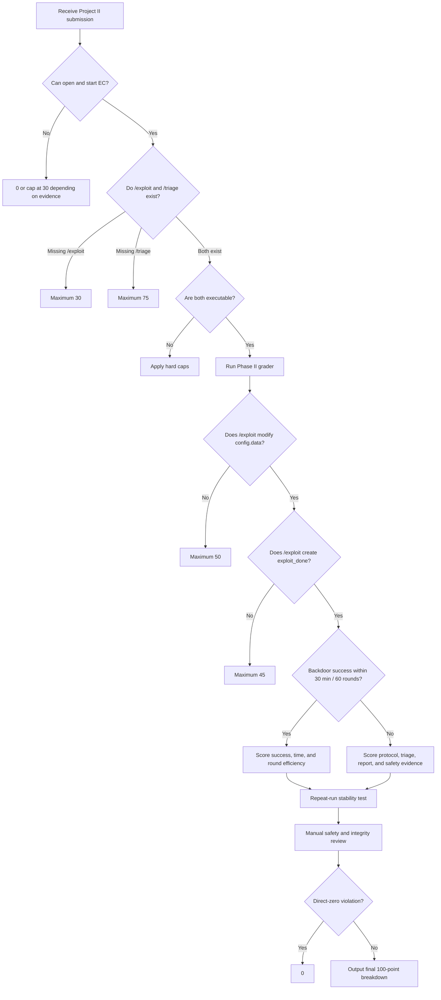

# Project II Phase II Medium Grading Rubric

## Purpose

This file records a strict local 100-point grading specification for Network
Security Project II / Phase II Medium: Autonomous APT Agent.

This is a local audit rubric derived from the saved project brief and lab
bundle. It is meant to make grading evidence-based, repeatable, and hard for an
AI assistant or human reviewer to score by intuition. The instructor's official
grading policy remains authoritative if it later differs from this file.

This document intentionally avoids payload recipes, offsets, shellcode, or
step-by-step exploit construction. It defines grading evidence and acceptance
criteria only.

## Related Documents

| Path | Role |
| --- | --- |
| `docs/SPEC.md` | Student-facing assignment specification, requirements, and test cases |
| `docs/SDD.md` | Student-facing software design, component responsibilities, and safe implementation plan |
| `docs/STUDENT_CHECKLIST.md` | Student pre-submission checklist |
| `docs/SAFETY_BOUNDARY.md` | Lab-only safety boundary and safe wording guide |
| `SPEC.md` | Requirements, deliverables, acceptance tests, and grading interface |
| `SDD.md` | Software design, component boundaries, state design, logging, and safety guards |
| `lab-manifest.md` | Searchable inventory of the provided lab bundle |

## Source Facts From The Project Brief

The grading specification below is based on these observable facts from
`project-brief.pdf` and `lab.zip`:

- Target environment: Ubuntu Linux LTS `24.04.3` x86_64.
- Student prepares the external container, abbreviated here as EC.
- The internal container, abbreviated here as IC, runs the business logic.
- The EC must provide executable programs at `/exploit` and `/triage`.
- The IC has the backdoor program preinstalled at `/backdoor`.
- Both EC and IC mount the shared volume at `/shared`.
- `/shared/config.data` is modified by `/exploit` and processed by blogic.
- `/shared/blogic.copy` is available for analysis by the exploit program.
- `/shared/exploit_done` signals that `/exploit` has finished tampering with
  `config.data`.
- `/shared/coredump/*` receives blogic crash coredumps after failed rounds.
- The grading procedure uses a fresh `/shared` volume, a maximum of `30`
  minutes, and a maximum of `60` rounds.
- Per round, `/exploit` runs first, IC waits for `exploit_done`, IC runs blogic,
  success is marked if `/backdoor` executes, otherwise coredump feedback is
  placed under `/shared/coredump/*`, then `/triage` runs.
- Phase II Medium conditions are: stack-based buffer without boundary check,
  non-PIE executable, and ASLR disabled.
- The score depends on total penetration time, but the brief also explicitly
  requires correct `/exploit` and `/triage` locations plus modification of
  `config.data` and creation of `exploit_done`.

## Grading Philosophy

Project II is graded by observable behavior in the supplied lab flow, not by a
student's narrative alone.

The core questions are:

1. Does `/exploit` run in the EC without manual intervention?
2. Does `/exploit` modify `/shared/config.data`?
3. Does `/exploit` create `/shared/exploit_done` after the config update?
4. Does IC process the modified config in the expected grading loop?
5. If an attempt fails, does feedback appear under `/shared/coredump/*`?
6. Does `/triage` process blogic/coredump feedback and produce usable next-round
   state?
7. Under Phase II Medium, does the submission cause `/backdoor` to execute
   within `30` minutes and `60` rounds?

Acceptable evidence:

| Evidence type | Examples |
| --- | --- |
| Runtime evidence | grader log, stdout/stderr, exit code, timestamp |
| File evidence | `config.data` hash change, `exploit_done` existence, coredump count |
| Success evidence | IC or grader-confirmed `/backdoor` execution |
| Program evidence | source code, executable files, Docker image/build log |
| Report evidence | README/report, but only as support for measured behavior |

Do not award points because a file name, README statement, or stdout message
"looks right." If the required behavior is not observed, the corresponding
points are `0`.

## Direct-Zero Rules

Apply these before scoring. If any direct-zero condition is true, the total
score is `0 / 100`.

| Condition | Rule |
| --- | --- |
| Submission cannot be opened or loaded | Corrupt archive, missing image, or unreadable package is `0`. |
| Submission is clearly for another assignment | Empty folder, report-only wrong project, or unrelated code is `0`. |
| Attacks outside the course lab | Scanning external networks, host escape, or reading unrelated host files is `0`. |
| Destructive behavior against grader/lab host | Deleting grader files, killing unrelated processes, exhausting host resources, or damaging Docker state is `0`. |
| Hard-coded grading bypass | Detecting the grader script and faking success without following the specified flow is `0`. |
| Unauthorized external network service | Runtime downloads, C2 callbacks, external API calls, or uploading grading data is `0`. |
| Fabricated success evidence | Fake success files/logs presented as grader success are `0`. |

## Hard Caps

If there is no direct-zero violation, compute the detailed score and then apply
the lowest relevant cap.

| Issue | Maximum total score |
| --- | ---: |
| `/exploit` is missing | 30 |
| `/exploit` exists but cannot execute | 40 |
| `/triage` is missing | 75 |
| `/exploit` never creates `/shared/exploit_done` | 45 |
| `/exploit` never modifies `/shared/config.data` | 50 |
| Submission cannot run independently inside the EC | 55 |
| Submission only works on the student's local machine, not in the grader environment | 60 |
| Phase I behavior works but Phase II Medium fails | 70 |
| Measured behavior succeeds but there is no log, README, or report evidence | 90 |
| Succeeds only through brittle hard-coded paths, timestamps, or exact coredump filenames | 85 |
| Requires manual TA interaction during grading | 80 |
| Uses undeclared dependencies that the grader must discover manually | 85 |

Caps are safety rails. They prevent a submission from earning a high score when
it violates the assignment's core execution model.

## 100-Point Rubric

| Area | Points |
| --- | ---: |
| A. Submission format and environment compatibility | 12 |
| B. `/exploit` behavior and shared-volume protocol | 18 |
| C. Phase II success, time, rounds, and repeatability | 25 |
| D. `/triage` analysis and iteration behavior | 15 |
| E. Automation and stability | 10 |
| F. Code quality, maintainability, and error handling | 8 |
| G. Report, audit trail, and explanation quality | 7 |
| H. Safety boundary and academic integrity | 5 |
| Total | 100 |

## A. Submission Format And Environment Compatibility: 12 Points

This section checks whether the grader can start and run the submitted EC
without guessing.

### A1. Container And File Structure: 3 Points

| Item | Points | Evidence | Scoring rule |
| --- | ---: | --- | --- |
| EC can be built, loaded, or started by the grader | 1 | Docker build/load/run log | Award `1` only if the grader can create/start EC. |
| `/exploit` exists at the exact path | 1 | `ls -l /exploit` | Award `1` only for exact `/exploit`; wrong path is `0`. |
| `/triage` exists at the exact path | 1 | `ls -l /triage` | Award `1` only for exact `/triage`; wrong path is `0`. |

Partial examples:

- `/home/student/exploit` but no `/exploit`: `0` for the path item.
- Requires TA to manually compile before `/exploit` exists: at most `0.5` for
  the path item if the README is clear; otherwise `0`.
- Requires undocumented environment variables: cap the affected item at `0.5`.

### A2. Permissions And Entry Behavior: 3 Points

| Item | Points | Evidence | Scoring rule |
| --- | ---: | --- | --- |
| `/exploit` is executable | 1 | `test -x /exploit` | Award `1` if executable. |
| `/triage` is executable | 1 | `test -x /triage` | Award `1` if executable. |
| Both entries require no interactive input | 1 | Run log with timeout | Award `1` only if no prompts, menu choices, or manual values are required. |

### A3. Ubuntu 24.04.3 x86_64 Compatibility: 2 Points

| Item | Points | Evidence | Scoring rule |
| --- | ---: | --- | --- |
| Runs on the specified Ubuntu x86_64 environment | 1 | Grader run log | Award `1` if it runs in the target base environment. |
| No local absolute path dependency | 1 | Code review and runtime log | Award `1` if there is no required `/Users/...`, `/home/name/...`, or local venv path. |

Deduct this item for hard-coded local paths, required undeclared Python virtual
environments, or missing Dockerfile package declarations.

### A4. No External Network Dependency: 2 Points

| Item | Points | Evidence | Scoring rule |
| --- | ---: | --- | --- |
| Build stage does not require non-reproducible downloads | 1 | Docker/build log | Award `1` if build is reproducible from submitted materials or declared packages. |
| Grading runtime does not connect externally | 1 | Network-disabled run or packet capture | Award `1` if the run succeeds with external networking disabled. |

### A5. Reasonable Resource Use: 2 Points

| Item | Points | Evidence | Scoring rule |
| --- | ---: | --- | --- |
| CPU and memory remain within grader limits | 1 | Resource log | Award `1` if no abnormal CPU/memory exhaustion. |
| `/shared` is not filled with unrelated files | 1 | `du`, file inventory | Award `1` if outputs remain bounded and relevant. |

Massive logs, unrelated binaries, or hundreds of MB of unneeded files under
`/shared` lose the relevant point.

## B. `/exploit` Behavior And Shared-Volume Protocol: 18 Points

This is the assignment's core protocol. `/exploit` must modify
`/shared/config.data` and create `/shared/exploit_done` so IC can process the
data in the grading loop.

### B1. Target File Discovery And Error Handling: 3 Points

| Item | Points | Evidence | Scoring rule |
| --- | ---: | --- | --- |
| Finds `/shared/config.data` | 1 | Runtime log or trace | Award `1` if `/exploit` uses the correct file. |
| Finds `/shared/blogic.copy` when available | 1 | Runtime log or trace | Award `1` if `/exploit` or its analysis path handles the copy. |
| Handles missing files clearly | 1 | Negative test | Award `1` if missing files cause bounded error output and non-hanging behavior. |

Acceptable error behavior includes a clear stderr message and non-zero exit
code. Infinite wait or silent crash is `0`.

### B2. Correct Modification Of `/shared/config.data`: 5 Points

| Item | Points | Evidence | Scoring rule |
| --- | ---: | --- | --- |
| Actually changes `config.data` contents | 1 | SHA-256 before/after | Award `1` if content hash changes. |
| Written content is processable by blogic | 1 | IC/blogic log | Award `1` if blogic reads/processes the file. |
| Does not break file permissions | 1 | `stat` before/after | Award `1` if permissions remain usable. |
| Does not delete or move `config.data` | 1 | File existence check | Award `1` if the expected path remains present. |
| Can update content across rounds | 1 | Round hash sequence | Award `1` if content can vary based on state/feedback. |

Touching the file without content change is not enough for the first point.

### B3. Correct Creation Of `/shared/exploit_done`: 4 Points

| Item | Points | Evidence | Scoring rule |
| --- | ---: | --- | --- |
| Creates `/shared/exploit_done` before `/exploit` exits | 1 | File existence and log | Award `1` if the marker appears. |
| Marker is created after config write completes | 1 | Timestamp/log or atomic-write evidence | Award `1` if ordering is correct. |
| Marker behavior is consistent across rounds | 1 | Round logs | Award `1` if repeated rounds behave consistently. |
| Uses exact path and filename | 1 | File check | Award `1` only for `/shared/exploit_done`. |

Wrong examples: `/tmp/exploit_done`, `/shared/exploit.done`, or signaling before
finishing config writes.

### B4. Grader-Controlled Execution Flow: 3 Points

| Item | Points | Evidence | Scoring rule |
| --- | ---: | --- | --- |
| One `/exploit` invocation terminates | 1 | Timeout log | Award `1` if it exits within the round budget. |
| Does not launch persistent background workers that interfere with grading | 1 | Process list/log | Award `1` if no unauthorized long-running interference. |
| Does not reorder the grader loop | 1 | Behavior log | Award `1` if it does not pre-run `/triage` or manipulate IC flow. |

### B5. Phase II Medium Fit: 3 Points

| Item | Points | Evidence | Scoring rule |
| --- | ---: | --- | --- |
| Explicitly targets Project II / Phase II Medium | 1 | README/report/code behavior | Award `1` if Phase II is the intended target. |
| Does not rely on Phase I executable-stack assumptions | 1 | Behavior/report review | Award `1` if success is not dependent on Phase I-only assumptions. |
| Does not rely on Phase III ASLR-specific brute-force assumptions | 1 | Behavior/report review | Award `1` if strategy matches ASLR-disabled Phase II. |

## C. Phase II Success, Time, Rounds, And Repeatability: 25 Points

The official brief states that the score depends on total time to penetrate the
business logic program. This section makes that measurable while still giving
partial credit for observable progress.

### C1. Phase II Success: 10 Points

| Result | Points |
| --- | ---: |
| IC/grader confirms `/backdoor` successfully executed within `30` minutes | 10 |
| blogic is triggered and processes modified config, but `/backdoor` does not execute | 4 |
| Submission causes relevant blogic crashes only, with no further control evidence | 2 |
| `/exploit` causes no observable blogic behavior | 0 |

Only IC/grader evidence counts as success. Student stdout saying "success" is
not success evidence by itself.

### C2. Time Score: 8 Points

Let `T` be the first success time in seconds, measured from grading start until
IC/grader confirms `/backdoor` execution.

| Success time T | Points |
| --- | ---: |
| `T <= 30` seconds | 8 |
| `30 < T <= 60` seconds | 7 |
| `60 < T <= 120` seconds | 6 |
| `120 < T <= 300` seconds | 5 |
| `300 < T <= 600` seconds | 4 |
| `600 < T <= 900` seconds | 3 |
| `900 < T <= 1200` seconds | 2 |
| `1200 < T <= 1800` seconds | 1 |
| No success | 0 |

### C3. Round Efficiency: 4 Points

Let `R` be the round number of first success.

| Success round R | Points |
| --- | ---: |
| `R = 1` | 4 |
| `2 <= R <= 3` | 3 |
| `4 <= R <= 10` | 2 |
| `11 <= R <= 30` | 1 |
| `31 <= R <= 60` | 0.5 |
| No success | 0 |

### C4. Repeat-Run Stability: 3 Points

Run the same submission from a clean shared volume three times when feasible.

| Result | Points |
| --- | ---: |
| 3 of 3 runs succeed | 3 |
| 2 of 3 runs succeed | 2 |
| 1 of 3 runs succeeds | 1 |
| 0 of 3 runs succeed | 0 |

If only one run is performed because of grading time constraints, this item is
capped at `1`.

## D. `/triage` Analysis And Iteration Behavior: 15 Points

The project is an autonomous agent, not only a one-shot payload writer. Triage
points require observable feedback processing and next-round influence.

### D1. `/triage` Execution Basics: 2 Points

| Item | Points | Evidence | Scoring rule |
| --- | ---: | --- | --- |
| `/triage` can execute directly | 1 | Exit code/log | Award `1` if it runs without manual setup. |
| Handles no-coredump case | 1 | Negative test | Award `1` if no coredump causes no crash/hang. |

Acceptable no-coredump behavior includes printing a clear message, producing a
default state, or returning a documented status code.

### D2. Reads And Selects Coredumps: 3 Points

| Item | Points | Evidence | Scoring rule |
| --- | ---: | --- | --- |
| Lists or discovers `/shared/coredump/*` | 1 | Triage log | Award `1` if it sees coredump files. |
| Chooses latest or relevant coredump by a defined rule | 1 | Triage log | Award `1` if selection is deterministic and documented. |
| Extracts next-round-useful information | 1 | State/log difference | Award `1` if extracted info affects strategy or state. |

Simply echoing filenames without using them does not earn the third point.

### D3. Analyzes `/shared/blogic.copy`: 3 Points

| Item | Points | Evidence | Scoring rule |
| --- | ---: | --- | --- |
| Confirms blogic copy exists | 0.5 | Log/state | Award `0.5` if checked. |
| Records basic binary properties | 0.5 | Log/state | Award `0.5` for architecture/protection/property evidence. |
| Identifies Phase II-relevant conditions | 1 | Report/log | Award `1` for non-PIE and ASLR-disabled Phase II awareness. |
| Passes analysis result to `/exploit` | 1 | State file or log | Award `1` if exploit can consume the result. |

Do not require students to disclose dangerous exploit details in the report.
Grade the existence of the analysis-to-state-to-exploit workflow.

### D4. Triage Influences Next-Round Exploit: 4 Points

| Item | Points | Evidence | Scoring rule |
| --- | ---: | --- | --- |
| `/triage` writes machine-readable state | 1 | JSON/state/log file | Award `1` if state is structured enough to consume. |
| `/exploit` reads that state | 1 | Code/log | Award `1` if exploit consumes triage output. |
| Next `config.data` differs based on triage result | 1 | Hash sequence | Award `1` if state affects config output. |
| The state-to-config change is auditable | 1 | Round logs | Award `1` if the reviewer can trace why it changed. |

Good evidence examples include `triage_state.json`, `strategy_state`,
round-level logs, and hash sequences. `sleep`, `echo done`, or fixed output
does not count.

### D5. Triage Robustness And Convergence: 3 Points

| Item | Points | Evidence | Scoring rule |
| --- | ---: | --- | --- |
| Handles missing or corrupt coredumps | 1 | Negative test | Award `1` if bounded and clear. |
| Handles multiple coredumps by a clear rule | 1 | Log/review | Award `1` if deterministic. |
| Has fallback or stop condition after repeated failure | 1 | Log/review | Award `1` if it avoids infinite unbounded behavior. |

## E. Automation And Stability: 10 Points

This section distinguishes an autonomous course artifact from manual tuning.

### E1. Fully Automated Grading Run: 3 Points

| Item | Points | Evidence | Scoring rule |
| --- | ---: | --- | --- |
| No human input required | 1 | Run log | Award `1` if fully noninteractive. |
| No human coredump copying required | 1 | Run log | Award `1` if feedback stays in `/shared`. |
| No human config editing required | 1 | Run log | Award `1` if `/exploit` writes config itself. |

### E2. Round State Management: 2 Points

| Item | Points | Evidence | Scoring rule |
| --- | ---: | --- | --- |
| Saves round state when needed | 1 | State/log | Award `1` if state is visible and bounded. |
| New rounds are not polluted by stale state | 1 | Clean/repeat run | Award `1` if stale coredumps/state are handled. |

### E3. Race Condition Control: 2 Points

| Item | Points | Evidence | Scoring rule |
| --- | ---: | --- | --- |
| `config.data` is complete before signal | 1 | Timestamp/log/atomic write | Award `1` if ordering is safe. |
| No partial-file reads in repeated runs | 1 | Repeated run evidence | Award `1` if no observed race failures. |

Atomic write plus rename, or equivalent safe sequencing, is good evidence.

### E4. Reproducibility: 3 Points

| Item | Points | Evidence | Scoring rule |
| --- | ---: | --- | --- |
| Clean shared volume can rerun | 1 | Clean run | Award `1` if no required leftover state. |
| Clean EC container can rerun | 1 | Clean run | Award `1` if image/container state is reproducible. |
| Does not depend on previous grading residue | 1 | Repeat run | Award `1` if previous artifacts are not required. |

## F. Code Quality, Maintainability, And Error Handling: 8 Points

These points should not outweigh functionality, but they separate a lucky
prototype from a maintainable submission.

### F1. Clear Program Structure: 2 Points

| Item | Points | Evidence | Scoring rule |
| --- | ---: | --- | --- |
| `/exploit` and `/triage` responsibilities are separated | 1 | Code review | Award `1` if roles are clear. |
| Main flow is readable and not intentionally confusing | 1 | Code review | Award `1` if reviewer can follow the logic. |

Unnecessary obfuscation, huge unrelated scripts, or intentionally opaque code
loses the relevant point.

### F2. Clear Error Reporting: 2 Points

| Item | Points | Evidence | Scoring rule |
| --- | ---: | --- | --- |
| Missing files, permissions, and bad formats produce clear messages | 1 | stderr/log | Award `1` if diagnostics are useful. |
| Exit codes reflect success/failure | 1 | Exit code evidence | Award `1` if codes are meaningful. |

### F3. Log Design: 2 Points

| Item | Points | Evidence | Scoring rule |
| --- | ---: | --- | --- |
| Has round-level logs | 1 | Log files/stdout | Award `1` if rounds are traceable. |
| Logs are bounded and do not expose unrelated sensitive data | 1 | Log review | Award `1` if logs are useful and not excessive. |

### F4. Dependency Management: 2 Points

| Item | Points | Evidence | Scoring rule |
| --- | ---: | --- | --- |
| Dockerfile or README declares dependencies | 1 | Dockerfile/README | Award `1` if needed packages/tools are explicit. |
| No undeclared grader-missing tools are required | 1 | Build/run evidence | Award `1` if the grader does not need to guess. |

## G. Report, Audit Trail, And Explanation Quality: 7 Points

The report cannot replace runtime success. Its job is to make the submission
auditable and reproducible.

### G1. README Or Report Basics: 2 Points

| Item | Points | Evidence | Scoring rule |
| --- | ---: | --- | --- |
| Explains how to build and run | 1 | README/report | Award `1` if commands are clear. |
| Explains `/exploit` and `/triage` roles | 1 | README/report | Award `1` if roles are concrete. |

### G2. Phase II Medium Conditions: 1 Point

Award `1` if the report explicitly states the relevant Phase II assumptions:
stack-based buffer without boundary check, non-PIE executable, and ASLR disabled.

Award `0` if it only says "exploit completed" without mapping to Phase II.

### G3. Execution Records: 2 Points

| Item | Points | Evidence | Scoring rule |
| --- | ---: | --- | --- |
| Provides sample success or failure log | 1 | Log/report | Award `1` if there is real run evidence. |
| Log includes round, time, and result | 1 | Log/report | Award `1` if the run is reconstructable. |

### G4. Limits And Failure Modes: 1 Point

Award `1` if the report explains relevant limitations such as no coredump,
multiple coredumps, repeated failure, environment dependency, or fallback
behavior.

### G5. Safety Statement: 1 Point

Award `1` if the report states that the code is only for the course Docker lab
and is not meant for real systems, external networks, host persistence, or
third-party targets.

## H. Safety Boundary And Academic Integrity: 5 Points

These points apply only if no direct-zero rule was triggered.

| Item | Points | Evidence | Scoring rule |
| --- | ---: | --- | --- |
| Operates only on specified lab paths such as `/shared`, `/exploit`, and `/triage` | 1 | Code/run review | Award `1` if bounded. |
| Does not read or modify unrelated host/system files | 1 | Code/run review | Award `1` if no unrelated access. |
| Performs no external attack behavior | 1 | Network/code review | Award `1` if no scanning, callbacks, uploads, or runtime downloads. |
| Does not tamper with grader, IC image, Docker daemon, or unrelated processes | 1 | Code/run review | Award `1` if clean. |
| Shows no cheating or uncredited reuse | 1 | Review | Award `1` if no fabricated success or suspicious bypass. |

## Detailed Score Sheet

This score sheet is the canonical fine-grained version. Each row must be scored
from evidence. Do not infer missing behavior.

| Area | Item | Points | Required evidence | Rule |
| --- | --- | ---: | --- | --- |
| A | EC can be built/loaded/started | 1 | Build/load log | Success `1`, failure `0`. |
| A | `/exploit` exact path | 1 | `ls -l /exploit` | Exact path `1`, wrong path `0`. |
| A | `/triage` exact path | 1 | `ls -l /triage` | Exact path `1`, wrong path `0`. |
| A | `/exploit` executable | 1 | `test -x /exploit` | Executable `1`, otherwise `0`. |
| A | `/triage` executable | 1 | `test -x /triage` | Executable `1`, otherwise `0`. |
| A | No interactive input | 1 | Run log | Noninteractive `1`; prompt/manual value `0`. |
| A | Ubuntu x86_64 compatible | 1 | Grader run | Runs in target environment `1`. |
| A | No local absolute path dependency | 1 | Code/log | No required local path `1`. |
| A | Build has no non-reproducible download dependency | 1 | Build log | Reproducible `1`. |
| A | Runtime does not connect externally | 1 | Network-disabled test | Runs without external network `1`. |
| A | CPU/memory reasonable | 1 | Resource log | No exhaustion `1`. |
| A | `/shared` output bounded | 1 | Disk/file inventory | No unrelated bulk output `1`. |
| B | Finds `config.data` | 1 | Log/trace | Correct file handled `1`. |
| B | Finds `blogic.copy` | 1 | Log/trace | Copy handled `1`. |
| B | Missing-file errors bounded | 1 | Negative test | No hang/silent crash `1`. |
| B | Changes config content | 1 | Hash diff | Content changed `1`. |
| B | Config is processable by blogic | 1 | IC log | blogic reads/processes `1`. |
| B | Config permissions preserved | 1 | `stat` | Usable permissions `1`. |
| B | Config path remains present | 1 | File check | Not deleted/moved `1`. |
| B | Config can change by round | 1 | Hash sequence | Round-aware change `1`. |
| B | Creates `exploit_done` | 1 | File/log | Marker appears `1`. |
| B | Signal after config write | 1 | Timestamp/log | Correct ordering `1`. |
| B | Marker consistent by round | 1 | Round logs | Consistent `1`. |
| B | Marker exact path | 1 | `/shared/exploit_done` check | Exact path `1`. |
| B | `/exploit` invocation terminates | 1 | Timeout log | Bounded exit `1`. |
| B | No interfering persistent process | 1 | Process list/log | No interference `1`. |
| B | Does not reorder grader loop | 1 | Behavior log | Flow-compliant `1`. |
| B | Targets Phase II | 1 | Report/code behavior | Explicit fit `1`. |
| B | No Phase I executable-stack dependency | 1 | Report/behavior | Phase II-safe `1`. |
| B | No Phase III ASLR-specific dependency | 1 | Report/behavior | Phase II-appropriate `1`. |
| C | Phase II success | 10 | Grader/IC success | Use C1 table. |
| C | Time score | 8 | Timer | Use C2 table. |
| C | Round efficiency | 4 | Round number | Use C3 table. |
| C | Repeat-run stability | 3 | Repeat logs | Use C4 table. |
| D | `/triage` direct execution | 1 | Exit code/log | Runs `1`. |
| D | No-coredump case handled | 1 | Negative test | No crash/hang `1`. |
| D | Lists coredumps | 1 | Log | Discovers files `1`. |
| D | Selects relevant coredump | 1 | Log | Deterministic selection `1`. |
| D | Extracts useful coredump info | 1 | State/log | Next-round-useful info `1`. |
| D | Confirms blogic copy exists | 0.5 | Log/state | Checked `0.5`. |
| D | Records binary properties | 0.5 | Log/state | Recorded `0.5`. |
| D | Identifies Phase II conditions | 1 | Report/log | Conditions recognized `1`. |
| D | Passes analysis to exploit | 1 | State/log | Connected `1`. |
| D | Writes machine-readable state | 1 | State file | Structured state `1`. |
| D | Exploit reads triage state | 1 | Code/log | Consumed `1`. |
| D | Next config changes from state | 1 | Hash sequence | State affects output `1`. |
| D | Change is auditable | 1 | Round logs | Traceable `1`. |
| D | Handles corrupt/missing coredump | 1 | Negative test | Bounded `1`. |
| D | Handles multiple coredumps | 1 | Log | Clear rule `1`. |
| D | Fallback or stop condition | 1 | Log/review | Exists `1`. |
| E | No human input | 1 | Run log | Automated `1`. |
| E | No human coredump copy | 1 | Run log | Automated `1`. |
| E | No human config edit | 1 | Run log | Automated `1`. |
| E | Saves round state | 1 | State/log | Present `1`. |
| E | Avoids stale-state pollution | 1 | Clean run | Clean `1`. |
| E | Complete config before signal | 1 | Timestamp/log | Safe order `1`. |
| E | No partial-file race | 1 | Repeated run | No observed race `1`. |
| E | Clean shared volume rerun | 1 | Clean run | Works `1`. |
| E | Clean EC rerun | 1 | Clean run | Works `1`. |
| E | No prior residue dependency | 1 | Repeat run | Independent `1`. |
| F | Exploit/triage responsibilities separated | 1 | Code review | Clear `1`. |
| F | Main flow readable | 1 | Code review | Clear `1`. |
| F | Error messages clear | 1 | stderr/log | Clear `1`. |
| F | Exit codes meaningful | 1 | Exit code | Meaningful `1`. |
| F | Round-level logs | 1 | Log | Present `1`. |
| F | Logs bounded and appropriate | 1 | File size/review | Bounded `1`. |
| F | Dependencies declared | 1 | Dockerfile/README | Declared `1`. |
| F | No undeclared missing tools | 1 | Build/run | None `1`. |
| G | Build/run instructions | 1 | README/report | Present `1`. |
| G | Exploit/triage role explanation | 1 | README/report | Present `1`. |
| G | Phase II condition explanation | 1 | README/report | Present `1`. |
| G | Sample log | 1 | Log/report | Present `1`. |
| G | Round/time/result log | 1 | Log/report | Present `1`. |
| G | Limits and failure cases | 1 | README/report | Present `1`. |
| G | Safety statement | 1 | README/report | Present `1`. |
| H | Only specified lab paths | 1 | Code/run | Bounded `1`. |
| H | No unrelated system file modification | 1 | Code/run | Clean `1`. |
| H | No external attack behavior | 1 | Network/code | Clean `1`. |
| H | No grader tampering | 1 | Code/run | Clean `1`. |
| H | No cheating/fabrication | 1 | Review | Clean `1`. |

## Practical Grading Workflow

### Step 1: Static Check

Check the submission package before executing the full grader.

```text
/exploit exists?
/triage exists?
test -x /exploit?
test -x /triage?
EC can build/load/start?
No obvious external network dependency?
No host-destructive behavior?
No suspicious grader bypass?
```

Suggested static output:

```json
{
  "static_check": {
    "exploit_exists": true,
    "triage_exists": true,
    "exploit_executable": true,
    "triage_executable": true,
    "container_startable": true,
    "network_dependency_detected": false,
    "dangerous_host_behavior_detected": false,
    "grader_bypass_suspected": false
  }
}
```

### Step 2: Phase II Clean Run

Use a clean shared volume and the Phase II environment. Measure at most `30`
minutes and at most `60` rounds.

Record each round:

```json
{
  "round": 1,
  "exploit_start_time": "2026-05-12T10:00:00+08:00",
  "exploit_exit_code": 0,
  "config_hash_before": "sha256-before",
  "config_hash_after": "sha256-after",
  "config_modified": true,
  "exploit_done_created": true,
  "blogic_processed": true,
  "backdoor_success": false,
  "coredump_created": true,
  "triage_start_time": "2026-05-12T10:00:20+08:00",
  "triage_exit_code": 0,
  "triage_state_changed": true
}
```

### Step 3: Success Determination

Successful Phase II completion requires IC/grader confirmation that `/backdoor`
was executed. Do not accept these as success by themselves:

- Student stdout saying `success`.
- Student-created fake success file.
- Report screenshot without grader evidence.
- A file name that implies exploit success.

### Step 4: Repeat-Run Stability

When feasible, run the same submission three times from clean state:

```json
{
  "repeat_runs": [
    {"run": 1, "success": true, "time_sec": 42, "round": 2},
    {"run": 2, "success": true, "time_sec": 45, "round": 2},
    {"run": 3, "success": false, "time_sec": 1800, "round": 60}
  ]
}
```

### Step 5: Manual Review

Manual review is limited to:

- Safety boundary violations.
- Cheating or grader bypass.
- Whether report claims match measured behavior.
- Whether `/triage` actually affects later behavior.
- Whether success depends on brittle hard-coding.

Do not award functionality points for polished writing alone.

## AI-Assisted Grading Contract

AI assistance is allowed only as a calculator and evidence organizer. It must
not infer unobserved behavior.

### AI Input Schema

```json
{
  "project": "Project II / Phase II Medium",
  "static_check": {
    "exploit_exists": true,
    "triage_exists": true,
    "exploit_executable": true,
    "triage_executable": true,
    "container_startable": true,
    "network_dependency_detected": false,
    "dangerous_host_behavior_detected": false,
    "grader_bypass_suspected": false
  },
  "runs": [
    {
      "run_id": 1,
      "success": true,
      "success_time_sec": 84,
      "success_round": 3,
      "rounds": [
        {
          "round": 1,
          "exploit_exit_code": 0,
          "config_modified": true,
          "exploit_done_created": true,
          "blogic_processed": true,
          "backdoor_success": false,
          "coredump_created": true,
          "triage_exit_code": 0,
          "triage_state_changed": true
        }
      ]
    }
  ],
  "manual_review": {
    "external_network_detected": false,
    "host_destructive_behavior": false,
    "grader_tampering": false,
    "hardcoded_cheating_detected": false,
    "readme_present": true,
    "report_present": true
  }
}
```

### AI Output Schema

```json
{
  "total_score": 87,
  "breakdown": {
    "A_submission_environment": 12,
    "B_exploit_protocol": 17,
    "C_success_time": 22,
    "D_triage": 13,
    "E_automation_stability": 9,
    "F_code_quality": 6,
    "G_report_auditability": 6,
    "H_safety_integrity": 5
  },
  "caps_applied": [],
  "critical_findings": [
    "Phase II succeeded in run 1 within 84 seconds at round 3.",
    "Triage state changed across rounds and was consumed by exploit.",
    "README present but dependency explanation incomplete."
  ],
  "deductions": [
    {
      "item": "F4 dependency clarity",
      "deduction": 1,
      "reason": "Dockerfile installs dependencies, but README does not explain them."
    }
  ],
  "evidence_required_but_missing": []
}
```

### AI Prohibited Behavior

The AI grader must not:

1. Assume success because the report is plausible.
2. Assume exploit behavior from a file name such as `exploit.py`.
3. Award triage points because the student claims coredump analysis.
4. Treat stdout `success` as IC/grader-confirmed backdoor success.
5. Guess what the student intended.
6. Add sympathy points.
7. Ignore direct-zero rules or hard caps.
8. Fill missing evidence from general cybersecurity knowledge.

## TA Quick Decision Flow



## Student-Facing Submission Spec

The EC container must contain:

```text
/exploit
/triage
README.md or equivalent documentation
```

`/exploit` must:

```text
1. Execute directly without interactive input.
2. Use the expected /shared lab paths.
3. Read or analyze /shared/blogic.copy when available.
4. Modify /shared/config.data.
5. Create /shared/exploit_done only after config.data has been written.
6. Terminate after a single round invocation.
```

`/triage` must:

```text
1. Execute directly without interactive input.
2. Not crash when no coredump exists.
3. Read /shared/coredump/* when coredumps exist.
4. Produce next-round information that /exploit can use.
5. Avoid manual intervention.
```

The README/report should include:

```text
1. Build/run instructions.
2. What /exploit does.
3. What /triage does.
4. How the design targets Project II / Phase II Medium.
5. Sample run log with round, time, and result.
6. Known limitations and failure cases.
7. Safety statement: course Docker lab only, not for real systems.
```

## Score Interpretation

| Score range | Meaning |
| ---: | --- |
| 90-100 | Phase II succeeds, fast enough, repeatable, triage is meaningful, docs are complete, and safety is clean. |
| 80-89 | Phase II succeeds, but there are small weaknesses in stability, triage, docs, or engineering quality. |
| 70-79 | Partial or unstable Phase II success; protocol mostly works but repeatability or triage is weak. |
| 60-69 | Basic protocol is present, but Phase II success evidence is insufficient. |
| 50-59 | `/exploit` modifies and signals, but does not complete Phase II. |
| 40-49 | Program runs, but shared-volume protocol is incomplete. |
| 30-39 | Submission skeleton exists, but path, permission, or environment issues are severe. |
| 1-29 | Minimal assessable evidence only. |
| 0 | Empty/wrong submission, non-runnable package, cheating, or destructive/off-scope behavior. |

## Recommended Final Weighting

Use the 100-point weighting in this file as the default local rubric:

| Category | Points | Reason |
| --- | ---: | --- |
| Submission format and environment | 12 | Prevents grading from depending on manual setup. |
| `/exploit` protocol | 18 | Captures the assignment's explicit shared-volume requirements. |
| Success and time | 25 | Reflects the brief's time-based scoring language. |
| `/triage` | 15 | Captures the autonomous-agent iteration requirement. |
| Automation and stability | 10 | Reduces lucky one-run success. |
| Code quality | 8 | Rewards maintainability without overpowering function. |
| Report and auditability | 7 | Makes grading reconstructable. |
| Safety and integrity | 5 | Preserves the course-lab boundary. |
