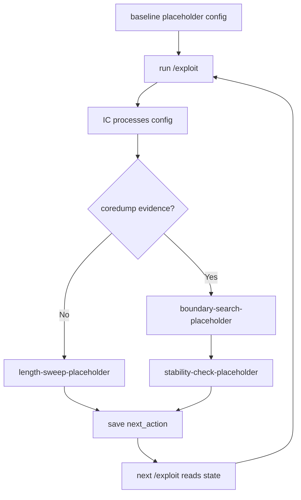
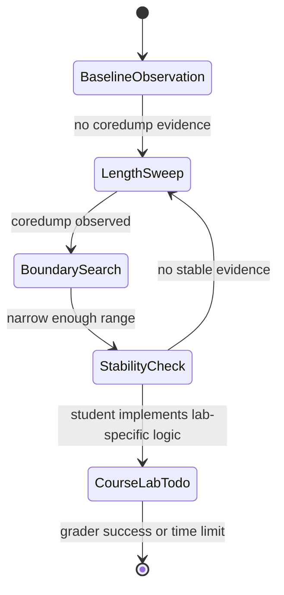

# Project II Core Workflow

This note explains the real engineering core of Project II without providing a
payload, shellcode, ROP chain, grader bypass, or real-world attack steps.

The core is a closed feedback loop:

```text
observe blogic.copy
-> generate candidate config.data
-> trigger blogic through exploit_done
-> read coredump evidence after failure
-> update the next-round hypothesis
-> generate the next config.data
-> repeat until grader success or time/round limit
```

In this scaffold, the loop is implemented with safe placeholders only:

| Assignment role | Scaffold module | What it demonstrates |
| --- | --- | --- |
| Observe target artifact | `environment_checker.py`, `coredump_scanner.py` | Path checks and safe metadata only. |
| Generate candidate config | `config_planner.py` | State-driven placeholder config generation. |
| Trigger processing | `exploit_runner.py` | Write `config.data`, then create `exploit_done`. |
| Read feedback | `triage_runner.py` | Scan coredump directory and select evidence deterministically. |
| Update hypothesis | `coredump_analyzer.py`, `state_manager.py` | Update safe next-round strategy from high-level evidence. |
| Preserve audit trail | `logger.py` | JSONL logs for round-level evidence. |

## 1. Find The Input Shape

Before course-lab-specific logic is added, the workflow should answer safe,
testable questions:

```text
Does config.data exist?
Does blogic.copy exist?
What candidate profile did this round write?
Did the IC side produce coredump evidence after the round?
Was the result stable across repeated clean runs?
```

Do not document payload construction details. Record only safe summaries:

```json
{
  "field_name": "candidate_field",
  "length": 32,
  "placeholder_only": true
}
```

## 2. Generate Candidate Configs From State

The `/exploit` path is:

```text
load state
increment round
plan candidate config
write config.data safely
save state
create exploit_done
log round result
```

In this scaffold, `config_planner.py` generates:

```text
PROJECT2_SAFE_PLACEHOLDER_CONFIG
round=<round>
strategy=<strategy_id>
candidate_field=<placeholder bytes>
candidate_field_length=<length>
notes=placeholder-only-no-payload
```

The important engineering pattern is that the candidate is generated from
`triage_state.json`, not from manual edits.

## 3. Use Coredumps As Feedback

The `/triage` path is:

```text
load state
list coredumps
select latest evidence deterministically
summarize evidence safely
decide next action
save state
log round result
```

The scaffold's `coredump_analyzer.py` only tracks high-level feedback:

```text
no coredump observed -> increase placeholder length for the next observation
coredump observed -> record a crash boundary and move to boundary/stability check
```

It intentionally does not inspect or document exploit-relevant internals.

## 4. Turn Manual Attempts Into Round-Based Search

The student-facing workflow should become:



The scaffold demonstrates that loop using harmless placeholder lengths. The
course-lab-specific logic belongs only in the marked TODO hook.

## 5. Preserve Grading Evidence

Every round should leave evidence:

| Evidence | File |
| --- | --- |
| Current state and next action | `/shared/triage_state.json` |
| Round events | `/shared/round_log.jsonl` |
| Config hash | `last_exploit.config_hash` |
| Input profile | `last_exploit.input_profile` |
| Coredump summary | `last_triage.summary` |
| Next strategy | `next_action.strategy_id` |

This lets a grader answer:

```text
Which round did what?
Why did the next round change?
Did /triage actually read evidence?
Did /exploit actually consume state?
Is the run repeatable?
```

## 6. Where The Student Actually Works

Most of the repository is engineering scaffolding. The course-specific work
belongs in one marked hook:

```text
src/config_planner.py
```

The TODO is intentionally explicit:

```text
TODO: Student implements course-lab-specific candidate generation here. Do not
use this scaffold outside the controlled Docker lab.
```

Keep all additions inside the instructor-approved course lab boundary. Do not
add payload details to documentation, logs, reports, or comments.

## 7. The Four Required Loops

Project II is not a one-shot script. A complete submission should close four
separate loops.

### 7.1 Protocol Loop

The protocol loop proves that the EC and IC can coordinate through `/shared`.

```text
/exploit starts
-> write a complete /shared/config.data
-> create /shared/exploit_done
-> exit
-> IC observes exploit_done
-> IC runs blogic with config.data
```

Acceptance evidence:

| Required behavior | Evidence |
| --- | --- |
| `/exploit` writes `config.data` | hash changes in logs |
| signal is created after the write | timestamp or ordered log event |
| `/exploit` exits per round | exit code and timeout log |
| paths are exact | `/shared/config.data`, `/shared/exploit_done` |

### 7.2 Evidence Loop

The evidence loop turns failure into useful next-round state.

```text
IC run fails
-> /shared/coredump/* appears
-> /triage selects evidence deterministically
-> /triage writes triage_state.json
-> next /exploit reads that state
```

Acceptance evidence:

| Required behavior | Evidence |
| --- | --- |
| coredumps are detected | selected coredump path in state |
| no-coredump case is handled | `analysis_status: no-evidence` |
| state changes after triage | `next_action.strategy_id` changes |
| next exploit consumes state | strategy id appears in the following exploit log |

### 7.3 Candidate-Generation Loop

The candidate-generation loop prevents 60 rounds of identical input.

```text
state + safe metadata + last evidence
-> candidate profile
-> rendered config.data
-> config hash
-> stored input profile
```

In this scaffold the candidate is harmless placeholder text. In the real
course lab, students replace the TODO with instructor-approved logic that
understands the lab config format and updates controlled parameters from
`triage_state.json`.

### 7.4 Scoring Loop

The scoring loop aligns the implementation with the grader:

```text
round <= 60
total runtime <= 30 minutes
success stops grading
failure gives evidence for the next round
```

Students should optimize for repeatable evidence first. A fast but unreproducible
attempt is weaker than a slower workflow that can be explained and rerun.

## 8. Ten-Step Student Path

This path is safe to follow without documenting operational exploit details.

| Step | Goal | Output |
| ---: | --- | --- |
| 1 | Write down the grading contract | Table of required paths, files, and round order |
| 2 | Build a safe skeleton | `/exploit`, `/triage`, state, and logs run without manual input |
| 3 | Confirm `config.data` input shape | Safe table of fields, lengths, and observed behavior |
| 4 | Add coredump feedback | `/triage` turns evidence into `triage_state.json` |
| 5 | Parameterize candidate generation | `config_planner.py` uses state instead of fixed strings |
| 6 | Add a strategy state machine | `next_action.strategy_id` controls the next round |
| 7 | Implement safe config writes | temporary file, flush, rename, then signal |
| 8 | Implement deterministic triage | sorted coredumps, selected file, safe summary |
| 9 | Preserve grading evidence | hashes, strategy ids, input profile, timestamps |
| 10 | Run clean-repeat checks | clean shared volume, clean container, no external network |

## 9. Strategy State Machine

The scaffold demonstrates this safe placeholder state machine:



| Strategy ID | Purpose | Uses |
| --- | --- | --- |
| `baseline-observation` | Confirm the protocol and initial state | first clean round |
| `length-sweep-placeholder` | Demonstrate one-parameter variation | no-coredump feedback |
| `boundary-search-placeholder` | Demonstrate narrowed search state | coredump feedback |
| `stability-check-placeholder` | Demonstrate repeatability checks | small evidence range |
| `course-lab-specific-*` | Student-owned lab logic | instructor-approved lab work only |

The names are intentionally descriptive. A grader should be able to read the
state file and understand why the next round changed.

## 10. State Fields That Matter

`triage_state.json` should be useful as memory, not just as a status flag.

```json
{
  "round": 4,
  "last_exploit": {
    "strategy_id": "length-sweep-placeholder",
    "config_hash": "safe-hash-placeholder",
    "input_profile": {
      "field_name": "candidate_field",
      "length": 64,
      "placeholder_only": true
    }
  },
  "last_triage": {
    "coredump_found": true,
    "selected_coredump": "/shared/coredump/core.placeholder",
    "analysis_status": "parsed",
    "summary": "Safe high-level evidence summary only."
  },
  "search_state": {
    "current_field": "candidate_field",
    "current_length": 64,
    "last_safe_length": 48,
    "first_crash_length": 64,
    "avoid_repeating_hashes": ["safe-hash-placeholder"]
  },
  "next_action": {
    "strategy_id": "boundary-search-placeholder",
    "parameters": {
      "candidate_length": 56
    },
    "confidence": 0.35
  }
}
```

This state supports three important habits:

- avoid sending the same `config.data` repeatedly;
- change one major variable at a time;
- preserve enough evidence for a grader to audit the loop.

## 11. Common Mistakes

| Mistake | Why it hurts |
| --- | --- |
| Only writing `/exploit` | The system has no feedback loop after failure. |
| Writing the same `config.data` every round | Sixty rounds become one repeated attempt. |
| Creating `exploit_done` before the config write finishes | IC may read a partial file. |
| Creating `exploit_done` too late or in the wrong path | IC may never process the input. |
| Not logging config hashes | The grader cannot prove rounds changed. |
| `/triage` only prints that a coredump exists | Evidence is not converted into a next action. |
| Hard-coding local paths or stale filenames | Clean grader runs fail. |
| Writing unsafe details into docs or logs | Violates the lab-only safety boundary. |

## 12. Recommended Development Schedule

| Phase | Goal | Acceptance check |
| --- | --- | --- |
| Day 1 | Protocol works | `/exploit` writes config, creates signal, `/triage` handles no coredump |
| Day 2 | Input observations are logged | candidate profile and config hash appear per round |
| Day 3 | Triage updates state | coredump/no-coredump changes `next_action` |
| Day 4 | Phase II workflow is automated | clean runs use state without manual editing |
| Day 5 | Packaging is ready | README, sample logs, static checks, safety statement |

## 13. Classroom Summary

Use this sentence when explaining the assignment:

```text
Action -> execution -> evidence -> triage -> state update -> better action.
```

In Project II terms:

| Concept | File or component |
| --- | --- |
| Action | `/exploit` |
| Execution environment | IC running blogic |
| Controlled input | `/shared/config.data` |
| Feedback | `/shared/coredump/*` |
| Learning step | `/triage` |
| Memory | `/shared/triage_state.json` |
| Audit trail | `/shared/round_log.jsonl` |

That closed loop is the real engineering core. The scaffold demonstrates the
loop safely; the assignment-specific details must stay inside the controlled
course lab and instructor rules.
