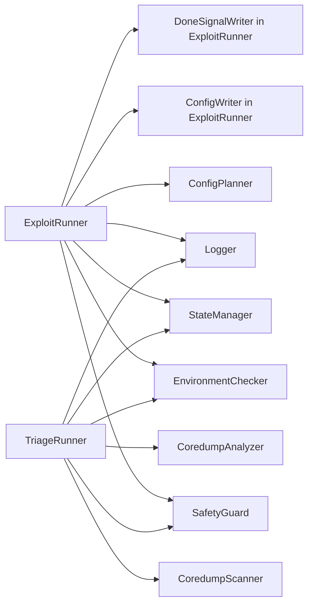
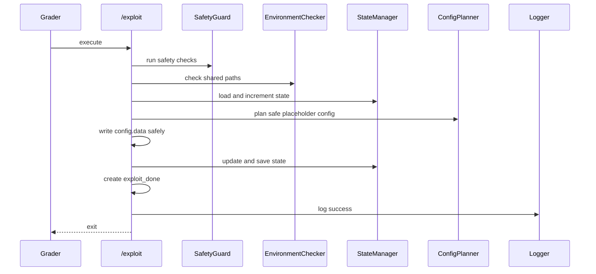
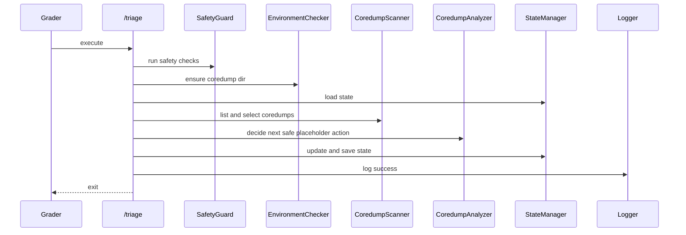

# Project II Scaffold SDD

## Architecture

The scaffold separates action, feedback, state, logging, and safety:

## Component Responsibilities

| Component | Responsibility | Failure behavior |
| --- | --- | --- |
| `path_config` | Defines shared paths and supports `PROJECT2_SHARED_DIR`. | Defaults to `/shared`. |
| `logger` | Writes JSONL events. | Raises normal filesystem errors to caller. |
| `safety_guard` | Validates lab/repo path boundaries. | Raises `SafetyError`. |
| `state_manager` | Loads, saves, and updates `triage_state.json`. | Uses default state on missing/invalid JSON. |
| `environment_checker` | Checks `/shared`, config, blogic copy, and coredump dir. | Raises `EnvironmentCheckError`. |
| `config_planner` | Produces safe placeholder config. | No exploit logic; TODO hook remains. |
| `coredump_analyzer` | Turns high-level coredump/no-coredump evidence into the next safe placeholder strategy. | No payload details; state-only decisions. |
| `exploit_runner` | Coordinates one `/exploit` round. | Logs and returns nonzero on error. |
| `coredump_scanner` | Lists, selects, and safely summarizes coredumps. | Empty list returns no selection. |
| `triage_runner` | Coordinates one `/triage` round. | Logs and returns nonzero on error. |
| `mock_grader` | Demonstrates round workflow with fake coredumps. | Never executes `/backdoor`. |

## Runtime Sequences

### `/exploit`

### `/triage`

## Data Design

State and log examples are in `docs/SPEC.md`; the step-by-step feedback model is
in `docs/CORE_WORKFLOW.md`. The key design rule is that state stores safe
summaries, identifiers, input profiles, and repeat-avoidance hashes, not
offensive construction details.

Important state fields:

| Field | Purpose |
| --- | --- |
| `last_exploit.input_profile` | Records the candidate field and placeholder length used in the last round. |
| `last_exploit.config_hash` | Lets the grader verify whether each round changed. |
| `last_triage.summary` | Safe high-level evidence summary. |
| `search_state.last_safe_length` | Demonstrates feedback from no-coredump rounds. |
| `search_state.first_crash_length` | Demonstrates feedback from coredump rounds. |
| `search_state.avoid_repeating_hashes` | Prevents silent repetition of identical candidates. |
| `next_action.strategy_id` | Explains what the next `/exploit` round will do. |

## Error Handling

| Error | Detection | Response |
| --- | --- | --- |
| Missing `config.data` | exploit environment check | log error and return nonzero |
| Missing `blogic.copy` | exploit environment check | log error and return nonzero |
| Missing coredump dir | triage environment check | create directory if possible |
| No coredump | scanner returns empty list | write no-evidence state |
| Invalid state | JSON load failure | use default state |
| Unsafe path | safety guard | raise and return nonzero |
| Write failure | filesystem exception | log and return nonzero |

## Safety Design

Hard rules:

- no real exploit payload;
- no shellcode;
- no ROP chains;
- no `/backdoor` execution;
- no grader bypass;
- no external network connection;
- no host file modification;
- no unsafe documentation.

The scaffold uses safe wording: candidate config, controlled lab input, triage
evidence, state update, and mock grader.

## Testing Design

| Test | Component coverage |
| --- | --- |
| `test_paths.py` | wrappers and path constants |
| `test_state_manager.py` | default state and save/load |
| `test_exploit_protocol.py` | placeholder config write, marker, state, log |
| `test_triage_protocol.py` | no-coredump and fake-coredump state updates |
| `run_static_checks.sh` | wrappers, docs, imports |

## Implementation Roadmap For Students

1. Keep the scaffold interfaces intact.
2. Confirm `/exploit` and `/triage` are executable in the EC.
3. Keep state and logs parseable.
4. Replace only the `ConfigPlanner` TODO with instructor-approved course-lab
   logic.
5. Re-run static checks and tests.
6. Document assumptions and known limitations.
7. Keep all behavior inside the Docker lab.

## Open Questions

- Exact official per-command timeout.
- Exact official submission packaging.
- Whether logs under `/shared` are collected or ignored.
- Whether helper files are allowed in the EC.
- Whether the grader always starts with a clean `/shared`.
