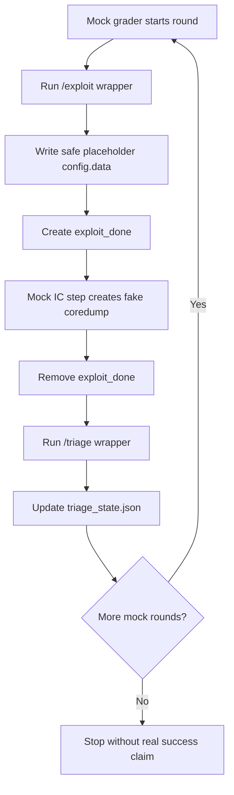

# Project II Scaffold SPEC

## Purpose

This scaffold demonstrates a complete, runnable, classroom-safe autonomous
workflow for Project II / Phase II Medium. It is not an exploit solution. It is
an engineering scaffold for entry points, state, logging, safety checks, and
mock grading.

## Scope

| In scope | Out of scope |
| --- | --- |
| `/exploit` and `/triage` wrappers | real exploit payloads |
| `/shared/config.data` placeholder writes | shellcode or ROP chains |
| `/shared/exploit_done` marker creation | grader bypass |
| `/shared/coredump/*` safe evidence summaries | real-world attack instructions |
| `/shared/triage_state.json` | external callbacks or network scanning |
| `/shared/round_log.jsonl` | host modification |
| local mock grader | executing `/backdoor` |

For the step-by-step closed-loop model, see `docs/CORE_WORKFLOW.md`.

## Environment

```mermaid
flowchart LR
    subgraph EC[External Container]
        X[/exploit/]
        T[/triage/]
    end
    subgraph SHARED[/shared or PROJECT2_SHARED_DIR]
        C[config.data]
        B[blogic.copy]
        D[exploit_done]
        CD[coredump/*]
        S[triage_state.json]
        L[round_log.jsonl]
    end
    subgraph IC[Internal Container]
        BL[blogic]
        BD[/backdoor]
    end
    S --> X
    B --> X
    X --> C
    X --> D
    C --> BL
    D --> BL
    BL --> CD
    CD --> T
    T --> S
    X --> L
    T --> L
```

## Deliverables

| Path | Purpose | Required |
| --- | --- | --- |
| `/exploit` | EC action entry point | Must have |
| `/triage` | EC feedback entry point | Must have |
| `src/` | Python modules | Must have for scaffold |
| `scripts/run_mock_grader.sh` | classroom mock grader runner | Should have |
| `scripts/run_static_checks.sh` | static interface checks | Should have |
| `tests/` | pytest protocol tests | Should have |
| `docs/` | student documentation | Should have |

## Functional Requirements

| ID | Requirement | Acceptance criteria |
| --- | --- | --- |
| FR-001 | `/exploit` exists and is executable | `test -f exploit && test -x exploit` locally; Docker exposes `/exploit`. |
| FR-002 | `/triage` exists and is executable | `test -f triage && test -x triage` locally; Docker exposes `/triage`. |
| FR-003 | `/exploit` is noninteractive | `timeout 30s ./exploit </dev/null` exits in mock setup. |
| FR-004 | `/exploit` checks required shared files | Missing `config.data` or `blogic.copy` returns a clear error. |
| FR-005 | `/exploit` writes placeholder config | `config.data` changes to safe placeholder content. |
| FR-006 | `/exploit` signals after write | `exploit_done` appears only after config write event. |
| FR-007 | `/triage` is noninteractive | `timeout 30s ./triage </dev/null` exits in mock setup. |
| FR-008 | `/triage` handles no coredump | Writes state or logs no evidence. |
| FR-009 | `/triage` handles coredump files | Selects latest file by deterministic rule and logs safe summary. |
| FR-010 | State is machine-readable | `triage_state.json` is valid JSON. |
| FR-011 | Logs are structured | `round_log.jsonl` contains JSON objects with timestamp/component/event/success. |
| FR-012 | Scaffold remains lab-only | No external network behavior, host writes, or grader tampering. |

## Non-Functional Requirements

| ID | Requirement | Acceptance criteria |
| --- | --- | --- |
| NFR-001 | Reproducible mock run | `./scripts/run_mock_grader.sh` works from clean `mock_shared`. |
| NFR-002 | Bounded runtime | Commands are expected to finish within 30 seconds. |
| NFR-003 | Bounded disk use | Logs and fake evidence remain small. |
| NFR-004 | Safe failure | Missing files produce nonzero exit and clear logs. |
| NFR-005 | No runtime network dependency | Tests and mock grader run offline. |
| NFR-006 | Readable code | Responsibilities are split by module. |

## Runtime Workflow



## State Schema

```json
{
  "schema_version": "1.0",
  "project": "project2",
  "phase": "II",
  "round": 0,
  "last_exploit": {
    "config_hash": "",
    "strategy_id": "",
    "timestamp": "",
    "input_profile": {}
  },
  "last_triage": {
    "coredump_found": false,
    "selected_coredump": "",
    "analysis_status": "none",
    "summary": ""
  },
  "next_action": {
    "strategy_id": "baseline-observation",
    "parameters": {
      "candidate_field": "candidate_field",
      "candidate_length": 16,
      "step": 16
    },
    "confidence": 0.0
  },
  "search_state": {
    "strategy_family": "safe-placeholder-feedback-loop",
    "current_field": "",
    "current_length": 0,
    "last_safe_length": 0,
    "first_crash_length": null,
    "max_demo_length": 256,
    "last_result": "not-run",
    "avoid_repeating_hashes": []
  },
  "safety": {
    "lab_only": true,
    "external_network": false
  }
}
```

## Logging Schema

Each line of `round_log.jsonl` is JSON:

```json
{
  "timestamp": "ISO-8601",
  "component": "exploit",
  "event": "config_written",
  "success": true,
  "details": {
    "round": 1,
    "strategy_id": "baseline-observation",
    "config_hash": "sha256-placeholder",
    "input_profile": {
      "field_name": "candidate_field",
      "length": 16,
      "placeholder_only": true
    }
  }
}
```

## Test Cases

| ID | Test | Evidence |
| --- | --- | --- |
| TC-001 | wrappers exist | shell checks |
| TC-002 | state save/load | pytest |
| TC-003 | exploit protocol | pytest temp shared dir |
| TC-004 | triage no-coredump | pytest temp shared dir |
| TC-005 | triage with fake coredump | pytest temp shared dir |
| TC-006 | static imports/docs | `scripts/run_static_checks.sh` |

## Safety Boundary

This scaffold may mention assignment-level concepts such as candidate config,
triage evidence, and Phase II assumptions. It must not include exploit payload
details, shellcode, ROP chains, real-world targets, external callbacks, or
instructions to execute `/backdoor`.

## Pre-Submission Checklist

- [ ] Wrappers executable.
- [ ] Static checks pass.
- [ ] Tests pass if pytest is available.
- [ ] Mock grader runs.
- [ ] State and logs are generated.
- [ ] Docs explain that scaffold is not a solution.
- [ ] Candidate generation TODO is still clearly marked.
