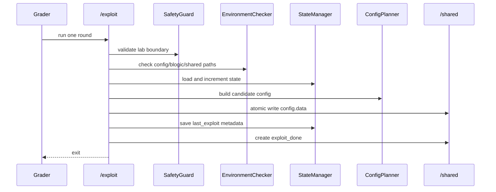
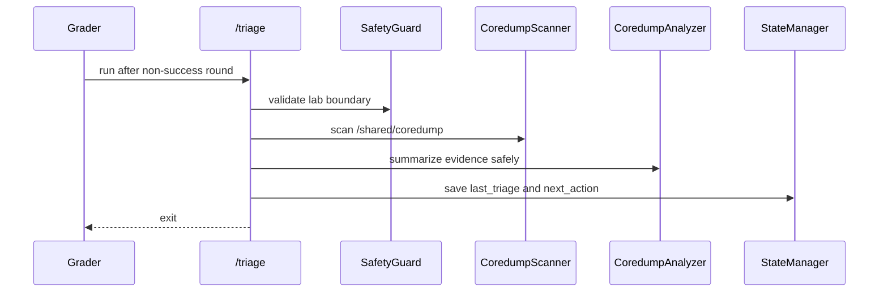

# Project II Submission SDD

Date: 2026-05-14
Scope: Design for the current Project II Phase II EC submission package

## 1. Design Goal

The design goal is to submit a runnable, auditable EC package that satisfies the
Project II interface and honestly records the remaining Phase II success gap.

This SDD describes the current implementation as a submission system, not as a
payload recipe.

## 2. System Context

```mermaid
flowchart LR
    G[Official grader] --> X[/exploit]
    G --> T[/triage]
    X --> C[/shared/config.data]
    X --> D[/shared/exploit_done]
    X --> S[/shared/triage_state.json]
    X --> L[/shared/round_log.jsonl]
    IC[Official IC blogic] --> CD[/shared/coredump/]
    IC --> SU[/shared/success.txt]
    CD --> T
    T --> S
    T --> L
```

The EC owns `/exploit` and `/triage`. The IC owns the real success condition.
The EC must not create `/shared/success.txt`.

## 3. Component Design

| Component | File(s) | Responsibility |
| --- | --- | --- |
| Entry wrappers | `exploit`, `triage` | Stable executable entry points at container root. |
| Path layer | `src/path_config.py` | Resolves `/shared` or `PROJECT2_SHARED_DIR`. |
| Safety layer | `src/safety_guard.py` | Keeps execution inside lab boundaries. |
| Environment checks | `src/environment_checker.py` | Verifies shared files and coredump directory. |
| Planner | `src/config_planner.py`, `src/phase2_payload.py` | Produces placeholder or lab-only probe config. |
| Exploit runner | `src/exploit_runner.py` | Writes config, state, logs, and `exploit_done`. |
| Triage runner | `src/triage_runner.py` | Reads feedback and writes next state. |
| Evidence scanner | `src/coredump_scanner.py`, `src/coredump_analyzer.py` | Selects and summarizes coredump evidence safely. |
| State manager | `src/state_manager.py` | Maintains JSON state schema. |
| Logger | `src/logger.py` | Writes JSONL event log. |
| Readiness reporter | `src/readiness_report.py` | Produces protocol-readiness report. |
| Packaging | `scripts/build_submission_package.sh` | Produces clean source zip. |

## 4. Runtime Sequence

### `/exploit`



### `/triage`



## 5. Data Design

### `triage_state.json`

The state file stores:

- schema version;
- project and phase;
- round number;
- last exploit strategy and config hash;
- input profile;
- last triage summary;
- next action;
- safety flags.

It does not store secrets, real-world target data, raw coredump bodies, or
payload recipes.

### `round_log.jsonl`

Each event stores:

- timestamp;
- component;
- event name;
- success boolean;
- bounded details.

The log exists to prove ordering and repeatability:

```text
config written -> state saved -> exploit_done created
```

## 6. Submission Evidence Design

The submission package includes docs in three layers:

| Layer | Files |
| --- | --- |
| Interface docs | `SPEC.md`, `SDD.md`, `CORE_WORKFLOW.md` |
| Current status docs | `PROJECT_II_ANALYSIS_REPORT_2026-05-14.md`, `PARTIAL_SUBMISSION_BRIEF.md`, `REQUIREMENTS_TRACEABILITY.md` |
| Validation/audit docs | `COMPLETION_AUDIT.md`, `PHASE2_SUCCESS_VALIDATION.md`, `PHASE2_*_ATTEMPT_2026-05-14.md` |

This design lets a reviewer distinguish:

- what the EC can run;
- what evidence exists;
- what is still missing;
- what must not be claimed.

## 7. Packaging Design

`scripts/build_submission_package.sh` creates a zip with:

- source files;
- wrappers;
- Dockerfile;
- scripts;
- documentation;
- submission brief;
- TA clarification draft.

It excludes:

- `mock_shared/`;
- `dist/`;
- `__pycache__/`;
- `.pytest_cache/`;
- coredumps;
- local OS metadata.

The package script checks required entries so the submission cannot silently
drop the status brief or TA draft.

## 8. Readiness Design

`scripts/generate_readiness_report.sh` starts from clean mock shared state,
runs the mock workflow, and writes:

```text
mock_shared/readiness_report.json
```

The report checks:

- wrappers;
- required docs;
- required source modules;
- shared protocol state;
- parseable JSON;
- static checks;
- external-network safety flags.

Expected current status:

```text
ready-for-protocol-demo
```

## 9. Known Limitations

The current design does not provide full-credit success because:

- no official IC-side `/shared/success.txt` has been observed;
- the current candidate path is a lab probe, not a completion claim;
- several simple technical paths have been tested and narrowed without success;
- further technical work needs a new mechanism, not another blind probe.

## 10. Full-Credit Upgrade Path

To upgrade this design from protocol-complete partial to full-credit complete:

1. Identify a new course-lab-specific candidate-generation mechanism.
2. Keep the same EC interface and logging design.
3. Validate only in the official IC loop.
4. Observe IC-side `/shared/success.txt`.
5. Save success evidence.
6. Update the status docs and traceability matrix.
7. Rebuild the source package.

## 11. Safety Notes

The design deliberately avoids general offensive instructions. All behavior is
scoped to the supplied Project II Docker lab. The EC must not fabricate success,
modify the grader, call external services, or touch host paths.
