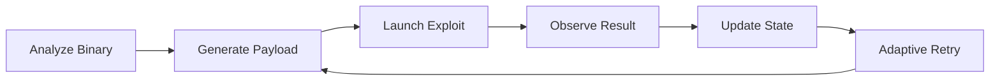
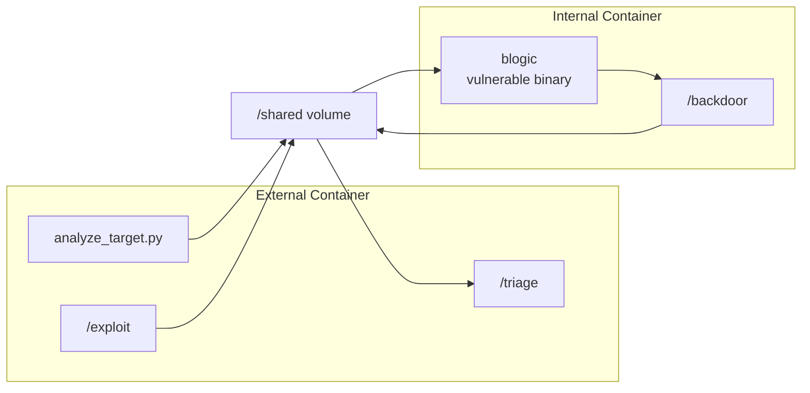
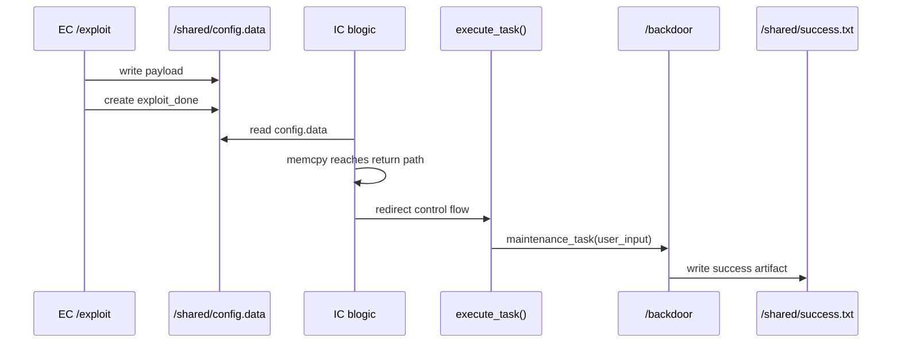
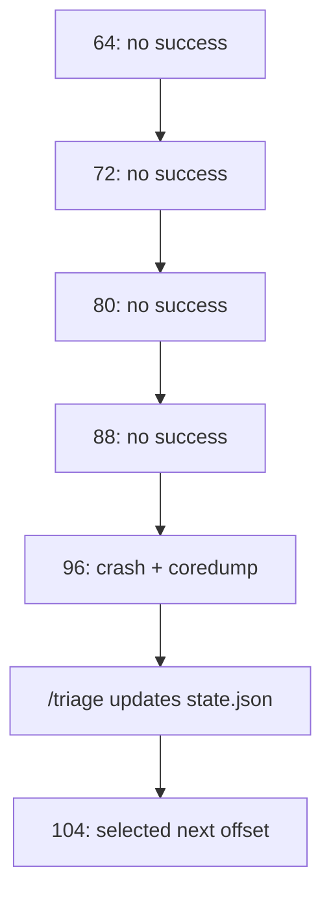

# Autonomous APT Agent

## Adaptive Binary Exploitation Workflow With Failure-Aware Coordination

NYCU Network Security Practice  
Project II Class Presentation

<!--
Opening: this is the complete English 10-minute pitch. The core message is that
the project is an autonomous cyber operation workflow, not just a single buffer
overflow detail.
-->

---

# 1. Vision

## From Manual Exploitation To Autonomous Cyber Operations

Modern cyber operation workflows increasingly combine:

- automated binary analysis
- adaptive retry logic
- stateful coordination
- multi-stage exploitation workflows
- reproducible cyber-range execution

This project builds an **Autonomous APT Agent** that turns binary exploitation
into an orchestrated workflow.

<!--
Pitch the system impression first. The audience should remember: this is an
agent workflow that analyzes, generates, observes, and retries.
-->

---

# 2. Project Objective

## Build An Autonomous Exploitation Workflow

The agent follows this high-level loop:



Goal:

```text
EC generates /shared/config.data
IC runs blogic
blogic reaches /backdoor
success.txt is created
```

<!--
This slide gives the audience the mental model. It is an analyze-generate-
observe-update loop.
-->

---

# 3. Real Lab Architecture

## Dual-Container Cyber Range

The lab uses two isolated containers:

- **EC: External Container** - the agent side
- **IC: Internal Container** - the target side
- **/shared** - the coordination channel between both containers



<!--
Emphasize the architecture: EC and IC interact through /shared. The system is
bounded, reproducible, and designed as a lab cyber range.
-->

---

# 4. Actual Lab Package

## Project Structure

```text
lab/
├── EC/
│   ├── exploit
│   ├── triage
│   ├── analyze_target.py
│   └── Dockerfile
├── IC/
│   ├── server.cpp
│   ├── server_1
│   ├── server_2
│   ├── backdoor
│   └── Dockerfile
├── shared/
├── docker.sh
├── grader.sh
└── README.md
```

Archived successful package:

- `26` lab files preserved in the extracted package
- EC agent, IC target files, shared evidence, grader scripts, and report assets
- saved evidence includes `success.txt`, `exploit-log.txt`, `state.json`, and
  `target_info.json`

<!--
This grounds the pitch in the actual lab package rather than abstract
architecture.
-->

---

# 4.1 How The Lab Files Work Together

## File Relationships

| File / Folder | Relationship In The Workflow |
| --- | --- |
| `docker.sh` | Starts the IC cyber range and prepares `blogic` plus `/shared` |
| `grader.sh` | Controls the round loop: run `/exploit`, wait for IC, check success, run `/triage` |
| `EC/analyze_target.py` | Reads `/shared/blogic` and writes `target_info.json` |
| `EC/exploit` | Uses analyzer output and state to write `config.data` and `exploit_done` |
| `IC/server.cpp` / `server_1` / `server_2` | Provide the vulnerable logic that becomes the executable `blogic` |
| `IC/backdoor` | Success target; writes `success.txt` when triggered |
| `shared/` | Stores payload, state, logs, target analysis, and success evidence |

The relationship is:

```text
docker.sh → IC/blogic ready
grader.sh → EC/exploit → shared/config.data + exploit_done
IC/blogic → shared/success.txt or coredump
grader.sh → EC/triage → shared/state.json
```

<!--
This slide explains how the package files cooperate. docker.sh prepares the
range, grader.sh controls the loop, analyze_target.py creates target facts,
exploit creates payload input, IC/blogic consumes it, and triage turns the
result into next-round state.
-->

---

# 5. Core Vulnerability

## Vulnerable Logic In `server.cpp`

The key vulnerability is a boundary mismatch:

```cpp
char buf[96];
memcpy(buf, msg, len);
```

Engineering observation:

- `config.data` provides attacker-controlled input
- `parse_config()` places the input into global `user_input`
- `log_message(user_input, user_input_len)` copies it into `buf`
- oversized input reaches stack control data
- the return path can be redirected to `execute_task()`

<!--
Keep the vulnerability explanation short. The purpose is to show how the input
becomes control flow.
-->

---

# 6. Exploitation Chain

## Actual Attack Path



Payload concept:

```text
/backdoor\x00 + padding + ret_gadget + execute_task
```

<!--
This is the main technical slide. It keeps the chain visible without making the
whole talk a deep dive into assembly.
-->

---

# 7. Autonomous Components

## Three-Agent Design Inside EC

| Component | Role | Evidence |
| --- | --- | --- |
| `analyze_target.py` | Reads `blogic`, extracts ELF facts, symbols, strings, and gadgets | `target_info.json` |
| `/exploit` | Selects target, builds payload, writes `config.data`, creates `exploit_done` | `exploit-log.txt` |
| `/triage` | Reads result, checks coredumps, updates retry state | `state.json` |

Design pattern:

```text
perception → action → observation → state update
```

<!--
This reframes the system as agentic. Analyzer is perception, exploit is action,
triage is reflection/update.
-->

---

# 8. Shared-State Coordination

## `/shared` As The Agent Memory And Protocol Layer

| File | Purpose |
| --- | --- |
| `config.data` | payload input consumed by `blogic` |
| `exploit_done` | synchronization marker for IC |
| `target_info.json` | structured binary-analysis output |
| `state.json` | retry state, selected offset, target, gadget |
| `exploit-log.txt` | execution trace from `/exploit` |
| `success.txt` | final success artifact |

Saved final run:

- `state.json` strategy: `adaptive_static_analysis_driven_agent`
- mode: `final_exploit`
- next action: `generate_final_payload`

<!--
The shared volume is more than a folder. It is the protocol and memory layer.
-->

---

# 9. Experimental Binary Analysis

## Facts Extracted From `target_info.json`

| Measurement | Value |
| --- | --- |
| Binary type | ELF `64-bit` |
| Architecture | `x86_64` |
| Endianness | `little` |
| Stripped | `false` |
| PIE | `false` |
| NX in saved final target | `false` |
| Parsed symbols | `108` |
| Ret gadgets found | `20` |

Key discovered symbols:

```text
execute_task      0x401415
maintenance_task  0x4013f6
parse_config      0x401464
user_input         0x404340
user_input_len     0x404540
```

<!--
This is the experimental data slide. It proves the analyzer did real binary
analysis.
-->

---

# 10. Payload Planning Result

## Final Payload Parameters

From the saved final exploit log:

| Parameter | Value |
| --- | --- |
| selected target | `_Z12execute_taskv` |
| `execute_task` address | `0x401415` |
| preferred `ret` gadget | `0x401414` |
| offset to return address | `104` bytes |
| payload length reported by `/exploit` | `120` bytes |
| saved `config.data` file size | `132` bytes |
| exploit mode | `final_exploit` |

Payload structure:

```text
/backdoor\x00
+ padding to offset 104
+ ret gadget at 0x401414
+ execute_task at 0x401415
```

<!--
This turns the exploit into measurable engineering output: addresses, offset,
payload length, and mode.
-->

---

# 11. Adaptive Retry Workflow

## Failure-Aware Offset Search

Adaptive mode keeps candidate offsets in `state.json`:

```text
64, 72, 80, 88, 96, 104, 112, 120, 128
```

Observed Phase 2 / Phase 3 adaptive behavior:

- rounds `1-4`: no success, no coredump
- round `5`: offset `96` produced a crash and one coredump
- triage advanced the candidate from `96` to `104`
- round `6`: next attempt uses offset `104`



<!--
This is the clearest agent behavior: it observes failure and advances state.
-->

---

# 12. Successful Final Run

## Saved Success Evidence

Final exploit log:

```text
[2026-05-22 16:50:15] Analyzer completed successfully
[2026-05-22 16:50:15] Selected execute_task: 0x401415
[2026-05-22 16:50:15] Selected ret gadget: 0x401414
[2026-05-22 16:50:15] Using offset_to_ret: 104
[2026-05-22 16:50:15] Payload length: 120 bytes
[2026-05-22 16:50:15] Created /shared/exploit_done
```

Saved `success.txt`:

```text
Backdoor triggered
Fri May 22 16:50:15 UTC 2026
```

The timestamp aligns the exploit generation and success artifact in the same
saved run.

<!--
This is the evidence slide. Show that the saved logs and success file align.
-->

---

# 13. What We Demonstrated

## Results By Capability

| Capability | Demonstrated Result |
| --- | --- |
| Binary analysis | ELF facts, `108` parsed symbols, target functions, risky imports |
| Gadget discovery | `20` ret gadgets, preferred gadget `0x401414` |
| Payload planning | target `0x401415`, offset `104`, payload length `120` bytes |
| Stateful retry | adaptive offset candidates and coredump-aware triage |
| Cyber-range operation | EC / IC / `/shared` coordination |
| Success evidence | `/shared/success.txt` with `Backdoor triggered` |

Core achievement:

```text
binary exploitation as an orchestrated autonomous workflow
```

<!--
This is the results summary. Keep it evidence-based.
-->

---

# 14. Why This Project Matters

## From Exploit Detail To System Impression

A single technical detail explains one mechanism.

An autonomous workflow explains the system:

- how the target is analyzed
- how payload parameters are selected
- how the attempt is launched
- how failure feedback updates the next action
- how evidence is preserved

This project demonstrates a lightweight autonomous cyber operation workflow
inside a controlled Docker cyber range.

<!--
This slide carries the pitch philosophy: the audience should remember the
system impression.
-->

---

# 15. Future Expansion

## AI-Assisted Cyber Operations

Possible next directions:

| Direction | Expansion |
| --- | --- |
| LLM-assisted planning | explain crashes, suggest next probes, summarize state |
| Symbolic execution | integrate `angr`, Triton, or Z3 for path-aware reasoning |
| Multi-agent architecture | separate reconnaissance, exploit, retry, and orchestration agents |
| Richer triage | parse coredumps and registers into structured next-action evidence |
| Defense learning | map each exploit step to the corresponding protection mechanism |

This turns a course lab into a bridge toward agentic security research.

<!--
Close with future-facing direction while keeping it grounded in the actual lab.
-->

---

# Final Takeaway

## Core Contribution

This project shows that:

> binary exploitation can evolve into an adaptive autonomous cyber workflow.

The system combines:

- Dockerized cyber-range execution
- dual-container attack model
- static binary analysis
- payload generation
- shared-state coordination
- adaptive retry
- saved experimental evidence

Closing statement:

```text
We demonstrated a coordinated autonomous cyber operation workflow.
```

<!--
Final delivery: concise, confident, and system-level.
-->
