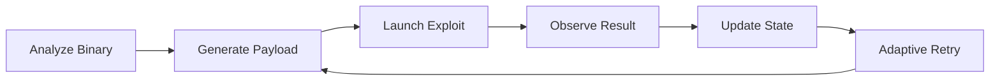
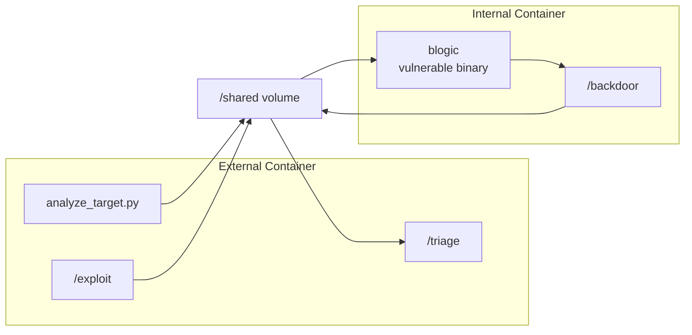
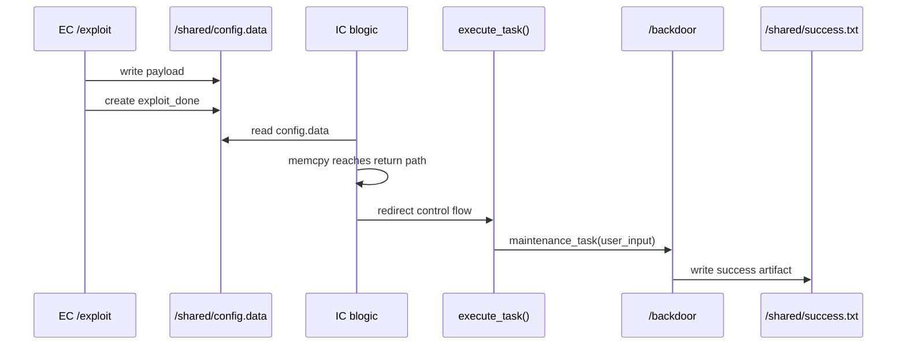
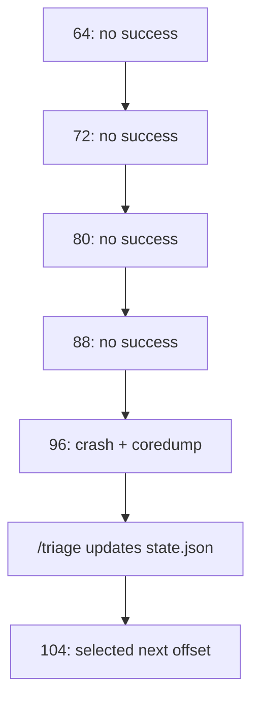

# Autonomous APT Agent

## Adaptive Binary Exploitation Workflow with Failure-Aware Coordination

NYCU Network Security Practice  
Project II 課堂報告

<!--
開場重點：10 分鐘 pitch 的任務，是建立觀眾腦中的系統印象。主軸放在
autonomous cyber operation workflow，而細節用實驗數據支撐。
-->

---

# 1. Vision

## From Manual Exploitation to Autonomous Cyber Operations

現代 cyber operation workflow 已逐漸演進為：

- automated analysis
- adaptive retry
- orchestration-based operations
- multi-stage exploitation workflows
- reproducible cyber-range execution

本專案建立一個 **Autonomous APT Agent**，把 binary exploitation 整合成可協調、
可觀察、可重試的 workflow。

<!--
這張投影片建立 elevator pitch：我們做的是會分析、會產生 payload、會觀察結果、
會更新 state 的攻擊代理系統。
-->

---

# 2. Project Objective

## Goal: Autonomous Exploitation Workflow

agent 的工作流程：



目標成果：

```text
EC 產生 /shared/config.data
IC 執行 blogic
blogic 觸發 /backdoor
success.txt 成為成功證據
```

<!--
用一張簡潔流程圖讓觀眾記得整體 loop：analyze、generate、observe、update。
-->

---

# 3. Real Lab Architecture

## Dual-Container Cyber Range

實驗環境使用兩個 container：

- **EC: External Container** - agent / exploit 端
- **IC: Internal Container** - target / vulnerable service 端
- **/shared** - EC 與 IC 的 coordination channel



<!--
這裡強調 cyber range：EC 和 IC 分離，透過 shared volume 協調。這讓實驗可以
重現、可以觀察、可以保留 artifacts。
-->

---

# 4. Actual Lab Package

## Repository Layout

```text
lab/
├── EC/
│   ├── exploit
│   ├── triage
│   ├── analyze_target.py
│   └── Dockerfile
├── IC/
│   ├── server.cpp
│   ├── server_1
│   ├── server_2
│   ├── backdoor
│   └── Dockerfile
├── shared/
├── docker.sh
├── grader.sh
└── README.md
```

已保存的 successful package：

- extracted lab package 共 `26` 個檔案
- EC agent、IC target files、shared evidence、grader scripts 都已歸檔
- saved evidence 包含 `success.txt`、`exploit-log.txt`、`state.json`、
  `target_info.json`

<!--
這張投影片把 pitch 落地到真實 lab.zip / extracted package。觀眾知道這是實作
成果，而非抽象概念。
-->

---

# 4.1 Lab Files Work Together

## File Relationship

| File / Folder | Relationship In The Workflow |
| --- | --- |
| `docker.sh` | 啟動 IC cyber range，準備 `blogic` 與 `/shared` |
| `grader.sh` | 控制 round loop：呼叫 `/exploit`、等待 IC、檢查 success、呼叫 `/triage` |
| `EC/analyze_target.py` | 讀取 `/shared/blogic`，產生 `target_info.json` |
| `EC/exploit` | 使用 analyzer 結果與 state，寫入 `config.data` 與 `exploit_done` |
| `IC/server.cpp` / `server_1` / `server_2` | 提供 vulnerable logic，編譯後作為 `blogic` 被 IC 執行 |
| `IC/backdoor` | 成功目標，被觸發後寫出 `success.txt` |
| `shared/` | 保存 payload、state、logs、target analysis、success evidence |

檔案關係可以整理成：

```text
docker.sh → IC/blogic ready
grader.sh → EC/exploit → shared/config.data + exploit_done
IC/blogic → shared/success.txt or coredump
grader.sh → EC/triage → shared/state.json
```

<!--
這張補足檔案之間的關係。重點是：docker.sh 建環境，grader.sh 控制 loop，
analyze_target.py 產生 target facts，exploit 產生 payload，IC/blogic 消費
payload，triage 把結果轉成下一輪 state。
-->

---

# 5. Core Vulnerability

## Vulnerable Logic

核心漏洞來自 `server.cpp` 的長度邊界缺口：

```cpp
char buf[96];
memcpy(buf, msg, len);
```

Engineering observation：

- `config.data` 提供 attacker-controlled input
- `parse_config()` 將輸入放進 global `user_input`
- `log_message(user_input, user_input_len)` 將資料複製進 `buf`
- oversized input 會碰到 stack control data
- return path 可以被導向 `execute_task()`

<!--
保持簡潔。10 分鐘 pitch 需要讓觀眾知道漏洞如何支撐系統，而非展開完整 assembly
deep dive。
-->

---

# 6. Exploitation Workflow

## Actual Attack Chain



payload concept：

```text
/backdoor\x00 + padding + ret_gadget + execute_task
```

<!--
這是主技術圖。它保留 exploit 的核心，但把重點放在 chain 與 workflow。
-->

---

# 7. Actual Autonomous Components

## Three-Agent Design Inside EC

| Component | Role | Evidence |
| --- | --- | --- |
| `analyze_target.py` | 分析 `blogic`，抽取 ELF facts、symbols、strings、gadgets | `target_info.json` |
| `/exploit` | 選 target、建立 payload、寫 `config.data`、建立 `exploit_done` | `exploit-log.txt` |
| `/triage` | 讀取結果、檢查 coredump、更新 retry state | `state.json` |

設計模式：

```text
perception → action → observation → state update
```

<!--
這張把實作轉成 agentic architecture：analyzer 是 perception，exploit 是 action，
triage 是 observation/state update。
-->

---

# 8. Stateful Coordination Design

## `/shared` As Agent Memory And Protocol Layer

| File | Purpose |
| --- | --- |
| `config.data` | payload input consumed by `blogic` |
| `exploit_done` | workflow synchronization marker |
| `target_info.json` | structured binary-analysis output |
| `state.json` | retry state、selected offset、target、gadget |
| `exploit-log.txt` | `/exploit` execution trace |
| `success.txt` | final success artifact |

final saved run：

- strategy: `adaptive_static_analysis_driven_agent`
- mode: `final_exploit`
- next action: `generate_final_payload`

<!--
/shared 是 protocol layer，也是 agent memory。這是這個 lab 超越單次 exploit 的
地方。
-->

---

# 9. Experimental Binary Analysis

## Facts Extracted From `target_info.json`

| Measurement | Value |
| --- | --- |
| Binary type | ELF `64-bit` |
| Architecture | `x86_64` |
| Endianness | `little` |
| Stripped | `false` |
| PIE | `false` |
| NX in saved final target | `false` |
| Parsed symbols | `108` |
| Ret gadgets found | `20` |

Key discovered symbols：

```text
execute_task      0x401415
maintenance_task  0x4013f6
parse_config      0x401464
user_input         0x404340
user_input_len     0x404540
```

<!--
這是實驗數據 slide，證明 analyzer 真的有做 binary analysis。
-->

---

# 10. Payload Planning Result

## Final Payload Parameters

final exploit log 記錄：

| Parameter | Value |
| --- | --- |
| selected target | `_Z12execute_taskv` |
| `execute_task` address | `0x401415` |
| preferred `ret` gadget | `0x401414` |
| offset to return address | `104` bytes |
| payload length reported by `/exploit` | `120` bytes |
| saved `config.data` file size | `132` bytes |
| exploit mode | `final_exploit` |

payload structure：

```text
/backdoor\x00
+ padding to offset 104
+ ret gadget at 0x401414
+ execute_task at 0x401415
```

<!--
把 exploit 變成工程數據：address、offset、payload length、mode。
-->

---

# 11. Adaptive Retry Workflow

## Failure-Aware Offset Search

adaptive mode 的 offset candidates：

```text
64, 72, 80, 88, 96, 104, 112, 120, 128
```

Phase 2 / Phase 3 adaptive trace：

- rounds `1-4`: no success, no coredump
- round `5`: offset `96` produced a crash and one coredump
- `/triage` advanced the candidate from `96` to `104`
- round `6`: next attempt uses offset `104`



<!--
這是最清楚的 autonomous behavior：系統觀察失敗，把失敗轉成下一輪 offset。
-->

---

# 12. Successful Final Run

## Saved Success Evidence

final exploit log：

```text
[2026-05-22 16:50:15] Analyzer completed successfully
[2026-05-22 16:50:15] Selected execute_task: 0x401415
[2026-05-22 16:50:15] Selected ret gadget: 0x401414
[2026-05-22 16:50:15] Using offset_to_ret: 104
[2026-05-22 16:50:15] Payload length: 120 bytes
[2026-05-22 16:50:15] Created /shared/exploit_done
```

saved `success.txt`：

```text
Backdoor triggered
Fri May 22 16:50:15 UTC 2026
```

exploit generation 與 success artifact 對齊在同一個 saved run timestamp。

<!--
這是成果證據 slide。log 和 success.txt 在同一秒對齊，適合上台展示。
-->

---

# 13. Experimental Results

## Demonstrated Capabilities

| Capability | Demonstrated Result |
| --- | --- |
| Binary analysis | ELF facts、`108` parsed symbols、target functions、risky imports |
| Gadget discovery | `20` ret gadgets、preferred gadget `0x401414` |
| Payload planning | target `0x401415`、offset `104`、payload length `120` bytes |
| Stateful retry | adaptive offset candidates and coredump-aware triage |
| Cyber-range operation | EC / IC / `/shared` coordination |
| Success evidence | `/shared/success.txt` with `Backdoor triggered` |

Core achievement：

```text
binary exploitation as an orchestrated autonomous workflow
```

<!--
這張是 results summary。每個 claim 都配一個實驗證據。
-->

---

# 14. Why This Project Matters

## From Exploit Detail To System Impression

單一技術細節能解釋一個 mechanism。

autonomous workflow 能建立整體系統印象：

- target 如何被分析
- payload parameters 如何被選出
- exploit attempt 如何啟動
- failure feedback 如何更新下一步
- execution evidence 如何被保存

本專案展示了一個在 Docker cyber range 內運作的 lightweight autonomous cyber
operation workflow。

<!--
這張回到 pitch 哲學：10 分鐘報告要讓觀眾記住 system impression。
-->

---

# 15. Future Expansion

## AI-Assisted Cyber Operations

未來方向：

| Direction | Expansion |
| --- | --- |
| LLM-assisted planning | explain crashes、suggest next probes、summarize state |
| Symbolic execution | integrate `angr`、Triton、Z3 for path-aware reasoning |
| Multi-agent architecture | reconnaissance、exploit、retry、orchestration agents |
| Richer triage | parse coredumps and registers into structured next-action evidence |
| Defense learning | map each exploit step to the corresponding protection mechanism |

這讓 course lab 成為 agentic security research 的入門橋樑。

<!--
未來方向保持具體：LLM planning、symbolic execution、multi-agent、rich triage、
defense mapping。
-->

---

# Final Takeaway

## Core Contribution

本專案展示：

> binary exploitation can evolve into an adaptive autonomous cyber workflow.

系統整合：

- Dockerized cyber-range execution
- dual-container attack model
- static binary analysis
- payload generation
- shared-state coordination
- adaptive retry
- saved experimental evidence

Closing statement：

```text
We demonstrated a coordinated autonomous cyber operation workflow.
```

<!--
結尾要短、穩、可記憶。核心句：coordinated autonomous cyber operation workflow。
-->
