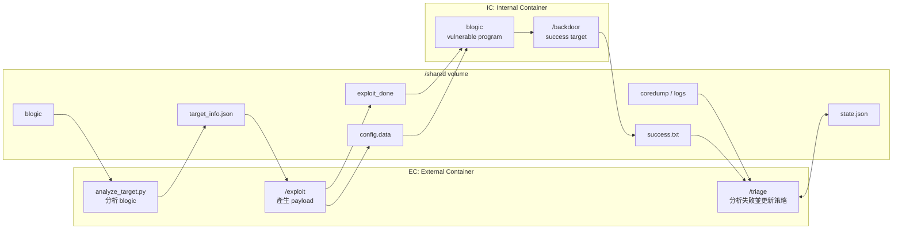
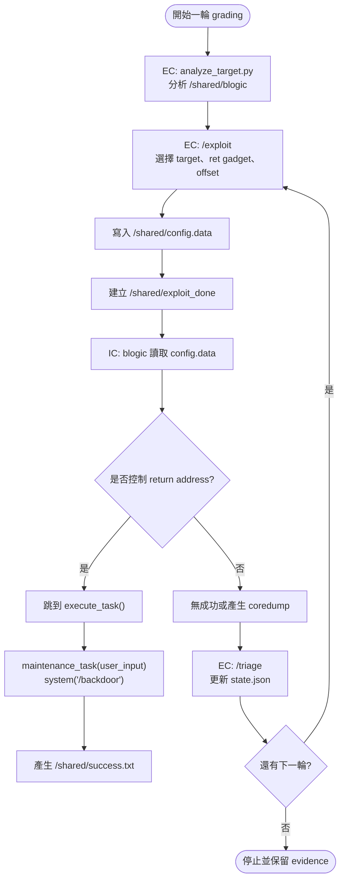

# Project II: Autonomous APT Agent

## Lab Overview And First Technical Walkthrough

Network Security Practice  
Autonomous APT Agent / 自動化漏洞利用代理人

<!--
開場說明：這份報告先介紹第一部分，也就是 lab.zip 的整體架構、核心任務、
漏洞來源、payload 概念，以及後續應該如何閱讀程式碼。
-->

---

# 二進位漏洞利用 Lab

這是一個資安課堂用的 CTF/lab 型二進位漏洞利用實作。

核心任務：

> 讓外部容器 EC 自動產生 `/shared/config.data`，觸發內部容器 IC 的
> vulnerable program `blogic`，最後讓 IC 裡的 `/backdoor` 被執行。

重點是在指定 lab boundary 內完成自動化 exploit workflow，並把每一輪嘗試、
觀察與調整都保留成可說明的 evidence。

<!--
這裡先幫聽眾建立正確框架：這是一個 bounded course lab。它的核心是 EC、
IC、shared volume、blogic 和 backdoor 組成的評分流程。
-->

---

# 專案角色

| 元件 | 角色 |
| --- | --- |
| `EC` | 外部攻擊端容器，負責產生 payload 與執行 triage |
| `IC` | 內部目標容器，執行 vulnerable program |
| `shared/` | EC 與 IC 唯一共同資料夾 |
| `blogic` | 有漏洞的 binary |
| `exploit` | 寫出惡意設定檔並觸發 grading flow |
| `triage` | 根據上一輪結果調整下一輪策略 |
| `backdoor` | 成功目標 |

<!--
這張投影片是名詞對齊。先讓同學知道每個東西扮演什麼角色，後面講 payload
會更容易銜接。
-->

---

# Lab.zip 專案結構

```text
lab/
├── EC/
│   ├── exploit
│   ├── triage
│   ├── analyze_target.py
│   └── Dockerfile
├── IC/
│   ├── server.cpp
│   ├── server_1
│   ├── server_2
│   ├── backdoor
│   └── Dockerfile
├── shared/
├── grader.sh
├── docker.sh
└── README.md
```

<!--
這裡用檔案結構說明整個 lab 的工作邊界。EC 是我們控制的外部容器；IC 是
課程提供的內部環境；shared 是兩邊唯一互動管道。
-->

---

# 架構圖



<!--
架構上可以把它看成三個區塊：EC、shared volume、IC。EC 透過 shared 寫入
config.data 與 exploit_done。IC 偵測到訊號後執行 blogic，如果 payload
成功，backdoor 會產生 success.txt。
-->

---

# 漏洞來源：`IC/server.cpp`

關鍵程式碼：

```cpp
char buf[96];
memcpy(buf, msg, len);
```

問題：

- `buf` 是固定大小，只有 `96` bytes。
- `memcpy` 依照 `len` 複製資料。
- `len` 缺少與 `buf` 大小對齊的邊界檢查。
- 超過邊界後會覆蓋 stack 上其他資料。

結果：形成 **buffer overflow**。

<!--
這張要講清楚漏洞來自明確的長度邊界問題。buf 只有 96 bytes，但是 memcpy
會照 len 複製。如果 len 太大，就會蓋到旁邊的記憶體，包括可能影響 return
address。
-->

---

# 必要名詞

| 名詞 | 意思 |
| --- | --- |
| Buffer Overflow | 寫入固定大小記憶體時超過邊界 |
| Return Address | 函式結束後 CPU 要跳回的位置 |
| Payload | 攻擊輸入內容，本 lab 是 `config.data` 裡的 `user_input=...` |
| ROP / ret gadget | 利用既有程式片段調整控制流程 |
| NX | stack 維持不可執行的資料區 |
| PIE | 若關閉，程式位址較固定，exploit 較容易 |

<!--
這些名詞是後面說 payload 的基礎。這份 lab 採用既有函式和 return control
flow 來完成成功路徑。
-->

---

# Exploit 邏輯

```text
1. 分析 /shared/blogic
2. 找到 execute_task 的位址
3. 找到 ret gadget
4. 推測或嘗試 offset
5. 寫入 config.data
6. 建立 exploit_done
7. 等 IC 執行 blogic
8. 若失敗，triage 更新 state.json
9. 下一輪重試
```

核心：這是一個會分析、嘗試、觀察、調整的 agent loop。

<!--
這裡要把 exploit 從單一字串提升成系統流程。analyze_target.py 提供 target
facts，exploit 產生嘗試，triage 根據結果更新 state.json。
-->

---

# 流程圖



<!--
流程圖要強調兩件事：第一，成功路徑是 config.data 觸發 blogic，最後 backdoor
執行；第二，失敗結果會成為 triage input，triage 會更新 state.json，讓下一輪
可以調整。
-->

---

# Payload 概念

```text
user_input=/backdoor\x00 + padding + ret_gadget + execute_task
```

分解：

1. 先把 `/backdoor` 放進全域變數 `user_input`。
2. 用 padding 填滿 buffer。
3. 覆蓋 return address。
4. 透過 `ret_gadget` 對齊或調整 stack。
5. 跳到 `execute_task()`。

<!--
這裡講概念，現場保留位址細節。重點是 payload 前半段是 command，後半段是
控制流程。payload 成功後會跳到 binary 內既有 helper function。
-->

---

# 為什麼跳到 `execute_task()`

`execute_task()` 會呼叫：

```cpp
maintenance_task(user_input);
```

而 `maintenance_task()` 裡面是：

```cpp
system(arg);
```

所以成功時等價於：

```cpp
system("/backdoor");
```

成功條件：IC 端的 `/backdoor` 被執行，並留下 `/shared/success.txt`。

<!--
這是整份報告最核心的技術句子。execute_task 幫我們把 global user_input 接到
maintenance_task，再接到 system。也就是說，只要 user_input 是 /backdoor，
控制流程能跳到 execute_task，就能到成功條件。
-->

---

# `triage` 的角色

`triage` 是 autonomous agent 味道最重的地方。

它會根據上一輪結果判斷：

- 是否已經有 `/shared/success.txt`
- 是否產生 coredump
- 目前 offset 是否合理
- 下一輪要嘗試哪個 offset 或策略

它讓系統具備 feedback-driven 調整能力。

<!--
這裡要把 triage 跟 AI agent 的 reflection loop 連起來。失敗結果會變成下一輪
策略的一部分，state.json 就是這個 agent 的記憶。
-->

---

# 建議閱讀順序

1. `IC/server.cpp`  
   看懂漏洞怎麼發生。
2. `grader.sh`  
   看懂作業如何評分。
3. `docker.sh`  
   看懂 IC 如何啟動、`server_1` / `server_2` 如何變成 `/blogic`。
4. `EC/exploit`  
   看懂 payload 如何產生。
5. `EC/triage`  
   看懂失敗後如何調整下一輪。
6. `EC/analyze_target.py`  
   看懂如何從硬寫 exploit 升級成分析驅動的 exploit agent。

<!--
第一次做這種 project 時，建議從 server.cpp 理解漏洞來源，再看 grader 和
docker flow，最後進入 exploit 與 triage。
-->

---

# 這個 Lab 已經包含的能力

```text
binary analysis
stateful exploit loop
adaptive offset probing
triage feedback
Docker grading simulation
artifact logging
```

這份專案已經具備小型 autonomous security system 的結構。

<!--
總結技術含量：它同時包含 binary exploitation、Docker environment、
state machine、feedback loop 和 evidence logging。這也是為什麼它適合拿來
理解 agentic workflow。
-->

---

# Part 1 結論

這個 lab 的主軸可以整理成一句話：

> EC 透過 `/shared` 寫入 payload，IC 的 `blogic` 讀取後觸發 buffer
> overflow，成功時控制流程跳到 `execute_task()`，最後執行 `/backdoor`。

下一步報告可以從 `server.cpp` 開始，一行一行拆解：

- 漏洞如何發生
- payload 為什麼長這樣
- Docker 評分流程如何跑
- triage 如何讓 exploit loop 變成 agentic workflow

<!--
收尾時要提醒這是第一部分。後續可以再加 server.cpp 逐行解釋、grader.sh
流程、Docker 啟動方式，以及 evidence demo。
-->
