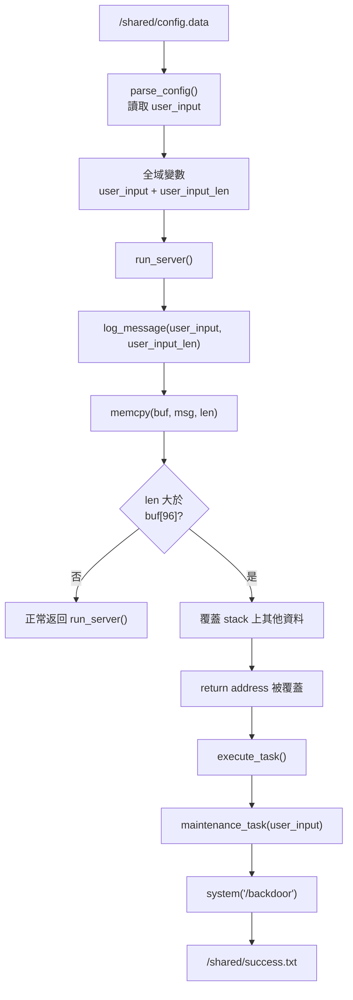

# Project II: Vulnerability Source

## Part 2 - `IC/server.cpp` Data Flow And Control Flow

Network Security Practice  
Autonomous APT Agent / 自動化漏洞利用代理人

<!--
這一部分接續 Part 1。Part 1 先建立 lab.zip 架構與 exploit loop；Part 2 聚焦
在漏洞來源，也就是 IC/server.cpp 裡資料如何從 config.data 走到 buffer
overflow，最後如何改寫控制流程。
-->

---

# 下一步：先看懂漏洞來源

這個 lab 的核心學習路徑，是先看懂 vulnerable program 的資料流，再進入
exploit 技巧。

`IC/server.cpp` 的資料流：

```text
/shared/config.data
        ↓
parse_config()
        ↓
user_input 全域變數
        ↓
run_server()
        ↓
log_message(user_input, user_input_len)
        ↓
memcpy(buf, msg, len)
        ↓
buffer overflow
```

<!--
這張投影片先建立主線：輸入從 /shared/config.data 被 parse_config 讀進
user_input，再一路傳到 log_message。
-->

---

# 流程圖：從輸入到成功條件



<!--
這張圖把正常資料流和攻擊後控制流程接在一起。關鍵判斷點是 len 是否大於
buf[96]。長度在界線內時，流程正常返回；長度超出界線時，就可能覆蓋 return
address，讓程式跳到 execute_task。
-->

---

# 關鍵程式碼：`log_message()`

```cpp
void log_message(const char *msg, size_t len) {
    char buf[96];
    memcpy(buf, msg, len);
}
```

`buf[96]` 代表這個區域只能安全放 `96` bytes。

`memcpy(buf, msg, len)` 會依照 `len` 複製資料，這裡缺少與 `buf` 大小對齊的
邊界檢查。

如果 `len = 150`，它仍然會把 `150` bytes 寫進去。

<!--
這裡要講清楚：重點是 memcpy 使用時需要長度邊界。buf 只有 96 bytes，len
可能比 96 大。
-->

---

# Buffer Overflow 發生時

當輸入長度超過 `96` bytes：

```text
前 96 bytes：
  塞進 buf

後面多出來的 bytes：
  蓋到 stack 上其他資料

再繼續蓋：
  可能蓋到 return address
```

`return address` 是函式結束後 CPU 要跳回哪裡的地址。

如果它被改寫，程式就可能改走新的控制流程。

<!--
這張投影片用直覺方式說明 overflow。前 96 bytes 還在合法空間，超過的部分
開始破壞 stack。攻擊者真正想控制的是 return address。
-->

---

# 改寫 Return Address 的目標

如果 return address 被改成 `execute_task()` 的地址，程式就會改走這條路：

```cpp
void execute_task() {
    maintenance_task(user_input);
    exit(0);
}
```

再往下：

```cpp
void maintenance_task(const char *arg) {
    system(arg);
}
```

所以只要 `user_input` 前面是：

```text
/backdoor
```

最後就會變成：

```cpp
system("/backdoor");
```

<!--
execute_task 是這個 lab 的關鍵 helper。它會把全域 user_input 帶進
maintenance_task，而 maintenance_task 會呼叫 system。這讓 payload 可以把
/backdoor 放在 user_input 前面，再透過 return address 跳到 execute_task。
-->

---

# 正常流程 vs 攻擊後流程

正常流程：

```text
main()
  → parse_config()
  → run_server()
  → log_message()
  → 回到 run_server()
  → 結束
```

攻擊後流程：

```text
main()
  → parse_config()
  → run_server()
  → log_message()
  → return address 被覆蓋
  → execute_task()
  → maintenance_task(user_input)
  → system("/backdoor")
```

<!--
這張是報告時最容易讓人理解的對照圖。正常情況下 log_message 結束後回到
run_server；攻擊成功時，return address 被改掉，控制流程轉到 execute_task。
-->

---

# 第一個學習重點

# 第一個學習重點

這個 lab 的本質是：

> 利用程式的長度邊界缺口，改寫它原本的控制流程。

真正要理解的是：

- 資料從哪裡進來
- 哪裡缺少邊界檢查
- 哪個 stack 位置被覆蓋
- return address 被改成哪裡
- 改寫後的控制流程為什麼會執行 `/backdoor`

<!--
這裡用比較清楚的資安觀念收斂：本質是資料邊界和控制流程。
-->

---

# 先專注看三個函式

打開 `IC/server.cpp`，先只看三個函式：

```cpp
parse_config()
log_message()
execute_task()
```

理解目標：

- `parse_config()`：資料如何從 `config.data` 進入 `user_input`
- `log_message()`：overflow 如何發生
- `execute_task()`：成功後為什麼會走到 `system("/backdoor")`

這三個看懂，整個 lab 的骨架就懂了。

<!--
收尾給下一步。先聚焦這三個函式，掌握漏洞來源、payload 目的和成功條件。
-->
