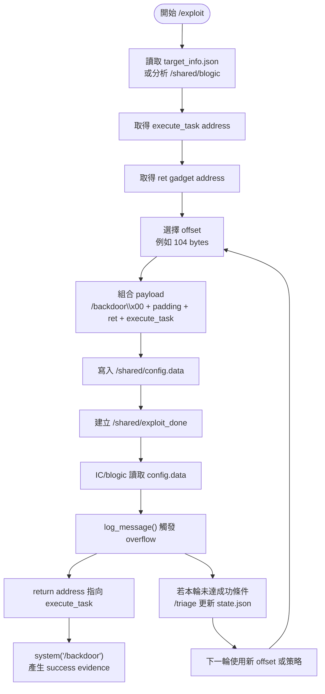

# Project II: Exploit Payload

## Part 3 - `EC/exploit`, Stack, Offset, And GDB

Network Security Practice  
Autonomous APT Agent / 自動化漏洞利用代理人

<!--
這一部分接續 Part 2。Part 2 看懂 server.cpp 的漏洞來源；Part 3 進入 EC 端，
也就是攻擊資料如何被做出來、payload 為什麼要這樣排版，以及 stack / offset
如何支撐整個 exploit。
-->

---

# 下一步：看攻擊資料怎麼被做出來

現在進入 `EC/exploit`。

要理解的主線：

```text
EC/exploit
  ↓
寫出 /shared/config.data
  ↓
IC/blogic 讀取 config.data
  ↓
觸發 buffer overflow
```

`EC/exploit` 的任務，是把一般輸入檔變成能控制流程的 payload。

<!--
這張投影片承接 Part 2。前面已經知道 IC/server.cpp 的漏洞位置，現在看 EC
如何製造送進那個漏洞的資料。
-->

---

# `config.data` 的角色

`config.data` 大概會長這樣：

```text
user_input=AAAA...
```

實際內容是 payload：

```text
/backdoor\x00 + padding + ret gadget + execute_task address
```

它把「輸入資料」轉換成「控制流程」。

<!--
這裡要讓聽眾知道 config.data 表面上只是設定檔，但 user_input 後面的內容
其實被精準排版成 payload。
-->

---

# Payload 分段

| 區段 | 作用 |
| --- | --- |
| `/backdoor\x00` | 交給 `system()` 執行的命令，`\x00` 是 C 字串結尾 |
| `padding` | 把長度推到 return address 前面 |
| `ret gadget` | 修正 stack alignment，讓 x86-64 呼叫路徑穩定 |
| `execute_task address` | 真正想跳過去的函式位址 |

核心概念：

```text
[命令字串] [填充資料] [控制流程跳板] [目標函式地址]
```

<!--
payload 的關鍵是精準排版。前半段放 command，後半段控制 return path。ret
gadget 在某些 Linux x86-64 情境下能協助 stack alignment。
-->

---

# Exploit 流程圖



<!--
這張圖把 EC/exploit 的工作完整串起來。它先取得目標函式和 ret gadget，再選
offset，最後寫出 config.data 和 exploit_done。IC 讀到後觸發 overflow；如果
本輪未達成功條件，triage 會更新 state.json，下一輪再調整。
-->

---

# 打開 `EC/exploit` 先找三件事

閱讀 `EC/exploit` 時，先抓三個問題：

1. 它怎麼找到 `execute_task` 的位址？
2. 它怎麼決定 `offset`？
3. 它怎麼把 payload 寫進 `/shared/config.data`？

抓住這句話：

> 資安 exploit 的本質是把輸入資料變成控制流程。

<!--
這張投影片給閱讀程式碼的路線。先找 execute_task address、offset、config
write。這三個點抓住，就能理解 exploit 的主體。
-->

---

# 進入 Stack：Buffer Overflow 的核心

函式呼叫可以想成：

```text
main()
  呼叫 run_server()
      呼叫 log_message()
```

CPU 每進入一個函式，都會建立一塊 stack frame。

在 `log_message()` 裡，stack frame 大概長這樣：

```text
高位址
+------------------+
| return address   | ← 要回 run_server 的位置
+------------------+
| saved rbp        |
+------------------+
| buf[96]          |
|                  |
|                  |
+------------------+
低位址
```

<!--
這張投影片建立 stack frame 圖像。buffer overflow 的核心，就是 buf 往上覆蓋
saved rbp 與 return address。
-->

---

# 正常寫入與 Overflow 寫入

正常情況：

```cpp
memcpy(buf, msg, 40);
```

資料只寫進 `buf`。

超出 `buf[96]` 的情況：

```cpp
memcpy(buf, msg, 160);
```

資料流向：

```text
buf 被塞滿
↓
蓋到 saved rbp
↓
蓋到 return address
```

攻擊目標：

```text
讓 return address = execute_task 的地址
```

<!--
這裡用 40 和 160 對比。40 在 buffer 內；160 會越過 buffer，碰到 saved rbp
和 return address。payload 的目的就是讓 return address 成為 execute_task。
-->

---

# Control Flow Hijacking

Control Flow Hijacking = 控制流程劫持。

概念：

```text
原本 CPU 要走的路
↓
被 payload 改成指定路線
```

在這個 lab：

```text
log_message() return
  ↓
execute_task()
  ↓
maintenance_task(user_input)
  ↓
system("/backdoor")
```

這是 binary exploitation 最核心的概念之一。

<!--
這張投影片把 return address 覆蓋提升成概念：控制流程劫持。CPU 原本要回到
run_server，payload 讓它改走 execute_task。
-->

---

# Offset 是什麼

`offset` 是從 buffer 開頭到 return address 的距離。

```text
buf 開頭
到
return address
中間距離多少 bytes
```

常見估算：

```text
96 bytes buffer
+ 8 bytes saved rbp
-------------------
104 bytes
```

payload 範例：

```python
b"A" * 104 + p64(execute_task)
```

意思：

```text
前 104 bytes：走到 return address 前面
下一個 8 bytes：覆蓋 return address
```

<!--
offset 是 exploit 裡最重要的數字之一。它幫我們精準瞄準 return address。
這也是為什麼 exploit 常看到 A * offset。
-->

---

# 為什麼常看到 `"A" * offset`

`"A" * offset` 的作用是定位。

它代表：

```text
用固定長度的 padding
精準走到 return address 前面
```

下一段資料才是真正要寫進 return address 的位址。

在這個 lab：

```text
padding 到 return address
↓
寫入 ret gadget
↓
寫入 execute_task address
```

<!--
這張投影片把 A * offset 用直覺說明。核心重點是長度。它是一把尺，
用來量到 return address。
-->

---

# GDB：Binary Exploitation 的觀察工具

GDB = GNU Debugger。

用途：

```text
1. 看程式 crash 在哪
2. 看 stack 長什麼樣
3. 看 registers
4. 看 return address 是否被覆蓋
5. 找 offset
```

常見指令：

```bash
gdb ./blogic
```

```gdb
run
info registers
x/40gx $rsp
disassemble execute_task
```

<!--
GDB 是把抽象 stack 概念變成可觀察 evidence 的工具。之後要驗證 offset、
return address、execute_task address，都會靠它。
-->

---

# 先理解三個 Register

| Register | 作用 |
| --- | --- |
| `RIP` | CPU 現在正在執行的位置 |
| `RSP` | stack pointer，目前 stack 頂端 |
| `RBP` | 目前 stack frame 的基準點 |

常見現象：

| 現象 | 意思 |
| --- | --- |
| Segmentation Fault | 程式跳到非法或不可用的記憶體 |
| `RIP` 被改變 | 控制流程已經被 payload 影響 |
| stack 上出現 padding | payload 已經寫進 stack |

<!--
這張投影片建立 gdb 閱讀基礎。RIP 看控制流程，RSP 看 stack，RBP 看 stack
frame。Segmentation fault 是觀察錯誤控制流程的重要訊號。
-->

---

# 新觀念：Exploit 是精準工程

資安 exploit 的核心是：

1. 理解程式記憶體布局
2. 理解 CPU 控制流程
3. 精準改寫流程

這個 lab 的 payload 可以整理成：

```text
資料流：config.data → user_input → log_message()
記憶體：buf[96] → saved rbp → return address
控制流：return address → execute_task() → system("/backdoor")
```

<!--
這張是 Part 3 的總結。把資料流、記憶體、控制流三條線合在一起，學生就能
理解 exploit 是精準工程。
-->

---

# Part 3 結論

`EC/exploit` 的核心任務：

```text
把 /shared/config.data 排版成 payload
讓 IC/blogic 的 overflow 改寫 return address
讓控制流程跳到 execute_task()
```

下一部分可以進入：

- little-endian
- x86-64 address 形式，例如 `0x4012ab`
- `p64()` 如何把 address 放進 payload
- `analyze_target.py` 如何支援 exploit 自動化

<!--
收尾時銜接下一份資訊。Part 4 可以正式進入 little-endian 和 x86-64 address，
也可以接 analyze_target.py。
-->
