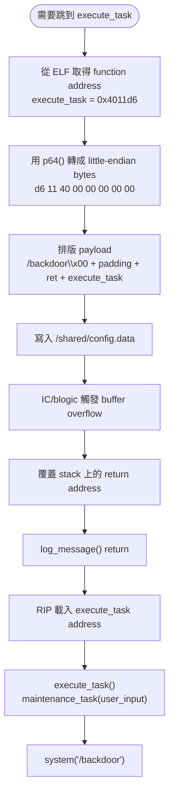

# Project II: Address, ELF, And Protections

## Part 4 - Little-endian, ELF Binary, And Modern Linux Protections

Network Security Practice  
Autonomous APT Agent / 自動化漏洞利用代理人

<!--
這一部分接續 Part 3。Part 3 已經說明 payload、stack、offset 與 GDB；Part 4
進入更底層的 computer architecture 與 binary analysis：address 如何被 CPU
儲存、ELF binary 如何提供 function address，以及現代 Linux protection 如何
影響 exploit strategy。
-->

---

# Part 4 主線

現在已經進入：

```text
覆蓋 return address
```

所以需要理解：

```text
CPU 怎麼儲存 address
ELF 怎麼保存 function address
Linux protection 怎麼改變 exploit strategy
```

這一部分會連接三個觀念：

```text
little-endian → ELF binary → Stack Canary / NX / PIE / ASLR
```

<!--
開場先把 Part 4 的範圍說清楚。return address 是 address，所以要理解 CPU
如何存 address；execute_task 位址來自 ELF，所以要理解 ELF；現代保護機制會
改變 exploit 難度，所以要知道 protection map。
-->

---

# Address 是什麼

可以把記憶體想成一整排有編號的櫃子：

```text
0x400000
0x400001
0x400002
...
```

每個 byte 都有自己的位置。

程式碼也放在記憶體裡，例如：

```text
execute_task() 可能位於 0x4011d6
```

意思是：

```text
execute_task 函式的起始位置
```

<!--
address 是記憶體位置。return address 裡放的也是一個位置，所以 exploit 要能
精準寫入 execute_task 的位置。
-->

---

# Return Address 裡放的是什麼

假設程式呼叫：

```cpp
log_message();
```

CPU 會先記錄：

```text
等等要回哪裡
```

這個位置就是 return address，會被放進 stack。

payload 覆蓋的核心位置其實是：

```text
函式結束後 CPU 要跳去哪
```

流程改寫：

```text
原本：return → run_server()
改寫後：return → execute_task()
```

<!--
這張投影片把 return address 講得非常直覺。它就是函式結束後的下一站。
payload 的工作就是把下一站改成 execute_task。
-->

---

# Little-endian 是什麼

x86-64 使用 little-endian。

意思是：

```text
低位元組放前面
```

例如 address：

```text
0x4011d6
```

實際放進記憶體時是：

```text
d6 11 40 00 00 00 00 00
```

address 在人類閱讀時從高位到低位；CPU 在記憶體裡依 little-endian byte order
儲存。

<!--
這是很多初學者會卡住的地方。人看 0x4011d6，但 payload 裡要放 bytes：
d6 11 40 00 00 00 00 00。
-->

---

# 為什麼 Exploit 要注意 Endian

payload 要寫入的是 CPU 會讀取的 address bytes。

Python exploit 常用：

```python
payload += p64(0x4011d6)
```

`p64()` 會把 64-bit address 轉成 little-endian bytes。

例如：

```python
from pwn import *

p64(0x4011d6)
```

結果：

```text
b'\xd6\x11\x40\x00\x00\x00\x00\x00'
```

<!--
這裡要說清楚 p64 的價值：它幫我們把 address 變成 CPU 期待的 byte order。
-->

---

# Address 字串與 Address Bytes

適合寫入 return address 的資料是：

```python
p64(0x4011d6)
```

它代表 memory address bytes。

字串形式：

```python
b"0x4011d6"
```

代表 ASCII bytes：

```text
30 78 34 30 31 31 64 36
```

CPU 會依照 bytes 解讀控制流程，所以 exploit 需要寫入 address bytes。

<!--
用正向方式說明差異：p64 產生 address bytes；b"0x4011d6" 產生 ASCII 字串。
return address 需要的是前者。
-->

---

# Payload 在記憶體中的樣子

Python 端概念：

```python
payload = (
    b"/backdoor\x00"
    + b"A" * 92
    + p64(ret_gadget)
    + p64(execute_task)
)
```

記憶體中會形成：

```text
/backdoor\x00AAAAAAA...
AAAAAAAAAAAAAAAA...
[ret gadget bytes]
[execute_task bytes]
```

函式 return 時：

```text
RIP ← execute_task
```

CPU 就會跳到 `execute_task()`。

<!--
這張投影片把 Part 3 的 payload layout 和 Part 4 的 endian 串起來。address
最後是用 p64 變成 bytes，放進 return path。
-->

---

# 流程圖：Address 到 RIP Control



<!--
這張流程圖是 Part 4 的核心：先從 ELF 找 execute_task address，再用 p64 轉成
little-endian bytes，接著排進 payload，最後在 return 時讓 RIP 指向
execute_task。
-->

---

# RIP 是什麼

`RIP` = Instruction Pointer。

意思是：

```text
CPU 下一條要執行的指令位置
```

正常流程：

```text
RIP = 原本程式流程
```

payload 成功控制流程時：

```text
RIP = execute_task
```

很多 exploit 教學會說：

```text
Control RIP
```

意思是 return path 已經被 payload 接管。

<!--
RIP 是觀察 exploit 是否控制流程的關鍵 register。GDB 裡看到 RIP 指到目標位址，
代表 payload 已經影響 CPU 下一步。
-->

---

# 為什麼有時需要 Ret Gadget

x86-64 ABI 需要 stack alignment。

某些函式呼叫前：

```text
RSP 需要 16-byte aligned
```

payload 常會放：

```python
payload += p64(ret_gadget)
payload += p64(execute_task)
```

形成：

```text
ret → ret → execute_task
```

這讓 stack alignment 符合呼叫路徑需求，減少 SSE 指令如 `movaps` 造成的
crash。

<!--
ret gadget 的目的可以講成 alignment helper。它讓 stack 多前進一次，常用來
修正 x86-64 的 16-byte alignment。
-->

---

# 這一步跨到哪些領域

你現在其實站在幾個領域的交界：

```text
Computer Architecture
Operating System
Compiler ABI
Binary Security
```

它同時涉及：

```text
CPU
memory
OS
calling convention
compiler behavior
ELF binary
stack layout
```

這也是 binary exploitation 具有挑戰性的原因：它要求精準理解系統底層。

<!--
這張投影片讓同學知道現在學到的是系統底層整合能力。
-->

---

# ELF Binary 是什麼

`blogic` 本質上是：

```text
ELF executable
```

ELF 全名：

```text
Executable and Linkable Format
```

Linux 幾乎所有可執行程式都是 ELF，例如：

```text
/bin/ls
/bin/bash
python
nginx
```

可以把 ELF 想成：

```text
Linux 的程式封裝格式
```

<!--
這裡從 address 轉到 ELF。execute_task address 是從 binary 裡找出來的，而
Linux binary 的格式就是 ELF。
-->

---

# ELF 裡有什麼

ELF 裡包含：

```text
1. 機器碼
2. function 位址
3. library 資訊
4. memory layout
5. symbols
6. sections
7. relocation info
```

也就是：

```text
CPU 怎麼執行這個程式的完整地圖
```

exploit 研究 ELF 的核心原因：

```text
找到 execute_task 在哪裡
```

<!--
ELF 是 map。payload 需要 execute_task address，所以 analyze_target.py 需要
讀 ELF。
-->

---

# ELF 重要 Sections

先記這幾個：

| Section | 作用 |
| --- | --- |
| `.text` | 程式碼區，放 `execute_task()`、`log_message()`、`main()` |
| `.data` | 已初始化全域變數 |
| `.bss` | 未初始化全域變數，例如 `user_input[256]` |
| `.rodata` | 唯讀字串，例如 `printf("hello")` |
| `.plt` / `.got` | dynamic linking 核心，library function 常會經過這裡 |

<!--
這張投影片用表格記 sections。對這個 lab 來說，.text 幫我們理解 function
address，.bss 幫我們理解 user_input 這類全域變數，PLT/GOT 後面會接 ROP。
-->

---

# 常用 ELF 工具

| 工具 | 用途 | 常見指令 |
| --- | --- | --- |
| `file` | 看 binary 類型 | `file blogic` |
| `readelf` | 看 ELF header 與 sections | `readelf -h blogic` |
| `objdump` | 反組譯 machine code | `objdump -d blogic` |
| `nm` | 列出 symbols | `nm blogic` |
| `ROPgadget` | 找 `ret` / `pop rdi` 等 gadgets | `ROPgadget --binary blogic` |

範例：

```text
00000000004011d6 T execute_task
```

意思：

```text
execute_task 在 0x4011d6
```

<!--
這是上台時最實用的一張工具表。file 看格式，readelf 看 header，objdump 看
assembly，nm 看 symbol，ROPgadget 找 gadget。
-->

---

# Symbol 是什麼

symbol 可以理解成：

```text
function 名字 ↔ address 的對照表
```

例如：

```text
execute_task → 0x4011d6
```

`analyze_target.py` 的核心工作就是自動化 binary analysis：

```text
1. 找 execute_task 位址
2. 找 gadget 位址
3. 判斷 PIE / NX 狀態
```

所以 exploit 可以從「手動查表」升級成「分析驅動」。

<!--
這張把 symbol 和 analyze_target.py 串起來。analyze_target.py 做的是自動化
ELF 解析，支援 exploit 自動找位址。
-->

---

# Pwntools

之後常會看到：

```python
from pwn import *
```

這是 CTF / exploit 常見框架。

例如：

```python
elf = ELF("./blogic")
```

就能直接取 symbol：

```python
elf.symbols["execute_task"]
```

取得：

```text
0x4011d6
```

再搭配：

```python
p64(elf.symbols["execute_task"])
```

把 address 轉成 payload bytes。

<!--
Pwntools 把 ELF parsing 和 p64 packing 串在一起，是 exploit automation 的
常用工具。
-->

---

# 你正在做 Reverse Engineering

當你分析 executable binary：

```text
file
nm
objdump
readelf
ROPgadget
GDB
```

你其實已經在做 reverse engineering。

真實世界很多情況只有 binary，source code 需要透過工具與觀察重建理解。

Project II 的 `analyze_target.py` 就是在課堂 lab 裡示範這個能力。

<!--
這張提升意義：不只是解作業，也是在學 reverse engineering 的入門方法。
-->

---

# Binary Exploitation Workflow

常見流程：

```text
1. 拿到 ELF
2. file
3. checksec
4. nm
5. objdump
6. gdb
7. 找漏洞
8. 找 offset
9. 找 gadget
10. 寫 exploit
11. 控制 RIP
12. 拿到成功證據
```

你目前已經走到：

```text
第 5~8 步附近
```

也就是開始把 source-level vulnerability 轉成 binary-level exploit strategy。

<!--
這張投影片讓同學知道自己在整個 exploit workflow 的位置。
-->

---

# 現代 Linux Protection Map

Binary exploitation 會受到保護機制影響。

最核心四個：

```text
1. Stack Canary
2. NX
3. PIE
4. ASLR
```

這個 lab 透過教學設計降低某些保護帶來的複雜度，讓主軸聚焦在 buffer
overflow、RIP control、ELF analysis 與 payload construction。

<!--
用正向語氣說：lab 是教學設計，它讓學生先學核心路徑，再逐步理解真實世界
protection。
-->

---

# Stack Canary

Stack Canary 是 return address 前面的完整性檢查值。

stack layout 會變成：

```text
高位址
+------------------+
| return address   |
+------------------+
| canary           |
+------------------+
| saved rbp        |
+------------------+
| buf[96]          |
+------------------+
低位址
```

程式 return 前會檢查 canary 是否維持原值。

常見 evidence：

```text
*** stack smashing detected ***
```

<!--
這張投影片講 canary 的作用：在 return address 前放完整性檢查值，讓 overflow
更容易被偵測。
-->

---

# NX

NX = No Execute。

stack 權限變成：

```text
可讀
可寫
不可執行
```

因此現代 exploit 常採用：

```text
ROP
ret2libc
ret2win
```

它們的共同概念是：

```text
改跳到已存在的程式碼
```

這個 lab 的 `execute_task()` 路線就是經典 ret2win 類型。

<!--
NX 讓傳統 shellcode-on-stack 路線變得困難，所以現代 exploit 常轉向 ROP 或
ret2win。這個 lab 的 helper function 就是 ret2win。
-->

---

# PIE 與 ASLR

PIE = Position Independent Executable。

它讓 binary 每次載入時可以放在不同 base address。

ASLR = Address Space Layout Randomization。

它會隨機化：

```text
stack
heap
libraries
binary
```

影響：

```text
function address 與 libc address 需要透過 leak 或 base calculation 還原
```

這會把 exploit 從固定 address 推進到動態 address 推理。

<!--
PIE 和 ASLR 的重點是 address 變動。初學 lab 常用 non-PIE 讓 function address
穩定；真實世界常需要 leak 後再計算 base。
-->

---

# Checksec

`checksec` 是 protection inventory 工具。

```bash
checksec --file=blogic
```

會看到：

```text
RELRO
Canary
NX
PIE
```

例子：

```text
Canary    : No
NX        : Yes
PIE       : No
```

意思：

```text
Canary 關閉
NX 開啟
PIE 關閉
```

這是很典型的 beginner-friendly CTF binary profile。

<!--
checksec 幫我們快速知道防禦面貌。這會直接影響 exploit strategy。
-->

---

# 真實 Exploit 的進階路線

現代 binary 常見 protection profile：

```text
Canary : Yes
NX     : Yes
PIE    : Yes
ASLR   : Yes
```

進階 exploit 會加入：

```text
1. leak memory
2. bypass canary
3. leak libc address
4. calculate offsets
5. build ROP chain
```

這會從 ret2win 推進到更完整的 ROP / ret2libc workflow。

<!--
這張投影片承接 lab 到真實世界。lab 先教核心路徑；進階路線會多出 leak、
canary bypass、libc base calculation 和 ROP chain。
-->

---

# ROP 是什麼

ROP = Return Oriented Programming。

核心概念：

```text
拼接既有程式碼片段
組成新的控制流程
```

常見 gadget：

```text
ret
pop rdi
pop rsi
```

典型路線：

```text
pop rdi ; ret
→ "/bin/sh"
→ system()
```

最後形成：

```text
system("/bin/sh")
```

<!--
ROP 可以用樂高比喻：拿既有程式片段拼出想要的控制流程。
-->

---

# 你現在的位置

你目前已經掌握：

```text
1. stack
2. overflow
3. RIP control
4. little-endian
5. ELF
6. symbols
7. binary analysis
8. modern protections
```

這已經是完整的 binary exploitation 入門骨架。

下一步可以進入：

```text
gdb 實戰思維
info registers
x/40gx $rsp
disassemble
breakpoint
pattern offset
```

<!--
Part 4 收尾，把目前進度定位成 binary exploitation 的完整入門骨架，並自然
銜接到下一部分 gdb 實戰。
-->
